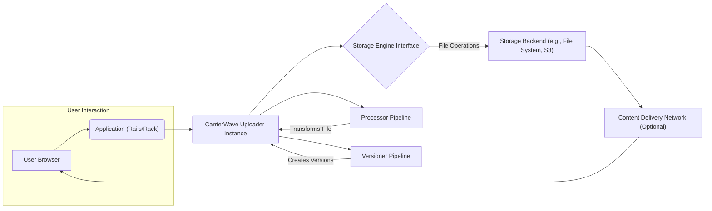
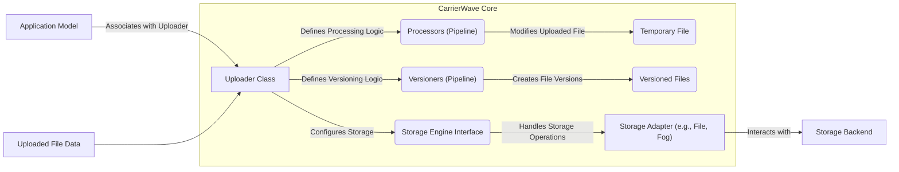

## Project Design Document: CarrierWave File Upload Library

**Version:** 1.1
**Date:** October 26, 2023
**Author:** AI Software Architect

### 1. Introduction

This document provides an enhanced architectural design of the CarrierWave file upload library for Ruby. This detailed design is specifically intended to serve as the foundation for comprehensive threat modeling activities, enabling the identification of potential security vulnerabilities and informing mitigation strategies. CarrierWave is a versatile and extensible library that simplifies file uploads in Ruby applications by providing a structured approach to file storage, processing, and version management.

### 2. Goals

*   Provide a clear, detailed, and easily understandable overview of CarrierWave's architecture and core functionalities.
*   Identify and describe the key components within the CarrierWave library and their interactions, focusing on elements relevant to security analysis.
*   Document the complete data flow during the file upload lifecycle, from initial upload to final retrieval, highlighting potential points of vulnerability.
*   Explicitly outline potential security considerations and risks inherent in CarrierWave's architecture and usage patterns, serving as direct input for threat modeling.
*   Serve as a definitive reference document for security engineers and developers involved in threat modeling and security assessments of applications using CarrierWave.

### 3. Project Overview

CarrierWave abstracts the complexities of file handling in Ruby applications. It introduces the concept of "uploaders" – dedicated classes responsible for managing specific file types. These uploaders encapsulate the logic for selecting storage mechanisms, applying transformations, and generating different file versions. By decoupling file handling from the core application logic, CarrierWave promotes cleaner code and easier maintenance.

### 4. Architectural Design

The central element of CarrierWave's architecture is the `Uploader` class, which acts as the orchestrator for file operations.

#### 4.1. High-Level Architecture Diagram

#### 4.2. Component Description

*   **User Browser:** The client-side interface used by the end-user to initiate file uploads and access uploaded files.
*   **Application (Rails/Rack):** The Ruby application framework (e.g., Rails, Sinatra) that integrates and utilizes the CarrierWave library to handle file uploads. This application manages user authentication, authorization, and interacts with the CarrierWave API.
*   **CarrierWave Uploader Instance:** A specific instance of an uploader class (e.g., `AvatarUploader`, `DocumentUploader`) within the application. Each instance is responsible for managing a single uploaded file associated with a model attribute. The uploader defines the storage location, processing steps, and versioning rules for that specific file.
*   **Storage Engine Interface:** An abstraction layer within CarrierWave that provides a consistent API for interacting with different storage backends. This interface decouples the uploader logic from the specifics of the underlying storage mechanism.
*   **Storage Backend:** The actual system where the uploaded files are physically stored. CarrierWave supports various storage options:
    *   **File System Storage:** Files are stored directly on the server's local file system. This is often used for development or smaller applications. Security considerations include file permissions and access control at the OS level.
    *   **Cloud Storage (e.g., AWS S3, Google Cloud Storage, Azure Blob Storage):** Files are stored in scalable and durable cloud-based object storage services. Security is managed through the cloud provider's IAM policies, bucket policies, and encryption features.
    *   **Other Storage Engines:** CarrierWave's architecture allows for the implementation of custom storage engines to integrate with other storage solutions.
*   **Processor Pipeline:** A sequence of processing steps defined within the uploader. These processors manipulate the uploaded file after it has been received but before it is stored. Examples include:
    *   **Image Resizing:** Using libraries like MiniMagick or ImageMagick to create thumbnails or different sizes of images. Potential security risks involve vulnerabilities in these processing libraries.
    *   **Watermarking:** Adding watermarks to images.
    *   **File Format Conversion:** Converting files from one format to another.
*   **Versioner Pipeline:** A set of instructions within the uploader for creating different versions of the uploaded file. Each versioner defines how to transform the original file to create a specific variation (e.g., a thumbnail, a compressed version).
*   **Content Delivery Network (Optional):** A distributed network of servers that caches uploaded files closer to users, improving loading times and reducing the load on the origin server. Security considerations involve CDN configuration, access control, and secure delivery protocols (HTTPS).

#### 4.3. Data Flow

The following steps describe the typical data flow during a file upload process using CarrierWave:

1. **User Initiates Upload:** The user selects a file in their browser and submits a form to the application.
2. **Application Receives File:** The web application receives the uploaded file data, typically as part of an HTTP request.
3. **Uploader Instantiation and Assignment:** The application instantiates the relevant CarrierWave uploader associated with the model attribute responsible for the file. The uploaded file data is then assigned to this uploader instance.
4. **Before Processing Hooks:**  Callbacks defined within the uploader are executed before any processing takes place. These hooks can be used for validation or preliminary actions.
5. **Processor Execution:** The processors defined in the uploader's `process` block are executed sequentially. Each processor takes the uploaded file as input and modifies it.
6. **Versioning Process:** The versioners defined using the `version` method in the uploader are executed. Each versioner creates a transformed copy of the original or processed file.
7. **Storage Adapter Interaction:** The uploader interacts with the configured storage engine's adapter (e.g., `CarrierWave::Storage::File`, `CarrierWave::Storage::Fog`) to save the original file and all its generated versions to the designated storage backend.
8. **Storage Backend Write:** The storage adapter writes the file data to the storage backend (e.g., saving to the file system or uploading to S3).
9. **After Processing/Storage Hooks:** Callbacks defined in the uploader are executed after the file has been processed and stored. These hooks can be used for tasks like updating database records or triggering notifications.
10. **Model Attribute Update:** The application updates the associated model attribute with the URL or path to the stored file(s).
11. **File Retrieval Request:** When a user requests access to the uploaded file, the application retrieves the stored file's location from the model.
12. **File Serving:** The application serves the file to the user, either directly from the application server or, more commonly, through a CDN.

#### 4.4. Key Components and Interactions (Detailed)

### 5. Security Considerations (Detailed for Threat Modeling)

This section outlines potential security vulnerabilities and risks associated with CarrierWave, categorized for clarity during threat modeling:

*   **Storage Security:**
    *   **Unauthorized Access:**  Risk of unauthorized access to stored files due to misconfigured storage backend permissions (e.g., publicly readable S3 buckets, weak file system permissions).
    *   **Data Breaches:** Potential exposure of sensitive data if storage backends are compromised or lack adequate encryption at rest.
    *   **Insufficient Access Control:** Lack of granular control over who can access specific files or directories within the storage backend.
    *   **Insecure File Deletion:**  Files not being permanently and securely deleted, potentially leaving residual data.
*   **File Processing Vulnerabilities:**
    *   **Malicious File Execution:**  Uploading and processing files that contain malicious code (e.g., scripts in SVG files, embedded executables) which could be executed during processing or when served.
    *   **Buffer Overflows/Memory Corruption:** Vulnerabilities in image processing libraries (e.g., ImageMagick) that could be exploited through crafted image files.
    *   **Denial of Service (DoS):** Uploading extremely large files or a large number of files to exhaust server resources or storage capacity.
    *   **Path Traversal Attacks:**  Manipulating file names or paths during upload to overwrite or access unintended files on the server or storage backend.
*   **Input Validation and Sanitization:**
    *   **Unrestricted File Types:** Allowing the upload of any file type, potentially including executable files or other dangerous formats.
    *   **Filename Manipulation:**  Lack of proper sanitization of uploaded filenames, leading to potential issues with file storage, retrieval, or even command injection in certain scenarios.
    *   **Metadata Exploitation:**  Exploiting vulnerabilities through manipulated file metadata.
*   **Configuration and Implementation Issues:**
    *   **Insecure Defaults:** Relying on default configurations that may not be secure.
    *   **Exposed Storage Credentials:**  Accidentally exposing storage backend credentials in application code or configuration files.
    *   **Lack of HTTPS:** Transmitting uploaded files or access credentials over insecure HTTP connections.
*   **Dependency Vulnerabilities:**
    *   **Outdated Libraries:** Using outdated versions of CarrierWave or its dependencies (e.g., MiniMagick, Fog) that contain known security vulnerabilities.
*   **Information Disclosure:**
    *   **Exposed File Paths:**  Revealing internal file paths or storage locations in error messages or application responses.
    *   **Publicly Accessible Directories:**  Accidentally making upload directories publicly accessible.

### 6. Deployment Considerations (Security Focused)

The security of CarrierWave deployments depends heavily on the environment:

*   **Storage Backend Configuration:**  Properly configuring access controls, encryption, and logging on the chosen storage backend is crucial. For cloud storage, this involves IAM policies and bucket settings. For file system storage, it means setting appropriate file permissions.
*   **Server Security Hardening:**  Securing the server hosting the application, including regular security updates, firewalls, and intrusion detection systems.
*   **Network Security:** Implementing network security measures to protect the transmission of uploaded files and access to the storage backend. Using HTTPS is essential.
*   **CDN Security:**  Configuring the CDN to enforce HTTPS, prevent unauthorized access, and potentially use signed URLs for accessing private content.
*   **Secure Temporary File Handling:** Ensuring that temporary files created during processing are handled securely and cleaned up properly.

### 7. Interaction with External Systems (Security Implications)

Interactions with external systems introduce potential security risks:

*   **Cloud Storage Providers:**
    *   **Credential Management:** Securely storing and managing API keys or access tokens for cloud storage services.
    *   **API Security:**  Ensuring secure communication with cloud storage APIs and understanding the provider's security model.
*   **Image Processing Libraries:**
    *   **Vulnerability Management:**  Staying up-to-date with security advisories and patching vulnerabilities in image processing libraries.
    *   **Input Sanitization:**  Carefully sanitizing input passed to these libraries to prevent exploitation of vulnerabilities.
*   **CDNs:**
    *   **Origin Authentication:** Verifying the origin of requests to prevent unauthorized content injection.
    *   **Cache Poisoning:** Protecting against attacks that could poison the CDN cache with malicious content.

### 8. Future Considerations (Security Enhancements)

*   **Content Security Policy (CSP) Integration:**  Further explore how CarrierWave can facilitate the implementation of strict CSP headers for serving uploaded content, mitigating XSS risks.
*   **Subresource Integrity (SRI) for CDN Assets:** Investigate the feasibility of implementing SRI for files served through CDNs to ensure their integrity.
*   **Secure File Deletion Mechanisms:**  Provide built-in mechanisms or guidance for securely deleting files from various storage backends, ensuring data is irrecoverable.
*   **Automated Security Scanning Integration:** Explore possibilities for integrating CarrierWave with static analysis security testing (SAST) tools to identify potential vulnerabilities early in the development lifecycle.

### 9. Conclusion

This enhanced design document provides a comprehensive and security-focused overview of the CarrierWave file upload library. By detailing the architecture, data flow, and potential security considerations, this document serves as a valuable resource for threat modeling and security assessments. Understanding these architectural aspects and potential vulnerabilities is crucial for developers and security engineers to build secure and resilient applications that utilize CarrierWave for file management.