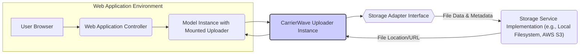
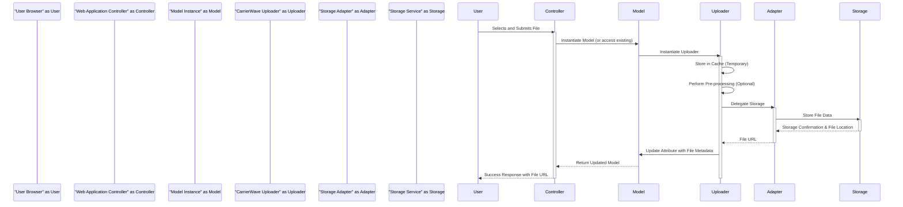

## Project Design Document: CarrierWave File Upload Library (Improved)

**1. Introduction**

This document provides an enhanced architectural design of the CarrierWave file upload library for Ruby. It offers a more detailed explanation of the system's components, data flow, and key functionalities, with a stronger emphasis on security considerations relevant for threat modeling. This document builds upon the previous version, aiming for greater clarity and technical depth.

**2. Goals and Objectives**

The primary goals of CarrierWave are to:

* Provide a robust and intuitive mechanism for handling file uploads within Ruby applications.
* Offer a flexible architecture supporting diverse storage solutions, including local file systems and various cloud storage providers.
* Enable developers to implement file processing and manipulation workflows, such as image resizing and format conversions.
* Facilitate seamless integration with popular Ruby web frameworks like Ruby on Rails, simplifying file management within web applications.
* Maintain an extensible and well-documented codebase, allowing for customization and community contributions.

**3. System Architecture**

The architecture of CarrierWave is centered around the `Uploader` class, which acts as a blueprint for managing specific file upload scenarios. The interaction between the web application, CarrierWave, and the storage service is crucial.

**4. Data Flow (Detailed)**

The process of uploading and retrieving files using CarrierWave involves a series of well-defined steps:

* **Upload Initiation:** A user interacts with the web application's interface, selecting a file for upload.
* **Request Handling:** The browser sends an HTTP request, typically a `POST` request with `multipart/form-data`, containing the file data to the web application's controller.
* **Uploader Mounting and Instantiation:** The web application's controller receives the request and interacts with a model that has a CarrierWave uploader mounted to a specific attribute. This triggers the instantiation of the corresponding `CarrierWave::Uploader` instance.
* **Temporary Storage (Caching):**  The uploaded file is initially often stored in a temporary location (cache) defined by the `cache_dir` configuration. This allows for pre-processing steps before final storage.
* **Pre-processing:** The uploader executes any defined pre-processing steps specified using the `process` DSL. This might include image resizing, format conversion, or other manipulations.
* **Storage Adapter Selection:** Based on the `storage` configuration (e.g., `:file`, `:fog`, `:aws`), the appropriate storage adapter is selected.
* **File Storage:** The uploader delegates the storage operation to the chosen storage adapter. The adapter interacts with the underlying storage service to save the file.
* **Metadata Persistence:** The uploader updates the associated model attribute with metadata about the uploaded file, such as the storage URL, filename, size, and content type. This information is typically persisted in the application's database.
* **Response Generation:** The web application sends a response back to the user, often including the URL or other information about the uploaded file.
* **File Retrieval:** When the application needs to serve the uploaded file, it retrieves the stored URL from the model's attribute and uses it to access the file directly from the storage service.

**5. Components (Detailed)**

CarrierWave's functionality is built upon several key components:

* **`CarrierWave::Uploader::Base`:** The foundational class that users inherit from to define custom uploaders. It provides the core DSL and methods for configuring storage, processing, and versioning.
    * **Configuration Options:**
        * `storage`: Specifies the storage mechanism (`:file`, `:fog`, `:aws`, or custom).
        * `store_dir`: Defines the directory structure within the storage service.
        * `cache_dir`: Specifies the temporary directory for cached files.
        * `permissions`: Sets file permissions for local storage.
        * `fog_credentials`, `aws_credentials`: Configuration for cloud storage providers.
    * **Processing DSL (`process`):** Allows defining a chain of methods to be executed on the uploaded file.
    * **Versioning DSL (`version`):** Enables the creation of different versions or transformations of the uploaded file.
    * **Callbacks:** Provides hooks at various stages of the upload lifecycle (e.g., `before_cache`, `after_store`).
    * **Whitelist/Blacklist:** Options for controlling allowed file extensions and content types (`extension_whitelist`, `extension_blacklist`, `content_type_whitelist`, `content_type_blacklist`).
* **Storage Adapters (`CarrierWave::Storage::*`):** Implement the logic for interacting with specific storage backends.
    * **`CarrierWave::Storage::File`:** Stores files on the local filesystem.
    * **`CarrierWave::Storage::Fog`:** Leverages the Fog gem to support numerous cloud storage providers (AWS S3, Google Cloud Storage, Azure Blob Storage, etc.).
    * **`CarrierWave::Storage::AWS`:** A dedicated adapter for Amazon S3, offering more specific configurations and optimizations for S3.
    * **Custom Adapters:** Developers can create custom storage adapters to integrate with other storage solutions.
* **Mounting (`mount_uploader`):**  A mechanism provided by integration libraries (e.g., `carrierwave-activerecord`, `carrierwave-mongoid`) to associate uploaders with model attributes. This simplifies the management of uploaded files within the application's data model.
* **Downloaders (`CarrierWave::Downloader::Base`):**  Facilitates downloading files from remote URLs for processing or storage.
* **Integrations:** Libraries that provide seamless integration with specific Ruby frameworks and ORMs (e.g., `carrierwave-rails`).

**6. Security Considerations (Enhanced)**

Security is paramount when handling file uploads. Here are key considerations for CarrierWave:

* **Input Validation:**
    * **File Extension Validation:** While not foolproof, use `extension_whitelist` to restrict allowed file extensions. **Mitigation:** Combine with content type validation.
    * **Content Type Validation:** Use `content_type_whitelist` to verify the MIME type of the uploaded file. **Mitigation:** Employ robust MIME type detection libraries and avoid relying solely on client-provided headers.
    * **File Size Limits:** Enforce maximum file size limits to prevent denial-of-service attacks. **Implementation:** Configure limits within the web application framework or web server.
    * **Filename Sanitization:** Sanitize filenames to prevent path traversal vulnerabilities and issues with special characters. **Implementation:** Use a robust sanitization library or implement a secure sanitization function.
* **Storage Security:**
    * **Local Filesystem Permissions:** Ensure appropriate file system permissions are set on upload directories to prevent unauthorized access. **Best Practice:** Use the principle of least privilege.
    * **Cloud Storage Access Control:** Utilize IAM policies, bucket policies, and ACLs to restrict access to cloud storage buckets and objects. **Best Practice:** Grant only necessary permissions to the application.
    * **Secure Credentials Management:** Avoid hardcoding storage credentials. Use environment variables or secure secrets management solutions.
    * **Encryption at Rest:**  Leverage the encryption features provided by cloud storage providers to encrypt files stored at rest.
* **Processing Security:**
    * **Vulnerability Scanning of Processing Libraries:** Ensure that any libraries used for file processing (e.g., image manipulation libraries like ImageMagick or MiniMagick) are up-to-date and free from known vulnerabilities.
    * **Preventing Command Injection:** Be extremely cautious when using user-provided data in processing commands. Sanitize inputs thoroughly.
* **Access Control:**
    * **Authorization for File Access:** Implement proper authorization mechanisms to control who can access uploaded files. Do not rely solely on the obscurity of the file URL.
    * **Signed URLs (for Cloud Storage):** For sensitive files, consider using signed URLs with expiration times to grant temporary access.
* **Error Handling and Information Disclosure:**
    * **Avoid Revealing Sensitive Information:** Ensure error messages and logs do not expose sensitive details about the storage configuration or internal application workings.
* **Direct Uploads to Cloud Storage:**
    * **Presigned URLs:** Utilize presigned URLs for direct uploads to cloud storage to reduce the load on the application server and minimize the server's exposure to raw file data. **Security Benefit:** Limits the window of opportunity for attacks targeting the application server during uploads.
* **Regular Security Audits:** Conduct periodic security assessments of the CarrierWave configuration and its integration within the application.

**7. Deployment Considerations**

Deploying applications using CarrierWave requires careful planning:

* **Storage Backend Choice:** Select the appropriate storage backend based on factors like scalability, cost, performance, and security requirements.
* **Credential Management:** Securely manage storage credentials using environment variables, secrets management services (e.g., HashiCorp Vault, AWS Secrets Manager), or platform-specific secrets management features.
* **CDN Integration:** Utilize a Content Delivery Network (CDN) to serve uploaded files efficiently, improving performance and reducing load on the storage backend. Configure appropriate caching headers.
* **Backup and Recovery Strategy:** Implement a robust backup and recovery plan for uploaded files to prevent data loss.
* **Scalability of Storage:** Design the storage infrastructure to handle increasing volumes of uploaded files and user traffic. Consider using auto-scaling features provided by cloud storage providers.
* **Monitoring and Logging:** Implement monitoring and logging for file uploads and storage operations to detect potential issues or security incidents.

**8. Future Considerations**

Potential future enhancements for CarrierWave could include:

* **Improved Security Defaults and Guidance:**  Strengthening default security configurations and providing more comprehensive documentation and best practices for secure usage.
* **Built-in Security Features:** Exploring the possibility of incorporating features like automatic virus scanning integration or more advanced content type validation mechanisms directly into the library.
* **Enhanced Support for Modern Storage Solutions:**  Continuously updating and improving support for new and evolving cloud storage services and features.
* **More Granular Access Control Mechanisms:** Providing more fine-grained control over access to uploaded files at the application level.
* **Improved Error Handling and Reporting:**  Providing more informative and actionable error messages for debugging and troubleshooting.

This improved design document provides a more detailed and security-focused overview of the CarrierWave file upload library. It serves as a valuable resource for understanding the system's architecture and will be instrumental in conducting thorough and effective threat modeling activities.