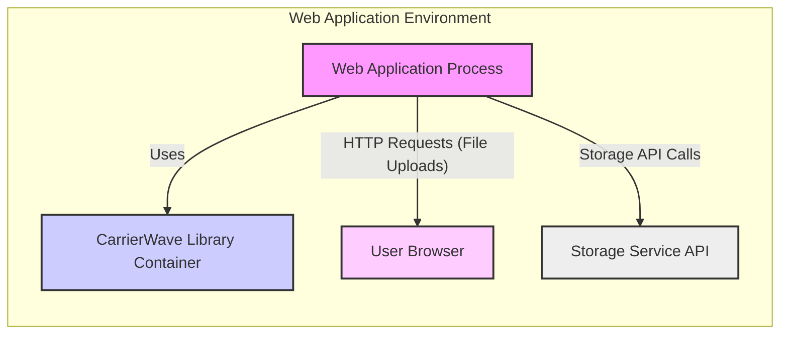
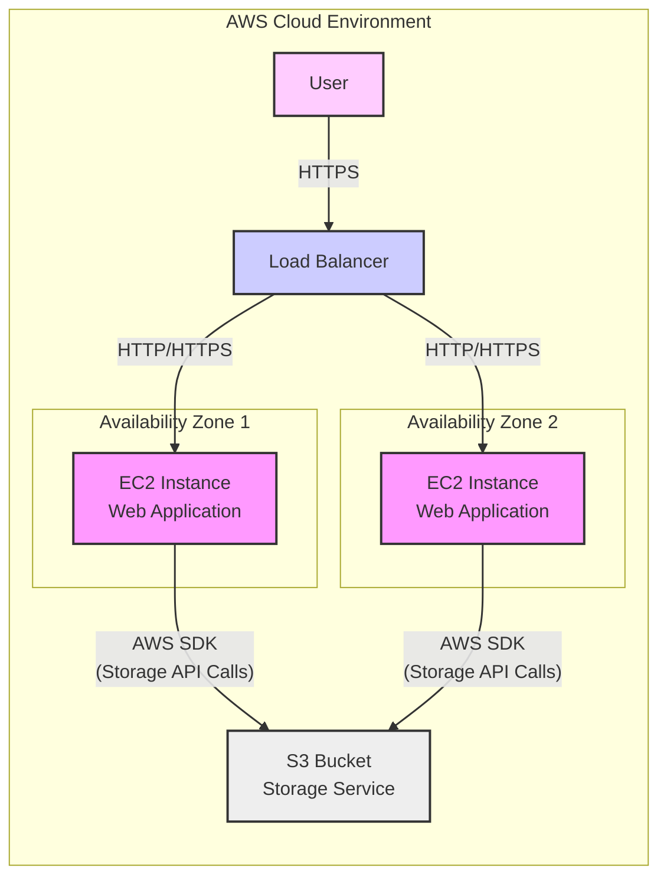
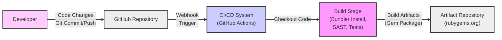

# BUSINESS POSTURE

This project, CarrierWave, is a Ruby library designed to simplify file uploads in web applications built with frameworks like Ruby on Rails and Sinatra. Its primary business purpose is to provide developers with a robust, flexible, and easy-to-use solution for handling file uploads, processing, storage, and retrieval.

Business Priorities and Goals:
- Ease of Integration: The library should be simple to integrate into existing and new Ruby web applications.
- Flexibility: It should support various storage options (local filesystem, cloud storage like AWS S3, Google Cloud Storage, etc.) and allow for custom processing and manipulation of uploaded files.
- Reliability: The library must reliably handle file uploads and storage without data loss or corruption.
- Performance: File uploads and retrievals should be efficient and not negatively impact application performance.
- Security: The library must facilitate secure file handling to prevent vulnerabilities related to file uploads.

Business Risks:
- Data Breach: Mishandling of uploaded files could lead to unauthorized access or exposure of sensitive user data.
- Service Disruption: Vulnerabilities in file upload processing or storage could lead to denial-of-service attacks or application crashes.
- Data Integrity: Bugs or misconfigurations could result in data corruption or loss of uploaded files.
- Reputational Damage: Security vulnerabilities or data breaches related to file uploads can damage the reputation of businesses using the library.
- Compliance Violations: Failure to secure uploaded data properly may lead to non-compliance with data protection regulations (e.g., GDPR, HIPAA).

# SECURITY POSTURE

Existing Security Controls:
- security control: Code Review - The project is open source and hosted on GitHub, allowing for community code review. Implemented on GitHub.
- security control: Version Control - Git is used for version control, providing history and traceability of code changes. Implemented on GitHub.
- security control: Issue Tracking - GitHub Issues are used for bug reports and feature requests, allowing for community reporting of potential security issues. Implemented on GitHub.
- security control: Testing - The project includes unit and integration tests to ensure functionality and catch regressions. Described in repository README and test directory.

Accepted Risks:
- accepted risk: Open Source Vulnerabilities - As an open-source project, there is a risk of undiscovered vulnerabilities in the code.
- accepted risk: Dependency Vulnerabilities - The library depends on other Ruby gems, which may have their own vulnerabilities.
- accepted risk: Community Support Reliance - Security updates and patches depend on the active maintenance of the open-source community.

Recommended Security Controls:
- security control: Automated Dependency Scanning - Implement automated checks for vulnerabilities in dependencies using tools like Bundler Audit or Dependabot.
- security control: Static Application Security Testing (SAST) - Integrate SAST tools into the CI/CD pipeline to automatically scan the codebase for potential security flaws.
- security control: Dynamic Application Security Testing (DAST) - Recommend DAST testing for applications using CarrierWave to identify runtime vulnerabilities related to file uploads.
- security control: Secure Configuration Guidance - Provide clear documentation and best practices for secure configuration of CarrierWave, including storage options and processing pipelines.
- security control: Regular Security Audits - Encourage periodic security audits of the codebase by security experts.

Security Requirements:
- Authentication: While CarrierWave itself doesn't handle authentication, applications using it must implement robust authentication to control who can upload files.
- Authorization: Applications must implement authorization to ensure that users can only access and manage files they are permitted to.
- Input Validation: CarrierWave and applications using it must perform thorough input validation on uploaded files, including file types, sizes, and content, to prevent malicious uploads.
- Cryptography: Consider using encryption for storing sensitive uploaded files at rest and during transmission, depending on the application's security requirements. CarrierWave should support or facilitate integration with encryption mechanisms.

# DESIGN

## C4 CONTEXT

```mermaid
flowchart LR
    subgraph "Web Application Environment"
        A["Web Application"] -- "Uses" --> B["CarrierWave Library"]
        A -- "Uploads Files" --> C["User"]
        A -- "Stores/Retrieves Files" --> D["Storage Service"]
    end
    C["User"]
    D["Storage Service"]

    style A fill:#f9f,stroke:#333,stroke-width:2px
    style B fill:#ccf,stroke:#333,stroke-width:2px
    style C fill:#fcf,stroke:#333,stroke-width:2px
    style D fill:#eee,stroke:#333,stroke-width:2px

    linkStyle 0,1,2,3 stroke:#333, stroke-width:1.5px;
```

Context Diagram Elements:

- Element:
    - Name: Web Application
    - Type: Software System
    - Description: The web application built using Ruby frameworks (e.g., Rails, Sinatra) that integrates the CarrierWave library to handle file uploads.
    - Responsibilities:
        - Provides user interface for file uploads.
        - Integrates CarrierWave library for file handling logic.
        - Authenticates and authorizes users.
        - Manages user sessions and application logic.
    - Security controls:
        - security control: Authentication and Authorization mechanisms.
        - security control: Input validation on user requests.
        - security control: Session management.

- Element:
    - Name: CarrierWave Library
    - Type: Software System / Library
    - Description: The CarrierWave Ruby gem, responsible for handling file uploads, processing, storage, and retrieval within the web application.
    - Responsibilities:
        - Provides API for file uploads and management.
        - Handles file processing and manipulation (e.g., resizing, thumbnails).
        - Manages storage interactions with various storage services.
        - Provides configuration options for storage, processing, and security.
    - Security controls:
        - security control: Input validation on file metadata and content.
        - security control: Secure file handling practices within the library.
        - security control: Configuration options for secure storage.

- Element:
    - Name: User
    - Type: Person
    - Description: End-users of the web application who upload files through the application interface.
    - Responsibilities:
        - Upload files through the web application.
        - Access and manage their uploaded files (depending on application functionality).
    - Security controls:
        - security control: User authentication to access the web application.
        - security control: Authorization to upload and manage files.

- Element:
    - Name: Storage Service
    - Type: External System
    - Description: External storage services used to store uploaded files. This could be local filesystem, cloud storage (AWS S3, Google Cloud Storage), or other storage solutions.
    - Responsibilities:
        - Persistently store uploaded files.
        - Provide access to files for retrieval by the web application.
        - Ensure data durability and availability.
    - Security controls:
        - security control: Access control mechanisms to restrict access to stored files.
        - security control: Encryption at rest and in transit (depending on the storage service).
        - security control: Data backup and recovery mechanisms.

## C4 CONTAINER



Container Diagram Elements:

- Element:
    - Name: Web Application Process
    - Type: Container / Application Process
    - Description: The running instance of the web application, typically a Ruby process (e.g., Puma, Unicorn) executing the application code.
    - Responsibilities:
        - Handles HTTP requests from user browsers.
        - Executes application logic, including file upload handling using CarrierWave.
        - Interacts with the Storage Service API to store and retrieve files.
    - Security controls:
        - security control: Web Application Firewall (WAF) in front of the application.
        - security control: Input validation within the application code.
        - security control: Secure coding practices in application development.

- Element:
    - Name: CarrierWave Library Container
    - Type: Container / Library
    - Description: The CarrierWave library loaded and used within the Web Application Process. It's not a separate running process but a component within the application.
    - Responsibilities:
        - Provides file upload and processing functionalities to the Web Application Process.
        - Manages interactions with the Storage Service API based on configuration.
        - Enforces configured file processing and storage rules.
    - Security controls:
        - security control: Secure coding practices within the CarrierWave library.
        - security control: Configuration options for secure storage and processing.

- Element:
    - Name: User Browser
    - Type: Container / Client Application
    - Description: The user's web browser used to interact with the web application.
    - Responsibilities:
        - Sends HTTP requests to the Web Application Process, including file upload requests.
        - Renders the web application user interface.
    - Security controls:
        - security control: Browser security features (e.g., Content Security Policy, Same-Origin Policy).
        - security control: User awareness of phishing and malicious websites.

- Element:
    - Name: Storage Service API
    - Type: Container / API
    - Description: The API provided by the chosen storage service (e.g., AWS S3 API, Google Cloud Storage API) that the Web Application Process interacts with to store and retrieve files.
    - Responsibilities:
        - Provides an interface for the Web Application Process to interact with the storage service.
        - Manages authentication and authorization for API requests.
        - Handles data storage and retrieval operations.
    - Security controls:
        - security control: API authentication and authorization (e.g., API keys, IAM roles).
        - security control: Encryption in transit (HTTPS).
        - security control: Storage service security controls (access policies, encryption at rest).

## DEPLOYMENT

Deployment Architecture Option: Cloud Deployment (AWS Example)



Deployment Diagram Elements (AWS Cloud Deployment):

- Element:
    - Name: EC2 Instance (Web Application)
    - Type: Infrastructure / Compute Instance
    - Description: Amazon EC2 instances running the Web Application Process. Deployed across multiple Availability Zones for high availability.
    - Responsibilities:
        - Host and execute the Web Application Process.
        - Handle incoming HTTP/HTTPS requests from the Load Balancer.
        - Interact with the S3 Bucket for file storage using the AWS SDK.
    - Security controls:
        - security control: Instance security groups to control network traffic.
        - security control: Operating system hardening and patching.
        - security control: IAM roles to restrict access to AWS resources.

- Element:
    - Name: Load Balancer
    - Type: Infrastructure / Load Balancer
    - Description: AWS Elastic Load Balancer distributing incoming traffic across the EC2 instances.
    - Responsibilities:
        - Distribute traffic across healthy EC2 instances.
        - Provide SSL/TLS termination.
        - Enhance application availability and scalability.
    - Security controls:
        - security control: SSL/TLS encryption for traffic termination.
        - security control: Security policies to protect the load balancer.

- Element:
    - Name: S3 Bucket (Storage Service)
    - Type: Infrastructure / Storage Service
    - Description: Amazon S3 bucket used as the storage service for uploaded files.
    - Responsibilities:
        - Persistently store uploaded files.
        - Provide scalable and durable storage.
        - Offer access control and security features.
    - Security controls:
        - security control: S3 bucket policies to control access.
        - security control: Encryption at rest (S3 server-side encryption).
        - security control: Encryption in transit (HTTPS for S3 access).
        - security control: S3 versioning and backup capabilities.

- Element:
    - Name: User
    - Type: Person
    - Description: End-users accessing the web application through their browsers.
    - Responsibilities:
        - Access the application via HTTPS.
    - Security controls:
        - security control: User device security.
        - security control: Secure network connection.

## BUILD



Build Process Description:

1. Developer makes code changes and commits/pushes them to the GitHub repository.
2. GitHub repository receives the code changes and triggers a webhook to the CI/CD system (e.g., GitHub Actions).
3. CI/CD system (GitHub Actions in this example) receives the webhook and starts a new build pipeline.
4. Build Stage:
    - Checkout Code: The CI/CD system checks out the latest code from the GitHub repository.
    - Dependency Installation: Uses Bundler to install Ruby gem dependencies.
    - Security Checks: Runs Static Application Security Testing (SAST) tools to scan the code for potential vulnerabilities.
    - Automated Tests: Executes unit and integration tests to ensure code quality and functionality.
5. Artifact Creation: If the build and tests are successful, the CI/CD system packages the library into a Gem package (build artifact).
6. Artifact Repository: The Gem package is published to an artifact repository like rubygems.org, making it available for developers to use in their Ruby projects.

Build Process Security Controls:

- security control: Version Control (Git): Tracks code changes and provides history. Implemented by GitHub.
- security control: Code Review: Encouraged through pull requests and community contributions on GitHub. Implemented as process.
- security control: Automated Testing: Unit and integration tests are run in the CI/CD pipeline to catch regressions and ensure code quality. Implemented in GitHub Actions.
- security control: Static Application Security Testing (SAST): SAST tools can be integrated into the CI/CD pipeline to automatically scan for security vulnerabilities in the code. Recommended for implementation in GitHub Actions.
- security control: Dependency Scanning: Tools like Bundler Audit or Dependabot can be used to scan for vulnerabilities in gem dependencies. Recommended for implementation in GitHub Actions.
- security control: Secure Build Environment: Using a controlled and secure CI/CD environment (e.g., GitHub Actions) reduces the risk of build process compromise. Implemented by GitHub Actions.
- security control: Code Signing (for Gem Package): Consider signing the Gem package to ensure integrity and authenticity. Optional enhancement.

# RISK ASSESSMENT

Critical Business Processes:
- For CarrierWave library itself: Ensuring the library is secure, reliable, and functional for developers to use in their applications.
- For applications using CarrierWave: Handling user file uploads securely and reliably, which can be critical for various business processes like user content management, data collection, document processing, etc. The criticality depends on the specific application.

Data to Protect and Sensitivity:
- For CarrierWave library itself: Source code of the library. Sensitivity: Publicly available open-source code, but integrity is important.
- For applications using CarrierWave: User-uploaded files and associated metadata. Sensitivity: Varies greatly depending on the application and the type of files uploaded. Could range from low sensitivity (e.g., profile pictures) to highly sensitive (e.g., medical records, financial documents). The sensitivity level is determined by the application context, not CarrierWave directly.

# QUESTIONS & ASSUMPTIONS

Questions:
- What type of applications are primarily using CarrierWave? (e.g., public-facing websites, internal applications, etc.)
- What are the typical storage services used with CarrierWave in production? (e.g., local filesystem, AWS S3, Google Cloud Storage, Azure Blob Storage)
- What is the security maturity level of organizations that are expected to use CarrierWave? (e.g., startups, Fortune 500 companies, government agencies)
- Are there any specific compliance requirements that applications using CarrierWave need to adhere to? (e.g., GDPR, HIPAA, PCI DSS)

Assumptions:
- BUSINESS POSTURE: The primary business goal is to provide a useful and reliable file upload library for Ruby developers. Security is a significant concern, but ease of use and flexibility are also important.
- SECURITY POSTURE:  Basic security practices like code review and testing are in place. However, more advanced security controls like automated SAST/DAST and dependency scanning are recommended for enhanced security. Applications using CarrierWave are responsible for implementing application-level security controls like authentication, authorization, and comprehensive input validation.
- DESIGN: CarrierWave is designed as a library to be integrated into web applications. It supports various storage backends and is intended to be deployed in typical web application environments, potentially including cloud deployments. The build process involves standard Ruby gem development practices and can be enhanced with CI/CD and security scanning.