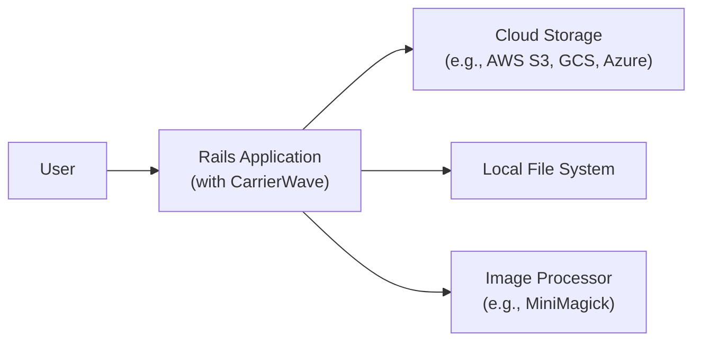
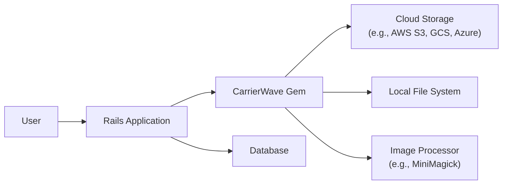
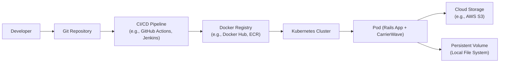
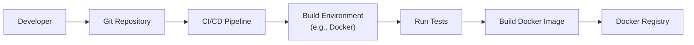

Okay, let's create a design document for the CarrierWave project.

# BUSINESS POSTURE

CarrierWave is a Ruby gem that provides a simple and flexible way to upload files from Ruby applications, particularly those built with Ruby on Rails. It's a mature and widely-used project.

Priorities:

*   Maintainability:  The project must remain easy to maintain and update, given its widespread use and the evolving Ruby/Rails ecosystem.
*   Flexibility:  It needs to support a variety of storage backends (local file system, cloud storage like AWS S3, Google Cloud Storage, Azure Blob Storage, etc.) and image processing libraries (MiniMagick, RMagick, etc.).
*   Ease of Use:  The API should be simple and intuitive for developers to integrate into their applications.
*   Security:  Protect against common file upload vulnerabilities, such as uploading malicious files, unrestricted file types, and excessive file sizes.
*   Backward Compatibility: As a widely used library, maintaining backward compatibility where possible is crucial to avoid breaking existing applications.
*   Performance: File uploads and downloads should be reasonably performant, avoiding unnecessary overhead.

Business Goals:

*   Provide a reliable and well-maintained file upload solution for the Ruby community.
*   Reduce the development effort required for handling file uploads in Ruby applications.
*   Facilitate the creation of applications that handle user-generated content (images, documents, etc.).

Most Important Business Risks:

*   Security Vulnerabilities:  A critical vulnerability in CarrierWave could impact a large number of applications, leading to data breaches or system compromise. This is the highest priority risk.
*   Lack of Maintenance:  If the project is not actively maintained, it could become incompatible with newer versions of Ruby, Rails, or storage providers, rendering it unusable.
*   Breaking Changes:  Introducing breaking changes without a clear migration path could cause significant disruption for users.
*   Performance Bottlenecks: Poor performance could lead to user dissatisfaction and impact the scalability of applications using CarrierWave.

# SECURITY POSTURE

Existing Security Controls:

*   security control: File Type Whitelisting (Configurable): CarrierWave allows developers to specify a whitelist of allowed file extensions (`extension_allowlist`). This is a crucial control to prevent the upload of executable files or other potentially dangerous file types. Implemented in uploader configuration.
*   security control: File Size Limits (Configurable): Developers can set maximum file size limits (`size_range`). This helps prevent denial-of-service attacks that attempt to exhaust server resources by uploading extremely large files. Implemented in uploader configuration.
*   security control: Storage Sanitization: CarrierWave provides mechanisms for sanitizing filenames to prevent issues with special characters or directory traversal attacks. This is often handled by storage providers (e.g., AWS S3 automatically handles URL encoding). Implemented in storage providers.
*   security control: Image Processing Validation (Indirect): When using image processing libraries like MiniMagick, CarrierWave indirectly benefits from the security features of those libraries, such as protection against image bombs (maliciously crafted images designed to crash image processors). Implemented in image processors.
*   security control: Regular Expression for Filenames (Configurable): CarrierWave allows to configure regular expression to validate filenames. Implemented in uploader configuration.

Accepted Risks:

*   accepted risk: Reliance on External Libraries: CarrierWave depends on external libraries for storage and image processing. Vulnerabilities in these libraries could impact CarrierWave's security. This risk is mitigated by choosing well-maintained and reputable libraries, and by staying up-to-date with security patches.
*   accepted risk: Configuration Errors: The security of CarrierWave heavily relies on proper configuration by developers. Misconfiguration (e.g., disabling the file type whitelist) can introduce vulnerabilities. This risk is mitigated by providing clear documentation and secure defaults.
*   accepted risk: Denial of Service (DoS): While file size limits help mitigate DoS attacks, a sufficiently large number of concurrent uploads could still overwhelm server resources. This is a general risk for any web application handling file uploads and requires broader mitigation strategies at the infrastructure level.

Recommended Security Controls:

*   security control: Implement Content Security Policy (CSP) headers in applications using CarrierWave to mitigate XSS risks associated with user-uploaded content.
*   security control: Consider integrating a virus scanning solution to scan uploaded files for malware, especially if accepting uploads from untrusted users.
*   security control: Implement robust logging and monitoring to detect and respond to suspicious upload activity.

Security Requirements:

*   Authentication: CarrierWave itself does not handle authentication. Authentication is the responsibility of the application using CarrierWave. The application must ensure that only authorized users can upload files.
*   Authorization: The application using CarrierWave must implement appropriate authorization mechanisms to control which users can upload files to specific locations or resources. CarrierWave provides hooks (e.g., `permissions`) that can be used to integrate with the application's authorization system.
*   Input Validation:
    *   File Type: Strictly enforce the file type whitelist.
    *   File Size: Enforce maximum file size limits.
    *   Filename: Sanitize filenames to prevent directory traversal and other filename-related attacks.
    *   File Content: If possible, validate the file content to ensure it matches the declared file type (e.g., using magic numbers). This is more complex but can provide additional security.
*   Cryptography:
    *   HTTPS: All file uploads and downloads should occur over HTTPS to protect data in transit. This is the responsibility of the application and the web server configuration.
    *   Storage Encryption: If storing files in cloud storage, use server-side encryption provided by the storage provider (e.g., AWS S3 server-side encryption).
    *   Data at Rest: Consider encrypting files at rest on the server's file system if sensitive data is being stored.

# DESIGN

## C4 CONTEXT

Element Description:

*   Element:
    *   Name: User
    *   Type: Person
    *   Description: A user of the application that uploads files.
    *   Responsibilities: Initiates file uploads through the application's interface.
    *   Security controls: Relies on application-level authentication and authorization.

*   Element:
    *   Name: Rails Application (with CarrierWave)
    *   Type: Software System
    *   Description: The Ruby on Rails application that integrates CarrierWave for file upload functionality.
    *   Responsibilities: Handles user requests, processes file uploads, interacts with storage providers, and performs image processing (if configured).
    *   Security controls: File type whitelisting, file size limits, filename sanitization, integration with application's authentication and authorization.

*   Element:
    *   Name: Cloud Storage (e.g., AWS S3, GCS, Azure)
    *   Type: Software System
    *   Description: A cloud-based storage service used to store uploaded files.
    *   Responsibilities: Stores files persistently, provides access control mechanisms, and handles scaling and availability.
    *   Security controls: Server-side encryption, access control lists (ACLs), versioning, logging.

*   Element:
    *   Name: Local File System
    *   Type: Software System
    *   Description: The server's local file system, used as an alternative storage option.
    *   Responsibilities: Stores files on the server's disk.
    *   Security controls: File system permissions, operating system security features.

*   Element:
    *   Name: Image Processor (e.g., MiniMagick)
    *   Type: Software System
    *   Description: A library used for image processing tasks (resizing, cropping, etc.).
    *   Responsibilities: Processes images based on configured options.
    *   Security controls: Relies on the security features of the chosen image processing library.

## C4 CONTAINER

Since CarrierWave is a library, the container diagram is essentially an extension of the context diagram, showing how CarrierWave integrates within a Rails application.

Element Description:

*   Element:
    *   Name: User
    *   Type: Person
    *   Description: A user of the application that uploads files.
    *   Responsibilities: Initiates file uploads through the application's interface.
    *   Security controls: Relies on application-level authentication and authorization.

*   Element:
    *   Name: Rails Application
    *   Type: Web Application
    *   Description: The Ruby on Rails application that integrates CarrierWave for file upload functionality.
    *   Responsibilities: Handles user requests, processes file uploads, interacts with storage providers, and performs image processing (if configured).
    *   Security controls: File type whitelisting, file size limits, filename sanitization, integration with application's authentication and authorization.

*   Element:
    *   Name: CarrierWave Gem
    *   Type: Library
    *   Description: The CarrierWave library, providing the core file upload functionality.
    *   Responsibilities: Manages file uploads, interacts with storage adapters, and provides configuration options.
    *   Security controls: File type whitelisting, file size limits, filename sanitization.

*   Element:
    *   Name: Cloud Storage (e.g., AWS S3, GCS, Azure)
    *   Type: Software System
    *   Description: A cloud-based storage service used to store uploaded files.
    *   Responsibilities: Stores files persistently, provides access control mechanisms, and handles scaling and availability.
    *   Security controls: Server-side encryption, access control lists (ACLs), versioning, logging.

*   Element:
    *   Name: Local File System
    *   Type: Software System
    *   Description: The server's local file system, used as an alternative storage option.
    *   Responsibilities: Stores files on the server's disk.
    *   Security controls: File system permissions, operating system security features.

*   Element:
    *   Name: Image Processor (e.g., MiniMagick)
    *   Type: Software System
    *   Description: A library used for image processing tasks (resizing, cropping, etc.).
    *   Responsibilities: Processes images based on configured options.
    *   Security controls: Relies on the security features of the chosen image processing library.

*   Element:
    *   Name: Database
    *   Type: Database
    *   Description: Database used by Rails application.
    *   Responsibilities: Stores information about uploaded files, e.g. path, uploader.
    *   Security controls: Access control, encryption at rest, backups.

## DEPLOYMENT

CarrierWave itself is a library and doesn't have a specific deployment process.  Its deployment is tied to the Rails application that uses it.  Here are some common deployment scenarios for Rails applications, and we'll pick one to detail:

1.  **Traditional Server Deployment (e.g., using Capistrano):**  The Rails application is deployed to a physical or virtual server, typically using a deployment tool like Capistrano.  The application code, including CarrierWave, is copied to the server, and dependencies are installed.
2.  **Containerized Deployment (e.g., using Docker and Kubernetes):** The Rails application, along with CarrierWave and all its dependencies, is packaged into a Docker container.  This container is then deployed to a container orchestration platform like Kubernetes.
3.  **Platform-as-a-Service (PaaS) Deployment (e.g., using Heroku):** The Rails application is deployed to a PaaS provider like Heroku.  The deployment process is typically handled by the PaaS provider, which manages the underlying infrastructure.

Let's detail the **Containerized Deployment (Docker and Kubernetes)** scenario:

Element Description:

*   Element:
    *   Name: Developer
    *   Type: Person
    *   Description: Develops the Rails application and pushes code to the Git repository.
    *   Responsibilities: Writes code, tests, and configuration.
    *   Security controls: Code reviews, secure coding practices.

*   Element:
    *   Name: Git Repository
    *   Type: Version Control System
    *   Description: Stores the application's source code.
    *   Responsibilities: Tracks code changes, manages versions.
    *   Security controls: Access control, branch protection rules.

*   Element:
    *   Name: CI/CD Pipeline (e.g., GitHub Actions, Jenkins)
    *   Type: Automation Server
    *   Description: Automates the build, test, and deployment process.
    *   Responsibilities: Builds the Docker image, runs tests, pushes the image to the registry, and triggers deployment to Kubernetes.
    *   Security controls: Secure configuration, access control, secrets management.

*   Element:
    *   Name: Docker Registry (e.g., Docker Hub, ECR)
    *   Type: Container Registry
    *   Description: Stores Docker images.
    *   Responsibilities: Provides a central repository for Docker images.
    *   Security controls: Access control, image scanning.

*   Element:
    *   Name: Kubernetes Cluster
    *   Type: Container Orchestration Platform
    *   Description: Manages the deployment and scaling of containerized applications.
    *   Responsibilities: Schedules pods, manages networking, ensures high availability.
    *   Security controls: Network policies, role-based access control (RBAC), pod security policies.

*   Element:
    *   Name: Pod (Rails App + CarrierWave)
    *   Type: Pod
    *   Description: A Kubernetes pod running the Rails application container, which includes CarrierWave.
    *   Responsibilities: Executes the application code, handles file uploads.
    *   Security controls: Inherits security controls from the container and Kubernetes cluster.

*   Element:
    *   Name: Cloud Storage (e.g., AWS S3)
    *   Type: Cloud Storage Service
    *   Description: Used for persistent storage of uploaded files.
    *   Responsibilities: Stores files, provides access control.
    *   Security controls: Server-side encryption, access control lists (ACLs).

*   Element:
    *   Name: Persistent Volume (Local File System)
    *   Type: Persistent Volume
    *   Description: A Kubernetes Persistent Volume, providing local file system storage for the pod (if local storage is used instead of cloud storage).
    *   Responsibilities: Provides persistent storage on the host node.
    *   Security controls: File system permissions, Kubernetes volume security features.

## BUILD

The build process for a Rails application using CarrierWave, in a containerized environment, typically involves these steps:

1.  **Developer pushes code:** A developer pushes code changes to a Git repository (e.g., GitHub, GitLab).
2.  **CI/CD pipeline triggered:** A CI/CD pipeline (e.g., GitHub Actions, Jenkins) is triggered by the code push.
3.  **Checkout code:** The pipeline checks out the latest code from the repository.
4.  **Build environment setup:** The pipeline sets up the build environment, including installing necessary dependencies (Ruby, Rails, CarrierWave, image processing libraries, etc.). This is often done within a Docker container to ensure consistency.
5.  **Run tests:** The pipeline runs the application's test suite (unit tests, integration tests, etc.).
6.  **Build Docker image:** If the tests pass, the pipeline builds a Docker image containing the Rails application, CarrierWave, and all dependencies. This image is built based on a `Dockerfile`.
7.  **Push Docker image:** The pipeline pushes the built Docker image to a container registry (e.g., Docker Hub, Amazon ECR, Google Container Registry).
8.  **Deploy (optional):** The pipeline may also trigger a deployment to a staging or production environment (e.g., Kubernetes).

Security Controls in the Build Process:

*   security control: **Dependency Management:** Use a dependency management tool (e.g., Bundler for Ruby) to track and manage dependencies, and regularly update them to address security vulnerabilities.
*   security control: **Static Application Security Testing (SAST):** Integrate SAST tools (e.g., Brakeman for Rails) into the CI/CD pipeline to scan the application code for security vulnerabilities.
*   security control: **Software Composition Analysis (SCA):** Use SCA tools (e.g., bundler-audit) to identify known vulnerabilities in third-party libraries (including CarrierWave and its dependencies).
*   security control: **Container Image Scanning:** Scan the built Docker image for vulnerabilities using tools like Trivy, Clair, or Anchore.
*   security control: **Secrets Management:** Avoid hardcoding secrets (API keys, passwords) in the code or Dockerfile. Use a secure secrets management solution (e.g., environment variables, Kubernetes secrets, HashiCorp Vault).
*   security control: **Least Privilege:** Run the build process with the least privileges necessary. Avoid running the build as root.
*   security control: **Build Artifact Signing:** Consider signing the Docker image to ensure its integrity and authenticity.

# RISK ASSESSMENT

Critical Business Processes to Protect:

*   User Data Management: Ensuring the confidentiality, integrity, and availability of user-uploaded files.
*   Application Functionality: Maintaining the availability and proper functioning of the application, including its file upload capabilities.
*   Reputation: Protecting the reputation of the application and the organization by preventing security breaches and data leaks.

Data to Protect and Sensitivity:

*   User-Uploaded Files: The sensitivity of these files depends on the nature of the application. They could range from publicly shareable images to highly confidential documents. The application must handle all files securely, but the level of protection required may vary based on the sensitivity.
*   Application Configuration Data: This includes database credentials, API keys, and other sensitive information. This data is highly sensitive and must be protected from unauthorized access.
*   User Account Information: Usernames, passwords (hashed and salted), email addresses, and other user profile data. This data is sensitive and subject to privacy regulations (e.g., GDPR, CCPA).

# QUESTIONS & ASSUMPTIONS

Questions:

*   What specific types of files are users expected to upload? (This helps determine appropriate file type restrictions and validation.)
*   What are the expected file size limits? (This helps configure appropriate size restrictions.)
*   What is the expected volume of uploads? (This helps assess potential performance bottlenecks and scaling needs.)
*   What are the specific compliance requirements (e.g., GDPR, HIPAA) that the application must adhere to?
*   Which storage providers are intended to be used with CarrierWave (AWS S3, Google Cloud Storage, local file system, etc.)?
*   Are there any specific image processing requirements (resizing, cropping, watermarking, etc.)?
*   What is the existing infrastructure and deployment process for the application?
*   What is the team's familiarity with secure coding practices and security testing tools?

Assumptions:

*   BUSINESS POSTURE: The application using CarrierWave is a Ruby on Rails application. The primary goal is to provide a reliable and secure file upload mechanism.
*   SECURITY POSTURE: Developers using CarrierWave will follow best practices for secure configuration (e.g., enabling the file type whitelist). The application using CarrierWave will handle authentication and authorization appropriately. The underlying infrastructure (servers, networks) is reasonably secure.
*   DESIGN: CarrierWave will be used with a supported storage provider (e.g., AWS S3, local file system). The application will be deployed using a standard deployment method (e.g., Capistrano, Docker, Heroku). The application will use HTTPS for all file uploads and downloads.