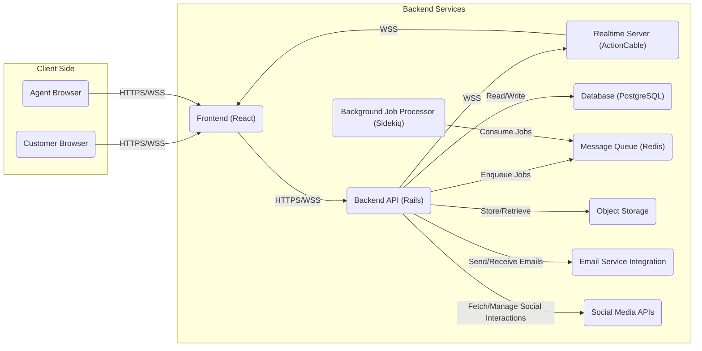
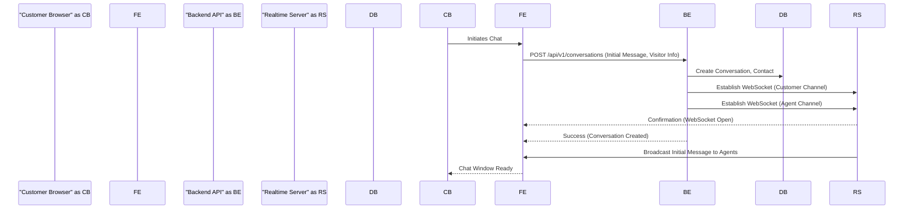

# Project Design Document: Chatwoot

**Version:** 1.1
**Date:** October 26, 2023
**Prepared By:** Gemini (AI Architecture Expert)

## 1. Introduction

This document provides a detailed architectural design of the Chatwoot project (as represented by the GitHub repository: [https://github.com/chatwoot/chatwoot](https://github.com/chatwoot/chatwoot)). This document aims to clearly outline the system's components, their interactions, data flows, and key technologies. It will serve as a foundation for subsequent threat modeling activities, providing a comprehensive understanding of the system's attack surface.

## 2. Project Overview

Chatwoot is an open-source customer engagement platform, providing features like live chat, shared email inboxes, and social media integrations (e.g., Facebook, Twitter, WhatsApp) to manage customer conversations from a unified interface. It's designed to be a self-hosted, privacy-focused alternative to proprietary customer support solutions, emphasizing data ownership and customization.

## 3. System Architecture

The Chatwoot architecture is designed with a modular approach, allowing for scalability and maintainability. The core components are:

*   **Frontend (Web Application):**
    *   Built using React, leveraging a component-based architecture for UI development.
    *   Provides distinct user interfaces for agents (managing conversations) and customers (interacting via chat widgets).
    *   Handles user authentication (login, registration, password management) and authorization based on roles and permissions.
    *   Communicates with the Backend API using asynchronous requests (e.g., Fetch API, Axios) for data retrieval and manipulation.
    *   Utilizes WebSockets for real-time, bidirectional communication with the Realtime Server, enabling features like live chat updates, typing indicators, and presence status.
    *   Manages the display of notifications and user interface updates based on events received via WebSockets.

*   **Backend (API Server):**
    *   Built using Ruby on Rails, following the MVC (Model-View-Controller) architectural pattern.
    *   Exposes RESTful APIs (and potentially GraphQL endpoints for specific data needs) for the frontend and other services to interact with.
    *   Handles core business logic, including conversation management, user management, contact management, and reporting.
    *   Performs data validation and sanitization to ensure data integrity and prevent security vulnerabilities.
    *   Manages user authentication and authorization using mechanisms like JWT (JSON Web Tokens) or Rails' built-in session management.
    *   Integrates with external services through APIs and webhooks, such as email providers (e.g., SendGrid, Mailgun), social media platforms (e.g., Facebook Graph API, Twitter API), and potentially other third-party applications.
    *   Manages background jobs and asynchronous tasks using a message queue (e.g., Redis) and a background job processor (e.g., Sidekiq).

*   **Realtime Server (ActionCable/WebSockets):**
    *   Leverages Rails' ActionCable framework, built on top of WebSockets, to facilitate real-time communication.
    *   Manages persistent WebSocket connections with both agent and customer browsers.
    *   Handles message broadcasting and routing between connected clients based on conversation channels and user roles.
    *   Provides mechanisms for presence tracking (online/offline status of agents).
    *   May include logic for handling connection management, such as reconnection attempts and timeouts.

*   **Database:**
    *   Stores persistent data using a relational database, typically PostgreSQL.
    *   Organizes data into tables representing entities like users, conversations, messages, contacts, inboxes, and settings.
    *   Ensures data integrity through database constraints, relationships, and transactions.
    *   May utilize database features like indexing for optimized data retrieval.

*   **Message Queue (e.g., Redis):**
    *   Acts as a message broker, facilitating asynchronous communication between different parts of the application.
    *   Used for queuing background jobs, such as sending emails, processing social media events, and handling webhook calls.
    *   Improves application responsiveness by offloading time-consuming tasks from the main request-response cycle.

*   **Object Storage (e.g., AWS S3, local storage):**
    *   Stores unstructured data, primarily media files like attachments in conversations, user avatars, and potentially conversation transcripts.
    *   Provides mechanisms for uploading, downloading, and managing files.
    *   May support different storage backends, allowing for flexibility in deployment environments.

*   **Background Job Processor (e.g., Sidekiq):**
    *   Processes tasks enqueued in the message queue (e.g., Redis).
    *   Executes background jobs asynchronously, ensuring that long-running operations do not block the main application threads.
    *   Provides features for job retries, error handling, and monitoring.

*   **Email Service Integration (SMTP/API):**
    *   Enables sending and receiving emails, crucial for features like email inboxes, notifications, and transactional emails (e.g., password resets).
    *   Integrates with external email service providers (e.g., SendGrid, Mailgun) via SMTP or their respective APIs.
    *   Handles email parsing and processing for incoming emails.

*   **Social Media Integrations (APIs):**
    *   Connects to social media platforms (e.g., Facebook Page API, Twitter API, WhatsApp Business API) to fetch and manage conversations originating from these channels.
    *   Handles authentication and authorization with social media platforms using OAuth or API keys.
    *   Translates social media platform-specific events and data into Chatwoot's internal data model.

## 4. Data Flow

The following outlines key data flows within the Chatwoot system, illustrating how different components interact:

*   **Customer Initiates a Chat via Website Widget:**
    *   Customer interacts with the chat widget embedded on a website.
    *   Frontend (within the widget) sends an API request to the Backend API to initiate a new conversation, including initial message content and visitor information.
    *   Backend API creates a new conversation record in the Database, associating it with the appropriate inbox and contact.
    *   Backend API establishes a WebSocket connection with the Realtime Server for both the customer's browser and relevant agent channels.
    *   The initial message is broadcasted via the Realtime Server to connected agent browsers.

*   **Agent Responds to a Chat:**
    *   Agent interacts with the Chatwoot web application in their browser.
    *   Agent composes a message and sends it through the Frontend.
    *   Frontend sends the message content to the Backend API via an API request.
    *   Backend API stores the message in the Database, associating it with the correct conversation.
    *   Backend API broadcasts the message via the Realtime Server to the customer's WebSocket connection and other connected agents in the conversation.

*   **New User Registration (Agent/Admin):**
    *   User interacts with the registration form on the Frontend.
    *   Frontend sends user details (email, password, name, etc.) to the Backend API.
    *   Backend API validates the data and creates a new user record in the Database, potentially hashing the password.
    *   Backend API may enqueue a background job in the Message Queue to send a confirmation email via the Email Service Integration.

*   **Processing Incoming Emails for Shared Inboxes:**
    *   Backend API periodically fetches new emails from configured email inboxes using IMAP/POP3 protocols or email provider APIs.
    *   Fetched emails are parsed, and relevant information (sender, subject, body, attachments) is extracted.
    *   Backend API creates new conversation and message records in the Database based on the email content.
    *   Notifications about new emails are pushed to relevant agents via the Realtime Server.

*   **Fetching New Social Media Interactions:**
    *   Backend API uses the respective social media platform's API (e.g., Facebook Graph API) to poll for new messages, comments, or mentions on connected social media accounts.
    *   Fetched content is processed and stored as conversations and messages in the Database.
    *   Agent actions (e.g., replying to a Facebook comment) are translated into API calls to the respective social media platform.

## 5. Key Technologies

*   **Programming Languages:** Ruby (Backend), JavaScript (Frontend)
*   **Backend Framework:** Ruby on Rails (version likely 6 or 7)
*   **Frontend Library/Framework:** React (with libraries like Redux or Zustand for state management)
*   **Database:** PostgreSQL (version likely 12 or higher)
*   **Realtime Communication:** ActionCable (WebSockets)
*   **Message Queue:** Redis (version likely 5 or higher)
*   **Background Job Processor:** Sidekiq
*   **Object Storage:**  Potentially AWS S3, Google Cloud Storage, Azure Blob Storage, or local filesystem (depending on deployment)
*   **Web Server:** Puma (default for Rails) or potentially Unicorn
*   **Operating System:** Linux (common for server deployments, e.g., Ubuntu, CentOS)
*   **Containerization:** Docker (likely used for development and deployment)
*   **Orchestration:** Kubernetes (potentially for larger, more complex deployments)
*   **Email Handling Libraries:**  Likely `mail` gem in Ruby for email processing
*   **Social Media API Clients:** Gems or libraries specific to each social media platform (e.g., `koala` for Facebook)

## 6. Deployment Architecture

Chatwoot offers flexibility in deployment, catering to different needs and scales:

*   **Self-Hosted (Traditional Server):**
    *   All components (web server, application server, database, Redis, etc.) are installed and managed directly on one or more physical or virtual servers.
    *   Requires manual configuration and maintenance of the entire stack.
    *   Provides maximum control over the environment but demands significant operational overhead.

*   **Self-Hosted (Containerized with Docker Compose):**
    *   Components are packaged as Docker containers, and their orchestration is managed using Docker Compose.
    *   Simplifies deployment and management compared to traditional server setups.
    *   Requires understanding of Docker and containerization concepts.

*   **Cloud Platforms (Managed Services):**
    *   Leverages managed services offered by cloud providers like AWS, Google Cloud, or Azure.
    *   Examples include:
        *   **Compute:** AWS EC2, Google Compute Engine, Azure Virtual Machines
        *   **Database:** AWS RDS (PostgreSQL), Google Cloud SQL for PostgreSQL, Azure Database for PostgreSQL
        *   **Message Queue:** AWS ElastiCache for Redis, Google Cloud Memorystore for Redis, Azure Cache for Redis
        *   **Object Storage:** AWS S3, Google Cloud Storage, Azure Blob Storage
        *   **Container Orchestration:** AWS ECS/EKS, Google Kubernetes Engine (GKE), Azure Kubernetes Service (AKS)
    *   Reduces operational burden by offloading infrastructure management to the cloud provider.

*   **Platform as a Service (PaaS):**
    *   Potentially deployable on PaaS platforms that support Ruby on Rails and related technologies (e.g., Heroku).
    *   Further simplifies deployment and scaling but may offer less control over the underlying infrastructure.

## 7. Diagrams

### 7.1. High-Level Architecture Diagram

### 7.2. Data Flow - Customer Initiates Chat

## 8. Security Considerations (Preliminary)

This section outlines key security considerations that need to be addressed during development and deployment.

*   **Authentication and Authorization:**
    *   Implement strong password policies and encourage the use of password managers.
    *   Utilize secure authentication mechanisms like JWT with appropriate expiration times and signature verification.
    *   Implement role-based access control (RBAC) to restrict access to sensitive features and data based on user roles (e.g., admin, agent).
    *   Consider implementing multi-factor authentication (MFA) for enhanced security.
    *   Protect against common authentication vulnerabilities like brute-force attacks and credential stuffing.

*   **Data Security:**
    *   Encrypt sensitive data at rest in the database (e.g., using database encryption features) and object storage (e.g., using server-side encryption).
    *   Enforce HTTPS for all communication between clients and the server to protect data in transit.
    *   Implement robust input validation and sanitization on the backend to prevent injection attacks (e.g., SQL injection, cross-site scripting (XSS), command injection).
    *   Protect against cross-site request forgery (CSRF) attacks using appropriate tokens and mechanisms.

*   **Realtime Communication Security:**
    *   Use secure WebSocket connections (WSS) to encrypt communication.
    *   Implement authorization checks on the Realtime Server to ensure that only authorized users can subscribe to specific channels and receive messages.
    *   Sanitize messages broadcasted through the Realtime Server to prevent XSS vulnerabilities.

*   **API Security:**
    *   Secure API endpoints with authentication (e.g., JWT) and authorization.
    *   Implement rate limiting to prevent denial-of-service (DoS) attacks and abuse.
    *   Follow secure API design principles, including proper error handling and data validation.
    *   Regularly audit API endpoints for potential vulnerabilities.

*   **Third-Party Integrations:**
    *   Securely store and manage API keys and tokens for integrations with email services and social media platforms, potentially using environment variables or a secrets management system.
    *   Understand the security posture of integrated services and their data handling practices.
    *   Implement appropriate error handling and fallback mechanisms for integration failures.

*   **Deployment Security:**
    *   Harden the underlying infrastructure (servers, cloud instances) by applying security patches, configuring firewalls, and disabling unnecessary services.
    *   Regularly update software and dependencies to patch known vulnerabilities.
    *   Implement network security measures, such as intrusion detection and prevention systems.
    *   Secure container images and registries if using containerized deployments.

*   **Data Privacy:**
    *   Implement mechanisms to comply with relevant data privacy regulations (e.g., GDPR, CCPA), including data deletion and anonymization features.
    *   Provide users with control over their data and privacy settings.
    *   Maintain transparency about data collection and usage practices.

## 9. Threat Modeling Focus Areas

Building upon the security considerations, the following areas should be the primary focus during threat modeling exercises:

*   **Authentication and Session Management:**  Thoroughly analyze the authentication flows, session handling mechanisms, and password reset processes for potential vulnerabilities.
*   **API Security (REST & potentially GraphQL):**  Focus on identifying vulnerabilities in API endpoints related to authentication, authorization, input validation, and data exposure.
*   **Realtime Communication (WebSockets):**  Assess the security of WebSocket connections, message integrity, authorization of channel subscriptions, and potential for message injection or eavesdropping.
*   **Data Storage Security:**  Evaluate the effectiveness of encryption at rest, access controls to the database and object storage, and backup/recovery procedures.
*   **Third-Party Integration Security:**  Analyze the risks associated with integrations with email services and social media platforms, including API key management and data exchange security.
*   **Input Validation and Output Encoding:**  Focus on identifying areas where user-provided data is processed to uncover potential injection vulnerabilities (SQLi, XSS, etc.).
*   **Deployment Environment Security:**  Consider threats related to the underlying infrastructure, container security (if applicable), and network configurations.

## 10. Conclusion

This revised document provides a more detailed and comprehensive architectural design of the Chatwoot project, offering a solid foundation for in-depth threat modeling. By clearly outlining the system's components, data flows, technologies, and preliminary security considerations, this document empowers security professionals to effectively identify potential vulnerabilities and develop appropriate mitigation strategies. This document will be maintained and updated as the Chatwoot project continues to evolve.
