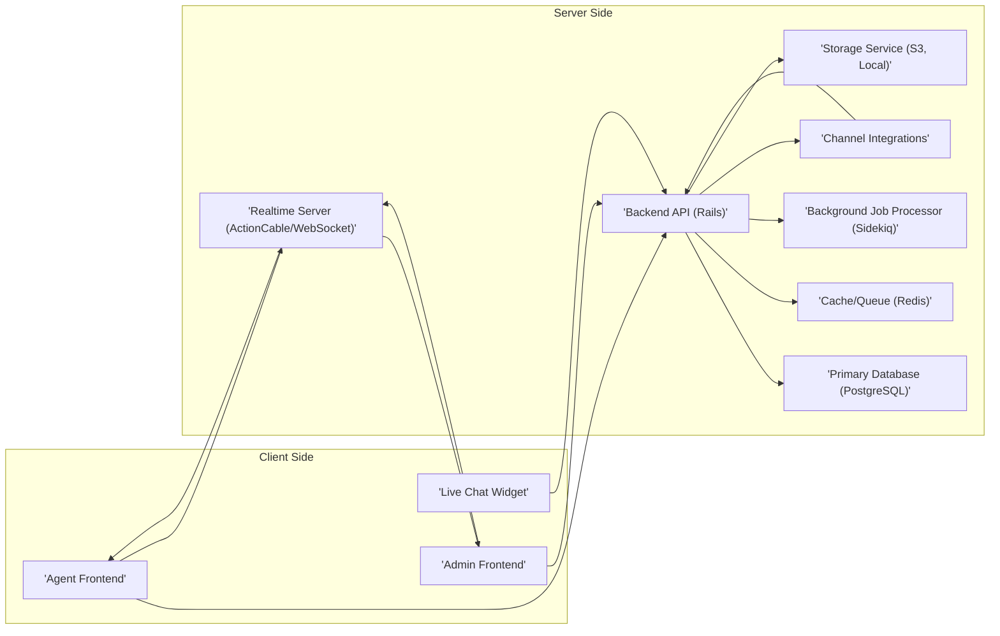

## Project Design Document: Chatwoot (Improved)

**1. Introduction**

This document provides an enhanced architectural design of the Chatwoot project, an open-source customer engagement platform. Its primary purpose is to offer a detailed understanding of the system's components, their interactions, and data flows, specifically for conducting thorough threat modeling. This document will serve as the foundation for identifying potential security vulnerabilities and designing appropriate mitigation strategies.

**2. Project Overview**

Chatwoot is a multi-channel customer communication platform designed to facilitate interactions between businesses and their customers across various channels, including website live chat, email, and social media platforms (e.g., Facebook, Twitter, WhatsApp), and SMS. Key features include conversation management, agent assignment, knowledge base creation, reporting, and integrations with other business tools. The platform is architected for flexible deployment, supporting both self-hosted and cloud-based environments.

**3. System Architecture**

The Chatwoot architecture is built upon a modular design, with distinct components collaborating to deliver the platform's functionality.

*   **Frontend Application:**
    *   Technology Stack: React.js, Redux, Webpack, and associated JavaScript libraries.
    *   Responsibility: Provides the user interface for both customer support agents and administrative users.
    *   Functions:
        *   Handles user authentication and session management.
        *   Renders dynamic content and manages user interactions.
        *   Communicates with the Backend API via HTTP/REST for data operations.
        *   Establishes and maintains WebSocket connections with the Realtime Server for real-time updates.

*   **Backend API:**
    *   Technology Stack: Ruby on Rails framework.
    *   Responsibility: Serves as the core application logic and business rules engine.
    *   Functions:
        *   Manages user authentication and authorization using mechanisms like JWT or session-based authentication.
        *   Provides RESTful API endpoints for the Frontend Application and potential external integrations.
        *   Handles data persistence and retrieval from the primary database.
        *   Processes incoming messages from various communication channels.
        *   Enqueues and manages background jobs for asynchronous tasks.
        *   Publishes and consumes events for inter-service communication.

*   **Realtime Server:**
    *   Technology Stack: ActionCable (Rails' WebSocket integration) or a dedicated WebSocket server implementation (e.g., Node.js with Socket.IO).
    *   Responsibility: Facilitates bidirectional, real-time communication between the Backend API and connected clients (Frontend Applications).
    *   Functions:
        *   Manages WebSocket connections with authenticated users.
        *   Broadcasts new messages, conversation status updates, agent online/offline status, and other real-time events to relevant clients.
        *   May implement authorization logic to control which users receive specific real-time updates.

*   **Primary Database:**
    *   Technology Stack: Typically PostgreSQL relational database.
    *   Responsibility: Stores the core, persistent data of the application.
    *   Data Entities:
        *   User accounts (agents, administrators, potentially customer profiles).
        *   Conversations and individual messages.
        *   Channel configurations and integration details.
        *   Knowledge base articles and associated content.
        *   System settings and application configurations.

*   **Cache/Queue Database:**
    *   Technology Stack: Typically Redis in-memory data store.
    *   Responsibility: Provides caching mechanisms and a message broker for asynchronous tasks.
    *   Functions:
        *   Caching frequently accessed data to improve performance and reduce database load.
        *   Managing background job queues (using libraries like Sidekiq for Ruby).
        *   Storing temporary data for real-time features or session management.
        *   Implementing publish/subscribe patterns for inter-service communication in certain deployments.

*   **Background Job Processor:**
    *   Technology Stack: Typically Sidekiq (for Ruby on Rails applications).
    *   Responsibility: Executes asynchronous tasks offloaded from the main application thread.
    *   Examples of Tasks:
        *   Sending email notifications (e.g., new message alerts).
        *   Processing incoming webhooks from external communication channels.
        *   Generating reports and analytics.
        *   Performing data cleanup and maintenance tasks.

*   **Channel Integration Modules:**
    *   Responsibility: Handle the specific logic for integrating with external communication channels.
    *   Functions:
        *   Managing channel-specific authentication credentials and API keys.
        *   Interacting with channel APIs to send and receive messages.
        *   Transforming messages between the Chatwoot internal format and the channel's specific format.
        *   Handling webhook registrations and processing incoming events from channels.
    *   Examples:
        *   Live Chat Widget Integration (JavaScript code embedded on websites).
        *   Email Integration (using SMTP for sending and IMAP/POP3 for receiving).
        *   Social Media Integrations (utilizing platform-specific APIs like Facebook Graph API, Twitter API, WhatsApp Business API).
        *   SMS Integration (using services like Twilio, Nexmo, etc.).

*   **Storage Service:**
    *   Responsibility: Provides persistent storage for file attachments (e.g., images, documents) associated with conversations.
    *   Implementation Options:
        *   Local file system storage on the server.
        *   Cloud-based object storage services (e.g., AWS S3, Google Cloud Storage, Azure Blob Storage).
    *   Security Considerations: Access control policies and encryption for stored files.

**4. Data Flow (Detailed Examples)**

*   **New Customer Message via Live Chat:**
    *   A customer enters a message in the "Live Chat Widget" (`A`).
    *   The widget sends the message content to the "Backend API (Rails)" (`D`) via an HTTPS request.
    *   The "Backend API (Rails)" (`D`) authenticates the request (if applicable) and creates a new conversation record (if it doesn't exist) and a new message record in the "Primary Database (PostgreSQL)" (`F`).
    *   The "Backend API (Rails)" (`D`) publishes an event (e.g., "message.created") to the "Realtime Server (ActionCable/WebSocket)" (`E`).
    *   The "Realtime Server (ActionCable/WebSocket)" (`E`) broadcasts the new message data to all connected and authorized "Agent Frontend" (`B`) instances.
    *   The "Agent Frontend" (`B`) displays the new message to the agents.

*   **Agent Responds to a Customer:**
    *   An agent types a response in their "Agent Frontend" (`B`).
    *   The "Agent Frontend" (`B`) sends the response to the "Backend API (Rails)" (`D`) via an HTTPS request.
    *   The "Backend API (Rails)" (`D`) authenticates the request, creates a new message record in the "Primary Database (PostgreSQL)" (`F`), associating it with the correct conversation and agent.
    *   The "Backend API (Rails)" (`D`) publishes an event (e.g., "message.created") to the "Realtime Server (ActionCable/WebSocket)" (`E`).
    *   The "Realtime Server (ActionCable/WebSocket)" (`E`) broadcasts the agent's message data to the customer's "Live Chat Widget" (`A`) and other connected "Agent Frontend" (`B`) instances involved in the conversation.
    *   The "Live Chat Widget" (`A`) displays the agent's response to the customer.

*   **Incoming Social Media Message:**
    *   A new message arrives on a connected social media platform (e.g., a Facebook Page).
    *   The relevant "Channel Integrations" module (`I`) (e.g., the Facebook integration) either polls the platform's API for new messages or receives a webhook notification from the platform.
    *   The "Channel Integrations" module (`I`) authenticates with the platform's API and retrieves the message details.
    *   The module transforms the message into Chatwoot's internal message format.
    *   The "Channel Integrations" module (`I`) sends the new message data to the "Backend API (Rails)" (`D`) via an HTTPS request.
    *   The "Backend API (Rails)" (`D`) processes the message, creates a new conversation (if necessary), and stores the message in the "Primary Database (PostgreSQL)" (`F`).
    *   The "Backend API (Rails)" (`D`) publishes an event to the "Realtime Server (ActionCable/WebSocket)" (`E`).
    *   The "Realtime Server (ActionCable/WebSocket)" (`E`) broadcasts the message to relevant "Agent Frontend" (`B`) instances.

**5. Component Diagram (Mermaid)**

**6. Key Interactions and Data Flows**

*   **Frontend <-> Backend API:** Communication primarily occurs over HTTPS using RESTful API principles for actions like creating, reading, updating, and deleting data. Authentication is crucial for these interactions.
*   **Backend API <-> Primary Database:** The Backend API interacts with PostgreSQL using SQL queries, often through an Object-Relational Mapper (ORM) like ActiveRecord, to manage persistent data. Connection pooling and secure credential management are important considerations.
*   **Backend API <-> Realtime Server:** The Backend API pushes real-time updates to the Realtime Server via WebSocket connections. This communication might involve authentication to ensure only authorized updates are broadcast.
*   **Frontend <-> Realtime Server:** Frontend applications establish and maintain WebSocket connections with the Realtime Server to receive real-time updates. Authentication and authorization are essential to control access to specific streams of data.
*   **Backend API <-> Cache/Queue:** The Backend API interacts with Redis for caching frequently accessed data, managing background job queues (e.g., pushing jobs to Sidekiq), and potentially for implementing pub/sub messaging patterns.
*   **Backend API <-> Background Job Processor:** The Backend API enqueues background jobs in Redis, which are then processed asynchronously by the Sidekiq workers. Secure job serialization and handling of sensitive data within jobs are important.
*   **Backend API <-> Channel Integrations:** The Backend API communicates with Channel Integrations modules, often through internal method calls or message passing, to manage channel-specific logic and interactions with external APIs. Secure storage and handling of API keys and tokens are critical.
*   **Backend API <-> Storage Service:** The Backend API interacts with the Storage Service (e.g., AWS S3 API) to upload, download, and manage file attachments. Secure API key management and access control policies on the storage service are essential.

**7. Security Considerations (Detailed)**

This section expands on the initial security considerations, providing more specific areas of focus for threat modeling:

*   **Authentication and Authorization:**
    *   **Agent/Admin Authentication:** Secure password hashing (e.g., bcrypt), multi-factor authentication (MFA), protection against brute-force attacks (rate limiting login attempts).
    *   **API Authentication:**  Use of JWT (JSON Web Tokens) or secure session management for API requests. Proper validation and revocation mechanisms for tokens.
    *   **Authorization:** Role-Based Access Control (RBAC) to restrict access to features and data based on user roles. Consistent enforcement of authorization rules across the application.
    *   **Channel Integration Authentication:** Secure storage and management of API keys, OAuth tokens, and other credentials required for integrating with external platforms. Implement secure credential rotation practices.

*   **Input Validation and Output Encoding:**
    *   **Server-Side Validation:** Rigorous validation of all user inputs on the Backend API to prevent injection attacks (SQL injection, command injection, etc.). Sanitize data before database interactions.
    *   **Frontend Validation:** Implement client-side validation for improved user experience but always enforce validation on the server-side.
    *   **Output Encoding:** Properly encode data before rendering it in the Frontend Application to prevent Cross-Site Scripting (XSS) vulnerabilities. Use context-aware encoding.

*   **Data Protection:**
    *   **Encryption at Rest:** Encrypt sensitive data stored in the Primary Database and the Storage Service. Consider using database-level encryption or application-level encryption.
    *   **Encryption in Transit:** Enforce HTTPS/TLS for all communication between clients and the server, and between internal components where applicable. Secure WebSocket connections (WSS).
    *   **Data Minimization:** Only store necessary data and implement data retention policies to minimize the impact of potential breaches.

*   **Realtime Communication Security:**
    *   **WebSocket Security:** Ensure WebSocket connections are established over WSS (secure WebSockets). Implement authentication and authorization for WebSocket connections to prevent unauthorized access to real-time streams.
    *   **Message Integrity:** Consider mechanisms to ensure the integrity of messages transmitted over WebSockets.

*   **Rate Limiting and Abuse Prevention:**
    *   Implement rate limiting on API endpoints to prevent denial-of-service (DoS) attacks and brute-force attempts.
    *   Implement measures to detect and prevent spam or abusive behavior.

*   **Cross-Site Request Forgery (CSRF) Protection:**
    *   Utilize anti-CSRF tokens for state-changing requests to protect against CSRF attacks.

*   **Dependency Management:**
    *   Regularly update dependencies (libraries, frameworks) to patch known security vulnerabilities. Implement a process for monitoring and addressing security advisories.

*   **Secure File Handling:**
    *   Implement secure file upload mechanisms, including file type validation, size limits, and scanning for malware.
    *   Implement proper access controls for stored files to prevent unauthorized access.

*   **Logging and Monitoring:**
    *   Implement comprehensive logging of security-related events (authentication attempts, authorization failures, suspicious activity).
    *   Establish monitoring and alerting mechanisms to detect and respond to security incidents.

*   **Infrastructure Security:**
    *   Secure configuration of servers, firewalls, and network infrastructure.
    *   Regular security audits and vulnerability scanning.

**8. Deployment Considerations**

*   **Self-Hosted:** Requires careful planning and implementation of security measures for all components. Responsibility for patching and maintenance lies with the deploying organization.
*   **Cloud-Based:** Leveraging managed services can simplify some aspects of security (e.g., database encryption, network security), but proper configuration and access control are still crucial. Consider using Infrastructure as Code (IaC) for consistent and secure deployments.
*   **Containerized (Docker):**  Provides isolation and simplifies deployment. Ensure secure container image management and orchestration platform security. Regularly scan container images for vulnerabilities.

**9. Technologies Used**

*   **Frontend:** React.js, Redux, JavaScript, HTML, CSS, Webpack
*   **Backend:** Ruby on Rails
*   **Realtime:** ActionCable (WebSockets), potentially Node.js with Socket.IO
*   **Primary Database:** PostgreSQL
*   **Cache/Queue:** Redis
*   **Background Jobs:** Sidekiq
*   **Storage:** Local File System, AWS S3, Google Cloud Storage, Azure Blob Storage
*   **Containerization:** Docker, Docker Compose, Kubernetes (optional)
*   **Operating System:** Linux (typically)
*   **Programming Languages:** Ruby, JavaScript

This improved design document provides a more detailed and security-focused overview of the Chatwoot project architecture. It serves as a valuable resource for conducting thorough threat modeling and identifying potential security vulnerabilities. The specific security considerations outlined will guide the process of designing and implementing appropriate security controls.
