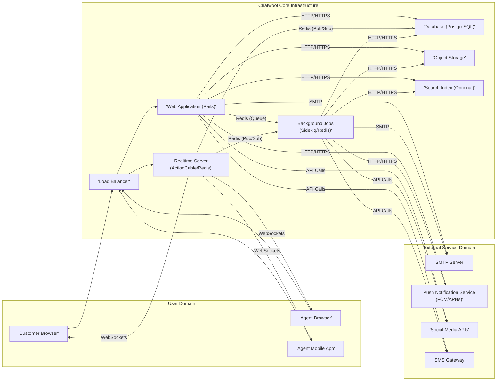

## Project Design Document: Chatwoot

**Project Name:** Chatwoot

**Project Repository:** https://github.com/chatwoot/chatwoot

**Document Version:** 1.1

**Date:** October 26, 2023

**Author:** AI Software Architect

**1. Introduction**

This document provides a detailed architectural design of the Chatwoot project, an open-source customer engagement platform. This document aims to provide a comprehensive understanding of the system's components, their interactions, and the overall architecture. This information will be crucial for subsequent threat modeling activities, enabling a thorough analysis of potential security vulnerabilities.

**2. System Overview**

Chatwoot is a comprehensive multi-channel customer communication platform designed to facilitate seamless interactions between businesses and their customers. It aggregates conversations from various channels, including website live chat, email, and social media platforms (Facebook, Twitter, WhatsApp, etc.), into a unified inbox. This allows agents to efficiently manage and respond to customer inquiries, fostering collaboration and enhancing support workflows.

**3. Architectural Diagram**

**4. Component Details**

*   **User Domain:**
    *   **'Customer Browser':**  The web browser used by customers to interact with the live chat widget embedded on a website. This component communicates with the Chatwoot infrastructure via HTTP/HTTPS and WebSockets.
    *   **'Agent Browser':** The primary web browser interface for agents to manage conversations, access administrative settings, configure integrations, and perform other operational tasks. It communicates via HTTP/HTTPS and WebSockets.
    *   **'Agent Mobile App':**  Native mobile applications (iOS and Android) that provide agents with the ability to manage conversations, receive notifications, and perform basic actions while on the go. These apps communicate via HTTP/HTTPS and WebSockets, often through specific mobile APIs provided by the Web Application.

*   **External Service Domain:**
    *   **'SMTP Server':**  An external Simple Mail Transfer Protocol server used for sending and receiving emails. This includes transactional emails (e.g., password resets, notifications) and the processing of email channel communications. Chatwoot interacts with this server using the SMTP protocol.
    *   **'Push Notification Service (FCM/APNs)':**  Services like Firebase Cloud Messaging (FCM) for Android and Apple Push Notification service (APNs) for iOS. These are used to send push notifications to agent mobile applications for new messages and other events. Communication is typically over HTTP/HTTPS using platform-specific APIs.
    *   **'Social Media APIs':**  Application Programming Interfaces provided by social media platforms (e.g., Facebook Graph API, Twitter API). Chatwoot uses these APIs to fetch messages, post replies, and manage conversations originating from these channels. Communication is over HTTP/HTTPS using OAuth 2.0 or other authentication mechanisms.
    *   **'SMS Gateway':** A third-party service that facilitates the sending and receiving of SMS messages for the SMS channel. Chatwoot interacts with this gateway via HTTP/HTTPS using APIs provided by the SMS gateway provider.

*   **Chatwoot Core Infrastructure:**
    *   **'Load Balancer':**  Distributes incoming HTTP/HTTPS traffic across multiple instances of the 'Web Application (Rails)' and 'Realtime Server (ActionCable/Redis)' to ensure high availability, fault tolerance, and scalability. It typically operates at Layer 7 (Application Layer) or Layer 4 (Transport Layer) of the OSI model.
    *   **'Web Application (Rails)':** The core of the Chatwoot application, built using the Ruby on Rails framework. It handles:
        *   Authentication and authorization of agents.
        *   Processing HTTP requests from browsers and mobile apps.
        *   Managing business logic related to conversations, agents, and settings.
        *   Interacting with the 'Database (PostgreSQL)' for persistent data storage.
        *   Interacting with 'Object Storage' for file uploads.
        *   Communicating with external services ('SMTP Server', 'Push Notification Service', 'Social Media APIs', 'SMS Gateway').
        *   Enqueuing background jobs in 'Background Jobs (Sidekiq/Redis)'.
        *   Interacting with the 'Search Index (Optional)' for search queries.
    *   **'Realtime Server (ActionCable/Redis)':**  Manages real-time, bidirectional communication between the server and clients (browsers, mobile apps) using WebSockets. ActionCable, a part of the Rails framework, uses Redis as a backend for managing WebSocket connections and broadcasting messages. It handles features like:
        *   Live chat message updates.
        *   Typing indicators.
        *   Agent presence status.
        *   Real-time notifications.
    *   **'Background Jobs (Sidekiq/Redis)':**  Processes asynchronous tasks that do not need to be handled in real-time. Sidekiq, a background processing library for Ruby, uses Redis as a job queue. Examples of background jobs include:
        *   Sending email notifications.
        *   Processing incoming social media messages.
        *   Generating reports.
        *   Performing data cleanup tasks.
    *   **'Database (PostgreSQL)':**  The primary relational database used to store persistent data for the application. This includes:
        *   User accounts (agents and customers).
        *   Conversation history and messages.
        *   Contact information.
        *   Settings and configurations.
        *   Integration details.
    *   **'Object Storage':**  Stores uploaded files, such as attachments in conversations, agent avatars, and other media. This can be implemented using cloud storage services like Amazon S3, Google Cloud Storage, Azure Blob Storage, or a local file system.
    *   **'Search Index (Optional)':**  An optional component, typically Elasticsearch, used to provide full-text search capabilities across conversations, contacts, and other data. This significantly improves the speed and relevance of search results.

**5. Data Flow**

*   **Customer Initiates a Chat:**
    *   A customer interacts with the chat widget embedded on a website.
    *   The 'Customer Browser' sends an HTTP/HTTPS request to the 'Load Balancer'.
    *   The 'Load Balancer' forwards the request to an available instance of the 'Web Application (Rails)'.
    *   The 'Web Application (Rails)' creates a new conversation record and message in the 'Database (PostgreSQL)'.
    *   The 'Web Application (Rails)' uses the 'Realtime Server (ActionCable/Redis)' via Redis Pub/Sub to push the new message event to connected agent browsers and mobile apps.
    *   The 'Realtime Server (ActionCable/Redis)' sends the message to the 'Agent Browser' and 'Agent Mobile App' via WebSockets.

*   **Agent Responds to a Chat:**
    *   An agent types a response in their 'Agent Browser' or 'Agent Mobile App'.
    *   The 'Agent Browser'/'Agent Mobile App' sends the message content via an HTTP/HTTPS request to the 'Load Balancer'.
    *   The 'Load Balancer' forwards the request to an available instance of the 'Web Application (Rails)'.
    *   The 'Web Application (Rails)' saves the message in the 'Database (PostgreSQL)'.
    *   The 'Web Application (Rails)' uses the 'Realtime Server (ActionCable/Redis)' via Redis Pub/Sub to push the new message event to the 'Customer Browser' and other connected agent interfaces.
    *   The 'Realtime Server (ActionCable/Redis)' sends the message to the 'Customer Browser' via WebSockets.

*   **Email Channel Communication:**
    *   When a customer sends an email to a configured inbox, the 'SMTP Server' receives it.
    *   A background job running in 'Background Jobs (Sidekiq/Redis)' periodically checks for new emails or the 'Web Application (Rails)' might receive email via a webhook or polling mechanism.
    *   The email content is processed by the 'Web Application (Rails)' and stored as a conversation and message in the 'Database (PostgreSQL)'. Attachments are stored in 'Object Storage'.
    *   Notifications about the new email are sent to agents via the 'Realtime Server (ActionCable/Redis)' using WebSockets.
    *   When an agent replies via the Chatwoot interface, the 'Web Application (Rails)' sends the email through the configured 'SMTP Server'.

*   **Social Media Channel Communication:**
    *   The 'Web Application (Rails)' uses the respective 'Social Media APIs' to periodically fetch new messages, posts, and comments. This might also involve webhook integrations for real-time updates.
    *   These messages are processed and stored as conversations and messages in the 'Database (PostgreSQL)'. Media content might be stored in 'Object Storage'.
    *   Agent replies are sent back through the 'Social Media APIs' by the 'Web Application (Rails)'. These actions might be handled by background jobs.

*   **Background Tasks:**
    *   The 'Web Application (Rails)' enqueues tasks into the Redis queue.
    *   'Background Jobs (Sidekiq/Redis)' workers pick up these tasks from the queue.
    *   These workers perform operations like sending email notifications via the 'SMTP Server', processing incoming social media messages via 'Social Media APIs', generating reports by querying the 'Database (PostgreSQL)', and interacting with 'Object Storage' for file management.

**6. Key Technologies**

*   **Backend Framework:** Ruby on Rails
*   **Frontend Framework:** JavaScript (various libraries and frameworks likely used)
*   **Web Server:** Puma (common in Rails deployments)
*   **Realtime Communication:** ActionCable (WebSockets framework within Rails), Redis (for pub/sub and connection management)
*   **Background Job Processing:** Sidekiq, Redis (as the job queue)
*   **Database:** PostgreSQL
*   **Optional Search Index:** Elasticsearch
*   **Object Storage:**  Potentially AWS S3, Google Cloud Storage, Azure Blob Storage, or local filesystem
*   **Message Broker (for ActionCable/Sidekiq):** Redis
*   **Containerization and Orchestration:** Docker, Docker Compose, potentially Kubernetes for more complex deployments

**7. Deployment Model**

Chatwoot offers flexibility in its deployment options:

*   **Docker-based Deployment:**  A common and recommended method, utilizing Docker and Docker Compose to containerize and orchestrate the various services. This simplifies setup and management across different environments.
*   **Cloud Platform Deployments:**  Leveraging managed services on cloud platforms like AWS, Google Cloud, or Azure. This often involves using services like:
    *   **Container Orchestration:**  Amazon ECS/EKS, Google Kubernetes Engine (GKE), Azure Kubernetes Service (AKS).
    *   **Managed Databases:** Amazon RDS for PostgreSQL, Google Cloud SQL for PostgreSQL, Azure Database for PostgreSQL.
    *   **Object Storage:** Amazon S3, Google Cloud Storage, Azure Blob Storage.
    *   **Caching:** Redis offered as a managed service (e.g., Amazon ElastiCache, Google Cloud Memorystore, Azure Cache for Redis).
*   **Self-Hosted Deployments:**  Installation directly on virtual machines or bare-metal servers. This requires manual configuration and management of all dependencies and services.

**8. Security Considerations (Detailed)**

This section expands on the initial security considerations, providing more specific examples and potential attack vectors.

*   **Authentication and Authorization:**
    *   **Agent Authentication:** Securely verifying the identity of agents using methods like password-based authentication, multi-factor authentication (MFA), or SSO (Single Sign-On). Vulnerabilities here could lead to unauthorized access to the platform.
    *   **Customer Identification:**  Identifying customers interacting through the chat widget, potentially using session cookies or unique identifiers. Lack of proper session management can lead to session hijacking.
    *   **Authorization:** Enforcing granular access control to ensure agents can only access and modify resources they are permitted to. Improper authorization can lead to privilege escalation.

*   **Input Validation and Output Encoding:**
    *   **Input Validation:**  Thoroughly validating all user inputs (from both agents and customers) on the server-side to prevent injection attacks such as SQL injection, command injection, and LDAP injection.
    *   **Output Encoding:**  Properly encoding user-generated content before displaying it in the application to prevent Cross-Site Scripting (XSS) attacks. Different encoding strategies are needed depending on the context (HTML, JavaScript, URL).

*   **Cross-Site Scripting (XSS):**
    *   **Stored XSS:** Malicious scripts injected into the database (e.g., through chat messages) that are then executed when other users view the content.
    *   **Reflected XSS:** Malicious scripts injected into the URL that are reflected back to the user and executed by their browser.
    *   **DOM-based XSS:** Vulnerabilities in client-side JavaScript code that allow malicious scripts to be injected into the DOM.

*   **Cross-Site Request Forgery (CSRF):**  Protecting against CSRF attacks by using anti-CSRF tokens to ensure that requests originating from the user's browser are legitimate and not initiated by a malicious website.

*   **Data Encryption:**
    *   **Encryption at Rest:** Encrypting sensitive data stored in the 'Database (PostgreSQL)' and 'Object Storage'. This can be achieved through database encryption features or full-disk encryption.
    *   **Encryption in Transit:** Enforcing HTTPS for all communication between clients and the server, and between internal services where appropriate, to protect data from eavesdropping and man-in-the-middle attacks.

*   **Secure Communication with External Services:**
    *   Using TLS/SSL for all communication with external services like 'SMTP Server', 'Push Notification Service', 'Social Media APIs', and 'SMS Gateway'.
    *   Securely storing and managing API keys and credentials for these services, avoiding hardcoding them in the application.

*   **Rate Limiting and Abuse Prevention:**  Implementing rate limiting on API endpoints and critical functionalities to prevent denial-of-service attacks and abuse.

*   **Vulnerability Management:**  Establishing a process for regularly updating dependencies, patching vulnerabilities in the underlying operating system and software components, and performing security audits.

*   **Access Control and Network Segmentation:**  Implementing network segmentation to isolate different components of the infrastructure. Using firewalls and access control lists to restrict access to sensitive resources.

*   **Secrets Management:**  Utilizing secure secrets management solutions (e.g., HashiCorp Vault, AWS Secrets Manager) to store and manage sensitive credentials and API keys.

*   **Content Security Policy (CSP):**  Implementing a strict CSP to control the resources that the browser is allowed to load, mitigating the risk of XSS attacks.

**9. Assumptions and Constraints**

*   The deployment environment provides reliable network connectivity between all components.
*   Standard security best practices for web application development are followed.
*   The optional Elasticsearch component is not a core requirement for basic functionality but is crucial for advanced search features and needs to be secured appropriately if deployed.
*   Security configurations and best practices for external services are the responsibility of the deployment environment and the administrators managing those services.

**10. Future Considerations**

*   **Enhanced Scalability:**  Further design considerations for scaling individual components horizontally based on specific load patterns and traffic demands.
*   **Comprehensive Monitoring and Logging:**  Implementing robust monitoring and logging solutions for performance analysis, security auditing, and incident response. This includes application logs, security logs, and infrastructure metrics.
*   **Disaster Recovery and Business Continuity:**  Developing a comprehensive disaster recovery plan, including data backups, replication strategies, and failover mechanisms to ensure business continuity in case of outages or failures.
*   **Integration with other services:**  Future integrations with other business tools and platforms should be designed with security in mind.