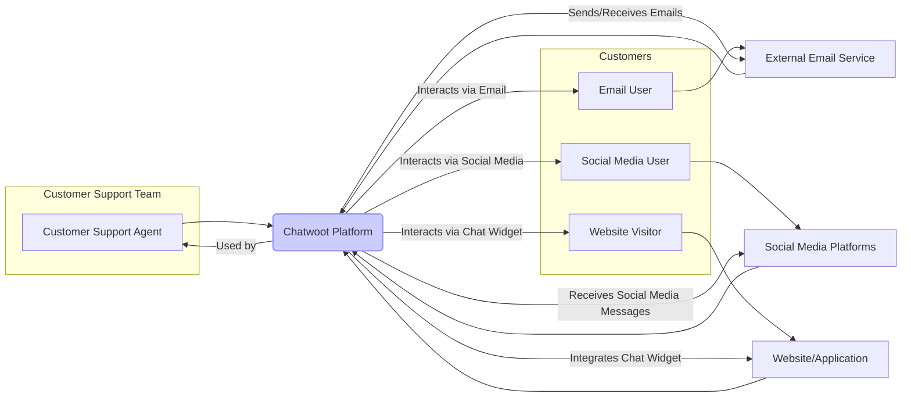
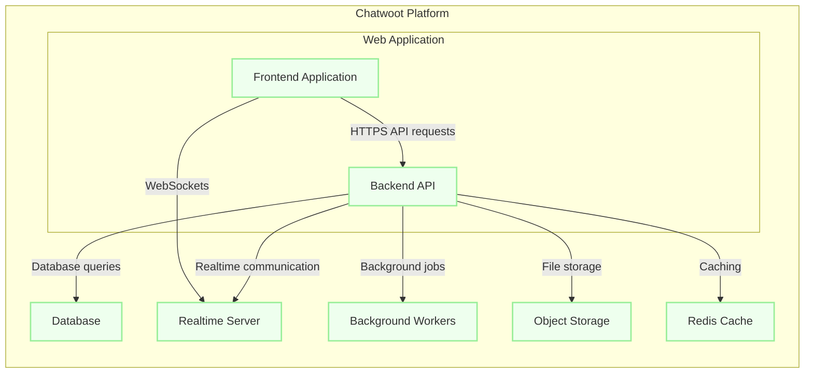
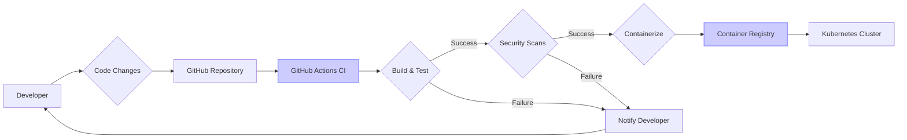

# BUSINESS POSTURE

Chatwoot is an open-source customer engagement platform designed to help businesses manage customer interactions across various channels like live chat, email, and social media.

- Business priorities and goals:
  - Provide a comprehensive customer engagement solution.
  - Offer an open-source alternative to proprietary customer support platforms.
  - Enable businesses to improve customer satisfaction and efficiency in communication.
  - Support multi-channel communication from a single platform.
  - Facilitate collaboration among support agents.
  - Offer customization and extensibility through open-source nature.

- Most important business risks:
  - Data breaches and unauthorized access to customer and business data.
  - Service disruption leading to inability to communicate with customers.
  - Reputational damage due to security vulnerabilities or data leaks.
  - Compliance violations related to data privacy regulations (e.g., GDPR, HIPAA).
  - Difficulty in attracting and retaining users if the platform is perceived as insecure or unreliable.

# SECURITY POSTURE

- Existing security controls:
  - security control: Regular security audits and penetration testing (mentioned in documentation and security page). Implemented by: Chatwoot team and external security firms.
  - security control: Dependency scanning for vulnerabilities in third-party libraries. Implemented by: Automated tools in CI/CD pipeline.
  - security control: Rate limiting to prevent brute-force attacks and abuse. Implemented by: Application level and infrastructure level (e.g., reverse proxy).
  - security control: Input sanitization and output encoding to prevent XSS and injection attacks. Implemented by: Application code in backend and frontend.
  - security control: Secure password storage using hashing algorithms. Implemented by: Backend authentication system.
  - security control: HTTPS enforced for all communication. Implemented by: Infrastructure level (e.g., load balancer, web server).
  - security control: Role-Based Access Control (RBAC) for managing user permissions within the application. Implemented by: Application level authorization system.
  - security control: Content Security Policy (CSP) to mitigate XSS attacks. Implemented by: Web server configuration and application headers.
  - security control: CORS policy to prevent unauthorized cross-origin requests. Implemented by: Web server configuration and application headers.
  - security control: Security headers (e.g., HSTS, X-Frame-Options, X-Content-Type-Options) to enhance browser security. Implemented by: Web server configuration.

- Accepted risks:
  - accepted risk: Potential vulnerabilities in open-source dependencies that are not immediately patched. Mitigation: Regular dependency updates and monitoring of security advisories.
  - accepted risk: Risk of misconfiguration by self-hosted users leading to security weaknesses. Mitigation: Comprehensive documentation and secure default configurations.

- Recommended security controls:
  - security control: Implement Web Application Firewall (WAF) to protect against common web attacks.
  - security control: Implement Database Activity Monitoring (DAM) to detect and respond to database threats.
  - security control: Integrate with Security Information and Event Management (SIEM) system for centralized security monitoring and alerting.
  - security control: Implement robust logging and monitoring of security-relevant events.
  - security control: Conduct regular security training for development and operations teams.
  - security control: Implement a vulnerability disclosure program to encourage responsible reporting of security issues.
  - security control: Implement Infrastructure as Code (IaC) security scanning to identify misconfigurations in infrastructure setup.
  - security control: Implement secrets management solution to securely store and manage sensitive credentials.

- Security requirements:
  - Authentication:
    - requirement: Secure user authentication mechanism (username/password, SSO, OAuth).
    - requirement: Multi-factor authentication (MFA) should be supported.
    - requirement: Protection against brute-force attacks on login endpoints.
    - requirement: Secure session management to prevent session hijacking.
  - Authorization:
    - requirement: Role-Based Access Control (RBAC) to manage user permissions.
    - requirement: Principle of least privilege should be enforced.
    - requirement: Authorization checks at every access point to sensitive data and functionalities.
  - Input validation:
    - requirement: Validate all user inputs on both client-side and server-side.
    - requirement: Sanitize inputs to prevent injection attacks (SQL injection, XSS, command injection).
    - requirement: Use parameterized queries or ORM to prevent SQL injection.
  - Cryptography:
    - requirement: Use strong encryption algorithms for data at rest and in transit.
    - requirement: Securely manage cryptographic keys.
    - requirement: Protect sensitive data (passwords, API keys, personal information) using encryption.
    - requirement: Use HTTPS for all communication to encrypt data in transit.

# DESIGN

## C4 CONTEXT



- Context Diagram Elements:
  - Element:
    - Name: Customer Support Agent
    - Type: Person
    - Description: Support team members who use Chatwoot to manage customer interactions.
    - Responsibilities: Respond to customer inquiries, manage conversations, resolve issues, and utilize Chatwoot features for efficient customer support.
    - Security controls: Role-Based Access Control within Chatwoot, strong password policy, multi-factor authentication.
  - Element:
    - Name: Website Visitor
    - Type: Person
    - Description: Customers visiting a website with Chatwoot's live chat widget integrated.
    - Responsibilities: Initiate chat conversations for support, browse website content, and interact with the business through the chat widget.
    - Security controls: HTTPS for communication with the website and Chatwoot, input validation on chat messages.
  - Element:
    - Name: Social Media User
    - Type: Person
    - Description: Customers interacting with the business through social media platforms integrated with Chatwoot.
    - Responsibilities: Send messages via social media, interact with business posts, and expect timely responses through social media channels.
    - Security controls: Social media platform's security controls, Chatwoot's secure integration with social media APIs.
  - Element:
    - Name: Email User
    - Type: Person
    - Description: Customers communicating with the business via email, managed through Chatwoot.
    - Responsibilities: Send emails for support inquiries, receive email responses, and expect email communication to be tracked and managed.
    - Security controls: Email service provider's security controls, Chatwoot's secure email integration (e.g., SMTP/IMAP with TLS).
  - Element:
    - Name: Chatwoot Platform
    - Type: Software System
    - Description: The Chatwoot customer engagement platform itself, handling all customer interactions, data storage, and agent interface.
    - Responsibilities: Centralize customer communication, provide agent interface, manage conversations, store customer data, integrate with external services, and provide reporting and analytics.
    - Security controls: Authentication, authorization, input validation, encryption, security logging, regular security audits, dependency scanning, rate limiting, WAF, DAM, SIEM integration.
  - Element:
    - Name: External Email Service
    - Type: External System
    - Description: Third-party email service providers (e.g., Gmail, SendGrid) used by Chatwoot to send and receive emails.
    - Responsibilities: Sending and receiving emails on behalf of Chatwoot, managing email delivery and infrastructure.
    - Security controls: Email service provider's security controls (SPF, DKIM, DMARC), secure connection protocols (TLS).
  - Element:
    - Name: Social Media Platforms
    - Type: External System
    - Description: Social media platforms (e.g., Facebook, Twitter, Instagram) integrated with Chatwoot for managing social media interactions.
    - Responsibilities: Providing social media communication channels, managing user accounts and APIs.
    - Security controls: Social media platform's security controls, OAuth for secure API access.
  - Element:
    - Name: Website/Application
    - Type: External System
    - Description: Websites or applications where the Chatwoot chat widget is embedded.
    - Responsibilities: Hosting the chat widget, providing website content and functionality.
    - Security controls: Website/application's own security controls, HTTPS, CSP.

## C4 CONTAINER



- Container Diagram Elements:
  - Element:
    - Name: Frontend Application
    - Type: Container - Web Application (JavaScript, React)
    - Description: Single-page application served to the user's browser, providing the user interface for agents and customers interacting with the chat widget.
    - Responsibilities: Rendering user interface, handling user interactions, communicating with the Backend API and Realtime Server, displaying real-time updates.
    - Security controls: Input validation, output encoding, Content Security Policy, secure handling of API keys and tokens, protection against XSS, regular updates of frontend dependencies.
  - Element:
    - Name: Backend API
    - Type: Container - Web Application (Ruby on Rails)
    - Description: RESTful API server that handles business logic, data processing, authentication, authorization, and communication with other containers.
    - Responsibilities: API endpoints for frontend application, data validation, business logic execution, database interactions, managing background jobs, handling file storage, user authentication and authorization.
    - Security controls: Authentication, authorization, input validation, output encoding, protection against injection attacks (SQL injection, command injection), rate limiting, secure session management, API security best practices, regular updates of backend dependencies, vulnerability scanning, WAF, DAM, SIEM integration.
  - Element:
    - Name: Database
    - Type: Container - Database (PostgreSQL)
    - Description: Relational database storing application data, including user information, conversations, messages, settings, and other persistent data.
    - Responsibilities: Persistent data storage, data retrieval, data integrity, data consistency, database backups, and ensuring data availability.
    - Security controls: Database access control, encryption at rest, encryption in transit, regular database backups, database activity monitoring, vulnerability scanning, hardening database configuration, principle of least privilege for database access.
  - Element:
    - Name: Realtime Server
    - Type: Container - Realtime Communication Server (ActionCable, WebSockets)
    - Description: Handles real-time communication between agents and customers, pushing updates and messages in real-time.
    - Responsibilities: Managing WebSocket connections, broadcasting real-time messages, ensuring low-latency communication, handling presence and online status.
    - Security controls: Secure WebSocket communication (WSS), authentication and authorization for WebSocket connections, rate limiting, input validation for real-time messages, protection against denial-of-service attacks.
  - Element:
    - Name: Background Workers
    - Type: Container - Background Job Processor (Sidekiq, Redis)
    - Description: Processes asynchronous tasks, such as sending emails, processing webhooks, and handling delayed jobs.
    - Responsibilities: Asynchronous task processing, reliable job execution, handling retries and failures, managing job queues.
    - Security controls: Secure job processing, input validation for job parameters, secure handling of credentials and API keys used in background jobs, monitoring of job execution, preventing job queue poisoning.
  - Element:
    - Name: Object Storage
    - Type: Container - Object Storage (AWS S3, Google Cloud Storage, or local storage)
    - Description: Stores files and attachments uploaded by users, such as conversation attachments and agent avatars.
    - Responsibilities: File storage, file retrieval, ensuring data durability and availability, managing file permissions.
    - Security controls: Access control for object storage, encryption at rest, encryption in transit, regular backups, vulnerability scanning, secure configuration of object storage buckets.
  - Element:
    - Name: Redis Cache
    - Type: Container - In-memory Data Store (Redis)
    - Description: Used for caching frequently accessed data, session management, and as a message broker for background workers and realtime server.
    - Responsibilities: Caching data to improve performance, session storage, message queuing for background jobs and real-time communication.
    - Security controls: Access control for Redis, secure configuration of Redis, encryption in transit (if required), regular backups (for persistent data if used for session storage), monitoring of Redis performance and security.

## DEPLOYMENT

Deployment Solution: Docker containers orchestrated with Kubernetes on a cloud provider (e.g., AWS, Google Cloud, Azure). This is a common and scalable deployment approach for modern web applications.

```mermaid
flowchart LR
    subgraph "Cloud Provider (e.g., AWS)"
        subgraph "Kubernetes Cluster"
            subgraph "Nodes"
                A[Node 1]
                B[Node 2]
                C[Node 3]
            end
            D[Load Balancer]
            E[Persistent Volume (Database)]
            F[Persistent Volume (Object Storage)]
        end
        G[CDN]
        H[WAF]
    end

    D -- "HTTPS (443)" --> A & B & C
    D -- "HTTPS (443)" --> A & B & C
    D -- "HTTPS (443)" --> A & B & C

    subgraph "Node 1"
        A1("Frontend Container")
        A2("Backend API Container")
        A3("Realtime Server Container")
    end
    subgraph "Node 2"
        B1("Backend API Container")
        B2("Background Workers Container")
        B3("Redis Container")
    end
    subgraph "Node 3"
        C1("Backend API Container")
        C2("Database Container")
        C3("Object Storage Container")
    end

    A --> A1 & A2 & A3
    B --> B1 & B2 & B3
    C --> C1 & C2 & C3

    A2 & B1 & C1 -- "Database Connection" --> E
    C3 -- "Object Storage Data" --> F
    A1 -- "Served via" --> G
    H -- "Protects" --> D

    style A1 fill:#efe,stroke:#9e9,stroke-width:2px
    style A2 fill:#efe,stroke:#9e9,stroke-width:2px
    style A3 fill:#efe,stroke:#9e9,stroke-width:2px
    style B1 fill:#efe,stroke:#9e9,stroke-width:2px
    style B2 fill:#efe,stroke:#9e9,stroke-width:2px
    style B3 fill:#efe,stroke:#9e9,stroke-width:2px
    style C1 fill:#efe,stroke:#9e9,stroke-width:2px
    style C2 fill:#efe,stroke:#9e9,stroke-width:2px
    style C3 fill:#efe,stroke:#9e9,stroke-width:2px
    style D fill:#ccf,stroke:#99f,stroke-width:2px
    style E fill:#ccf,stroke:#99f,stroke-width:2px
    style F fill:#ccf,stroke:#99f,stroke-width:2px
    style G fill:#ccf,stroke:#99f,stroke-width:2px
    style H fill:#ccf,stroke:#99f,stroke-width:2px
```

- Deployment Diagram Elements:
  - Element:
    - Name: Kubernetes Cluster
    - Type: Infrastructure - Container Orchestration Platform
    - Description: Kubernetes cluster manages the deployment, scaling, and operation of Chatwoot containers.
    - Responsibilities: Container orchestration, service discovery, load balancing within the cluster, health monitoring, automated scaling, and resource management.
    - Security controls: Kubernetes RBAC, network policies, pod security policies, secrets management, regular security updates of Kubernetes components, vulnerability scanning of container images, infrastructure security best practices.
  - Element:
    - Name: Nodes
    - Type: Infrastructure - Virtual Machines/Physical Servers
    - Description: Worker nodes in the Kubernetes cluster where containers are deployed and run.
    - Responsibilities: Running container workloads, providing compute resources, and interacting with the Kubernetes control plane.
    - Security controls: Operating system hardening, security patching, intrusion detection systems, host-based firewalls, access control, regular security audits.
  - Element:
    - Name: Load Balancer
    - Type: Infrastructure - Load Balancer
    - Description: Distributes incoming traffic across multiple Backend API containers running on different nodes, ensuring high availability and scalability.
    - Responsibilities: Traffic distribution, load balancing, SSL termination, health checks, and routing requests to healthy backend instances.
    - Security controls: HTTPS termination, DDoS protection, rate limiting, WAF integration, access control, security logging and monitoring.
  - Element:
    - Name: Persistent Volume (Database)
    - Type: Infrastructure - Persistent Storage
    - Description: Persistent storage volume for the PostgreSQL database, ensuring data persistence across container restarts and node failures.
    - Responsibilities: Persistent storage for database data, data durability, data availability, and backups.
    - Security controls: Encryption at rest, access control, regular backups, data replication for high availability, monitoring of storage usage and performance.
  - Element:
    - Name: Persistent Volume (Object Storage)
    - Type: Infrastructure - Persistent Storage
    - Description: Persistent storage volume for object storage, storing user-uploaded files and attachments.
    - Responsibilities: Persistent storage for object data, data durability, data availability, and backups.
    - Security controls: Encryption at rest, access control, regular backups, data replication for high availability, monitoring of storage usage and performance.
  - Element:
    - Name: CDN
    - Type: Infrastructure - Content Delivery Network
    - Description: Content Delivery Network to serve static assets (e.g., JavaScript, CSS, images) of the Frontend Application, improving performance and reducing latency for users.
    - Responsibilities: Caching and delivering static content, reducing load on the origin server, improving website performance, and providing DDoS protection for static assets.
    - Security controls: HTTPS delivery, DDoS protection, secure CDN configuration, content integrity checks.
  - Element:
    - Name: WAF
    - Type: Infrastructure - Web Application Firewall
    - Description: Web Application Firewall to protect the application from common web attacks, such as SQL injection, XSS, and other OWASP Top 10 vulnerabilities.
    - Responsibilities: Filtering malicious traffic, detecting and preventing web attacks, providing virtual patching, and enhancing application security.
    - Security controls: OWASP Top 10 protection, custom rule sets, anomaly detection, security logging and alerting, regular rule updates.
  - Element:
    - Name: Frontend Container
    - Type: Container - Docker Container
    - Description: Docker container running the Frontend Application.
    - Responsibilities: Serving the frontend application, handling user interactions, and communicating with the Backend API.
    - Security controls: Container image scanning, least privilege user, resource limits, regular updates of container image, network policies to restrict container network access.
  - Element:
    - Name: Backend API Container
    - Type: Container - Docker Container
    - Description: Docker container running the Backend API application.
    - Responsibilities: Handling API requests, business logic, data processing, and database interactions.
    - Security controls: Container image scanning, least privilege user, resource limits, regular updates of container image, network policies to restrict container network access, API security best practices.
  - Element:
    - Name: Realtime Server Container
    - Type: Container - Docker Container
    - Description: Docker container running the Realtime Server.
    - Responsibilities: Managing real-time communication and WebSocket connections.
    - Security controls: Container image scanning, least privilege user, resource limits, regular updates of container image, network policies to restrict container network access, secure WebSocket configuration.
  - Element:
    - Name: Background Workers Container
    - Type: Container - Docker Container
    - Description: Docker container running the Background Workers.
    - Responsibilities: Processing asynchronous tasks and background jobs.
    - Security controls: Container image scanning, least privilege user, resource limits, regular updates of container image, network policies to restrict container network access, secure job processing.
  - Element:
    - Name: Redis Container
    - Type: Container - Docker Container
    - Description: Docker container running the Redis cache.
    - Responsibilities: Caching data and session management.
    - Security controls: Container image scanning, least privilege user, resource limits, regular updates of container image, network policies to restrict container network access, secure Redis configuration.
  - Element:
    - Name: Database Container
    - Type: Container - Docker Container
    - Description: Docker container running the PostgreSQL database.
    - Responsibilities: Database management and data storage.
    - Security controls: Container image scanning, least privilege user, resource limits, regular updates of container image, network policies to restrict container network access, database security hardening, access control.
  - Element:
    - Name: Object Storage Container
    - Type: Container - Docker Container
    - Description: Docker container providing object storage functionality (could be MinIO or similar if self-hosted).
    - Responsibilities: Object storage and file management.
    - Security controls: Container image scanning, least privilege user, resource limits, regular updates of container image, network policies to restrict container network access, object storage security configuration, access control.

## BUILD



- Build Process Elements:
  - Element:
    - Name: Developer
    - Type: Person
    - Description: Software developers who write and modify the Chatwoot codebase.
    - Responsibilities: Writing code, committing changes, creating pull requests, and fixing bugs.
    - Security controls: Secure development practices, code reviews, security training, using secure coding guidelines.
  - Element:
    - Name: Code Changes
    - Type: Artifact - Source Code
    - Description: Modifications to the Chatwoot codebase made by developers.
    - Responsibilities: Implementing new features, fixing bugs, and improving code quality.
    - Security controls: Version control (Git), code reviews, static code analysis, and adherence to secure coding standards.
  - Element:
    - Name: GitHub Repository
    - Type: System - Version Control System
    - Description: GitHub repository hosting the Chatwoot source code.
    - Responsibilities: Source code management, version control, collaboration, and code history tracking.
    - Security controls: Access control, branch protection rules, audit logs, vulnerability scanning of repository dependencies, and secure repository configuration.
  - Element:
    - Name: GitHub Actions CI
    - Type: System - CI/CD Platform
    - Description: GitHub Actions workflows automating the build, test, and security scanning processes.
    - Responsibilities: Automated build process, running tests, performing security scans, and triggering deployments.
    - Security controls: Secure CI/CD pipeline configuration, secrets management for CI/CD, access control to CI/CD workflows, audit logs, and regular security reviews of CI/CD pipelines.
  - Element:
    - Name: Build & Test
    - Type: Process - Build and Test Automation
    - Description: Steps in the CI/CD pipeline that compile the code, run unit tests, and integration tests.
    - Responsibilities: Code compilation, unit testing, integration testing, and ensuring code quality and functionality.
    - Security controls: Automated testing, static code analysis, and secure build environment.
  - Element:
    - Name: Security Scans
    - Type: Process - Security Automation
    - Description: Automated security scans performed in the CI/CD pipeline, including SAST, dependency scanning, and container image scanning.
    - Responsibilities: Identifying security vulnerabilities in code, dependencies, and container images.
    - Security controls: SAST tools, dependency scanning tools (e.g., bundler-audit, npm audit), container image scanning tools (e.g., Trivy), and automated vulnerability reporting.
  - Element:
    - Name: Containerize
    - Type: Process - Container Image Creation
    - Description: Building Docker container images for Chatwoot components.
    - Responsibilities: Creating container images, optimizing image size, and ensuring secure container image build process.
    - Security controls: Base image selection, multi-stage builds, minimal container image, and container image signing.
  - Element:
    - Name: Container Registry
    - Type: System - Container Image Registry
    - Description: Stores and manages Docker container images for Chatwoot.
    - Responsibilities: Container image storage, versioning, access control, and distribution.
    - Security controls: Access control, vulnerability scanning of container images in the registry, image signing and verification, and secure registry configuration.
  - Element:
    - Name: Kubernetes Cluster
    - Type: System - Deployment Environment
    - Description: Target Kubernetes cluster where container images are deployed.
    - Responsibilities: Running Chatwoot application, providing runtime environment, and ensuring application availability and scalability.
    - Security controls: Kubernetes security controls as described in the Deployment section.
  - Element:
    - Name: Notify Developer
    - Type: Process - Notification
    - Description: Automated notifications sent to developers in case of build or security scan failures.
    - Responsibilities: Alerting developers about issues, enabling timely issue resolution.
    - Security controls: Secure notification channels and clear and actionable error messages.

# RISK ASSESSMENT

- Critical business processes:
  - Customer communication management across multiple channels.
  - Live chat support on websites.
  - Handling customer inquiries and resolving issues.
  - Maintaining customer relationships and satisfaction.
  - Agent collaboration and efficient support workflows.

- Data we are trying to protect:
  - Customer Personally Identifiable Information (PII): names, email addresses, phone numbers, social media handles, chat transcripts, email content, conversation history. Sensitivity: High.
  - Business sensitive data: internal notes, agent performance data, reports, configuration settings. Sensitivity: Medium.
  - Authentication credentials: user passwords, API keys, tokens. Sensitivity: Critical.

# QUESTIONS & ASSUMPTIONS

- Questions:
  - What is the expected scale of the Chatwoot deployment (number of agents, customers, conversations)?
  - What are the specific compliance requirements for organizations using Chatwoot (e.g., GDPR, HIPAA, PCI DSS)?
  - What is the organization's risk appetite regarding security vulnerabilities and data breaches?
  - Are there any specific integrations with other systems beyond email and social media platforms?
  - What is the expected uptime and availability requirement for the Chatwoot platform?

- Assumptions:
  - The target deployment environment is a cloud-based Kubernetes cluster.
  - Security is a high priority for organizations using Chatwoot, especially given the sensitive customer data handled.
  - Organizations using Chatwoot will need to comply with relevant data privacy regulations.
  - The open-source nature of Chatwoot implies a community-driven security approach and reliance on community contributions for security improvements.
  - The provided GitHub repository represents the core functionality and architecture of the Chatwoot platform.