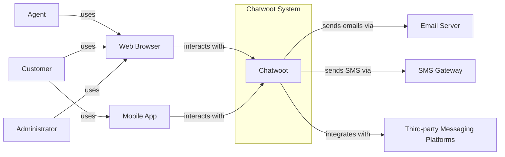
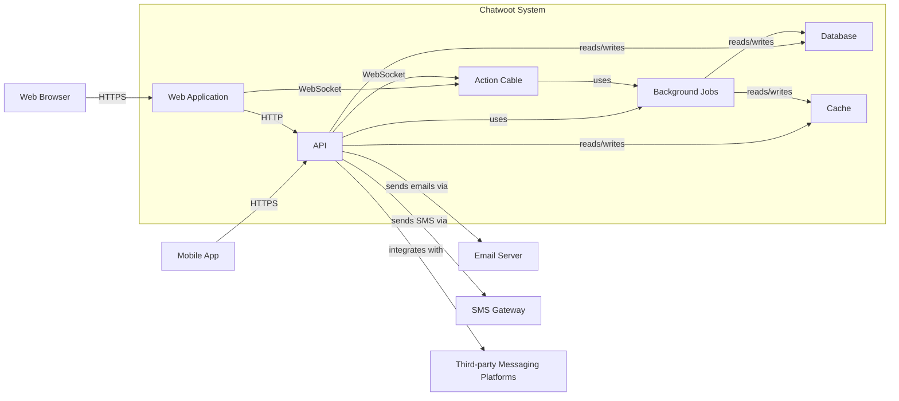

Okay, let's create a design document for the Chatwoot project, focusing on aspects relevant for threat modeling.

# BUSINESS POSTURE

Chatwoot is an open-source customer engagement suite, an alternative to proprietary solutions like Intercom, Zendesk, etc.  The business priorities likely revolve around:

*   Growth: Expanding the user base, both self-hosted and cloud users.
*   Community: Fostering a strong open-source community for contributions and support.
*   Monetization: Converting free users to paid plans (for the cloud-hosted version).
*   Reliability: Ensuring the platform is stable and available for users.
*   Feature Velocity:  Continuously adding new features and integrations to remain competitive.
*   Data Privacy and Security: Protecting user data and ensuring compliance with regulations (GDPR, CCPA, etc.). This is crucial for attracting and retaining customers, especially larger enterprises.

Business risks that need to be addressed, based on these priorities:

*   Data Breach: Unauthorized access to customer data (conversations, user details, etc.) could lead to significant reputational damage, legal issues, and loss of customers.
*   Service Disruption: Downtime or performance issues can frustrate users and drive them to competitors.
*   Malicious Use: The platform could be exploited for spam, phishing, or other malicious activities.
*   Compromised Accounts:  Attackers gaining access to user or administrator accounts could lead to data breaches or service manipulation.
*   Supply Chain Attacks: Vulnerabilities in third-party dependencies could be exploited to compromise the Chatwoot platform.
*   Insider Threats: Malicious or negligent employees could compromise the system.
*   Regulatory Non-compliance: Failure to comply with data privacy regulations could result in fines and legal action.

# SECURITY POSTURE

Based on the provided GitHub repository, here's an assessment of Chatwoot's security posture:

Existing security controls:

*   security control: Authentication: User authentication is implemented using Devise, a popular Ruby authentication library. (Gemfile, app/models/user.rb)
*   security control: Authorization: Role-based access control (RBAC) is implemented, likely using a library like Pundit or CanCanCan. (app/policies)
*   security control: Input Validation: Rails' built-in mechanisms for strong parameters and model validations are used to prevent common injection vulnerabilities. (app/controllers, app/models)
*   security control: CSRF Protection: Rails' built-in CSRF protection is enabled. (app/controllers/application_controller.rb)
*   security control: Dependency Management: Dependencies are managed using Bundler, and a Gemfile.lock ensures consistent versions. (Gemfile, Gemfile.lock)
*   security control: Security Headers: Some security headers (e.g., X-Frame-Options, X-XSS-Protection) are likely set, either directly or via a gem like `secure_headers`. (config/initializers)
*   security control: Rate Limiting: Rate limiting is likely implemented to prevent abuse and brute-force attacks, potentially using a gem like `rack-attack`. (config/initializers)
*   security control: Database Security: Database interactions are handled through ActiveRecord, which helps prevent SQL injection vulnerabilities. (app/models)
*   security control: Secrets Management: Sensitive information like API keys and database credentials are not stored directly in the codebase, and environment variables are used. (.env.example)
*   security control: Regular Updates: The project appears to be actively maintained, with regular updates and bug fixes.

Accepted risks:

*   accepted risk: Self-Hosting Complexity: Users who self-host Chatwoot are responsible for securing their own infrastructure, which may introduce vulnerabilities if not properly managed.
*   accepted risk: Third-Party Integrations: Integrations with third-party services (e.g., email providers, messaging platforms) introduce a dependency on the security of those services.
*   accepted risk: Open-Source Visibility: The open-source nature of the project means that vulnerabilities may be discovered by attackers, although it also allows for community auditing and faster patching.

Recommended security controls (high priority):

*   Implement a robust Content Security Policy (CSP) to mitigate XSS attacks.
*   Implement Subresource Integrity (SRI) for JavaScript and CSS files to prevent tampering.
*   Implement robust auditing and logging to track user activity and detect suspicious behavior.
*   Use a dedicated secrets management solution (e.g., HashiCorp Vault, AWS Secrets Manager) instead of relying solely on environment variables.
*   Implement regular security scans (SAST, DAST, dependency scanning) as part of the CI/CD pipeline.
*   Establish a clear vulnerability disclosure program to encourage responsible reporting of security issues.
*   Implement two-factor authentication (2FA) for all user accounts, especially administrator accounts.

Security Requirements:

*   Authentication:
    *   All users must be authenticated before accessing any non-public resources.
    *   Support for strong passwords and password complexity rules.
    *   Implement account lockout mechanisms to prevent brute-force attacks.
    *   Provide options for social login (e.g., Google, Facebook) and SSO (Single Sign-On).
    *   Support for multi-factor authentication (MFA/2FA).

*   Authorization:
    *   Implement granular role-based access control (RBAC) to restrict user permissions based on their roles.
    *   Ensure that users can only access data and perform actions that are authorized for their roles.
    *   Regularly review and update user roles and permissions.

*   Input Validation:
    *   Validate all user inputs on the server-side to prevent injection attacks (SQL injection, XSS, command injection).
    *   Use a whitelist approach to input validation, allowing only known-good characters and patterns.
    *   Sanitize and encode user inputs appropriately before displaying them in the UI.

*   Cryptography:
    *   Use strong, industry-standard encryption algorithms (e.g., AES-256, RSA-2048) for storing sensitive data at rest and in transit.
    *   Use secure hashing algorithms (e.g., SHA-256, bcrypt) for storing passwords.
    *   Use HTTPS for all communication between the client and the server.
    *   Regularly update cryptographic libraries and protocols to address known vulnerabilities.
    *   Properly manage cryptographic keys, using a secure key management system.

# DESIGN

## C4 CONTEXT



Element Descriptions:

*   1.  Name: Chatwoot
    *   2.  Type: System
    *   3.  Description: The core Chatwoot application, providing customer engagement features.
    *   4.  Responsibilities: Managing conversations, user accounts, integrations, and data storage.
    *   5.  Security controls: Authentication, authorization, input validation, encryption, rate limiting, CSRF protection.

*   1.  Name: Web Browser
    *   2.  Type: User Interface
    *   3.  Description: Used by agents, administrators, and customers to access the Chatwoot web interface.
    *   4.  Responsibilities: Displaying the Chatwoot UI, handling user input, and communicating with the Chatwoot server.
    *   5.  Security controls: Browser security settings, HTTPS, CSP, SRI.

*   1.  Name: Mobile App
    *   2.  Type: User Interface
    *   3.  Description: Used by customers to access Chatwoot on mobile devices.
    *   4.  Responsibilities: Displaying the Chatwoot UI, handling user input, and communicating with the Chatwoot server.
    *   5.  Security controls: Mobile platform security features, HTTPS, secure storage of API keys.

*   1.  Name: Email Server
    *   2.  Type: External System
    *   3.  Description: Used by Chatwoot to send email notifications and transactional emails.
    *   4.  Responsibilities: Delivering emails reliably and securely.
    *   5.  Security controls: SPF, DKIM, DMARC, TLS encryption.

*   1.  Name: SMS Gateway
    *   2.  Type: External System
    *   3.  Description: Used by Chatwoot to send SMS notifications.
    *   4.  Responsibilities: Delivering SMS messages reliably and securely.
    *   5.  Security controls: API key authentication, rate limiting.

*   1.  Name: Third-party Messaging Platforms
    *   2.  Type: External System
    *   3.  Description: Platforms like Facebook Messenger, Twitter, WhatsApp, etc., that Chatwoot integrates with.
    *   4.  Responsibilities: Handling communication with users on those platforms.
    *   5.  Security controls: API key authentication, webhook verification, OAuth.

*   1.  Name: Customer
    *   2.  Type: User
    *   3.  Description: The end-user interacting with a business through Chatwoot.
    *   4.  Responsibilities: Initiating conversations, providing information, and receiving support.
    *   5.  Security controls: None (relies on Chatwoot and the chosen interface).

*   1.  Name: Agent
    *   2.  Type: User
    *   3.  Description: A customer service representative using Chatwoot to manage conversations.
    *   4.  Responsibilities: Responding to customer inquiries, resolving issues, and managing conversations.
    *   5.  Security controls: Authentication, authorization, 2FA (recommended).

*   1.  Name: Administrator
    *   2.  Type: User
    *   3.  Description: A user with elevated privileges who manages the Chatwoot installation.
    *   4.  Responsibilities: Configuring settings, managing users, and maintaining the system.
    *   5.  Security controls: Authentication, authorization, 2FA (recommended), strong password policies.

## C4 CONTAINER



Element Descriptions:

*   1.  Name: Web Application
    *   2.  Type: Container (Ruby on Rails)
    *   3.  Description: The main web interface for Chatwoot, handling user interactions and displaying data.
    *   4.  Responsibilities: Rendering HTML, handling user input, managing sessions, and interacting with the API.
    *   5.  Security controls: CSRF protection, session management, output encoding, CSP (recommended).

*   1.  Name: API
    *   2.  Type: Container (Ruby on Rails)
    *   3.  Description: Provides an API for accessing Chatwoot data and functionality.
    *   4.  Responsibilities: Handling API requests, authenticating users, validating input, and interacting with the database and other services.
    *   5.  Security controls: Authentication, authorization, input validation, rate limiting, API key management.

*   1.  Name: Background Jobs
    *   2.  Type: Container (Sidekiq/Redis)
    *   3.  Description: Handles asynchronous tasks, such as sending emails, processing webhooks, and performing scheduled tasks.
    *   4.  Responsibilities: Executing tasks in the background, ensuring reliability and scalability.
    *   5.  Security controls: Input validation, error handling, secure communication with other services.

*   1.  Name: Database
    *   2.  Type: Container (PostgreSQL)
    *   3.  Description: Stores Chatwoot data, including conversations, user accounts, and settings.
    *   4.  Responsibilities: Persisting data, ensuring data integrity and consistency.
    *   5.  Security controls: Database access controls, encryption at rest (recommended), regular backups.

*   1.  Name: Cache
    *   2.  Type: Container (Redis)
    *   3.  Description: Caches frequently accessed data to improve performance.
    *   4.  Responsibilities: Storing and retrieving cached data.
    *   5.  Security controls: Access controls, data validation.

*   1.  Name: Action Cable
    *   2.  Type: Container (Ruby on Rails)
    *   3.  Description: Handles real-time communication using WebSockets.
    *   4.  Responsibilities: Managing WebSocket connections, broadcasting messages, and handling real-time events.
    *   5.  Security controls: Authentication, authorization, input validation, secure WebSocket configuration.

*   Rest of the elements are described in C4 CONTEXT section.

## DEPLOYMENT

Chatwoot can be deployed in several ways:

1.  **Self-Hosted (Docker Compose):** This is the most common and recommended approach for self-hosting. It uses Docker Compose to orchestrate the various containers (web, API, database, etc.).
2.  **Self-Hosted (Manual Installation):**  Installing directly on a server without Docker. This requires more manual configuration and dependency management.
3.  **Cloud-Hosted (Chatwoot Cloud):** Chatwoot offers a managed cloud-hosted version, where they handle the infrastructure and deployment.
4.  **Heroku:** Chatwoot provides instructions for deploying to Heroku, a Platform-as-a-Service (PaaS).
5.  **CapRover:** Chatwoot can be deployed to CapRover.
6.  **Kubernetes:** While not officially documented, it's possible to deploy Chatwoot to a Kubernetes cluster.

We'll describe the **Docker Compose** deployment in detail, as it's the most common self-hosted option and provides a good balance of simplicity and control.

```mermaid
graph LR
    subgraph "Deployment Environment (Docker Host)"
        A[Docker Compose]
        subgraph Chatwoot Containers
            B[Web]
            C[API]
            D[Sidekiq]
            E[PostgreSQL]
            F[Redis]
            G[Action Cable]
        end
        H[Reverse Proxy (e.g., Nginx)]
    end
    I[Internet]

    I -- HTTPS --> H
    H -- HTTP --> B
    B -- HTTP --> C
    C -- uses --> D
    C -- uses --> F
    B -- WebSocket --> G
    C -- WebSocket --> G
    G -- uses --> D
    G -- uses --> F
```

Element Descriptions:

*   1.  Name: Docker Compose
    *   2.  Type: Orchestration Tool
    *   3.  Description: Defines and manages the multi-container Chatwoot application.
    *   4.  Responsibilities: Starting, stopping, and networking the containers.
    *   5.  Security controls: Docker security best practices, network isolation.

*   1.  Name: Web
    *   2.  Type: Container (Ruby on Rails)
    *   3.  Description: The Chatwoot web application container.
    *   4.  Responsibilities: Serving the web interface.
    *   5.  Security controls: See C4 Container descriptions.

*   1.  Name: API
    *   2.  Type: Container (Ruby on Rails)
    *   3.  Description: The Chatwoot API container.
    *   4.  Responsibilities: Handling API requests.
    *   5.  Security controls: See C4 Container descriptions.

*   1.  Name: Sidekiq
    *   2.  Type: Container (Sidekiq/Redis)
    *   3.  Description: The background job processing container.
    *   4.  Responsibilities: Handling asynchronous tasks.
    *   5.  Security controls: See C4 Container descriptions.

*   1.  Name: PostgreSQL
    *   2.  Type: Container (PostgreSQL)
    *   3.  Description: The database container.
    *   4.  Responsibilities: Storing persistent data.
    *   5.  Security controls: See C4 Container descriptions.

*   1.  Name: Redis
    *   2.  Type: Container (Redis)
    *   3.  Description: The caching and real-time communication container.
    *   4.  Responsibilities: Caching data and managing WebSocket connections.
    *   5.  Security controls: See C4 Container descriptions.

*   1.  Name: Action Cable
    *   2.  Type: Container (Ruby on Rails)
    *   3.  Description: The real-time communication container.
    *   4.  Responsibilities: Managing WebSocket connections.
    *   5.  Security controls: See C4 Container descriptions.

*   1.  Name: Reverse Proxy (e.g., Nginx)
    *   2.  Type: Server
    *   3.  Description: Handles incoming requests and forwards them to the appropriate container.  Often used for SSL termination, load balancing, and serving static assets.
    *   4.  Responsibilities: Terminating SSL/TLS, routing traffic, and serving static content.
    *   5.  Security controls: HTTPS configuration, SSL/TLS certificates, firewall rules.

*   1.  Name: Internet
    *   2.  Type: Network
    *   3.  Description: The public internet.
    *   4.  Responsibilities: Connecting users to the Chatwoot deployment.
    *   5.  Security controls: None (relies on the security of the deployment environment and user devices).

## BUILD

Chatwoot's build process appears to be primarily managed through Ruby's standard tooling (Bundler, Rake) and likely incorporates some CI/CD automation. Here's a breakdown, focusing on security:

```mermaid
graph LR
    A[Developer] --> B[Git Repository (GitHub)]
    B -- triggers --> C[CI/CD Pipeline (e.g., GitHub Actions)]
    C -- runs --> D[Build Steps]
    D -- includes --> E[Dependency Management (Bundler)]
    D -- includes --> F[Tests (RSpec, etc.)]
    D -- includes --> G[Linters (RuboCop, etc.)]
    D -- includes --> H[Security Scans (Brakeman, bundler-audit)]
    D -- produces --> I[Docker Images]
    I -- pushed to --> J[Container Registry (e.g., Docker Hub, GHCR)]
```

Build Process Description:

1.  **Developer:**  Writes code and commits it to the Git repository.
2.  **Git Repository (GitHub):**  Stores the source code and triggers the CI/CD pipeline on events like pushes and pull requests.
3.  **CI/CD Pipeline (e.g., GitHub Actions):**  Automates the build, test, and deployment process.  Chatwoot likely uses GitHub Actions, based on the presence of workflow files in the `.github/workflows` directory.
4.  **Build Steps:**  The CI/CD pipeline executes a series of steps, including:
    *   **Dependency Management (Bundler):**  Installs the required Ruby gems, ensuring consistent versions using `Gemfile.lock`.  Security checks should be integrated here (e.g., `bundler-audit` to check for known vulnerabilities in dependencies).
    *   **Tests (RSpec, etc.):**  Runs automated tests (unit, integration, system) to ensure code quality and prevent regressions.
    *   **Linters (RuboCop, etc.):**  Enforces code style and identifies potential code quality issues.
    *   **Security Scans (Brakeman, bundler-audit):**  Performs static analysis to detect potential security vulnerabilities in the code (Brakeman) and dependencies (bundler-audit).  This is a *crucial* step for supply chain security.
    *   **Docker Images:** Builds Docker images for the various Chatwoot components (web, API, Sidekiq, etc.).
5.  **Docker Images:** The output of the build process is a set of Docker images.
6.  **Container Registry (e.g., Docker Hub, GHCR):**  The Docker images are pushed to a container registry, making them available for deployment.

Security Controls in the Build Process:

*   security control: Dependency Scanning: Using tools like `bundler-audit` to identify and address vulnerabilities in third-party dependencies.
*   security control: Static Analysis: Using tools like Brakeman to detect potential security vulnerabilities in the code.
*   security control: Automated Testing: Running automated tests to ensure code quality and prevent regressions.
*   security control: Code Review: Requiring code reviews before merging changes to the main branch.
*   security control: Least Privilege: Ensuring that the CI/CD pipeline has only the necessary permissions to perform its tasks.

# RISK ASSESSMENT

*   What are critical business processes we are trying to protect?
    *   Customer communication and support.
    *   Data management and storage.
    *   User account management.
    *   Integration with third-party platforms.
    *   System administration and configuration.

*   What data we are trying to protect and what is their sensitivity?
    *   Customer conversations: Highly sensitive, containing potentially personal and confidential information.
    *   User account details (names, email addresses, passwords): Sensitive, subject to privacy regulations.
    *   API keys and other credentials: Highly sensitive, providing access to external services.
    *   System configuration data: Sensitive, potentially revealing vulnerabilities if exposed.
    *   Agent and administrator activity logs: Moderately sensitive, useful for auditing and security investigations.
    *   Customer metadata (IP addresses, device information): Moderately sensitive, subject to privacy regulations.

# QUESTIONS & ASSUMPTIONS

*   Questions:
    *   What is the specific threat model used by the Chatwoot team (if any)?
    *   What are the results of any recent penetration tests or security audits?
    *   What is the process for handling security incidents and vulnerabilities?
    *   What are the specific compliance requirements (e.g., GDPR, CCPA) that Chatwoot aims to meet?
    *   What is the long-term security roadmap for the project?
    *   Are there any specific security concerns related to the use of WebSockets (Action Cable)?
    *   How are database backups handled, and what is the recovery process?
    *   What is the policy for managing and rotating cryptographic keys?
    *   How is the security of third-party integrations assessed and monitored?
    *   Is there a bug bounty program?

*   Assumptions:
    *   BUSINESS POSTURE: The Chatwoot team prioritizes security and data privacy, given the nature of the application.
    *   BUSINESS POSTURE: The cloud-hosted version of Chatwoot has a higher level of security controls and monitoring than self-hosted deployments.
    *   SECURITY POSTURE: The Chatwoot team follows secure coding practices and regularly updates dependencies.
    *   SECURITY POSTURE: The provided `.env.example` file accurately reflects the required environment variables for secure configuration.
    *   DESIGN: The Docker Compose deployment is the primary deployment method for self-hosted installations.
    *   DESIGN: The CI/CD pipeline includes security checks (dependency scanning, static analysis).
    *   DESIGN: The reverse proxy (Nginx) is properly configured to handle SSL/TLS termination and security headers.
    *   DESIGN: Database connections are secured using appropriate credentials and encryption.
    *   DESIGN: Redis connections are secured.