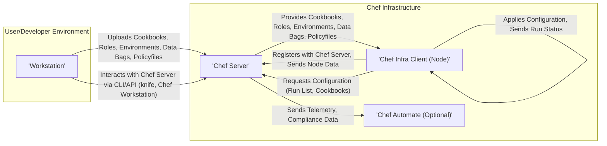
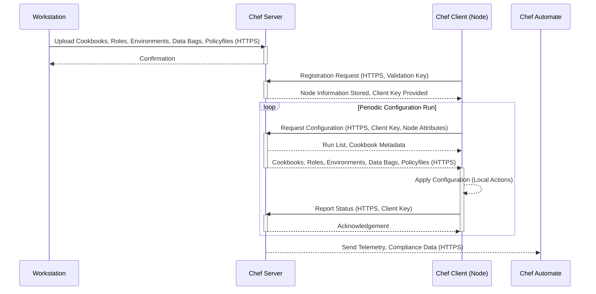

## Project Design Document: Chef (Improved)

**1. Introduction**

This document provides an enhanced architectural overview of the Chef project, an infrastructure automation platform. It details the core components, their interactions, data flow, and security considerations, serving as a robust foundation for subsequent threat modeling activities.

**Project Name:** Chef

**Project Repository:** https://github.com/chef/chef

**Project Goal:** To provide a comprehensive platform for automating infrastructure configuration and management, enabling users to define infrastructure as code, ensuring consistency, repeatability, and compliance.

**Document Scope:** This document focuses on the core architectural components of the Chef platform and their interactions, emphasizing aspects relevant to security. It does not delve into the specifics of individual cookbooks or recipes but provides the necessary context for understanding their role.

**2. High-Level Architecture**

The Chef platform operates on a client-server model, with a central server orchestrating configuration for numerous client nodes. The Workstation serves as the primary interface for users to interact with the Chef ecosystem.

**3. Key Components**

*   **Workstation:**
    *   The local development environment where users (developers, operators) create, test, and manage Chef configuration code.
    *   Utilizes the `knife` command-line interface (CLI) and the Chef Workstation application for interacting with the Chef Server.
    *   Responsible for authoring and version controlling cookbooks, roles, environments, data bags, and policyfiles.
    *   Packages and uploads these configuration artifacts to the Chef Server.
    *   Authenticates with the Chef Server using API keys or user credentials.

*   **Chef Server:**
    *   The central hub of the Chef infrastructure, acting as a repository for all configuration data and metadata.
    *   Authenticates and authorizes Chef Clients and Workstations.
    *   Manages node registration, storing metadata about each managed node (e.g., attributes, run history).
    *   Stores and serves cookbooks, roles, environments, data bags, and policyfiles.
    *   Provides a RESTful API for interaction with Workstations and Chef Clients.
    *   Maintains search indexes (powered by Elasticsearch) for querying node attributes and other data.
    *   Handles node-to-role and node-to-environment mappings.

*   **Chef Infra Client (Node):**
    *   An agent installed on each server, virtual machine, or container being managed by Chef.
    *   Registers with the Chef Server, providing identifying information and initial attributes.
    *   Periodically (or on-demand) contacts the Chef Server to retrieve its assigned run list and the necessary configuration data.
    *   Executes the recipes defined in the run list using the resources provided by Chef.
    *   Collects and reports back the status of the configuration run (success, failure, changes made) to the Chef Server.
    *   Authenticates with the Chef Server using client-specific validation keys.

*   **Chef Automate (Optional):**
    *   A commercial platform offering enhanced visibility, compliance, and automation workflows built upon Chef Infra.
    *   Aggregates data from the Chef Server and managed nodes, providing reporting, dashboards, and analytics.
    *   Enables compliance scanning and enforcement using Chef InSpec profiles.
    *   Provides event tracking and audit logging capabilities.
    *   Offers workflow automation features for managing infrastructure changes.

**4. Data Flow (Detailed)**

The data flow within the Chef ecosystem involves a series of interactions between the components:

*   **Cookbook Development and Upload:**
    *   Developers create or modify cookbooks, roles, environments, data bags, or policyfiles on their Workstation.
    *   Using the `knife` CLI or Chef Workstation, they authenticate to the Chef Server.
    *   The configuration artifacts are packaged and uploaded to the Chef Server via HTTPS.
    *   The Chef Server stores these artifacts in its repository.

*   **Node Registration:**
    *   When a new node is provisioned, the Chef Infra Client is installed.
    *   The client is configured with the Chef Server URL and a validation key.
    *   Upon first run, the client authenticates with the Chef Server using the validation key and requests registration.
    *   The Chef Server creates a client object for the node and provides a unique client key for future authentication.

*   **Client Configuration Request:**
    *   The Chef Infra Client periodically (based on the `chef_client_interval`) or on-demand (using `chef-client -o <recipe>`) contacts the Chef Server via HTTPS.
    *   The client authenticates using its unique client key.
    *   The client sends its current node attributes to the server.
    *   The Chef Server determines the node's run list based on its assigned roles, environment, and policyfile (if used).
    *   The server identifies the required cookbooks, roles, environment attributes, data bags, and policyfile.

*   **Configuration Retrieval and Execution:**
    *   The Chef Server provides the run list and metadata about the required cookbooks to the client.
    *   The Chef Client downloads the necessary cookbooks from the Chef Server via HTTPS.
    *   The client merges attributes from various sources (node attributes, environment attributes, role attributes, etc.).
    *   The Chef Client executes the recipes in the run list in the specified order, using the available resources and providers.
    *   During execution, the client may interact with local system resources and external services.

*   **Reporting and Data Collection:**
    *   After the configuration run, the Chef Infra Client reports the status (success, failure, resources updated) back to the Chef Server via HTTPS.
    *   The Chef Server stores this run history and updates the node's metadata.
    *   If Chef Automate is in use, the Chef Server forwards telemetry and compliance data to Chef Automate for analysis and visualization.

**5. Security Considerations (Detailed)**

This section expands on the initial security considerations, providing more specific details relevant to threat modeling.

*   **Authentication and Authorization:**
    *   **Workstation to Server:** Authentication is typically done using API keys generated for users or organizations on the Chef Server. These keys should be securely stored and managed. Authorization is based on the permissions associated with the API key.
    *   **Node to Server:** Authentication relies on unique client keys generated by the Chef Server during node registration. These keys must be kept secret and securely managed on the nodes. Authorization is based on the node's identity and the permissions configured on the Chef Server.
    *   **Potential Threats:** Compromised API keys or client keys could allow unauthorized access to configuration data or the ability to manipulate node configurations.

*   **Data in Transit:**
    *   All communication between the Workstation, Chef Server, and Chef Clients should be encrypted using HTTPS (TLS).
    *   Ensure proper TLS configuration and certificate management on the Chef Server.
    *   **Potential Threats:** Man-in-the-middle attacks could expose sensitive configuration data if encryption is not properly implemented.

*   **Data at Rest:**
    *   Sensitive data stored on the Chef Server (e.g., passwords in data bags) should be encrypted at rest. Chef Server supports encrypted data bags using a shared secret key.
    *   Consider using external secrets management solutions (e.g., HashiCorp Vault) for more robust secret management.
    *   **Potential Threats:** Unauthorized access to the Chef Server's database could expose sensitive information if not encrypted.

*   **Node Security:**
    *   Secure bootstrapping and registration of nodes are crucial. Use secure methods for distributing the initial validation key.
    *   Implement proper access controls on managed nodes to prevent unauthorized access and modification.
    *   Regularly audit node configurations for compliance and security vulnerabilities.
    *   **Potential Threats:** Compromised nodes could be used to attack the Chef Server or other managed nodes.

*   **Supply Chain Security:**
    *   Verify the integrity and authenticity of cookbooks obtained from external sources (e.g., Chef Supermarket). Consider using signed cookbooks.
    *   Implement code review processes for internally developed cookbooks.
    *   **Potential Threats:** Malicious or compromised cookbooks could introduce vulnerabilities or backdoors into the managed infrastructure.

*   **Secrets Management:**
    *   Avoid storing secrets directly in cookbooks or attributes. Utilize encrypted data bags or integrate with secrets management solutions.
    *   Implement proper access controls for accessing and managing secrets.
    *   **Potential Threats:** Secrets exposed in cookbooks or attributes could lead to unauthorized access to critical systems.

*   **API Security:**
    *   Secure the Chef Server API using authentication and authorization mechanisms.
    *   Implement rate limiting and other protective measures to prevent API abuse.
    *   Regularly audit API access logs.
    *   **Potential Threats:** API vulnerabilities could allow unauthorized access to manage the Chef infrastructure.

*   **Compliance and Auditing:**
    *   Chef Automate provides features for compliance scanning and reporting using Chef InSpec.
    *   Enable audit logging on the Chef Server to track configuration changes and user activity.
    *   **Potential Threats:** Lack of proper auditing can make it difficult to detect and respond to security incidents.

**6. Deployment Model**

Chef can be deployed in various configurations, each with its own security implications:

*   **Standalone Chef Server:** All components reside on a single server. Requires careful security hardening of the server.
*   **High Availability (HA) Chef Server:** Multiple Chef Servers are deployed for redundancy and scalability. Requires secure communication and data synchronization between servers.
*   **Cloud-Hosted Chef Server:** Utilizing cloud provider services for hosting the Chef Server. Security relies on both the cloud provider's security measures and proper configuration of the Chef Server.
*   **Managed Chef Services:** Utilizing a third-party provider to manage the Chef infrastructure. Security relies on the provider's security practices and SLAs.

**7. Technologies Used**

*   **Programming Languages:** Ruby (primarily for the Chef Server and `knife`), Erlang (for some internal components of the Chef Server)
*   **Database:** PostgreSQL (for storing Chef Server data)
*   **Search Engine:** Elasticsearch (for indexing and searching node attributes and other data)
*   **Message Queue:** RabbitMQ (for asynchronous task processing within the Chef Server)
*   **Web Server:** Nginx (typically used as a reverse proxy in front of the Chef Server)
*   **Operating Systems:** Linux (most commonly used for Chef Server and Clients), Windows (for Chef Clients)
*   **Protocols:** HTTPS (mandatory for secure communication), SSH (for remote access to managed nodes)

**8. Assumptions and Constraints**

*   The underlying network infrastructure is assumed to provide secure and reliable connectivity between all components.
*   This document focuses primarily on Chef Infra and does not cover other Chef products like Chef Habitat or Chef InSpec in detail, although their integration points are considered.
*   Security best practices for the underlying operating systems and infrastructure are assumed to be in place.
*   The threat modeling process will further refine and validate the security considerations outlined in this document.

**9. Conclusion**

This improved design document provides a more detailed and comprehensive overview of the Chef project's architecture, data flow, and security considerations. It serves as a valuable resource for understanding the system's intricacies and identifying potential security vulnerabilities during the subsequent threat modeling process. By carefully considering the security aspects outlined here, organizations can effectively leverage Chef to automate their infrastructure while maintaining a strong security posture.
