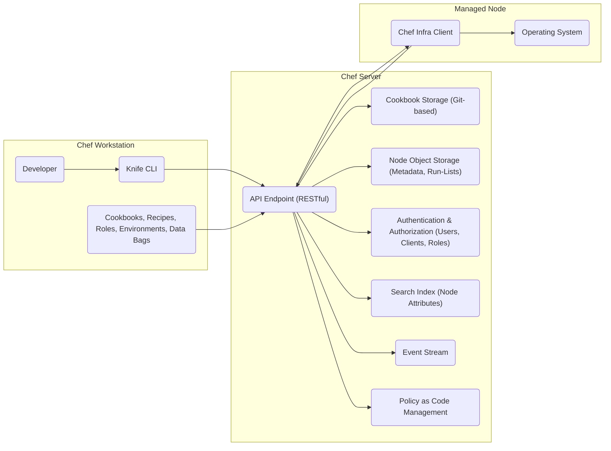
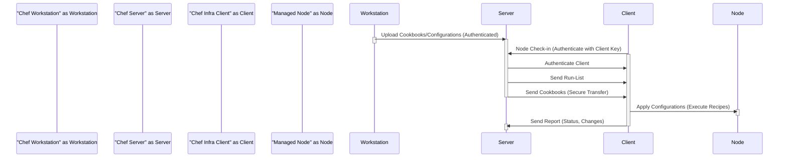

# Project Design Document: Chef

**Version:** 1.1
**Date:** October 26, 2023
**Author:** AI Software Architect

## 1. Introduction

This document provides a detailed design overview of the Chef project, an infrastructure automation platform. It is specifically designed to serve as a foundation for subsequent threat modeling activities, providing a comprehensive understanding of the system's architecture, components, and data flows to facilitate the identification of potential security vulnerabilities.

## 2. Goals and Objectives

The primary goal of Chef is to automate the configuration and management of infrastructure, ensuring consistency, repeatability, and compliance across diverse environments. Key objectives include:

*   Automating the configuration of operating systems, applications, and services.
*   Managing infrastructure as code, enabling version control and collaboration.
*   Enforcing desired states on managed nodes, remediating configuration drift.
*   Providing a centralized and auditable platform for infrastructure management and compliance.
*   Supporting a wide range of operating systems, cloud providers, and on-premises infrastructure.

## 3. Architectural Overview

Chef employs a client-server architecture where a central server manages multiple client nodes. The core components interact to ensure nodes are configured according to defined policies.

*   **Chef Workstation:**  The local environment where users develop, test, and manage Chef configurations. It acts as the control plane for interacting with the Chef Server.
*   **Chef Server:** The central repository and API gateway that stores cookbooks, node metadata, manages authentication, authorization, and facilitates communication between the workstation and clients.
*   **Chef Infra Client:** The agent installed on each managed node. It communicates with the Chef Server to retrieve and apply configurations, ensuring the node reaches and maintains its desired state.
*   **Chef InSpec:** A framework used for writing and executing automated tests to verify the compliance and security posture of infrastructure.
*   **Chef Habitat:** A solution for application automation, packaging, and deployment. While part of the broader Chef ecosystem, its direct interaction with the core Chef Infra for basic configuration management is less central, but its presence and potential interactions should be acknowledged.

## 4. Key Components and Their Functionality

This section provides a more detailed breakdown of the functionality and key aspects of each component.

### 4.1. Chef Workstation

*   **Purpose:**  The primary interface for human interaction with the Chef infrastructure. It's where configuration code is authored and managed.
*   **Functionality:**
    *   **Configuration Authoring:** Developing and testing Chef configurations using Ruby-based Domain Specific Language (DSL) for cookbooks, recipes, attributes, etc.
    *   **Server Interaction:** Interacting with the Chef Server via the `knife` command-line interface (CLI) and potentially other tools.
    *   **Configuration Management:** Managing cookbooks, roles, environments, data bags (including potentially sensitive information like passwords and API keys), and policy groups.
    *   **Upload and Synchronization:** Uploading configurations to the Chef Server, making them available to managed nodes.
    *   **Node Bootstrapping:** Initiating the process of installing and configuring the Chef Infra Client on new nodes.

### 4.2. Chef Server

*   **Purpose:** The central authority and data store for all configuration information and node metadata. It mediates interactions between workstations and clients.
*   **Functionality:**
    *   **API Endpoint:** Provides a secure RESTful API for communication with the Chef Workstation and Chef Infra Clients. This API handles authentication, authorization, and request routing.
    *   **Cookbook Storage:** Stores cookbooks, typically in a Git-based repository, ensuring version control and auditability of configuration changes.
    *   **Node Object Storage:** Stores critical information about registered nodes, including their attributes (ohai data), assigned run-lists, policy group assignments, and last reported status. This data is crucial for determining the correct configurations to apply.
    *   **Authentication and Authorization:** Manages user accounts, client keys, and access control lists (ACLs) to control who and what can access and modify resources on the server. This includes authentication for both human users and machine clients.
    *   **Search Index:**  Provides a powerful search capability based on node attributes, allowing for dynamic targeting of nodes for specific configurations.
    *   **Event Stream:**  Publishes a stream of events related to node runs, server activities, and other changes within the Chef ecosystem, enabling monitoring and auditing.
    *   **Policy as Code Management:** Enables the definition and management of node configurations through policy groups and policies, providing a more structured approach to configuration management.

### 4.3. Chef Infra Client

*   **Purpose:** The agent running on each managed node responsible for retrieving and applying configurations from the Chef Server. It's the component that enforces the desired state on the infrastructure.
*   **Functionality:**
    *   **Authentication:** Authenticates with the Chef Server using a unique client key, ensuring only authorized nodes can retrieve configurations.
    *   **Node Registration:** Registers the node with the Chef Server, providing initial information about its attributes.
    *   **Configuration Retrieval:** Contacts the Chef Server to retrieve its assigned run-list (a list of recipes to execute) and downloads the necessary cookbooks.
    *   **Resource Execution:** Executes the recipes and resources defined in the cookbooks, interacting with the underlying operating system and applications to bring the node to the desired state. This involves actions like installing packages, configuring services, and managing files.
    *   **Reporting:** Sends detailed reports back to the Chef Server about the outcome of the configuration run, including any errors or changes made.
    *   **Idempotency:** Designed to ensure that running the same configuration multiple times produces the same result, preventing unintended side effects.

### 4.4. Knife CLI

*   **Purpose:** A command-line tool used on the Chef Workstation to interact with the Chef Server. It provides a user-friendly interface for managing various aspects of the Chef infrastructure.
*   **Functionality:**
    *   **Cookbook Management:** Uploading, downloading, and managing cookbooks on the Chef Server.
    *   **Node Management:** Managing node metadata, run-lists, and performing actions like bootstrapping and deleting nodes.
    *   **Search Operations:** Querying the Chef Server's search index to find nodes based on their attributes.
    *   **User and Access Control Management:** Managing users, groups, and access control lists (ACLs) on the Chef Server.
    *   **Data Bag Management:** Creating, updating, and deleting data bags, which can store configuration data, including sensitive information.
    *   **Environment and Role Management:** Managing environments and roles to organize and apply configurations.

### 4.5. Chef InSpec

*   **Purpose:** A framework for expressing infrastructure requirements as code and automatically verifying that infrastructure meets those requirements. It's crucial for ensuring compliance and security.
*   **Functionality:**
    *   **Profile Definition:** Defining infrastructure requirements and security policies as InSpec profiles.
    *   **Automated Testing:** Executing tests against managed nodes or other infrastructure components to verify their state against the defined profiles.
    *   **Compliance Reporting:** Generating reports detailing the compliance status of the tested infrastructure.
    *   **Integration with Chef Workflow:** Integrating InSpec tests into the Chef workflow to ensure continuous compliance.

## 5. Data Flow

The typical data flow in a Chef environment follows these steps:

1. **Configuration Development and Update:** A developer modifies or creates Chef configurations (cookbooks, recipes, etc.) on their Chef Workstation.
2. **Upload to Chef Server:** The developer uses the `knife` CLI to securely upload these configurations to the Chef Server. This often involves authentication with the server.
3. **Node Check-in and Authentication:** The Chef Infra Client on a managed node initiates communication with the Chef Server, authenticating itself using its unique client key.
4. **Run-List Retrieval:** The Chef Server determines the appropriate run-list for the node based on its assigned roles, environments, and policy groups.
5. **Cookbook Download:** The Chef Infra Client downloads the necessary cookbooks from the Chef Server. This transfer needs to be secure to prevent tampering.
6. **Configuration Execution:** The Chef Infra Client executes the recipes in the downloaded cookbooks, applying the desired configurations to the managed node. This involves interacting with the operating system and potentially other services.
7. **Reporting:** The Chef Infra Client sends a detailed report back to the Chef Server about the outcome of the configuration run, including any changes made or errors encountered.

## 6. Deployment Considerations

The deployment model of the Chef Server significantly impacts its security posture.

*   **On-Premise:**  Deploying the Chef Server within an organization's own data center provides maximum control but requires managing the underlying infrastructure, operating system, and application security. Security considerations include physical security, network segmentation, and robust access control.
*   **Cloud-Based (IaaS):** Deploying the Chef Server on cloud infrastructure (like EC2, Azure VMs, GCP Compute Engine) offers flexibility but still requires managing the operating system and application security. Security considerations include securing the cloud instances, network configurations (VPCs, security groups), and access management.
*   **Managed Chef (SaaS):** Utilizing Chef's hosted offering offloads the management of the Chef Server infrastructure to Chef. This simplifies operations but requires trusting the provider's security measures. Security considerations involve understanding the provider's security policies and compliance certifications.

Chef Clients are typically installed directly on each managed node, requiring secure distribution and management of client keys.

## 7. Security Considerations (Detailed)

This section outlines potential security considerations and threat areas, providing a basis for more in-depth threat modeling.

*   **Authentication and Authorization:**
    *   **Weak or Default Credentials:**  Using default passwords for Chef Server users or client keys.
    *   **Insecure Key Management:**  Storing client keys insecurely on managed nodes or workstations.
    *   **Insufficient Access Control:**  Granting excessive permissions to users or nodes on the Chef Server.
    *   **API Key Security:**  Compromise of API keys used for programmatic access to the Chef Server.
*   **Data Security:**
    *   **Data in Transit:**  Unencrypted communication between the Chef Workstation, Chef Server, and Chef Clients, potentially exposing sensitive data like passwords in data bags.
    *   **Data at Rest:**  Insecure storage of cookbooks, node data, and data bags on the Chef Server, potentially exposing sensitive information if the server is compromised.
    *   **Secret Management:**  Storing secrets (passwords, API keys) directly in cookbooks or attributes, making them easily accessible.
*   **Infrastructure Security:**
    *   **Chef Server Vulnerabilities:**  Exploitation of vulnerabilities in the Chef Server software itself.
    *   **Operating System Vulnerabilities:**  Vulnerabilities in the operating system hosting the Chef Server or managed nodes.
    *   **Network Security:**  Lack of proper network segmentation, allowing unauthorized access to the Chef Server or managed nodes.
    *   **Supply Chain Attacks:**  Compromised cookbooks or dependencies introduced into the Chef ecosystem.
*   **Chef Client Security:**
    *   **Client Key Compromise:** If a client key is compromised, an attacker could potentially impersonate the node.
    *   **Local Exploits:**  Vulnerabilities in the Chef Infra Client software that could be exploited on managed nodes.
*   **Workflow and Process Security:**
    *   **Unauthorized Configuration Changes:**  Lack of proper controls and auditing of changes to Chef configurations.
    *   **Malicious Cookbooks:**  Introduction of malicious code into cookbooks, potentially leading to system compromise.
    *   **Lack of Monitoring and Auditing:**  Insufficient logging and monitoring of Chef Server and client activity, hindering incident detection and response.
*   **InSpec Security:**
    *   **Insecure Test Profiles:**  Vulnerabilities or weaknesses in the InSpec profiles themselves, leading to a false sense of security.
    *   **Tampering with Test Results:**  Compromising the reporting mechanisms of InSpec to hide non-compliance.

## 8. Conclusion

This detailed design document provides a comprehensive understanding of the Chef project's architecture, components, and data flow, with a specific focus on identifying potential security considerations. This document serves as a critical input for subsequent threat modeling activities, enabling a systematic analysis of potential vulnerabilities and risks within the Chef ecosystem. By understanding the interactions and data exchanges between these components, security professionals can effectively assess and mitigate potential threats to the infrastructure managed by Chef.