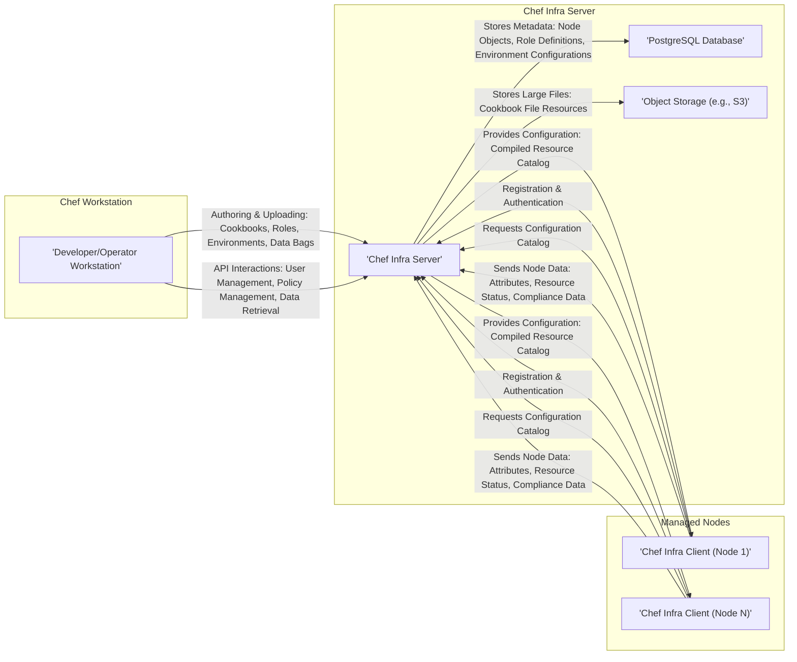
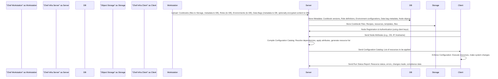

# Project Design Document: Chef (Improved)

**Version:** 1.1
**Date:** October 26, 2023
**Author:** AI Software Architect

## 1. Introduction

This document provides an enhanced architectural design of the Chef project, an automation platform that transforms infrastructure into code. This improved design document builds upon the previous version to provide a more detailed and nuanced understanding of the system, specifically for threat modeling purposes. It further clarifies the key components, their interactions, data flows, and security considerations within the core open-source Chef Infra project as found in the provided GitHub repository.

## 2. Goals and Objectives

The primary goal remains to provide a comprehensive and clear architectural overview of the Chef project to facilitate effective threat modeling. Improvements in this version aim to:

*   Provide more granular detail on component interactions.
*   Clarify data flow with specific examples of data types.
*   Enhance the security considerations section with more specific potential threats.
*   Improve the clarity and readability of the document.

## 3. High-Level Architecture

The Chef architecture follows a client-server model with a central server managing configurations for multiple client nodes. The diagram below illustrates the key components and their primary interactions.

## 4. Component Breakdown

This section provides a more detailed breakdown of the key components of the Chef architecture, emphasizing their interactions and potential security implications.

*   **Chef Workstation:**
    *   **Purpose:** The primary interface for developers and operators to interact with the Chef Infra Server. It's where configuration as code is authored, tested, and managed.
    *   **Key Functionality:**
        *   **Cookbook Development:** Creating and modifying Chef cookbooks, recipes, roles, environments, and data bags using a local development environment.
        *   **Testing:** Utilizing tools like Test Kitchen and ChefSpec to validate cookbooks before deployment.
        *   **Uploading:** Transferring authored artifacts to the Chef Infra Server using the `knife` command-line tool. This involves authentication with the server.
        *   **Server Interaction:** Interacting with the Chef Infra Server API for tasks like user management, node management, and data retrieval.
        *   **Local Mode Execution:** Running `chef-client` in local mode for testing and development purposes without a central server.
    *   **Technology Stack:** Ruby, command-line tools (knife, chef-client), potentially Docker for testing.
    *   **Security Considerations:**
        *   **Credential Management:** Secure storage of credentials used to authenticate with the Chef Infra Server. Compromised workstation credentials can lead to unauthorized modifications.
        *   **Supply Chain Attacks:** Risk of using compromised or malicious dependencies in the development environment.
        *   **Local Code Execution:** Vulnerabilities in development tools could allow for local code execution.
        *   **Exposure of Secrets:** Accidental inclusion of sensitive information (passwords, API keys) in version control or uploaded cookbooks.

*   **Chef Infra Server:**
    *   **Purpose:** The central hub of the Chef ecosystem, responsible for storing configuration data, managing nodes, and serving configurations to clients.
    *   **Key Functionality:**
        *   **Data Storage:** Persistently storing cookbooks, recipes, roles, environments, data bags, node metadata (attributes, run lists), and user/client information in the PostgreSQL database and object storage.
        *   **Authentication and Authorization:** Verifying the identity of users, nodes, and API clients through various mechanisms (e.g., username/password, client keys). Enforcing access control policies based on roles and permissions.
        *   **Node Management:** Tracking registered nodes, their attributes, and their association with specific configurations (run lists, environments).
        *   **Configuration Serving:** Compiling and serving node-specific configuration catalogs to Chef Infra Clients based on their attributes and assigned configurations.
        *   **Search Indexing:** Providing a search interface (often powered by Elasticsearch) to query node attributes and other data.
        *   **API Endpoint:** Exposing a RESTful API for interaction with workstations, other systems, and potentially the Chef Management Console.
    *   **Technology Stack:** Ruby on Rails, PostgreSQL, Erchef (Erlang-based Chef Server core), potentially Elasticsearch or Solr for search.
    *   **Security Considerations:**
        *   **Authentication and Authorization Bypass:** Vulnerabilities in authentication or authorization mechanisms could allow unauthorized access and control.
        *   **Data Breaches:**  Compromise of the server or its underlying data stores could expose sensitive configuration data and secrets.
        *   **API Security:**  Vulnerabilities in the API endpoints could allow for unauthorized actions or data manipulation.
        *   **Injection Attacks:**  Susceptible to SQL injection, command injection, or other injection vulnerabilities if input validation is insufficient.
        *   **Denial of Service (DoS):** Potential for resource exhaustion attacks against the server.
        *   **Insecure Defaults:** Misconfigured settings could weaken security.

*   **PostgreSQL Database:**
    *   **Purpose:** The primary relational database for the Chef Infra Server, storing structured metadata about the Chef environment.
    *   **Key Functionality:**
        *   **Persistent Storage:**  Storing data related to cookbooks, nodes, users, roles, environments, and other Chef objects.
        *   **Transactional Integrity:** Ensuring data consistency and reliability through ACID properties.
    *   **Technology Stack:** PostgreSQL.
    *   **Security Considerations:**
        *   **Unauthorized Access:**  Weak database credentials or misconfigured access controls could allow unauthorized access to sensitive data.
        *   **SQL Injection:**  Vulnerabilities in the Chef Infra Server code that interact with the database could lead to SQL injection attacks.
        *   **Data at Rest Encryption:** Lack of encryption for data stored in the database could expose sensitive information if the storage is compromised.
        *   **Backup Security:**  Insecure backups could be a target for attackers.

*   **Object Storage (e.g., S3):**
    *   **Purpose:** Used for storing larger, unstructured files associated with cookbooks, such as file resources (e.g., installation packages, configuration files).
    *   **Key Functionality:**
        *   **Scalable Storage:** Providing a scalable and durable storage solution for binary data.
    *   **Technology Stack:** AWS S3 or compatible object storage.
    *   **Security Considerations:**
        *   **Publicly Accessible Buckets:** Misconfigured bucket permissions could expose sensitive cookbook files.
        *   **Unauthorized Access:**  Weak access policies or compromised credentials could allow unauthorized access to stored files.
        *   **Data at Rest Encryption:** Lack of encryption for stored files could expose sensitive information.

*   **Chef Infra Client:**
    *   **Purpose:** An agent installed on each managed node that communicates with the Chef Infra Server to retrieve and apply configurations.
    *   **Key Functionality:**
        *   **Authentication:** Authenticating with the Chef Infra Server using client keys.
        *   **Node Data Collection:** Gathering information about the node's current state (attributes like operating system, IP address, installed software).
        *   **Catalog Request:** Requesting the configuration catalog from the Chef Infra Server.
        *   **Catalog Compilation (Server-Side):** The server compiles a catalog based on the node's attributes and assigned configurations.
        *   **Catalog Download:** Receiving the compiled configuration catalog from the server.
        *   **Resource Execution:** Executing the resources defined in the catalog, making changes to the node's configuration.
        *   **Status Reporting:** Sending a report back to the Chef Infra Server detailing the outcome of the configuration run, including any errors or changes made.
    *   **Technology Stack:** Ruby, potentially interacting with system-level tools and APIs.
    *   **Security Considerations:**
        *   **Client Key Management:** Secure storage and management of client keys on the managed node. Compromised keys could allow impersonation.
        *   **Local Privilege Escalation:** Vulnerabilities in the Chef Infra Client or its interactions with the operating system could allow for privilege escalation.
        *   **Man-in-the-Middle Attacks:**  Insecure communication channels could allow attackers to intercept and modify communication between the client and server.
        *   **Tampering with Client:** Attackers gaining access to a managed node could potentially tamper with the Chef Infra Client or its configuration.
        *   **Exposure of Secrets:**  Accidental logging or exposure of sensitive information during the client run.

## 5. Data Flow

The following outlines the typical data flow within the Chef ecosystem, providing more specific examples of the data being exchanged.

1. **Cookbook Development (Workstation):** Developers create and modify cookbook files (recipes, attributes, resources, metadata), role definitions (JSON files), environment configurations (JSON files), and data bags (encrypted or unencrypted JSON data).
2. **Upload to Server (Workstation to Server):** Using `knife`, the workstation uploads these artifacts to the Chef Infra Server. This involves:
    *   **Cookbook Files:** Uploaded to object storage.
    *   **Metadata:** Cookbook metadata, role definitions, environment configurations, and data bag metadata are stored in the PostgreSQL database.
3. **Node Registration (Client to Server):** A Chef Infra Client on a managed node sends a registration request to the Chef Infra Server, including its hostname and potentially initial attributes. Authentication is performed using client keys.
4. **Node Data Collection (Client):** The Chef Infra Client gathers information about the node's current state, such as operating system details, network configuration, installed packages, and custom attributes defined by Ohai.
5. **Catalog Request (Client to Server):** The Chef Infra Client sends a request to the Chef Infra Server for its configuration catalog, identifying itself.
6. **Catalog Compilation (Server):** The Chef Infra Server compiles a catalog for the specific node by:
    *   Retrieving the node's run list and environment.
    *   Resolving cookbook dependencies.
    *   Applying attributes from various sources (node attributes, environment attributes, role attributes, cookbook attributes).
    *   Generating a list of resources to be configured on the node.
7. **Catalog Download (Server to Client):** The compiled catalog, containing instructions on how to configure the node, is sent back to the Chef Infra Client.
8. **Configuration Enforcement (Client):** The Chef Infra Client executes the resources defined in the catalog, making changes to the node's configuration (e.g., installing packages, creating files, starting services).
9. **Status Reporting (Client to Server):** The Chef Infra Client sends a report back to the Chef Infra Server, including:
    *   The status of each resource execution (success, failure, skipped).
    *   Any errors encountered.
    *   Changes made to the node.
    *   Optionally, compliance data based on InSpec profiles.

## 6. Security Considerations

This section expands on the general security considerations, providing more specific examples of potential threats and vulnerabilities.

*   **Authentication and Authorization:**
    *   **Threats:** Brute-force attacks against user accounts, compromised client keys, privilege escalation due to misconfigured RBAC.
    *   **Mitigations:** Strong password policies, multi-factor authentication, regular rotation of client keys, principle of least privilege for user and node permissions.
*   **Data Protection:**
    *   **Threats:** Exposure of sensitive data in transit (e.g., during cookbook uploads or client-server communication), data breaches of the server database or object storage, accidental inclusion of secrets in cookbooks.
    *   **Mitigations:** Enforce TLS for all communication, encrypt data at rest in the database and object storage, utilize encrypted data bags for sensitive information, implement secrets management solutions (e.g., HashiCorp Vault).
*   **Input Validation:**
    *   **Threats:** SQL injection vulnerabilities in the Chef Infra Server, command injection vulnerabilities if user-provided data is used in resource execution without proper sanitization.
    *   **Mitigations:** Implement robust input validation and sanitization techniques, use parameterized queries for database interactions, avoid direct execution of user-provided commands.
*   **Secure Communication:**
    *   **Threats:** Man-in-the-middle attacks if TLS is not enforced or configured correctly.
    *   **Mitigations:** Enforce TLS 1.2 or higher for all communication, consider mutual TLS for stronger authentication between clients and the server.
*   **Secrets Management:**
    *   **Threats:** Hardcoded secrets in cookbooks, insecure storage of secrets in data bags.
    *   **Mitigations:** Utilize encrypted data bags, integrate with secrets management solutions, avoid storing secrets directly in cookbooks.
*   **Supply Chain Security:**
    *   **Threats:** Use of compromised or malicious community cookbooks, vulnerabilities in cookbook dependencies.
    *   **Mitigations:** Review and test community cookbooks before use, utilize supermarket policies for approved cookbooks, scan cookbook dependencies for vulnerabilities.
*   **Vulnerability Management:**
    *   **Threats:** Exploitation of known vulnerabilities in Chef Infra Server, Chef Infra Client, or underlying dependencies.
    *   **Mitigations:** Regularly scan components for vulnerabilities, apply security patches promptly, subscribe to security advisories.
*   **Access Control:**
    *   **Threats:** Unauthorized access to the Chef Infra Server, database, or object storage.
    *   **Mitigations:** Implement strong access control policies, follow the principle of least privilege, regularly review and audit access permissions.
*   **Auditing and Logging:**
    *   **Threats:** Lack of visibility into security events and potential breaches.
    *   **Mitigations:** Enable comprehensive audit logging for all components, monitor logs for suspicious activity, integrate with security information and event management (SIEM) systems.
*   **Secure Defaults:**
    *   **Threats:** Insecure default configurations that weaken security.
    *   **Mitigations:** Review and harden default configurations, follow security best practices for component configuration.
*   **Network Security:**
    *   **Threats:** Unauthorized access to Chef components through network vulnerabilities.
    *   **Mitigations:** Implement firewalls and network segmentation, restrict access to necessary ports and protocols.

## 7. Assumptions and Constraints

The following assumptions and constraints remain relevant:

*   The primary focus is on the open-source Chef Infra project.
*   Standard security best practices for the underlying infrastructure are assumed.
*   A basic understanding of configuration management concepts is assumed.
*   Specific deployment architectures are not covered in detail.

## 8. Future Considerations

Future improvements to this design document and the threat modeling process could include:

*   More detailed diagrams of specific subsystems and their interactions.
*   Inclusion of Chef Automate and its security implications.
*   Analysis of specific deployment scenarios (e.g., HA, multi-region) and their security considerations.
*   A deeper dive into the Chef API security, including authentication and authorization flows.
*   Mapping of data residency and compliance requirements and their impact on the architecture.
*   Threat modeling diagrams and use case scenarios based on this design document.

This improved design document provides a more robust foundation for threat modeling the Chef project, enabling a more thorough identification and mitigation of potential security risks.