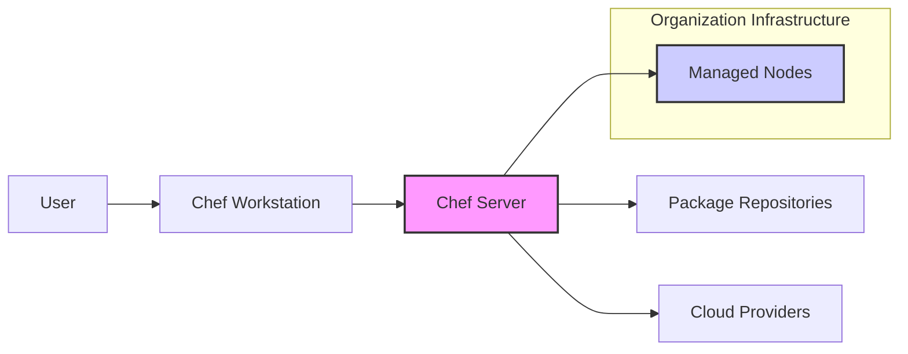
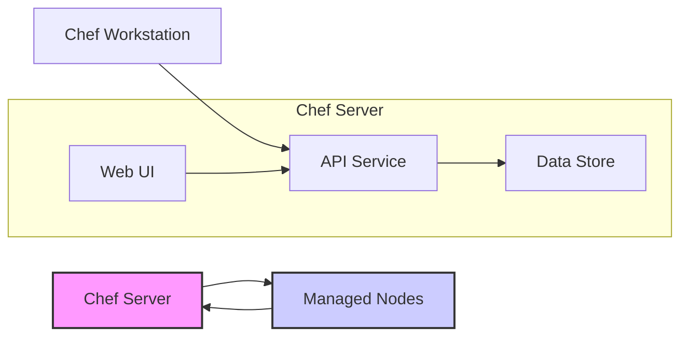
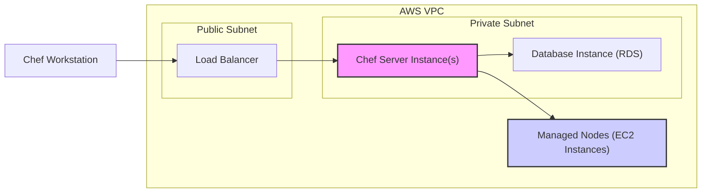
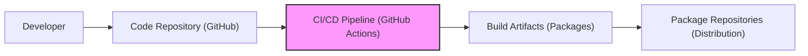

# BUSINESS POSTURE

The Chef project is an infrastructure automation platform that enables users to manage and automate the configuration of servers, applications, and networks. It aims to streamline IT operations, ensure consistency across infrastructure, and accelerate application deployment.

Business Priorities and Goals:
- Automate infrastructure management to reduce manual effort and operational costs.
- Ensure consistent configurations across all managed systems to improve reliability and reduce configuration drift.
- Accelerate application deployment and updates by automating infrastructure provisioning and configuration.
- Improve compliance and auditability by codifying infrastructure configurations.
- Enable scalability and agility in infrastructure management to support business growth.

Business Risks:
- Misconfiguration of infrastructure leading to service disruptions, security vulnerabilities, or compliance violations.
- Unauthorized access to Chef infrastructure allowing malicious actors to control managed systems.
- Data breaches due to insecure storage or transmission of sensitive configuration data and secrets.
- Supply chain attacks targeting Chef components or dependencies, compromising managed infrastructure.
- Operational disruptions due to failures in the Chef infrastructure itself.

# SECURITY POSTURE

Existing Security Controls:
- security control: Code review process for Chef codebase (location: GitHub repository - pull request reviews).
- security control: Static code analysis and linting (location: likely integrated into CI/CD pipelines, details not publicly available).
- security control: Unit and integration testing (location: GitHub repository - test suites).
- security control: Package signing for Chef Client and Chef Server packages (location: package repositories).
- security control: HTTPS for communication between Chef components (Chef Client, Chef Server, Chef Workstation).
- security control: Role-Based Access Control (RBAC) within Chef Server to manage user permissions.
- security control: Secrets management capabilities within Chef to handle sensitive data (e.g., encrypted attributes, Chef Vault).

Accepted Risks:
- accepted risk: Potential vulnerabilities in third-party dependencies used by Chef.
- accepted risk: Risk of misconfiguration by Chef users leading to security issues in managed infrastructure.
- accepted risk: Reliance on user-provided cookbooks and recipes, which may contain vulnerabilities or misconfigurations.

Recommended Security Controls:
- security control: Implement Software Composition Analysis (SCA) to continuously monitor third-party dependencies for vulnerabilities.
- security control: Enhance input validation and sanitization throughout Chef components to prevent injection attacks.
- security control: Implement robust secret scanning in code repositories and CI/CD pipelines to prevent accidental exposure of credentials.
- security control: Provide security hardening guidelines and best practices for Chef Server and Chef Client deployments.
- security control: Implement automated security testing (e.g., vulnerability scanning, penetration testing) of Chef components and managed infrastructure.

Security Requirements:
- Authentication:
    - Requirement: Secure authentication mechanisms for users accessing Chef Server (e.g., username/password, LDAP, SAML).
    - Requirement: Mutual TLS authentication between Chef Client and Chef Server to ensure secure communication and client identity verification.
    - Requirement: API keys or tokens for programmatic access to Chef Server APIs.
- Authorization:
    - Requirement: Role-Based Access Control (RBAC) to manage permissions for users and services within Chef Server.
    - Requirement: Granular authorization policies to control access to nodes, cookbooks, environments, and other Chef resources.
    - Requirement: Principle of least privilege should be applied to all user and service accounts.
- Input Validation:
    - Requirement: Strict input validation for all data received by Chef Server and Chef Client, including API requests, cookbook attributes, and node data.
    - Requirement: Sanitize user-provided data to prevent injection attacks (e.g., command injection, SQL injection).
    - Requirement: Validate cookbook syntax and structure to prevent errors and potential security issues.
- Cryptography:
    - Requirement: Use strong encryption algorithms for sensitive data at rest and in transit (e.g., AES-256, TLS 1.2+).
    - Requirement: Securely store and manage cryptographic keys used for encryption and signing.
    - Requirement: Implement cryptographic signing and verification for Chef cookbooks and packages to ensure integrity and authenticity.

# DESIGN

## C4 CONTEXT

Context Diagram Elements:

- Element:
    - Name: User
    - Type: Person
    - Description: An individual who interacts with the Chef system to manage infrastructure. This could be a system administrator, developer, or operations engineer.
    - Responsibilities:
        - Writes and manages Chef cookbooks and recipes.
        - Interacts with Chef Workstation to develop and test configurations.
        - Uses Chef Workstation to upload cookbooks and manage Chef Server.
        - Monitors the status of Chef Client runs on managed nodes.
    - Security controls:
        - Authentication to Chef Server via Chef Workstation.
        - Authorization based on RBAC within Chef Server.
        - Secure workstation configuration and access controls.

- Element:
    - Name: Chef Workstation
    - Type: Software System
    - Description: A local machine where users develop, test, and interact with Chef. It includes the Chef CLI tools.
    - Responsibilities:
        - Development and testing of Chef cookbooks and recipes.
        - Interaction with Chef Server via the Chef CLI.
        - Management of local Chef configuration and credentials.
    - Security controls:
        - Secure operating system and software configuration.
        - Access control to the workstation.
        - Secure storage of Chef credentials (e.g., private keys).

- Element:
    - Name: Chef Server
    - Type: Software System
    - Description: The central hub of the Chef infrastructure. It stores cookbooks, node data, policies, and provides APIs for interaction.
    - Responsibilities:
        - Storage and management of Chef cookbooks, roles, environments, and policies.
        - Management of node data and metadata.
        - API endpoint for Chef Workstation and Chef Client communication.
        - Authentication and authorization of users and clients.
        - Orchestration of Chef Client runs on managed nodes.
    - Security controls:
        - Authentication and authorization mechanisms (RBAC).
        - HTTPS for all communication.
        - Secure data storage and encryption of sensitive data.
        - Input validation and sanitization.
        - Regular security updates and patching.

- Element:
    - Name: Managed Nodes
    - Type: Software System
    - Description: Servers, virtual machines, containers, or other infrastructure components that are managed by Chef Client.
    - Responsibilities:
        - Running Chef Client to retrieve configurations from Chef Server.
        - Applying configurations defined in Chef cookbooks and recipes.
        - Reporting status and compliance back to Chef Server.
    - Security controls:
        - Chef Client authentication to Chef Server.
        - Secure communication with Chef Server (HTTPS).
        - Operating system and application security hardening.
        - Regular security updates and patching.
        - Access control and least privilege configurations.

- Element:
    - Name: Package Repositories
    - Type: External System
    - Description: External repositories (e.g., apt, yum, npm, rubygems) from which Chef can download packages and software.
    - Responsibilities:
        - Providing software packages and dependencies required by Chef cookbooks.
    - Security controls:
        - Verification of package signatures to ensure integrity and authenticity.
        - Use of trusted and reputable package repositories.
        - Vulnerability scanning of packages before deployment.

- Element:
    - Name: Cloud Providers
    - Type: External System
    - Description: Cloud infrastructure providers (e.g., AWS, Azure, GCP) that may host Chef Server and managed nodes. Chef can also interact with cloud provider APIs for provisioning and management.
    - Responsibilities:
        - Providing infrastructure resources (compute, storage, networking).
        - Cloud provider APIs for infrastructure management.
    - Security controls:
        - Cloud provider security controls (IAM, network security groups, encryption).
        - Secure configuration of cloud resources.
        - Least privilege access to cloud provider APIs.

## C4 CONTAINER

Container Diagram Elements:

- Element:
    - Name: API Service
    - Type: Container
    - Description: The Chef Server API service handles requests from Chef Workstation and Chef Client. It provides RESTful APIs for managing cookbooks, nodes, policies, and other Chef resources.
    - Responsibilities:
        - Receives and processes API requests from Chef Workstation and Chef Client.
        - Authenticates and authorizes API requests.
        - Interacts with the Data Store to retrieve and store data.
        - Orchestrates Chef Client runs on managed nodes.
    - Security controls:
        - HTTPS for API communication.
        - Input validation and sanitization.
        - Authentication and authorization (RBAC).
        - Rate limiting and protection against denial-of-service attacks.

- Element:
    - Name: Data Store
    - Type: Container
    - Description: The Chef Server Data Store is responsible for persistent storage of Chef data, including cookbooks, node data, roles, environments, and policies.  This is typically a database like PostgreSQL or a similar data storage solution.
    - Responsibilities:
        - Persistent storage of Chef data.
        - Data integrity and consistency.
        - Data backup and recovery.
    - Security controls:
        - Encryption at rest for sensitive data.
        - Access control to the database.
        - Regular security updates and patching of the database system.
        - Database hardening and security configuration.

- Element:
    - Name: Web UI
    - Type: Container
    - Description: The Chef Server Web UI provides a graphical interface for users to interact with Chef Server, manage cookbooks, nodes, and monitor Chef activity.
    - Responsibilities:
        - Provides a user-friendly web interface for Chef Server management.
        - Authenticates users and enforces authorization policies.
        - Interacts with the API Service to perform actions.
    - Security controls:
        - HTTPS for web UI access.
        - Authentication and authorization.
        - Protection against common web application vulnerabilities (e.g., XSS, CSRF).
        - Secure session management.

- Element:
    - Name: Chef Workstation
    - Type: Software System (External - same as context diagram)
    - Description: (Same as context diagram) A local machine where users develop, test, and interact with Chef. It includes the Chef CLI tools.
    - Responsibilities: (Same as context diagram) Development and testing of Chef cookbooks and recipes. Interaction with Chef Server via the Chef CLI. Management of local Chef configuration and credentials.
    - Security controls: (Same as context diagram) Secure operating system and software configuration. Access control to the workstation. Secure storage of Chef credentials (e.g., private keys).

- Element:
    - Name: Managed Nodes
    - Type: Software System (External - same as context diagram)
    - Description: (Same as context diagram) Servers, virtual machines, containers, or other infrastructure components that are managed by Chef Client.
    - Responsibilities: (Same as context diagram) Running Chef Client to retrieve configurations from Chef Server. Applying configurations defined in Chef cookbooks and recipes. Reporting status and compliance back to Chef Server.
    - Security controls: (Same as context diagram) Chef Client authentication to Chef Server. Secure communication with Chef Server (HTTPS). Operating system and application security hardening. Regular security updates and patching. Access control and least privilege configurations.

## DEPLOYMENT

Deployment Architecture: Cloud Deployment (Example - AWS)

Deployment Diagram Elements:

- Element:
    - Name: Load Balancer
    - Type: Infrastructure Component
    - Description: An AWS Elastic Load Balancer (ELB) or Application Load Balancer (ALB) in a public subnet. It distributes traffic to Chef Server instances and provides high availability and scalability.
    - Responsibilities:
        - Load balancing traffic to Chef Server instances.
        - SSL termination for HTTPS traffic.
        - Health checks for Chef Server instances.
    - Security controls:
        - HTTPS termination and enforcement.
        - Web Application Firewall (WAF) integration (optional).
        - Security groups to restrict inbound and outbound traffic.

- Element:
    - Name: Chef Server Instance(s)
    - Type: Infrastructure Component (EC2 Instance)
    - Description: One or more EC2 instances running Chef Server in a private subnet.
    - Responsibilities:
        - Running Chef Server application and services.
        - Processing API requests and managing Chef data.
    - Security controls:
        - Security groups to restrict inbound and outbound traffic.
        - Instance hardening and security configuration.
        - Regular security updates and patching of the operating system and Chef Server software.
        - Encryption at rest for instance storage (EBS encryption).

- Element:
    - Name: Database Instance (RDS)
    - Type: Infrastructure Component (AWS RDS)
    - Description: An AWS Relational Database Service (RDS) instance (e.g., PostgreSQL) in a private subnet, used as the Chef Server Data Store.
    - Responsibilities:
        - Persistent storage of Chef data.
        - Database management and maintenance.
    - Security controls:
        - Encryption at rest for database storage.
        - Access control to the database (security groups, IAM).
        - Regular security updates and patching of the database system.
        - Database hardening and security configuration.
        - Database backups and disaster recovery.

- Element:
    - Name: Managed Nodes (EC2 Instances)
    - Type: Infrastructure Component (EC2 Instances)
    - Description: EC2 instances in private or public subnets that are managed by Chef Client.
    - Responsibilities:
        - Running applications and services.
        - Running Chef Client to apply configurations.
    - Security controls:
        - Security groups to restrict inbound and outbound traffic.
        - Instance hardening and security configuration.
        - Regular security updates and patching of the operating system and applications.
        - Access control and least privilege configurations.

- Element:
    - Name: Chef Workstation
    - Type: Software System (External - same as context diagram)
    - Description: (Same as context diagram) A local machine where users develop, test, and interact with Chef. It includes the Chef CLI tools.
    - Responsibilities: (Same as context diagram) Development and testing of Chef cookbooks and recipes. Interaction with Chef Server via the Chef CLI. Management of local Chef configuration and credentials.
    - Security controls: (Same as context diagram) Secure operating system and software configuration. Access control to the workstation. Secure storage of Chef credentials (e.g., private keys).

## BUILD

Build Process Diagram Elements:

- Element:
    - Name: Developer
    - Type: Person
    - Description: A software developer contributing to the Chef project codebase.
    - Responsibilities:
        - Writing and committing code changes.
        - Performing local testing and code reviews.
    - Security controls:
        - Secure development environment.
        - Code review process.
        - Secure coding practices.
        - Authentication to code repository.

- Element:
    - Name: Code Repository (GitHub)
    - Type: Software System
    - Description: GitHub repository hosting the Chef project source code.
    - Responsibilities:
        - Version control of the codebase.
        - Collaboration platform for development.
        - Triggering CI/CD pipelines on code changes.
    - Security controls:
        - Access control to the repository (authentication and authorization).
        - Branch protection and code review enforcement.
        - Audit logging of repository activities.
        - Secret scanning to prevent credential leaks.

- Element:
    - Name: CI/CD Pipeline (GitHub Actions)
    - Type: Software System
    - Description: GitHub Actions workflows automating the build, test, and release process for Chef.
    - Responsibilities:
        - Automated building of Chef components.
        - Running unit and integration tests.
        - Performing static code analysis and security scans.
        - Packaging build artifacts.
        - Publishing build artifacts to package repositories.
    - Security controls:
        - Secure CI/CD pipeline configuration.
        - Use of secure build environments.
        - Software Composition Analysis (SCA) for dependencies.
        - Static Application Security Testing (SAST) for code vulnerabilities.
        - Signing of build artifacts.
        - Access control to CI/CD pipeline configuration and secrets.

- Element:
    - Name: Build Artifacts (Packages)
    - Type: Data Store
    - Description: Packages (e.g., .deb, .rpm, gems) generated by the CI/CD pipeline, containing Chef components (Chef Client, Chef Server, etc.).
    - Responsibilities:
        - Distribution of Chef software.
        - Installation of Chef components.
    - Security controls:
        - Package signing to ensure integrity and authenticity.
        - Secure storage of build artifacts.
        - Vulnerability scanning of build artifacts.

- Element:
    - Name: Package Repositories (Distribution)
    - Type: Software System
    - Description: Public or private package repositories where Chef build artifacts are published for distribution to users.
    - Responsibilities:
        - Hosting and distributing Chef packages.
        - Providing package management capabilities (e.g., apt, yum).
    - Security controls:
        - Secure repository infrastructure.
        - Access control to the repository (for publishing).
        - Verification of package signatures during installation.

# RISK ASSESSMENT

Critical Business Processes:
- Infrastructure provisioning and configuration management.
- Application deployment and updates.
- Compliance and security policy enforcement across infrastructure.
- Ensuring system uptime and availability through consistent configurations.

Data Sensitivity:
- High Sensitivity:
    - Secrets and credentials (e.g., passwords, API keys, SSH keys) used for infrastructure management and application deployment.
    - Configuration data that may reveal sensitive information about the infrastructure or applications.
    - Audit logs containing information about user actions and system changes.
- Medium Sensitivity:
    - Cookbook code and recipes, as they define infrastructure configurations and application deployments.
    - Node data and metadata, including system inventory and configuration details.
- Low Sensitivity:
    - Chef Server application logs (excluding sensitive data).
    - Publicly available Chef packages and documentation.

# QUESTIONS & ASSUMPTIONS

Questions:
- What is the intended deployment environment (on-premise, cloud, hybrid)?
- What are the specific compliance requirements for the project (e.g., PCI DSS, HIPAA, SOC 2)?
- What is the organization's risk tolerance for security vulnerabilities and operational disruptions?
- Are there any specific security tools or technologies already in use that should be integrated with Chef?
- What is the process for managing and rotating secrets used by Chef?
- What is the disaster recovery plan for Chef Server and managed infrastructure?

Assumptions:
- BUSINESS POSTURE: The primary business goal is to improve efficiency and consistency in infrastructure management. Security and compliance are important considerations.
- SECURITY POSTURE:  The organization values security and is willing to invest in security controls. Secure software development lifecycle practices are in place.
- DESIGN: Chef Server will be deployed in a highly available and secure manner. Managed nodes are expected to be diverse and may include various operating systems and application stacks. The build process is automated and includes security checks.