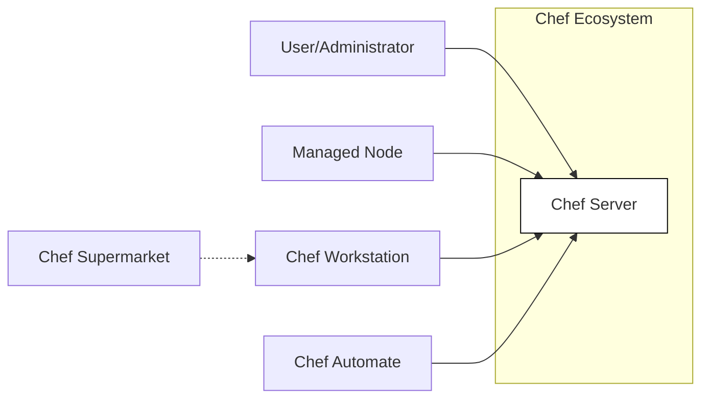
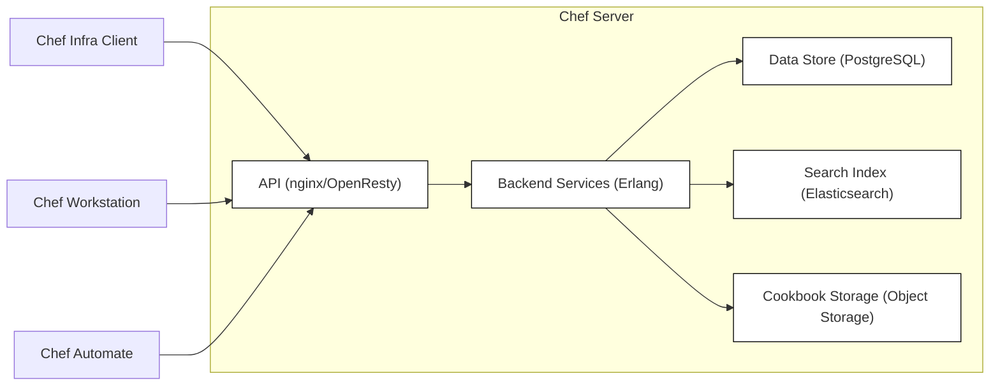
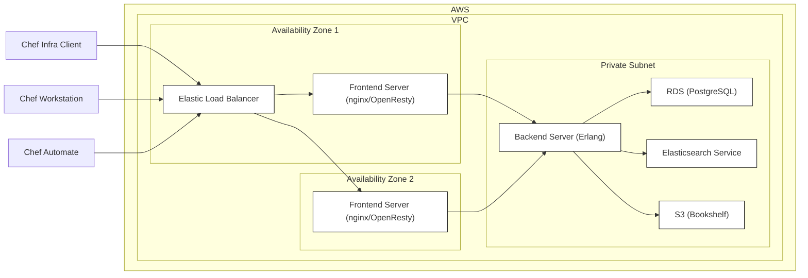
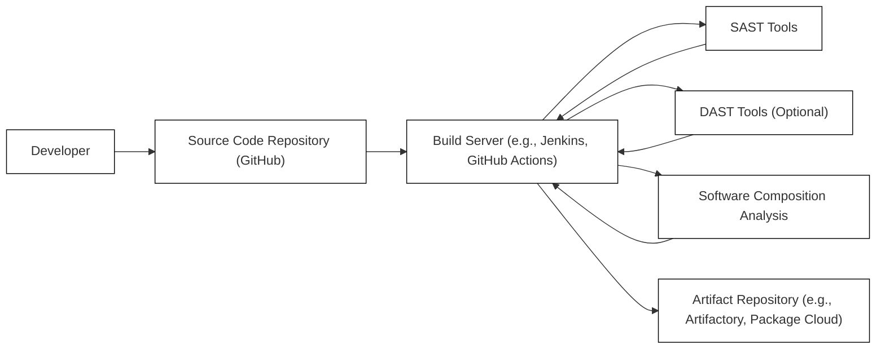

Okay, let's dive into creating a design document for the Chef project, keeping security and threat modeling in mind.

# BUSINESS POSTURE

Chef is a powerful automation platform that transforms infrastructure into code.  It automates how infrastructure is configured, deployed, and managed across a network, regardless of its size.  This applies to on-premises, cloud, or hybrid environments.  Given its role in managing infrastructure, the business posture is centered around reliability, consistency, and security.  Chef is a mature, well-established product used by many large organizations. Therefore, its risk appetite is likely to be relatively low, prioritizing stability and security over rapid feature iteration.

Priorities:

*   Reliability: Chef must operate reliably and predictably.  Unexpected changes or failures can have significant consequences for the managed infrastructure.
*   Consistency:  Chef's core value proposition is ensuring consistent configurations across many systems.  Deviations from expected configurations must be minimized.
*   Security:  As a tool that has privileged access to managed systems, Chef itself must be highly secure.  Compromise of Chef could lead to widespread infrastructure compromise.
*   Scalability: Chef needs to scale to manage large and complex infrastructures.
*   Compliance: Many Chef users operate in regulated industries and need to ensure their infrastructure meets compliance requirements. Chef should facilitate this.
*   Extensibility: Chef should be adaptable to new technologies and evolving infrastructure needs.

Business Risks:

*   Compromise of Chef Server:  An attacker gaining control of the Chef Server could potentially control all managed nodes.
*   Unauthorized Access to Chef Data:  Sensitive data (e.g., passwords, API keys) stored within Chef could be exposed.
*   Malicious Cookbooks/Recipes:  An attacker could introduce malicious code into cookbooks or recipes, leading to infrastructure compromise.
*   Supply Chain Attacks:  Compromised dependencies or build processes could introduce vulnerabilities into Chef itself.
*   Denial of Service:  Attacks against the Chef Server could disrupt infrastructure management.
*   Data Loss: Loss of Chef Server data (e.g., node configurations, run lists) could hinder recovery and management.
*   Misconfiguration: Incorrectly configured Chef settings or cookbooks could lead to infrastructure instability or security vulnerabilities.

# SECURITY POSTURE

Existing Security Controls:

*   security control: Role-Based Access Control (RBAC): Chef Server implements RBAC to control user permissions. (Implemented in Chef Server)
*   security control: Authentication: Chef Server supports various authentication methods, including local users, LDAP, and SAML. (Implemented in Chef Server)
*   security control: Transport Layer Security (TLS): Communication between Chef components (clients, server, Automate) is typically encrypted using TLS. (Implemented in all components)
*   security control: Data Encryption: Chef Vault (now integrated into Chef Infra Client) allows for encrypting sensitive data within data bags. (Implemented in Chef Infra Client and cookbooks)
*   security control: API Request Signing: Chef API requests are signed to prevent tampering and ensure authenticity. (Implemented in Chef Infra Client and Server)
*   security control: Auditing: Chef Automate provides audit logging capabilities to track changes and actions. (Implemented in Chef Automate)
*   security control: Policyfiles: Policyfiles provide a way to define and manage infrastructure configurations in a version-controlled and testable manner, reducing the risk of misconfiguration. (Implemented in Chef Infra Client)
*   security control: Compliance Phase (InSpec): Chef includes InSpec for defining and executing compliance checks as code. (Implemented in Chef Infra Client and Automate)

Accepted Risks:

*   accepted risk: Complexity of Configuration: Chef can be complex to configure and manage, potentially leading to misconfigurations if not handled carefully.
*   accepted risk: Reliance on Community Cookbooks: While Chef provides official cookbooks, many users rely on community-maintained cookbooks, which may have varying levels of security and quality.
*   accepted risk: Agent-Based Architecture: The agent-based architecture requires the Chef Infra Client to be installed on all managed nodes, which increases the attack surface.

Recommended Security Controls:

*   Implement robust secrets management for all sensitive data used by Chef, integrating with external secrets management solutions (e.g., HashiCorp Vault, AWS Secrets Manager).
*   Enforce regular security audits and penetration testing of the Chef infrastructure.
*   Implement network segmentation to isolate the Chef Server and managed nodes.
*   Implement strict input validation and sanitization in all custom cookbooks and recipes.
*   Regularly review and update all dependencies to mitigate supply chain risks.
*   Implement a robust vulnerability management program to identify and address security vulnerabilities in Chef and its components.

Security Requirements:

*   Authentication:
    *   All users and services interacting with Chef Server must be authenticated.
    *   Support for multi-factor authentication (MFA) should be considered.
    *   Strong password policies must be enforced.
*   Authorization:
    *   RBAC must be used to restrict access to Chef resources based on the principle of least privilege.
    *   Permissions should be regularly reviewed and updated.
*   Input Validation:
    *   All input received from external sources (e.g., user input, API requests, data bags) must be validated and sanitized.
    *   Cookbooks and recipes should be carefully reviewed for potential injection vulnerabilities.
*   Cryptography:
    *   TLS must be used for all communication between Chef components.
    *   Strong cryptographic algorithms and key lengths must be used.
    *   Sensitive data stored within Chef must be encrypted at rest.
*   Auditing:
    *   All security-relevant events must be logged and monitored.
    *   Audit logs should be protected from tampering and unauthorized access.

# DESIGN

## C4 CONTEXT

Element Descriptions:

*   Element:
    *   Name: User/Administrator
    *   Type: Person
    *   Description: A person who interacts with Chef to manage infrastructure.
    *   Responsibilities:
        *   Creating and managing cookbooks.
        *   Defining roles and environments.
        *   Managing nodes.
        *   Monitoring infrastructure status.
    *   Security Controls:
        *   Authentication (e.g., username/password, LDAP, SAML).
        *   RBAC.

*   Element:
    *   Name: Managed Node
    *   Type: System
    *   Description: A server, virtual machine, or container that is managed by Chef.
    *   Responsibilities:
        *   Running the Chef Infra Client.
        *   Applying configurations defined in cookbooks.
        *   Reporting status to the Chef Server.
    *   Security Controls:
        *   Chef Infra Client configuration (e.g., TLS, run list).
        *   Operating system security controls.

*   Element:
    *   Name: Chef Workstation
    *   Type: System
    *   Description: A developer's machine used to create and manage Chef code (cookbooks, recipes, Policyfiles).
    *   Responsibilities:
        *   Developing and testing cookbooks.
        *   Uploading cookbooks to the Chef Server.
        *   Managing Policyfiles.
    *   Security Controls:
        *   User authentication.
        *   Secure storage of credentials.
        *   Code signing (optional).

*   Element:
    *   Name: Chef Server
    *   Type: System
    *   Description: The central hub for Chef configuration data.
    *   Responsibilities:
        *   Storing cookbooks, recipes, roles, environments, and data bags.
        *   Providing an API for Chef Infra Clients and workstations.
        *   Managing user authentication and authorization.
    *   Security Controls:
        *   RBAC.
        *   Authentication (local users, LDAP, SAML).
        *   TLS encryption.
        *   API request signing.
        *   Data encryption (Chef Vault).

*   Element:
    *   Name: Chef Automate
    *   Type: System
    *   Description: A dashboard and reporting tool for Chef.
    *   Responsibilities:
        *   Providing visibility into infrastructure status.
        *   Displaying audit logs.
        *   Managing compliance checks (InSpec).
    *   Security Controls:
        *   Authentication.
        *   RBAC.
        *   TLS encryption.

*   Element:
    *   Name: Chef Supermarket
    *   Type: System
    *   Description: A public repository of community-maintained cookbooks.
    *   Responsibilities:
        *   Hosting cookbooks.
        *   Providing a search interface for cookbooks.
    *   Security Controls:
        *   Community moderation.
        *   User authentication (for uploading cookbooks).
        *   Cookbook signing (optional).

## C4 CONTAINER

Element Descriptions:

*   Element:
    *   Name: API
    *   Type: Container (Web Application)
    *   Description: The front-end API for the Chef Server, typically implemented using nginx/OpenResty.
    *   Responsibilities:
        *   Handling API requests from Chef Infra Clients and workstations.
        *   Authenticating users and clients.
        *   Routing requests to backend services.
    *   Security Controls:
        *   TLS encryption.
        *   Authentication (API keys, user credentials).
        *   Request signing.
        *   Rate limiting.
        *   Input validation.

*   Element:
    *   Name: Backend Services
    *   Type: Container (Application Server)
    *   Description: The core logic of the Chef Server, implemented in Erlang.
    *   Responsibilities:
        *   Managing cookbooks, roles, environments, and data bags.
        *   Processing node registrations and run lists.
        *   Interacting with the data store and search index.
    *   Security Controls:
        *   RBAC.
        *   Internal API authentication.

*   Element:
    *   Name: Data Store
    *   Type: Container (Database)
    *   Description: The database used to store Chef Server data, typically PostgreSQL.
    *   Responsibilities:
        *   Storing node data, roles, environments, data bags, and other configuration information.
    *   Security Controls:
        *   Database authentication.
        *   Data encryption at rest (optional).
        *   Access control lists (ACLs).

*   Element:
    *   Name: Search Index
    *   Type: Container (Search Engine)
    *   Description: The search index used to enable searching for nodes and other data, typically Elasticsearch.
    *   Responsibilities:
        *   Indexing Chef Server data.
        *   Providing search capabilities.
    *   Security Controls:
        *   Authentication.
        *   Access control.

*   Element:
    *   Name: Bookshelf
    *   Type: Container (Object Storage)
    *   Description: Storage for cookbook files. Can be local storage or object storage (e.g., S3).
    *   Responsibilities:
        * Storing cookbook files.
    *   Security Controls:
        * Authentication.
        * Access Control.
        * Encryption at rest.

*   Element:
    *   Name: Chef Infra Client
    *   Type: Software
    *   Description: Agent that runs on managed nodes.
    *   Responsibilities:
        *   Fetching configurations from Chef Server.
        *   Applying configurations.
        *   Reporting status.
    *   Security Controls:
        *   TLS.
        *   API request signing.

*   Element:
    *   Name: Chef Workstation
    *   Type: Software
    *   Description: Developer's machine.
    *   Responsibilities:
        *   Developing cookbooks.
        *   Uploading to Chef Server.
    *   Security Controls:
        *   User authentication.
        *   Secure credential storage.

*   Element:
    *   Name: Chef Automate
    *   Type: Software
    *   Description: Reporting and dashboard.
    *   Responsibilities:
        *   Providing visibility.
        *   Audit logs.
        *   Compliance checks.
    *   Security Controls:
        *   Authentication.
        *   RBAC.
        *   TLS.

## DEPLOYMENT

Possible Deployment Solutions:

1.  Standalone Chef Server: A single server running all Chef Server components.
2.  Tiered Chef Server: Separates the front-end (API) and back-end services onto different servers.
3.  High Availability (HA) Chef Server: Uses multiple servers and load balancing for redundancy and scalability.
4.  Chef Automate with External Chef Server: Chef Automate can be deployed separately and connect to an existing Chef Server.
5.  Cloud-Based Deployments: Chef Server and Automate can be deployed on cloud platforms (e.g., AWS, Azure, GCP) using various services (e.g., VMs, containers, managed services).

Chosen Solution (for detailed description): Tiered Chef Server on AWS

Element Descriptions:

*   Element:
    *   Name: Elastic Load Balancer (ELB)
    *   Type: Infrastructure (Load Balancer)
    *   Description: Distributes traffic across multiple front-end servers.
    *   Responsibilities:
        *   Load balancing.
        *   SSL termination (optional).
        *   Health checks.
    *   Security Controls:
        *   Security groups.
        *   TLS configuration.

*   Element:
    *   Name: Frontend Server
    *   Type: Infrastructure (Virtual Machine)
    *   Description: Runs the Chef Server API (nginx/OpenResty).
    *   Responsibilities:
        *   Handling API requests.
        *   Authentication.
        *   Routing requests to the backend.
    *   Security Controls:
        *   Security groups.
        *   TLS configuration.
        *   Firewall rules.

*   Element:
    *   Name: Frontend Server 2
    *   Type: Infrastructure (Virtual Machine)
    *   Description: Runs the Chef Server API (nginx/OpenResty). Provides redundancy.
    *   Responsibilities:
        *   Handling API requests.
        *   Authentication.
        *   Routing requests to the backend.
    *   Security Controls:
        *   Security groups.
        *   TLS configuration.
        *   Firewall rules.

*   Element:
    *   Name: Backend Server
    *   Type: Infrastructure (Virtual Machine)
    *   Description: Runs the Chef Server backend services (Erlang).
    *   Responsibilities:
        *   Managing Chef data.
        *   Processing node registrations.
    *   Security Controls:
        *   Security groups.
        *   Firewall rules.

*   Element:
    *   Name: RDS (PostgreSQL)
    *   Type: Infrastructure (Managed Database)
    *   Description: Managed PostgreSQL database service.
    *   Responsibilities:
        *   Storing Chef Server data.
    *   Security Controls:
        *   Security groups.
        *   Database authentication.
        *   Encryption at rest.
        *   Automated backups.

*   Element:
    *   Name: Elasticsearch Service
    *   Type: Infrastructure (Managed Service)
    *   Description: Managed Elasticsearch service.
    *   Responsibilities:
        *   Providing search capabilities.
    *   Security Controls:
        *   Security groups.
        *   Authentication.
        *   Encryption at rest.

*   Element:
    *   Name: S3 (Bookshelf)
    *   Type: Infrastructure (Object Storage)
    *   Description: Used to store cookbook files.
    *   Responsibilities:
        *   Storing cookbook files.
    *   Security Controls:
        *   S3 bucket policies.
        *   IAM roles.
        *   Encryption at rest.

*   Element:
    *   Name: Chef Infra Client
    *   Type: Software
    *   Description: Agent that runs on managed nodes.
    *   Responsibilities:
        *   Fetching configurations from Chef Server.
        *   Applying configurations.
        *   Reporting status.
    *   Security Controls:
        *   TLS.
        *   API request signing.

*   Element:
    *   Name: Chef Workstation
    *   Type: Software
    *   Description: Developer's machine.
    *   Responsibilities:
        *   Developing cookbooks.
        *   Uploading to Chef Server.
    *   Security Controls:
        *   User authentication.
        *   Secure credential storage.

*   Element:
    *   Name: Chef Automate
    *   Type: Software
    *   Description: Reporting and dashboard.
    *   Responsibilities:
        *   Providing visibility.
        *   Audit logs.
        *   Compliance checks.
    *   Security Controls:
        *   Authentication.
        *   RBAC.
        *   TLS.

## BUILD

The Chef project itself is a complex software project with multiple components (Chef Infra Client, Chef Server, Chef Automate, InSpec, etc.).  The build process likely involves multiple repositories, build pipelines, and artifact repositories.  A simplified, generalized build process is described below.

Build Process Description:

1.  Developers commit code to the source code repository (GitHub).
2.  A build server (e.g., Jenkins, GitHub Actions) detects the changes and triggers a build pipeline.
3.  The build pipeline performs the following steps:
    *   Checks out the code.
    *   Builds the software components (compiling, linking, etc.).
    *   Runs unit tests.
    *   Runs integration tests.
    *   Performs static analysis (SAST) to identify potential security vulnerabilities in the code. Tools like RuboCop (for Ruby), ESLint (for JavaScript) and others are likely used.
    *   Performs software composition analysis (SCA) to identify known vulnerabilities in third-party dependencies. Tools like Dependabot or Snyk are likely used.
    *   Optionally, performs dynamic analysis (DAST) to test the running application for vulnerabilities.
    *   Packages the software into deployable artifacts (e.g., packages, container images).
    *   Publishes the artifacts to an artifact repository (e.g., Artifactory, Package Cloud).
4.  The build pipeline reports the results (success/failure, test results, security scan findings).

Security Controls:

*   security control: Version Control: All code is stored in a version control system (Git).
*   security control: Build Automation: The build process is automated using a build server.
*   security control: Static Analysis (SAST): SAST tools are used to identify potential security vulnerabilities in the code.
*   security control: Software Composition Analysis (SCA): SCA tools are used to identify known vulnerabilities in third-party dependencies.
*   security control: Dependency Management: Dependencies are carefully managed and tracked.
*   security control: Artifact Signing: Build artifacts are likely signed to ensure their integrity.
*   security control: Secure Build Environment: The build server itself is secured and hardened.
*   security control: Least Privilege: Build processes run with the least privilege necessary.

# RISK ASSESSMENT

Critical Business Processes:

*   Infrastructure Configuration Management: The core process of defining, deploying, and managing infrastructure configurations.
*   Compliance Management: Ensuring that infrastructure meets compliance requirements.
*   Automated Remediation: Automatically correcting configuration drift and security vulnerabilities.
*   Reporting and Auditing: Providing visibility into infrastructure status and changes.

Data Sensitivity:

*   Node Data: Information about managed nodes, including their attributes, run lists, and applied configurations. (Sensitivity: Medium to High, depending on the data stored in node attributes)
*   Cookbooks and Recipes: The code that defines infrastructure configurations. (Sensitivity: Medium to High, as they may contain sensitive data or logic)
*   Data Bags: Data used by cookbooks, which may contain sensitive information (e.g., passwords, API keys). (Sensitivity: High, especially if not encrypted using Chef Vault)
*   Roles and Environments: Definitions of infrastructure roles and environments. (Sensitivity: Medium)
*   Audit Logs: Records of actions performed within Chef. (Sensitivity: Medium)
*   User Credentials: Usernames, passwords, and API keys for accessing Chef Server. (Sensitivity: High)

# QUESTIONS & ASSUMPTIONS

Questions:

*   What specific secrets management solutions are currently used or planned for integration with Chef?
*   What is the current process for reviewing and approving community-maintained cookbooks before they are used?
*   What are the specific compliance requirements that Chef deployments need to meet (e.g., PCI DSS, HIPAA, SOC 2)?
*   What is the current vulnerability management process for Chef and its components?
*   Are there any specific cloud platforms or deployment environments that are prioritized?
*   What level of detail is required for the component-level diagrams (C4 Component)?
*   What are the specific performance and scalability requirements for Chef deployments?

Assumptions:

*   BUSINESS POSTURE: Chef is considered a critical system with a low risk appetite.
*   SECURITY POSTURE: Existing security controls are in place, but there is room for improvement.
*   DESIGN: The deployment architecture will be based on a tiered Chef Server model on AWS, but this can be adjusted based on specific requirements. The build process is automated and includes security checks.