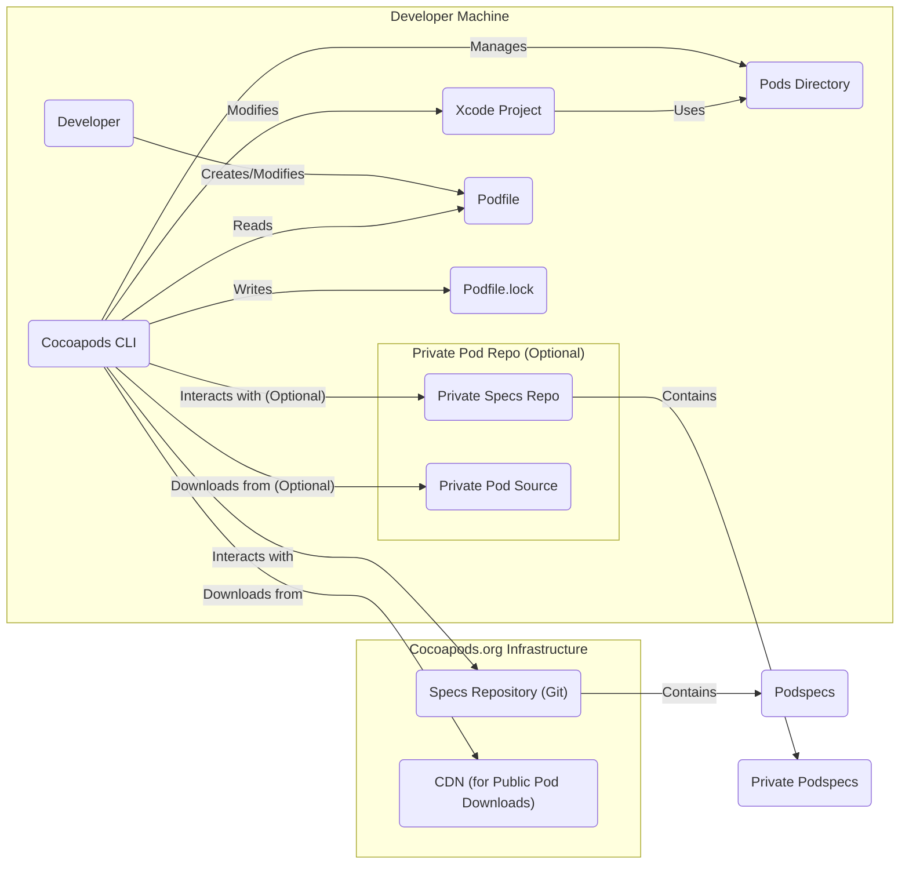

# Project Design Document: Cocoapods

**Version:** 1.1
**Date:** October 26, 2023
**Prepared By:** Gemini (AI Language Model)

## 1. Project Overview

Cocoapods is a dependency manager for Swift and Objective-C Cocoa projects, streamlining the inclusion of third-party libraries (referred to as "Pods"). It operates by reading a declarative dependency specification in a `Podfile`, resolving these dependencies against a central repository, downloading the necessary code, and integrating it into the Xcode workspace. This automation simplifies the process of managing external libraries and their versions.

This document details the architecture and key components of Cocoapods to facilitate a comprehensive threat modeling exercise.

## 2. Goals

* To provide a clear and detailed architectural overview of the Cocoapods system.
* To identify and describe the core components and their interactions, emphasizing data flow and potential security implications.
* To establish a solid foundation for identifying potential security threats, vulnerabilities, and attack vectors within the Cocoapods ecosystem.
* To serve as a reference document for security assessments and development efforts related to Cocoapods.

## 3. Scope

This document encompasses the core functionalities and interactions within the Cocoapods system, including:

* Processing of the `Podfile` and subsequent dependency resolution.
* Downloading and management of Pods and their versions.
* Integration mechanisms with Xcode projects and workspaces, including modifications to project files.
* Communication and interaction with the central Pods specification repository (Cocoapods.org).
* The functionalities of the Cocoapods command-line interface (CLI).
* Management of private Pod repositories.

This document explicitly excludes:

* The internal implementation details of individual Pod libraries.
* The low-level workings of the Ruby programming language and its ecosystem, upon which Cocoapods is built.
* The detailed implementation of the Cocoapods.org website's user interface and administrative functions (focusing instead on the Specs Repository and CDN).

## 4. Target Audience

* Security engineers responsible for conducting threat modeling and security assessments.
* Software developers contributing to the Cocoapods project.
* DevOps engineers managing Cocoapods installations, integrations, and infrastructure.
* Security researchers investigating potential vulnerabilities in dependency management systems.

## 5. Architectural Overview

**Description:**

* **Developer Machine:** Represents the local development environment.
    * **Developer:** The individual using Cocoapods to manage dependencies.
    * **Xcode Project:** The target iOS or macOS project.
    * **Podfile:** The file specifying project dependencies.
    * **Podfile.lock:** Records the exact versions of installed dependencies.
    * **Pods Directory:** Contains the downloaded and integrated Pod libraries.
    * **Cocoapods CLI:** The command-line tool for interacting with Cocoapods.
    * **Private Pod Repo (Optional):** Represents an optional private repository for internal or proprietary Pods.
        * **Private Specs Repo:** A Git repository hosting Podspecs for private Pods.
        * **Private Pod Source:** Location (e.g., Git, artifact store) of the actual private Pod code.
* **Cocoapods.org Infrastructure:** The central infrastructure for public Pods.
    * **Specs Repository (Git):** The canonical Git repository on GitHub containing Podspecs for public Pods.
    * **CDN (for Public Pod Downloads):** A Content Delivery Network hosting the downloadable archives of public Pods.
    * **Podspecs:** Files describing individual Pods, including metadata and source locations.

**Key Interactions:**

* Developers define project dependencies in the `Podfile`.
* The Cocoapods CLI reads the `Podfile` and interacts with either the public Specs Repository or private Specs Repositories to resolve dependencies.
* The CLI writes the resolved dependency versions to the `Podfile.lock`.
* The CLI downloads Pods from either the public CDN or private source locations.
* The CLI modifies the Xcode project to integrate the downloaded Pods, creating a workspace if necessary.

## 6. Component Breakdown

This section provides a detailed examination of the key components within the Cocoapods ecosystem.

### 6.1. Cocoapods CLI (`pod` command)

* **Functionality:** The primary command-line interface for developers, responsible for:
    * Project initialization (`pod init`).
    * Installing dependencies (`pod install`).
    * Updating dependencies (`pod update`).
    * Searching for Pods (`pod search`).
    * Creating new Pod libraries (`pod lib create`).
    * Validating Pod specifications (`pod spec lint`).
    * Managing private Pod repositories (adding sources).
* **Inputs:**
    * User commands and command-line arguments.
    * Contents of the `Podfile` and `Podfile.lock`.
    * Data retrieved from the public Specs Repository and any configured private Specs Repositories.
    * Credentials for accessing private Pod sources (if required).
* **Outputs:**
    * Modifications to the Xcode project files (e.g., project.pbxproj, workspace.xcworkspace).
    * Downloaded Pod files within the `Pods` directory.
    * Updated `Podfile.lock` reflecting resolved dependencies.
    * Terminal output providing status, errors, and informational messages.
* **Key Technologies:** Ruby programming language, various Ruby gems (e.g., `xcodeproj` for Xcode project manipulation, `molinillo` for dependency resolution, network libraries for communication).

### 6.2. Podfile

* **Functionality:** A declarative specification file written by developers to define project dependencies, including:
    * Target-specific dependencies.
    * Platform requirements (iOS, macOS, watchOS, tvOS).
    * Specification of source repositories for Podspecs (both public and private).
    * Constraints on Pod versions (exact versions, version ranges, optimistic operators).
    * Hooks for executing custom scripts during the installation process.
* **Inputs:** A text file authored by the developer.
* **Outputs:** Parsed data structures used by the Cocoapods CLI for dependency resolution, source retrieval, and installation instructions.
* **Key Technologies:** Ruby Domain Specific Language (DSL).

### 6.3. Podfile.lock

* **Functionality:** A file generated and maintained by the Cocoapods CLI to record the precise versions of dependencies that were resolved and installed. This ensures consistent dependency versions across different development environments and over time.
* **Inputs:** Written by the Cocoapods CLI after successful dependency resolution and installation.
* **Outputs:** Read by the Cocoapods CLI during subsequent `pod install` operations to ensure that the same dependency versions are used unless explicitly updated.
* **Key Technologies:** YAML (YAML Ain't Markup Language) format.

### 6.4. Pods Directory

* **Functionality:** A directory within the Xcode workspace that houses the downloaded and integrated Pod libraries. It typically contains:
    * Source code of the Pods (if distributed as source).
    * Pre-built binary frameworks or libraries (if distributed as binaries).
    * Generated Xcode project files specifically for the Pods.
    * Supporting files and resources required by the Pods.
* **Inputs:** Files downloaded from the CDN, private source locations, or potentially generated during the installation process.
* **Outputs:** Libraries and resources that are linked into the main Xcode project during the build process.
* **Key Technologies:** Varies depending on the individual Pods (e.g., Swift, Objective-C, C/C++, frameworks, asset catalogs).

### 6.5. Specs Repository (Cocoapods/Specs on GitHub)

* **Functionality:** The central, authoritative Git repository hosted on GitHub that contains the `Podspecs` for publicly available Pods. It acts as an index of available libraries and their metadata.
* **Inputs:** Pull requests from Pod maintainers proposing additions or updates to Podspecs. These changes are subject to review and acceptance.
* **Outputs:** Podspec data served to the Cocoapods CLI for searching, browsing, and resolving dependencies.
* **Key Technologies:** Git version control system, GitHub platform.

### 6.6. Podspecs

* **Functionality:** Ruby files that define the specifications for individual Pod libraries. They contain crucial metadata, including:
    * Pod name and version.
    * A concise summary and a more detailed description.
    * The location of the Pod's source code (e.g., Git repository URL, HTTP URL for a zip file).
    * Dependencies on other Pods.
    * Supported platforms and deployment targets (iOS, macOS, etc.).
    * License information.
    * Information about authors and maintainers.
    * Hooks for executing scripts before or after installation.
* **Inputs:** Authored by Pod maintainers.
* **Outputs:** Metadata consumed by the Cocoapods CLI to understand the characteristics of a Pod, its requirements, and how to retrieve its code.
* **Key Technologies:** Ruby Domain Specific Language (DSL).

### 6.7. CDN (Content Delivery Network)

* **Functionality:** A distributed network of servers that hosts the actual binary or source code archives of public Pods. This provides faster and more reliable downloads for developers worldwide.
* **Inputs:** Uploaded Pod archives by Pod maintainers or automated systems following successful Podspec publication.
* **Outputs:** Downloadable archive files (e.g., zip files, tarballs) for the Cocoapods CLI to retrieve the Pod's code.
* **Key Technologies:** Varies depending on the CDN provider (e.g., Amazon CloudFront, Fastly).

### 6.8. Private Pod Repositories

* **Functionality:** Allow developers and organizations to host private or internal Pod libraries, controlling access and distribution. These can be Git repositories containing Podspecs and potentially the Pod source code itself, or references to external artifact storage.
* **Inputs:** Configuration within the `Podfile` specifying the source URL of the private Specs Repository. Podspecs and source code managed within the private repository.
* **Outputs:** Podspec data and downloadable Pod archives accessible only to authorized users or within the organization's network.
* **Key Technologies:** Git, potentially artifact management systems (e.g., Artifactory, Nexus).

## 7. Data Flow

The typical data flow during a `pod install` operation, including the consideration of private Pods, is as follows:

1. **Developer executes `pod install`:** The developer initiates the dependency installation process using the Cocoapods CLI.
2. **CLI reads `Podfile`:** The CLI parses the `Podfile` to identify the required dependencies and specified source repositories (both public and private).
3. **CLI fetches Specs Repositories:**
    * For public Pods, the CLI updates its local clone of the central Specs Repository from GitHub.
    * For private Pods, the CLI accesses the specified private Specs Repositories (often Git repositories), potentially requiring authentication.
4. **Dependency Resolution:** The CLI employs a dependency resolution algorithm (e.g., using the `molinillo` gem) to determine the optimal versions of all required Pods, considering dependencies between them and version constraints.
5. **CLI writes `Podfile.lock`:** The resolved dependency versions are recorded in the `Podfile.lock` file, ensuring consistency in future installations.
6. **CLI downloads Pods:**
    * For public Pods, the CLI uses the information in the Podspecs to download the corresponding archives from the CDN.
    * For private Pods, the CLI retrieves the Pod code from the locations specified in the private Podspecs, potentially requiring authentication to access private Git repositories or artifact stores.
7. **CLI integrates Pods:** The CLI modifies the Xcode project and workspace files to integrate the downloaded Pods. This involves adding references to the Pods' source code or pre-built libraries, configuring build settings, and creating an Xcode workspace if one doesn't already exist.
8. **Xcode project uses Pods:** The developer can now build and run the Xcode project, which will link against the installed Pod libraries.

## 8. Security Considerations (Precursor to Threat Modeling)

This section outlines potential security concerns and threat vectors within the Cocoapods ecosystem, providing a basis for a more detailed threat modeling exercise.

* **Dependency Confusion/Substitution Attacks:** A malicious actor could publish a Pod with the same name as a legitimate internal or private Pod in the public Specs Repository, potentially leading developers to inadvertently install the malicious version. This risk is amplified if private Pod sources are not strictly controlled.
* **Supply Chain Attacks via Compromised Podspecs:** If a Pod maintainer's account is compromised, or if the Specs Repository itself is targeted, malicious modifications to Podspecs could redirect developers to download compromised code from attacker-controlled locations. This includes pointing to malicious Git repositories or CDN endpoints.
* **Vulnerabilities in Third-Party Pod Code:** The security of an application is directly impacted by the security of the Pods it includes. Vulnerabilities within these dependencies can be exploited by attackers. Cocoapods itself does not provide inherent vulnerability scanning or mitigation for Pod code.
* **Man-in-the-Middle Attacks (MITM) on Specs Repository or CDN:** If the communication channels used to access the Specs Repository (GitHub) or the CDN are not adequately secured (e.g., using HTTPS without proper certificate validation), attackers could intercept and potentially modify Podspec data or the downloaded Pod archives.
* **Malicious Code Execution via Installation Scripts:** Podspecs can include pre-install and post-install scripts that are executed during the `pod install` process. Attackers could leverage this to execute arbitrary code on a developer's machine if a compromised Pod is installed.
* **Security of Private Pod Repositories:** Weak authentication or authorization controls on private Pod repositories could allow unauthorized access to proprietary code. Compromised credentials for private repositories could lead to the injection of malicious Pods.
* **Data Integrity of Downloaded Pods:**  Mechanisms to verify the integrity of downloaded Pod archives (e.g., checksums, signatures) are crucial to prevent the installation of tampered code. The reliance on HTTPS provides some level of assurance but doesn't fully mitigate risks.
* **Privacy Risks Associated with Usage Data:** Cocoapods may collect anonymized usage data. The potential for re-identification or misuse of this data should be considered.
* **Vulnerabilities in the Cocoapods CLI Tool:**  Security vulnerabilities within the Cocoapods CLI itself could be exploited by attackers, potentially leading to arbitrary code execution or other malicious actions on a developer's machine.
* **Namespace Collisions in Private Pods:**  Organizations using private Pods need to establish clear naming conventions to avoid collisions with public Pods, which could increase the risk of dependency confusion attacks.

This enhanced design document provides a more detailed and security-focused overview of the Cocoapods architecture. The identified components, interactions, and data flows, along with the highlighted security considerations, are essential for conducting a thorough threat modeling exercise to proactively address potential security risks.
