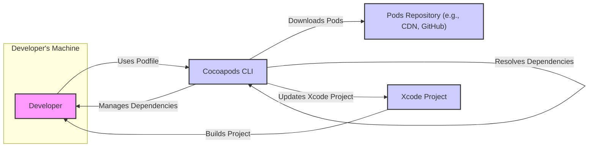
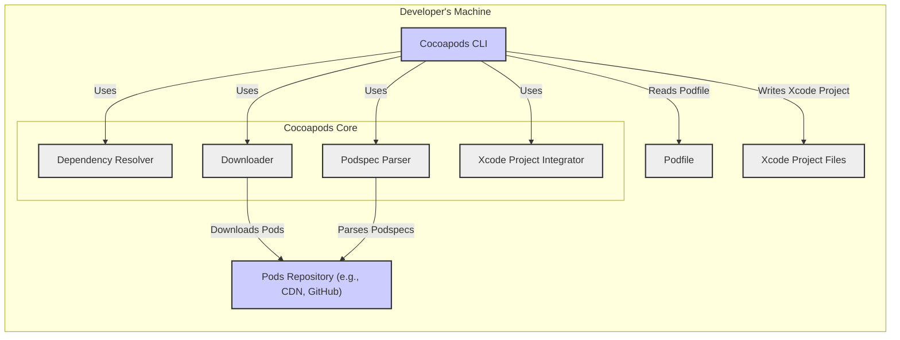
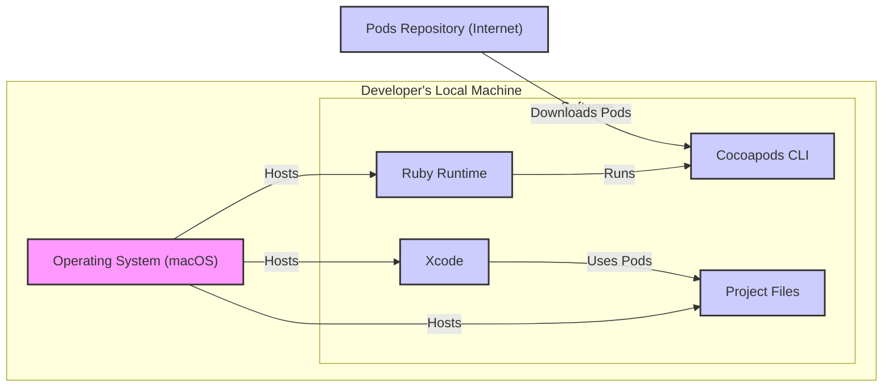
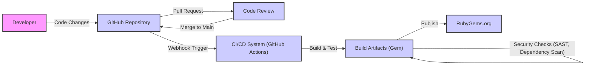

# BUSINESS POSTURE

Cocoapods is a dependency manager for Swift and Objective-C Cocoa projects. It simplifies the process of adding, removing, and updating libraries (Pods) in Xcode projects. The primary business goal of Cocoapods is to enhance developer productivity and streamline the management of project dependencies within the Apple development ecosystem.

Business Priorities and Goals:
- Simplify dependency management for iOS, macOS, watchOS, and tvOS projects.
- Provide a centralized repository of reusable libraries (Pods).
- Ensure compatibility and resolve dependency conflicts between libraries.
- Facilitate easy integration of third-party code into projects.
- Support a large and active community of developers and library maintainers.

Business Risks:
- Dependency resolution failures leading to build errors and project instability.
- Introduction of vulnerable dependencies into projects, posing security risks.
- Availability and reliability of the central Pods repository.
- Community governance and maintenance of the project.
- Compatibility issues with new versions of Xcode, Swift, and Objective-C.

# SECURITY POSTURE

Existing Security Controls:
- security control: Open Source Development Model - Publicly accessible codebase and community contributions allow for broad code review and identification of potential vulnerabilities. Implemented in: GitHub repository and community contribution process.
- security control: Code Review - Pull requests are reviewed by maintainers before merging, providing a level of security review. Implemented in: GitHub pull request workflow.
- security control: Version Control - Git history provides traceability and rollback capabilities in case of security issues. Implemented in: Git version control system.
- security control: HTTPS for Package Distribution - Pods are distributed over HTTPS, ensuring integrity and confidentiality during download. Implemented in: CDN and repository infrastructure.
- security control: Checksum Verification - Cocoapods uses checksums to verify the integrity of downloaded Pods. Implemented in: Cocoapods CLI and Podspec mechanism.

Accepted Risks:
- accepted risk: Reliance on third-party Pods - Security of projects depends on the security of external libraries, which are not directly controlled by the Cocoapods project.
- accepted risk: Vulnerabilities in dependencies -  Cocoapods itself might have vulnerabilities, and vulnerabilities in dependencies of Cocoapods can also pose risks.
- accepted risk: Community-driven security - Security relies on the vigilance of the open-source community to identify and report vulnerabilities.

Recommended Security Controls:
- security control: Dependency Scanning - Implement automated dependency scanning to identify known vulnerabilities in Cocoapods' own dependencies and potentially in Podspecs.
- security control: Static Application Security Testing (SAST) - Integrate SAST tools into the CI/CD pipeline to automatically scan the Cocoapods codebase for potential security flaws.
- security control: Security Audits - Conduct periodic security audits of the Cocoapods codebase and infrastructure by security experts.
- security control: Vulnerability Disclosure Program - Establish a clear vulnerability disclosure program to encourage responsible reporting of security issues.
- security control: Security Training for Maintainers - Provide security training to maintainers to improve their awareness of secure coding practices and common vulnerabilities.

Security Requirements:
- Authentication: Not directly applicable to Cocoapods as a dependency manager itself. Authentication is relevant for accessing private Pod repositories, which is an extension of Cocoapods functionality and should be handled by the repository provider.
- Authorization: Authorization is relevant in the context of private Pod repositories. Cocoapods should respect and enforce authorization mechanisms provided by private repository solutions.
- Input Validation: Cocoapods CLI and core libraries must perform robust input validation to prevent injection attacks and other input-related vulnerabilities. This includes validating Podspec files, command-line arguments, and network responses.
- Cryptography: Cocoapods uses cryptography for checksum verification and secure communication (HTTPS). Ensure that strong cryptographic algorithms and best practices are used. Secure storage of any secrets or keys used by Cocoapods infrastructure.

# DESIGN

## C4 CONTEXT

Context Diagram Elements:

- Element:
    - Name: Developer
    - Type: Person
    - Description: Software developer using Cocoapods to manage dependencies in their Xcode projects.
    - Responsibilities: Defines project dependencies in a Podfile, runs Cocoapods commands, builds and tests Xcode projects.
    - Security controls: security control: Local machine security practices, secure coding practices when using dependencies.

- Element:
    - Name: Cocoapods CLI
    - Type: Software System
    - Description: Command-line interface tool that developers use to interact with Cocoapods. It resolves dependencies, downloads Pods, and integrates them into Xcode projects.
    - Responsibilities: Reads Podfile, resolves dependencies, downloads Pods from repositories, updates Xcode project files, manages Podspec repositories.
    - Security controls: security control: Input validation, checksum verification of downloaded Pods, HTTPS for communication with Pods repositories.

- Element:
    - Name: Pods Repository (e.g., CDN, GitHub)
    - Type: External System
    - Description: Stores Podspec files and Pod source code (or binaries). Can be the central Cocoapods Specs repository, private repositories, or Git repositories.
    - Responsibilities: Hosting Podspec files and Pod source code, serving download requests for Pods.
    - Security controls: security control: HTTPS for serving files, access control for private repositories, infrastructure security of the repository provider.

- Element:
    - Name: Xcode Project
    - Type: Software System
    - Description: The iOS, macOS, watchOS, or tvOS project being developed by the developer. Cocoapods modifies the Xcode project to integrate dependencies.
    - Responsibilities: Contains the application code, uses dependencies managed by Cocoapods, builds and runs the application.
    - Security controls: security control: Project-specific security controls, secure coding practices within the project.

## C4 CONTAINER

Container Diagram Elements:

- Element:
    - Name: Cocoapods CLI
    - Type: Container - Command-line Application
    - Description: The main entry point for developers to interact with Cocoapods. Handles command parsing, user interaction, and orchestrates core components.
    - Responsibilities: Command parsing, user interface, invoking core functionalities, managing configuration.
    - Security controls: security control: Input validation of command-line arguments, secure handling of user credentials (if any, for private repositories).

- Element:
    - Name: Dependency Resolver
    - Type: Container - Library/Module
    - Description: Core logic for resolving dependencies based on Podfile specifications and Podspec dependencies.
    - Responsibilities: Parsing Podfile, resolving dependency graphs, handling version constraints, conflict resolution.
    - Security controls: security control: Logic to prevent dependency confusion attacks, robust error handling during resolution.

- Element:
    - Name: Downloader
    - Type: Container - Library/Module
    - Description: Responsible for downloading Pods from various sources (HTTP, Git, etc.).
    - Responsibilities: Fetching Podspec files, downloading Pod source code or pre-built binaries, checksum verification.
    - Security controls: security control: HTTPS for downloads, checksum verification, handling redirects securely, input validation of URLs and file paths.

- Element:
    - Name: Podspec Parser
    - Type: Container - Library/Module
    - Description: Parses Podspec files to extract metadata, dependencies, source locations, and other information about Pods.
    - Responsibilities: Reading and parsing Podspec files (Ruby files), validating Podspec syntax and semantics.
    - Security controls: security control: Secure parsing of Ruby files to prevent code injection or arbitrary code execution, input validation of Podspec content.

- Element:
    - Name: Xcode Project Integrator
    - Type: Container - Library/Module
    - Description: Modifies Xcode project files (pbxproj) to integrate Pods into the project build process.
    - Responsibilities: Modifying Xcode project settings, adding build phases, linking libraries, configuring search paths.
    - Security controls: security control: Secure modification of Xcode project files to prevent corruption or unintended changes, ensuring build settings are securely configured.

- Element:
    - Name: Podfile
    - Type: Configuration File
    - Description: File that defines project dependencies.
    - Responsibilities: Specifies Pods to be included in the project, version constraints, and other dependency configurations.
    - Security controls: security control: Developers are responsible for the security of their Podfile and ensuring they are not introducing malicious dependencies.

- Element:
    - Name: Xcode Project Files
    - Type: Data Store - Files
    - Description: Xcode project files (pbxproj, workspace, etc.) that are modified by Cocoapods.
    - Responsibilities: Storing project configuration, build settings, and references to Pods.
    - Security controls: security control: File system permissions to protect project files from unauthorized modification.

- Element:
    - Name: Pods Repository (e.g., CDN, GitHub)
    - Type: External System
    - Description: Stores Podspec files and Pod source code (or binaries).
    - Responsibilities: Hosting Podspec files and Pod source code, serving download requests for Pods.
    - Security controls: security control: HTTPS, access controls, infrastructure security.

## DEPLOYMENT

Cocoapods CLI is primarily deployed on developer's local machines. It's also used in CI/CD environments for automated builds.

Deployment Architecture: Developer's Local Machine

Deployment Diagram Elements (Developer's Local Machine):

- Element:
    - Name: Operating System (macOS)
    - Type: Infrastructure - Operating System
    - Description: macOS operating system on the developer's machine.
    - Responsibilities: Providing runtime environment for Ruby and Cocoapods, managing file system, network access.
    - Security controls: security control: OS-level security controls, user account management, firewall, anti-malware.

- Element:
    - Name: Ruby Runtime
    - Type: Software - Runtime Environment
    - Description: Ruby interpreter required to run Cocoapods, which is written in Ruby.
    - Responsibilities: Executing Cocoapods code, providing Ruby libraries and functionalities.
    - Security controls: security control: Keeping Ruby runtime updated with security patches, secure configuration of Ruby environment.

- Element:
    - Name: Cocoapods CLI
    - Type: Software - Application
    - Description: Cocoapods command-line tool installed on the developer's machine.
    - Responsibilities: Dependency management, interacting with Pods repositories, modifying Xcode projects.
    - Security controls: security control: Application-level security controls, input validation, secure communication.

- Element:
    - Name: Xcode
    - Type: Software - IDE
    - Description: Apple's Integrated Development Environment used for iOS, macOS, etc. development. Cocoapods integrates with Xcode projects.
    - Responsibilities: Building, running, and debugging applications, using dependencies managed by Cocoapods.
    - Security controls: security control: Xcode security features, code signing, secure build settings.

- Element:
    - Name: Project Files
    - Type: Data - Files
    - Description: Xcode project files and related source code files on the developer's machine.
    - Responsibilities: Storing project code, configuration, and dependencies.
    - Security controls: security control: File system permissions, backup and recovery.

- Element:
    - Name: Pods Repository (Internet)
    - Type: External System
    - Description: Remote repository hosting Podspec files and Pods.
    - Responsibilities: Providing access to Pods, serving download requests.
    - Security controls: security control: HTTPS, access controls, infrastructure security of the repository.

## BUILD

Cocoapods project build process focuses on building and publishing the Cocoapods CLI tool itself.

Build Process Diagram Elements:

- Element:
    - Name: Developer
    - Type: Person
    - Description: Cocoapods project contributors.
    - Responsibilities: Writing code, fixing bugs, adding features, submitting pull requests.
    - Security controls: security control: Secure coding practices, code review participation.

- Element:
    - Name: GitHub Repository
    - Type: Code Repository
    - Description: Git repository hosting the Cocoapods source code.
    - Responsibilities: Version control, code collaboration, pull request management.
    - Security controls: security control: Access control, branch protection, audit logs.

- Element:
    - Name: Code Review
    - Type: Process
    - Description: Manual code review process for pull requests.
    - Responsibilities: Reviewing code changes for correctness, security, and quality.
    - Security controls: security control: Peer review, security-focused code review guidelines.

- Element:
    - Name: CI/CD System (GitHub Actions)
    - Type: Automation System
    - Description: Automated build and deployment pipeline using GitHub Actions.
    - Responsibilities: Automated building, testing, security scanning, and publishing of Cocoapods.
    - Security controls: security control: Secure CI/CD configuration, secrets management, build environment security.

- Element:
    - Name: Build Artifacts (Gem)
    - Type: Software Artifact
    - Description: Ruby Gem package containing the Cocoapods CLI tool.
    - Responsibilities: Distributable package of Cocoapods.
    - Security controls: security control: Checksum verification of the Gem package, signing of the Gem package (if applicable).

- Element:
    - Name: Security Checks (SAST, Dependency Scan)
    - Type: Security Tooling
    - Description: Automated security scans performed during the build process.
    - Responsibilities: Identifying potential security vulnerabilities in the codebase and dependencies.
    - Security controls: security control: SAST tools, dependency scanning tools, vulnerability reporting.

- Element:
    - Name: RubyGems.org
    - Type: Package Registry
    - Description: Public registry for Ruby Gems, where Cocoapods Gem is published.
    - Responsibilities: Hosting and distributing the Cocoapods Gem package.
    - Security controls: security control: Registry security controls, malware scanning, account security.

# RISK ASSESSMENT

Critical Business Processes:
- Dependency Resolution: Correctly resolving dependencies is critical for developers to build their projects successfully. Failures can lead to project build failures and developer frustration.
- Pod Download and Integration: Ensuring that Pods are downloaded securely and integrated correctly into Xcode projects is crucial for project functionality and security.
- Podspec Management: The integrity and availability of Podspec files are essential for Cocoapods to function. Compromised or unavailable Podspecs can disrupt dependency management.

Data Sensitivity:
- Podspec files: Publicly available metadata about Pods. Low sensitivity.
- Pod source code: Sensitivity depends on the individual Pod. Cocoapods itself does not directly handle sensitive data in Pod source code.
- User project code: Cocoapods interacts with user project code, but does not store or transmit it. Sensitivity depends on the user's project.
- Cocoapods infrastructure data: Logs, build artifacts, etc. Medium sensitivity. Should be protected to maintain system integrity and availability.

# QUESTIONS & ASSUMPTIONS

Questions:
- What is the process for reporting and handling security vulnerabilities in Cocoapods?
- Are there any specific security audits or penetration testing performed on Cocoapods?
- What are the security considerations for private Pod repositories and how does Cocoapods integrate with them securely?
- What is the strategy for addressing vulnerabilities in third-party Pods?

Assumptions:
- BUSINESS POSTURE: Cocoapods prioritizes developer productivity and ease of use. Security is important but should not overly complicate the user experience.
- SECURITY POSTURE: Cocoapods follows common open-source security practices. The community plays a significant role in identifying and addressing security issues. HTTPS and checksum verification are considered baseline security controls.
- DESIGN: The design is focused on a command-line tool interacting with remote repositories and local Xcode projects. The core components are modular and responsible for specific tasks. Deployment is primarily on developer's local machines and CI/CD environments. Build process is automated using CI/CD and includes basic security checks.