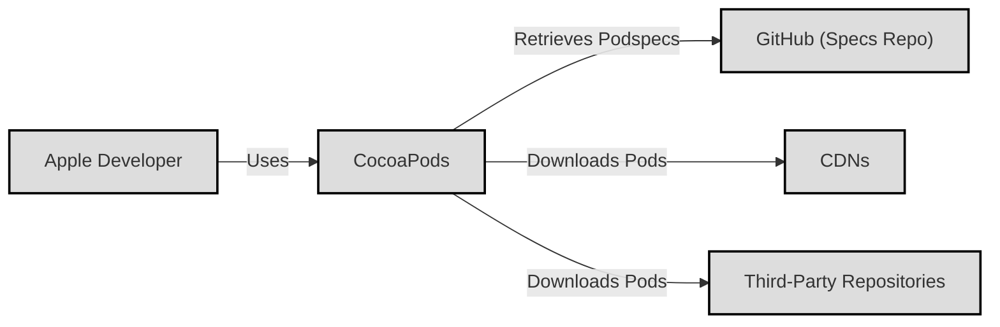
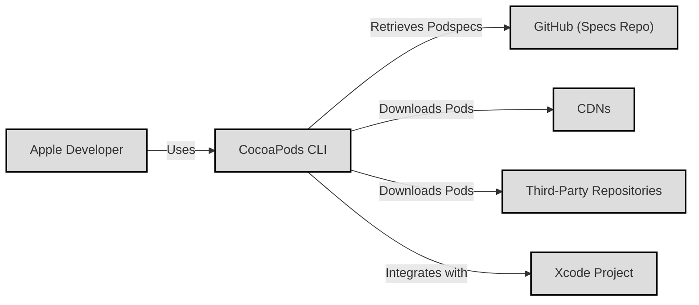
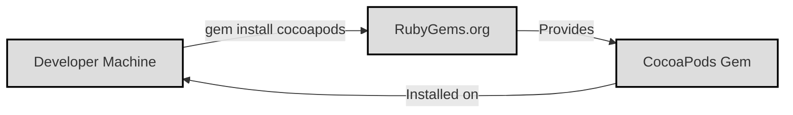
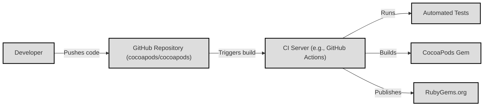

# BUSINESS POSTURE

CocoaPods is a critical dependency manager for the Apple developer ecosystem (iOS, macOS, etc.). Its primary business goal is to simplify and streamline the process of integrating third-party libraries (Pods) into Xcode projects. This improves developer productivity and reduces the overhead associated with managing external dependencies.

Business Priorities:

*   Reliability: Ensuring that the CocoaPods service is consistently available and that dependency resolution works correctly.  Developers rely on CocoaPods for their builds, so downtime or incorrect dependency resolution directly impacts their ability to work.
*   Maintainability: Keeping the CocoaPods codebase manageable and easy to update. This is crucial for adapting to changes in the Xcode build system and the evolving needs of the developer community.
*   Community Trust: Maintaining the trust of the Apple developer community. This involves ensuring the security and integrity of the Pods available through the service, as well as responding to community feedback and issues.
*   Performance: Providing fast and efficient dependency resolution and installation. Developers need to be able to quickly add, update, and manage their project's dependencies.

Business Risks:

*   Service Outages: Downtime of the CocoaPods service (specifically, the Specs repository and any CDN used) would prevent developers from building their projects, causing significant disruption.
*   Malicious Pods: A compromised or malicious Pod could introduce security vulnerabilities into applications, potentially leading to data breaches or other security incidents. This is a major risk to the entire ecosystem.
*   Dependency Conflicts: Incorrect or conflicting dependency specifications can lead to build failures or runtime errors, hindering developer productivity.
*   Supply Chain Attacks: Compromise of the CocoaPods infrastructure itself (e.g., the Specs repository, build servers, or distribution mechanisms) could allow attackers to inject malicious code into many projects simultaneously.
*   Lack of Adoption of Security Features: If developers don't adopt security best practices (like checksum verification or using trusted sources), the overall security benefits of CocoaPods are diminished.

# SECURITY POSTURE

Existing Security Controls:

*   security control: Code Signing: CocoaPods itself is likely code-signed, ensuring its authenticity and integrity. (Verification needed in the repository or build process).
*   security control: HTTPS: Communication with the CocoaPods Specs repository and CDN is expected to be over HTTPS, protecting against man-in-the-middle attacks. (Verification needed in client code and documentation).
*   security control: Community Vetting: The open-source nature of many Pods allows for community scrutiny, potentially identifying and reporting vulnerabilities. (This is an indirect control, relying on community participation).
*   security control: Gemfile.lock: CocoaPods generates a Podfile.lock file, which pins specific versions of dependencies, helping to ensure consistent builds and prevent unexpected changes. (Described in CocoaPods documentation).
*   security control: SHA256 Checksums: CocoaPods uses SHA256 checksums for Pod downloads to verify the integrity of downloaded files. (Described in CocoaPods documentation and client code).

Accepted Risks:

*   accepted risk: Reliance on Third-Party Pod Authors: CocoaPods inherently relies on the security practices of individual Pod authors. A vulnerability in a popular Pod can have widespread impact.
*   accepted risk: Centralized Repository: The centralized nature of the Specs repository creates a single point of failure and a potential target for attackers.
*   accepted risk: Limited Sandboxing: While Pods are integrated into Xcode projects, there's limited sandboxing or isolation between the Pod's code and the main application's code.

Recommended Security Controls:

*   security control: Two-Factor Authentication (2FA): Enforce 2FA for maintainers of the CocoaPods Specs repository and any associated infrastructure.
*   security control: Content Security Policy (CSP): If a web interface is involved, implement a strict CSP to mitigate XSS vulnerabilities.
*   security control: Regular Security Audits: Conduct regular security audits of the CocoaPods codebase and infrastructure.
*   security control: Vulnerability Disclosure Program: Establish a clear vulnerability disclosure program to encourage responsible reporting of security issues.
*   security control: Software Bill of Materials (SBOM): Generate and maintain an SBOM for CocoaPods itself, to improve transparency and aid in vulnerability management.
*   security control: Supply Chain Levels for Software Artifacts (SLSA): Implement SLSA framework to secure build and distribution pipeline.

Security Requirements:

*   Authentication:
    *   CocoaPods CLI does not require authentication for public pod retrieval.
    *   Authentication is required for publishing pods (using `pod trunk push`). This should use API keys or other secure credentials, and 2FA should be strongly encouraged.
*   Authorization:
    *   Access control should be enforced for publishing and managing Pods. Only authorized maintainers should be able to modify the Specs repository.
*   Input Validation:
    *   The CocoaPods CLI should validate user inputs, such as Pod names, versions, and repository URLs, to prevent injection attacks or other malicious input.
    *   The `podspec` file format should be strictly validated to prevent malicious code or configurations from being included in Pods.
*   Cryptography:
    *   HTTPS should be used for all network communication.
    *   SHA256 checksums (or stronger) should be used to verify the integrity of downloaded files.
    *   Cryptographic signatures for Pods (optional, but recommended) could provide an additional layer of security.

# DESIGN

## C4 CONTEXT

Element Descriptions:

*   Element:
    *   Name: Apple Developer
    *   Type: Person
    *   Description: A developer creating applications for Apple platforms (iOS, macOS, etc.).
    *   Responsibilities: Uses CocoaPods to manage dependencies in their Xcode projects.
    *   Security controls: Uses secure coding practices, keeps their development environment secure.

*   Element:
    *   Name: CocoaPods
    *   Type: Software System
    *   Description: The CocoaPods dependency manager.
    *   Responsibilities: Resolves dependencies, downloads Pods, integrates Pods into Xcode projects.
    *   Security controls: HTTPS, SHA256 checksums, Podfile.lock.

*   Element:
    *   Name: GitHub (Specs Repo)
    *   Type: Software System
    *   Description: The central repository containing Podspec files, which describe the metadata for each Pod.
    *   Responsibilities: Stores Podspecs, provides an API for CocoaPods to retrieve Podspecs.
    *   Security controls: GitHub's security features (e.g., 2FA, access controls), HTTPS.

*   Element:
    *   Name: CDNs
    *   Type: Software System
    *   Description: Content Delivery Networks used to distribute Pod files.
    *   Responsibilities: Caches and delivers Pod files to developers quickly and reliably.
    *   Security controls: HTTPS, CDN provider's security features.

*   Element:
    *   Name: Third-Party Repositories
    *   Type: Software System
    *   Description: Git repositories or other sources where the actual source code of some Pods might reside.
    *   Responsibilities: Hosts the source code for Pods.
    *   Security controls: Vary depending on the repository; ideally, HTTPS and access controls.

## C4 CONTAINER

Element Descriptions:

*   Element:
    *   Name: Apple Developer
    *   Type: Person
    *   Description: A developer creating applications for Apple platforms.
    *   Responsibilities: Uses CocoaPods to manage dependencies in their Xcode projects.
    *   Security controls: Uses secure coding practices, keeps their development environment secure.

*   Element:
    *   Name: CocoaPods CLI
    *   Type: Application
    *   Description: The command-line tool that developers use to interact with CocoaPods.
    *   Responsibilities: Parses Podfiles, resolves dependencies, downloads Pods, integrates Pods into Xcode projects.
    *   Security controls: HTTPS, SHA256 checksums, Podfile.lock, input validation.

*   Element:
    *   Name: GitHub (Specs Repo)
    *   Type: Software System
    *   Description: The central repository containing Podspec files.
    *   Responsibilities: Stores Podspecs, provides an API for CocoaPods to retrieve Podspecs.
    *   Security controls: GitHub's security features, HTTPS.

*   Element:
    *   Name: CDNs
    *   Type: Software System
    *   Description: Content Delivery Networks used to distribute Pod files.
    *   Responsibilities: Caches and delivers Pod files quickly and reliably.
    *   Security controls: HTTPS, CDN provider's security features.

*   Element:
    *   Name: Third-Party Repositories
    *   Type: Software System
    *   Description: Git repositories or other sources where Pod source code might reside.
    *   Responsibilities: Hosts the source code for Pods.
    *   Security controls: Vary; ideally, HTTPS and access controls.

*   Element:
    *   Name: Xcode Project
    *   Type: Software System
    *   Description: The developer's Xcode project, which includes the integrated Pods.
    *   Responsibilities: Builds and runs the application.
    *   Security controls: Xcode's security features, developer's secure coding practices.

## DEPLOYMENT

Possible Deployment Solutions:

1.  RubyGems: CocoaPods is distributed as a Ruby gem.  This is the primary deployment method.
2.  Homebrew: CocoaPods can also be installed via Homebrew, a package manager for macOS.
3.  Bundler:  Developers might use Bundler to manage the CocoaPods gem within their project.

Chosen Deployment Solution (RubyGems):

Element Descriptions:

*   Element:
    *   Name: Developer Machine
    *   Type: Infrastructure
    *   Description: The developer's computer where CocoaPods is installed.
    *   Responsibilities: Runs the CocoaPods CLI.
    *   Security controls: Operating system security, user account security.

*   Element:
    *   Name: RubyGems.org
    *   Type: Software System
    *   Description: The central repository for Ruby gems.
    *   Responsibilities: Hosts the CocoaPods gem and its metadata.
    *   Security controls: RubyGems.org's security features (HTTPS, etc.).

*   Element:
    *   Name: CocoaPods Gem
    *   Type: Artifact
    *   Description: The packaged CocoaPods software.
    *   Responsibilities: Provides the CocoaPods functionality.
    *   Security controls: Code signing (if implemented), SHA256 checksums.

## BUILD

Build Process Description:

1.  Developers contribute code to the CocoaPods GitHub repository (cocoapods/cocoapods).
2.  Pull requests trigger automated builds and tests on a CI server (likely GitHub Actions, based on the repository).
3.  The CI server runs automated tests, including unit tests, integration tests, and linters.
4.  If the tests pass, the CI server builds the CocoaPods gem.
5.  The CI server publishes the new gem to RubyGems.org.

Security Controls:

*   security control: CI/CD Pipeline: Automated builds and tests ensure that code changes are thoroughly tested before being released.
*   security control: Automated Tests: Unit tests, integration tests, and linters help to identify bugs and security vulnerabilities early in the development process.
*   security control: Dependency Management: The `Gemfile` and `Gemfile.lock` files manage the dependencies of CocoaPods itself, ensuring consistent builds.
*   security control: Code Review: Pull requests are likely reviewed by other developers before being merged, providing an additional layer of security.
*   security control: Static Analysis: The CI pipeline could include static analysis tools (e.g., RuboCop) to identify potential security issues in the code.
*   security control: Supply Chain Security: Tools like `bundler-audit` can be used to check for known vulnerabilities in the dependencies of CocoaPods.

# RISK ASSESSMENT

Critical Business Processes:

*   Dependency Resolution: The core process of resolving and installing dependencies for Xcode projects.
*   Pod Publishing: The process of publishing new Pods and updates to the Specs repository.
*   Pod Retrieval: The process of developers retrieving Podspecs and downloading Pods.

Data and Sensitivity:

*   Podspecs (Low Sensitivity): Podspec files contain metadata about Pods, including their name, version, source code location, and dependencies. While publicly available, integrity is important.
*   Pod Source Code (Variable Sensitivity): The source code of Pods varies in sensitivity. Some Pods may contain proprietary code or sensitive algorithms.
*   Developer Credentials (High Sensitivity): Credentials used to publish Pods (e.g., API keys) are highly sensitive and must be protected.
*   Usage Data (Low-Medium Sensitivity): CocoaPods may collect anonymized usage data to improve the service. The sensitivity depends on the specific data collected.

# QUESTIONS & ASSUMPTIONS

Questions:

*   What specific CDNs are used for distributing Pods?
*   What are the exact security controls implemented on the RubyGems.org account used for publishing CocoaPods?
*   Are there any internal security audits or penetration tests conducted on CocoaPods?
*   Is there a formal vulnerability disclosure program for CocoaPods?
*   What are the specific metrics collected for usage data?
*   What is the process for handling compromised Pods or security vulnerabilities?
*   Are there any plans to implement code signing for Pods themselves (not just the CocoaPods gem)?

Assumptions:

*   BUSINESS POSTURE: The CocoaPods project prioritizes the stability and security of the service, recognizing its critical role in the Apple developer ecosystem.
*   SECURITY POSTURE: The CocoaPods maintainers follow security best practices, but there's always room for improvement.
*   DESIGN: The design is relatively straightforward, with a centralized Specs repository and reliance on CDNs for distribution. The primary attack vectors are the Specs repository, the build process, and individual Pods.