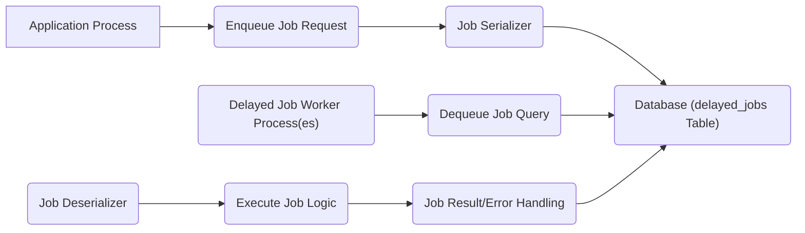

# Project Design Document: Delayed Job

**Version:** 1.1
**Date:** October 26, 2023
**Author:** Gemini (AI Language Model)

## 1. Introduction

This document provides an enhanced design overview of the Delayed Job project, a widely used Ruby library for asynchronous task processing. Building upon the previous version, this iteration aims for greater clarity, detail, and a stronger focus on security considerations to facilitate comprehensive threat modeling. This document serves as a crucial resource for developers, security analysts, and operations teams.

## 2. Goals and Objectives

*   Provide a detailed and unambiguous understanding of the Delayed Job architecture and its internal workings.
*   Clearly identify all key components, their responsibilities, and their interactions.
*   Thoroughly describe the data flow within the system, emphasizing data transformations and potential vulnerabilities.
*   Explicitly highlight potential security concerns and attack vectors to guide effective threat modeling.
*   Serve as a definitive reference point for understanding the system's design and security posture.

## 3. System Architecture

Delayed Job employs a decoupled architecture where task execution is deferred and managed independently from the main application flow. This asynchronous approach enhances application responsiveness and resilience.

### 3.1. High-Level Architecture Diagram

### 3.2. Component Description

*   **Application Process:** The primary application instance (e.g., a Rails application) that initiates the creation and enqueueing of background jobs.
*   **Enqueue Job Request:** The action within the application that triggers the creation of a new job. This involves specifying the job's target (class/method) and arguments.
*   **Job Serializer:** The component responsible for converting the job's class, method, and arguments into a serialized format suitable for storage in the database. The default is often Ruby's `Marshal`.
*   **Database (delayed\_jobs Table):** The persistent storage mechanism, typically a relational database, containing the `delayed_jobs` table. This table holds the serialized job data and metadata.
*   **Delayed Job Worker Process(es):** One or more independent processes dedicated to fetching and executing jobs from the `delayed_jobs` table. These workers operate in the background.
*   **Dequeue Job Query:** The database query executed by a worker process to retrieve the next available job for processing, based on priority and availability.
*   **Job Deserializer:** The component within the worker process that reverses the serialization process, reconstructing the job object and its arguments from the data retrieved from the database.
*   **Execute Job Logic:** The execution of the actual code defined within the job class, using the deserialized arguments.
*   **Job Result/Error Handling:** The process of managing the outcome of job execution. Upon success, the job status is updated or the record is deleted. Upon failure, error details are recorded, and retry mechanisms may be invoked.

## 4. Data Flow

The journey of a Delayed Job from creation to completion involves the following detailed data flow:

1. **Job Instantiation:** The application code creates an instance representing the background task to be performed, specifying the target method and its parameters.
    *   Data involved: Job class name, target method name, method arguments (Ruby objects).
2. **Job Serialization:** The `Job Serializer` converts the job object (including its class and arguments) into a serialized string. By default, Ruby's `Marshal` is used.
    *   Data involved: Transformation of Ruby objects into a byte stream.
3. **Job Persistence:** The serialized job data, along with metadata (priority, attempts, etc.), is inserted as a new record into the `delayed_jobs` table in the database.
    *   Data involved: Serialized job data (stored in the `handler` column), priority (integer), `run_at` (timestamp), `attempts` (integer), `last_error` (text), `queue` (string).
4. **Worker Query for Jobs:** A `Delayed Job Worker Process` periodically queries the `delayed_jobs` table for available jobs. The query typically filters for jobs that are not locked, have a `run_at` time in the past, and orders them by priority.
    *   Data involved: SQL query parameters specifying conditions on `locked_at`, `run_at`, and ordering by `priority`.
5. **Job Dequeue and Locking:** Once a suitable job is found, the worker updates the job record, setting the `locked_at` timestamp and `locked_by` identifier (typically the worker's hostname or PID) to prevent other workers from processing it concurrently.
    *   Data involved: Job ID, worker identifier, current timestamp.
6. **Job Deserialization:** The `Job Deserializer` within the worker process retrieves the serialized job data from the `handler` column and reconstructs the original job object and its arguments.
    *   Data involved: Retrieval of the serialized string from the database, conversion back into Ruby objects.
7. **Job Execution:** The worker executes the specified method on the deserialized job object, passing the deserialized arguments.
    *   Data involved: Data processed by the job's logic, potentially involving interactions with other services or data stores.
8. **Job Completion (Success):** If the job executes successfully, the worker updates the job record, typically setting `failed_at` to `NULL`, clearing `locked_by` and `locked_at`, and potentially deleting the record.
    *   Data involved: Job ID, `NULL` values for `failed_at`, `locked_by`, `locked_at`.
9. **Job Failure:** If an error occurs during job execution, the worker updates the job record, incrementing the `attempts` counter, recording the error message and backtrace in the `last_error` column, and potentially setting a new `run_at` time for a retry attempt.
    *   Data involved: Job ID, incremented `attempts` value, error message and backtrace (text), future timestamp for `run_at`.

## 5. Key Components and Interactions

*   **Job Classes:** User-defined Ruby classes that encapsulate the logic to be executed asynchronously. These classes must be serializable.
*   **`Delayed::Job` ActiveRecord Model:** The core model representing a job in the database. It manages the job's state, metadata, and persistence.
*   **Worker Processes:** Independent Ruby processes responsible for polling the database, retrieving jobs, and executing them. Multiple workers can run concurrently.
*   **Serialization Mechanism:** The strategy used to convert Ruby objects into a storable format and back. The default `Marshal` has significant security implications.
*   **Database Connection:** The connection between the application and worker processes and the database where job data is stored. Secure database credentials and connection methods are crucial.
*   **Configuration Options:** Settings that govern the behavior of Delayed Job, such as queue names, priority levels, retry strategies, and worker concurrency. These configurations can impact security and performance.

## 6. Security Considerations (For Threat Modeling)

This section details potential security vulnerabilities and attack vectors within the Delayed Job architecture.

*   **Unsafe Deserialization (Critical):** The default use of `Marshal` for serialization poses a significant risk. Deserializing untrusted data can lead to arbitrary code execution on the worker process.
    *   Potential Attack Vectors:
        *   Maliciously crafted serialized job data injected into the database (e.g., through compromised application code or direct database manipulation).
        *   Exploiting vulnerabilities in the `Marshal` implementation itself.
    *   Mitigation Strategies:
        *   Avoid using `Marshal` for untrusted data.
        *   Utilize safer serialization formats like `JSON` or `MessagePack`.
        *   Implement input validation and sanitization on job arguments before serialization.
*   **SQL Injection Vulnerabilities:** If job data or configuration parameters are not properly sanitized before being used in database queries, it can lead to SQL injection.
    *   Potential Attack Vectors:
        *   Crafted job arguments containing malicious SQL code.
        *   Exploiting vulnerabilities in custom job implementations that directly interact with the database without proper sanitization.
    *   Mitigation Strategies:
        *   Always use parameterized queries or prepared statements when interacting with the database.
        *   Implement strict input validation on all job arguments.
*   **Unauthorized Job Enqueueing (Access Control):** Lack of proper authorization controls can allow unauthorized users or processes to enqueue arbitrary jobs, potentially leading to resource exhaustion or malicious code execution.
    *   Potential Attack Vectors:
        *   Exploiting vulnerabilities in the application's job enqueueing endpoints or logic.
        *   Gaining unauthorized access to the application's internal systems.
    *   Mitigation Strategies:
        *   Implement robust authentication and authorization mechanisms for job enqueueing.
        *   Restrict access to job creation functionalities based on user roles and permissions.
*   **Denial of Service (DoS):** An attacker could flood the system with a large number of resource-intensive or malicious jobs, overwhelming the worker processes and the database.
    *   Potential Attack Vectors:
        *   Automated scripts generating numerous job creation requests.
        *   Exploiting vulnerabilities that allow for the creation of jobs with excessively long execution times or high resource consumption.
    *   Mitigation Strategies:
        *   Implement rate limiting on job creation endpoints.
        *   Set limits on the number of concurrent workers.
        *   Implement job prioritization and queue management to handle high loads effectively.
*   **Information Disclosure:** Error messages and backtraces stored in the `last_error` column might contain sensitive information about the application's internal workings or data.
    *   Potential Attack Vectors:
        *   Gaining unauthorized access to the `delayed_jobs` table.
        *   Exploiting vulnerabilities that expose error logs or database contents.
    *   Mitigation Strategies:
        *   Restrict access to the `delayed_jobs` table to authorized personnel and processes.
        *   Implement secure logging practices and avoid logging sensitive information in error messages.
*   **Job Data Tampering:** If the database is compromised, attackers could modify existing job data, potentially altering the behavior of the application or gaining unauthorized access.
    *   Potential Attack Vectors:
        *   SQL injection vulnerabilities allowing modification of job records.
        *   Direct access to the database with compromised credentials.
    *   Mitigation Strategies:
        *   Secure database credentials and access controls.
        *   Implement database auditing to track modifications to job records.
*   **Dependency Vulnerabilities:** Outdated versions of the `delayed_job` gem or its dependencies might contain known security vulnerabilities.
    *   Potential Attack Vectors:
        *   Exploiting known vulnerabilities in the gem or its dependencies.
    *   Mitigation Strategies:
        *   Regularly update the `delayed_job` gem and its dependencies to the latest secure versions.
        *   Use dependency scanning tools to identify and address potential vulnerabilities.
*   **Insecure Worker Environment:** If the environment where worker processes run is not properly secured, it could be vulnerable to attacks.
    *   Potential Attack Vectors:
        *   Compromising the worker server or container.
        *   Exploiting vulnerabilities in the worker's operating system or installed software.
    *   Mitigation Strategies:
        *   Harden the worker environment by applying security best practices.
        *   Regularly patch the operating system and software on worker machines.
        *   Isolate worker processes using containers or virtual machines.

## 7. Deployment Considerations

Secure deployment of Delayed Job involves several key aspects:

*   **Secure Database Configuration:** Ensure the database used by Delayed Job is properly secured with strong passwords, restricted access, and appropriate firewall rules.
*   **Worker Isolation:** Run worker processes in isolated environments (e.g., containers, separate virtual machines) to limit the impact of potential compromises.
*   **Secure Communication:** If communication between the application and worker processes involves network traffic (e.g., for monitoring), ensure it is encrypted using TLS/SSL.
*   **Resource Limits:** Configure resource limits (CPU, memory) for worker processes to prevent resource exhaustion attacks.
*   **Monitoring and Alerting:** Implement comprehensive monitoring of worker processes and job queues to detect anomalies and potential security incidents. Set up alerts for suspicious activity.
*   **Secrets Management:** Securely manage database credentials and any other secrets required by the application and worker processes, avoiding hardcoding them in configuration files.

## 8. Future Considerations

*   **Migration to More Secure Serialization:**  Actively plan and implement a migration away from `Marshal` to a safer serialization format like `JSON` or `MessagePack`.
*   **Enhanced Job Security Features:** Explore potential enhancements to the Delayed Job library itself to incorporate built-in security features, such as signature verification for job data.
*   **Integration with Security Scanning Tools:** Integrate Delayed Job workflows with security scanning tools to automatically identify potential vulnerabilities in job implementations.
*   **Fine-grained Access Control for Queues:** Implement more granular access control mechanisms for different job queues, allowing for better segregation of duties and security policies.

This enhanced design document provides a more detailed and security-focused overview of the Delayed Job project. By thoroughly understanding the architecture, data flow, and potential vulnerabilities, development, security, and operations teams can collaborate effectively to build and maintain a secure and reliable asynchronous task processing system.
