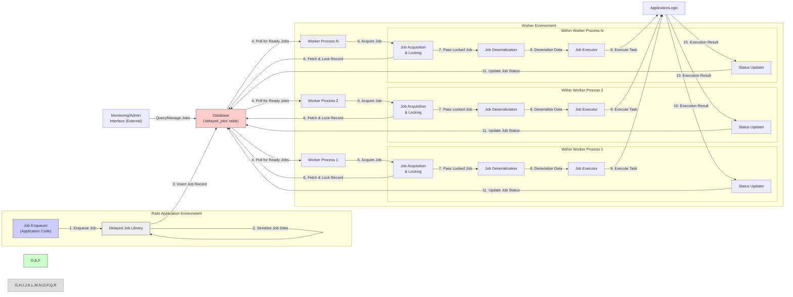
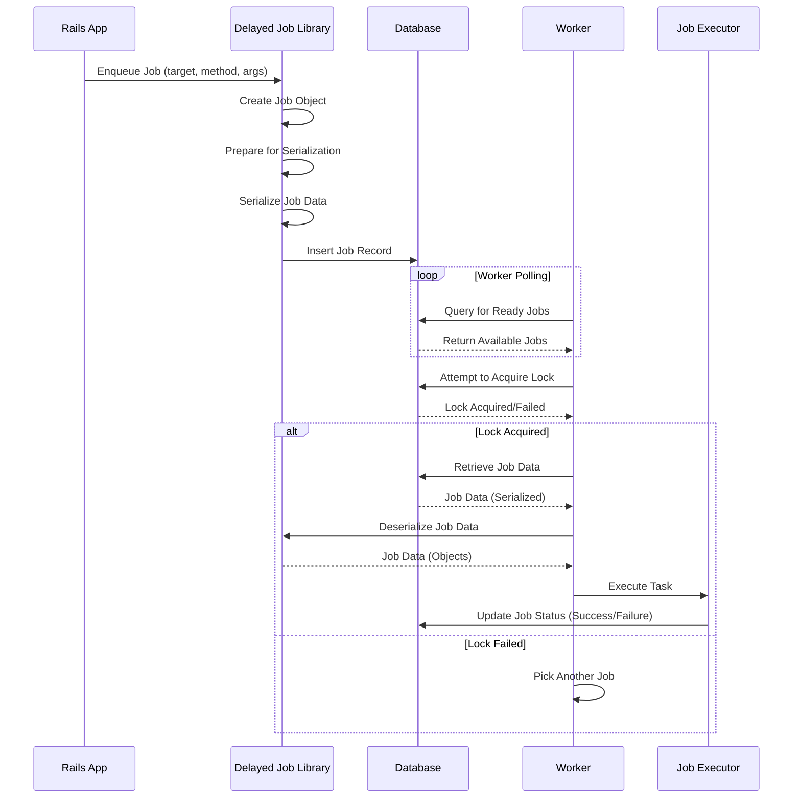

# Project Design Document: Delayed Job

**Version:** 1.1
**Date:** October 26, 2023
**Author:** AI Software Architect

## 1. Introduction

This document provides an enhanced and more detailed design overview of the Delayed Job project, a robust database-backed asynchronous priority queue system tailored for Ruby on Rails applications. Building upon the previous version, this iteration further clarifies the system's architecture, component interactions, and data flow, providing a stronger foundation for subsequent threat modeling activities. We aim to offer a granular understanding of the system's inner workings to facilitate a comprehensive security analysis.

## 2. Goals and Objectives

The fundamental goals of Delayed Job are:

*   To facilitate the non-blocking execution of time-consuming or resource-intensive tasks, thereby improving the responsiveness of the main web application.
*   To ensure the reliable processing of background jobs, even in scenarios involving application crashes, restarts, or temporary infrastructure outages. Persistence in the database is key to this reliability.
*   To offer a straightforward and efficient mechanism for managing, monitoring, and troubleshooting background job execution.
*   To enable the prioritization of jobs, guaranteeing that critical tasks are processed before less urgent ones, optimizing resource utilization and meeting service level agreements.

## 3. System Architecture

Delayed Job's architecture is characterized by a set of tightly integrated components operating within the context of a Ruby on Rails application. The primary components are:

*   **Job Enqueuer (within Application Code):** This is the point of initiation for background tasks. Developers use the Delayed Job API within their application code to create and enqueue jobs. This involves specifying the target object, the method to be executed, and any necessary arguments.
*   **Job Serialization Mechanism:** Before a job is persisted, Delayed Job serializes the job's metadata and arguments. This process typically uses YAML or JSON to convert Ruby objects into a string representation suitable for database storage. The choice of serializer can be configured.
*   **Database (Central Job Queue):** A relational database (commonly PostgreSQL, MySQL, or SQLite) acts as the central and persistent repository for the job queue. The `delayed_jobs` table is the core of this component, storing details of each job's state (pending, running, failed, completed), priority, number of attempts, error details, and the serialized job payload.
*   **Worker Process(es):** These are independent Ruby processes responsible for fetching and executing jobs from the queue. Multiple worker processes can run concurrently to increase throughput. These processes are typically managed by system-level tools or container orchestration platforms.
*   **Job Acquisition and Locking:** Workers poll the database for available jobs that are ready for execution. Upon finding a suitable job, a worker attempts to acquire an exclusive lock on that job record in the database. This locking mechanism is crucial to prevent multiple workers from processing the same job simultaneously, ensuring data integrity and preventing race conditions.
*   **Job Deserialization:** Once a worker has acquired a lock on a job, it deserializes the job's payload from the database record, reconstructing the original Ruby objects and method call information.
*   **Job Executor:** This is the component within the worker process that executes the actual background task. It invokes the specified method on the target object with the provided arguments.
*   **Status Updater:** After a job has been executed (either successfully or with failure), the worker updates the job's status in the `delayed_jobs` table. This includes marking the job as completed, recording any errors, incrementing the attempt count, and potentially setting a new `run_at` time for retry attempts.
*   **Monitor/Admin Interface (External or Custom):** While Delayed Job doesn't offer a built-in administrative UI, applications often integrate with external monitoring solutions (like Prometheus or Datadog) or develop custom interfaces to provide visibility into the job queue, track job progress, analyze failures, and potentially trigger manual interventions.

## 4. Data Flow

The lifecycle of a Delayed Job can be broken down into the following detailed steps:

1. **Job Invocation:** The application code initiates the process by calling the `delay` method (or similar) on an object or class, specifying the method to be executed in the background and its arguments.
2. **Job Object Creation:** The Delayed Job library creates an internal representation of the job, encapsulating the target object, method name, and arguments.
3. **Serialization Preparation:** The library prepares the job's arguments and target object for serialization. This might involve converting complex objects into simpler representations or ensuring they are serializable by the chosen serialization method (YAML or JSON).
4. **Data Serialization:** The core job data (target, method, arguments) is serialized into a string format. This serialized string will be stored in the database.
5. **Database Record Creation:** A new record is inserted into the `delayed_jobs` table. This record includes the serialized job data, the job's priority, the number of allowed attempts, the initial `run_at` time (when the job should be executed), and other metadata.
6. **Worker Query for Available Jobs:** Worker processes periodically query the `delayed_jobs` table for jobs that are ready to be processed. This query typically filters based on the `run_at` time and jobs that are not currently locked by other workers.
7. **Job Selection and Locking:** A worker selects a suitable job from the database and attempts to acquire an exclusive lock on its corresponding record. This lock is usually implemented using database-level mechanisms (e.g., `FOR UPDATE` in PostgreSQL).
8. **Data Retrieval:** Once the lock is acquired, the worker retrieves the full job data from the database record, including the serialized payload.
9. **Data Deserialization:** The worker deserializes the job data, reconstructing the original Ruby objects and method call information. This step is crucial and a potential point of vulnerability if not handled carefully.
10. **Task Execution:** The worker executes the specified method on the target object using the deserialized arguments. This is where the actual background task logic is performed.
11. **Execution Outcome Handling:**
    *   **Success:** If the job executes successfully, the worker updates the `failed_at` timestamp to NULL (or leaves it as NULL), potentially updates other fields, and may optionally delete the job record from the table.
    *   **Failure:** If the job execution raises an error, the worker records the error message and backtrace in the `last_error` field, increments the `attempts` counter, and potentially updates the `run_at` time to schedule a retry attempt in the future (using a backoff strategy).
12. **Database Update:** The worker updates the job's record in the `delayed_jobs` table with the execution status, error details, and updated attempt count or `run_at` time.
13. **Lock Release:** The worker releases the exclusive lock on the job record, making it available for other actions (though typically it's completed or retrying at this point).

## 5. Infrastructure

The infrastructure supporting Delayed Job deployments typically includes:

*   **Application Servers:** These servers host the Ruby on Rails application where jobs are initially enqueued. They require connectivity to the database server.
*   **Database Server:** This server hosts the relational database that serves as the persistent job queue. Its performance and reliability are critical for Delayed Job's operation.
*   **Worker Hosts (Servers, VMs, Containers):** These are the environments where the independent worker processes run. They need network access to the database server. The number of worker processes can be scaled based on the volume of background jobs.
*   **Process Management Tools:** Tools like `systemd`, `foreman`, `pm2`, Docker Compose, or Kubernetes are used to manage the lifecycle of the worker processes, ensuring they are running and restarted if they fail.
*   **Networking Infrastructure:** Reliable network connectivity between the application servers, database server, and worker hosts is essential for communication.
*   **Monitoring and Logging Systems:** While not strictly part of Delayed Job, external systems for monitoring job queue size, worker health, and job execution errors are crucial for operational visibility.
*   **Load Balancers (Optional):** In larger deployments, load balancers might distribute traffic to multiple application servers, each potentially enqueuing jobs.

## 6. Security Considerations

Security considerations for Delayed Job deployments are multifaceted and require careful attention:

*   **Data at Rest Security:**
    *   **Sensitive Job Data:**  The serialized job data in the `delayed_jobs` table might contain sensitive information. Database-level encryption (Transparent Data Encryption) or column-level encryption for the `handler` column should be considered.
    *   **Database Access Control:** Restrict access to the database to only authorized application and worker processes using strong authentication and authorization mechanisms.
*   **Data in Transit Security:**
    *   **Database Connections:** Ensure all connections between application servers, worker processes, and the database server are encrypted using TLS/SSL to protect data in transit.
*   **Job Deserialization Vulnerabilities:**
    *   **Object Deserialization Risks:**  Be extremely cautious about the data being deserialized. Untrusted data can lead to remote code execution vulnerabilities if the deserialization process is exploited. Regularly review and update the serialization library and consider using safer serialization formats if possible.
    *   **Input Validation:** While the primary data is serialized, any metadata or configuration related to job processing should be validated to prevent injection attacks.
*   **Worker Security:**
    *   **Process Isolation:** Run worker processes with the least privileges necessary. Consider using containerization to isolate worker environments.
    *   **Dependency Management:** Keep the Delayed Job gem and its dependencies up-to-date to patch known security vulnerabilities. Regularly scan dependencies for vulnerabilities.
*   **Job Content Security:**
    *   **Secure Task Implementation:** The code executed within the background jobs should be developed with security best practices in mind to prevent vulnerabilities within the tasks themselves.
*   **Denial of Service (DoS) Prevention:**
    *   **Rate Limiting:** Implement mechanisms to prevent malicious actors from flooding the job queue with a large number of jobs, potentially overwhelming the system.
    *   **Queue Monitoring and Alerts:** Monitor the job queue size and worker performance to detect and respond to potential DoS attacks.
*   **Access Control to Job Management:**
    *   **Administrative Interface Security:** If a custom or external administrative interface is used, ensure it has robust authentication and authorization mechanisms to prevent unauthorized manipulation of the job queue.

## 7. Assumptions and Constraints

The design of Delayed Job operates under the following assumptions and constraints:

*   **Relational Database Dependency:** Delayed Job relies on a relational database with transaction support for reliable job persistence and locking.
*   **Ruby on Rails Integration:** The primary use case is within a Ruby on Rails application, leveraging its conventions and ecosystem.
*   **Reliable Database Connectivity:**  A stable and reliable network connection to the database server is a fundamental requirement.
*   **Worker Process Management Responsibility:** The deployment environment is responsible for managing the lifecycle and scaling of worker processes. Delayed Job itself does not provide built-in worker management.
*   **Default Serialization:** The default serialization mechanism (typically YAML) is used unless explicitly configured otherwise. This has implications for security as discussed above.

## 8. Future Considerations

Potential future enhancements and considerations for Delayed Job include:

*   **Enhanced Monitoring and Observability:** Deeper integration with monitoring tools, providing more granular metrics on job processing time, failure rates, and resource utilization.
*   **Integration with External Message Queues:**  Offering pluggable backends to support alternative message brokers like Redis or RabbitMQ, providing more flexibility in deployment architectures.
*   **Improved Error Handling and Retry Strategies:** More sophisticated and configurable retry mechanisms, including exponential backoff with jitter and dead-letter queues for failed jobs.
*   **Built-in Web UI:**  Developing an optional built-in web interface for basic job management and monitoring, reducing the need for custom implementations.
*   **Support for Job Scheduling without Database Polling:** Exploring alternative approaches for triggering job execution, potentially using database triggers or external scheduling services to reduce database load from constant polling.

This enhanced design document provides a more granular and detailed understanding of the Delayed Job project, specifically focusing on aspects relevant to threat modeling. The expanded descriptions of components, data flow, and security considerations aim to facilitate a more comprehensive and effective security analysis of the system.