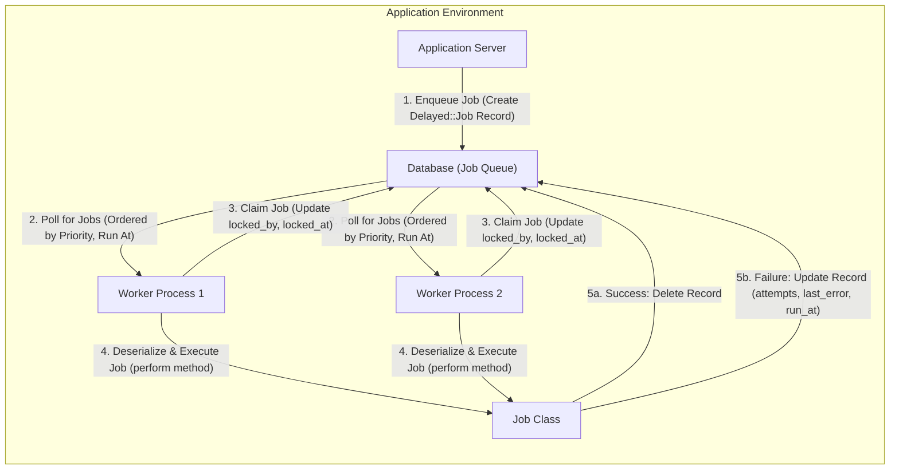
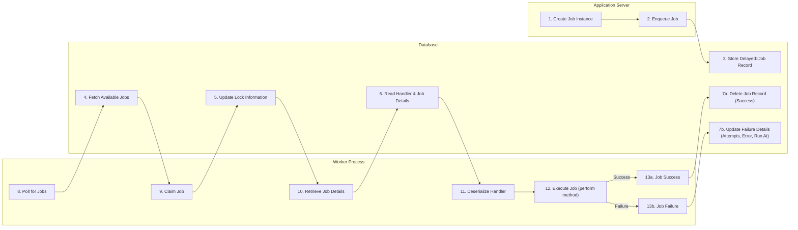

# Project Design Document: Delayed Job

**Version:** 1.1
**Date:** October 26, 2023
**Author:** AI Software Architect

## 1. Introduction

This document provides an enhanced design overview of the Delayed Job project, an asynchronous priority queueing system built on top of standard Ruby. It enables applications to defer the processing of time-consuming tasks to background processes, thereby improving the responsiveness of the main application. This document aims to provide a clearer and more detailed explanation of Delayed Job's architecture, components, and data flow, serving as a robust foundation for future threat modeling activities.

## 2. Goals and Objectives

The primary goals of Delayed Job are:

*   To offer a straightforward and dependable mechanism for asynchronous job processing within Ruby applications.
*   To facilitate the prioritization of jobs, ensuring critical tasks are processed promptly.
*   To guarantee job persistence, preventing data loss in the event of application or worker failures.
*   To maintain minimal dependencies and ensure seamless integration with existing Ruby on Rails and other Ruby projects.
*   To provide a flexible and extensible architecture for handling background tasks.

## 3. System Architecture

Delayed Job functions as a distinct component within an application, typically interacting with the main application through a shared database.

### 3.1. Components

*   **Application Server:** The primary application instance where jobs are initiated and added to the queue. This component interacts with the Delayed Job system by creating `Delayed::Job` records in the database. It utilizes the Delayed Job client library to enqueue jobs.
*   **Database (Job Queue):** A relational database (e.g., PostgreSQL, MySQL, SQLite) serving as the persistent storage for the job queue. The `delayed_jobs` table holds the specifics of each job awaiting processing. Key attributes of the `delayed_jobs` table include:
    *   `id`: Unique identifier for the job.
    *   `priority`: Integer representing job priority (lower is higher).
    *   `attempts`: Number of times the job has been attempted.
    *   `handler`: Serialized representation of the job object and its arguments.
    *   `run_at`: Timestamp indicating the earliest time the job should be processed.
    *   `locked_at`: Timestamp indicating when a worker claimed the job.
    *   `locked_by`: Identifier of the worker process that has locked the job.
    *   `failed_at`: Timestamp indicating when the job permanently failed (after max attempts).
    *   `last_error`: Text field storing the error message from the last failed attempt.
    *   `queue`: String identifying the queue the job belongs to (for routing).
    *   `created_at`: Timestamp of job creation.
    *   `updated_at`: Timestamp of the last update to the job record.
*   **Worker Process(es):** Independent Ruby processes dedicated to fetching jobs from the database queue and executing them. Multiple worker processes can operate concurrently to enhance processing throughput. Workers typically run in a loop, continuously checking for new jobs.
*   **Job Class:** User-defined Ruby classes that encapsulate the specific logic to be executed asynchronously. These classes are required to implement a `perform` method, which contains the core task logic.
*   **Delayed::Job Model:** An ActiveRecord model (or equivalent in other ORMs) that maps to the `delayed_jobs` table in the database. It provides an interface for interacting with the job queue data.

### 3.2. Interactions

The fundamental interaction flow involves:

1. The Application Server instantiates a Job Class, providing any necessary data for the background task.
2. The Application Server utilizes the `Delayed::Job.enqueue` method (or similar, potentially with options for priority or `run_at`) to serialize the Job Class instance and its arguments into the `handler` attribute of a newly created `Delayed::Job` record in the database.
3. One or more Worker Processes periodically query the `delayed_jobs` table in the database for available jobs. This query typically filters for jobs that are not locked (`locked_by` is NULL), have not exceeded their maximum allowed attempts, and whose `run_at` time is in the past or present. Jobs are usually ordered by `priority` (ascending) and `run_at` (ascending).
4. A Worker Process claims a job by executing an atomic update on the corresponding `Delayed::Job` record, setting its `locked_by` attribute to identify itself and updating the `locked_at` timestamp. This prevents other workers from processing the same job concurrently (optimistic locking).
5. The Worker Process retrieves the complete `Delayed::Job` record from the database, including the serialized job details from the `handler` attribute.
6. The Worker Process deserializes the job details from the `handler` attribute, reconstructing the original Job Class instance and its arguments.
7. The Worker Process instantiates the Job Class and invokes its `perform` method.
8. Upon successful completion of the `perform` method, the Worker Process deletes the corresponding `Delayed::Job` record from the database.
9. If an exception occurs during the execution of the `perform` method:
    *   The Worker Process catches the exception.
    *   The exception details (message and backtrace) are stored in the `last_error` attribute of the `Delayed::Job` record.
    *   The `attempts` counter is incremented.
    *   The `run_at` timestamp might be updated based on a configured retry strategy (e.g., exponential backoff).
    *   The `locked_by` and `locked_at` attributes are cleared, making the job available for another worker to attempt processing later, provided the maximum number of attempts has not been reached.

### 3.3. Architectural Diagram

## 4. Data Flow

The lifecycle of a Delayed Job involves the following data flow stages:

1. **Job Creation and Enqueueing:**
    *   The Application Server instantiates a Job Class, encapsulating the task to be performed asynchronously.
    *   The `Delayed::Job.enqueue` method serializes the Job Class instance and its arguments into a string format (typically using YAML or JSON by default).
    *   This serialized string is stored in the `handler` column of a new `Delayed::Job` record in the Database.
    *   Other attributes of the `Delayed::Job` record, such as `priority`, `run_at`, `attempts` (initialized to 0), and `queue`, are also set based on the enqueueing parameters or default values.

2. **Job Acquisition by a Worker:**
    *   Worker Processes continuously poll the `delayed_jobs` table in the Database.
    *   The polling query selects jobs that meet the criteria for processing: not currently locked (`locked_by` IS NULL), not failed (`failed_at` IS NULL), and ready to run (`run_at` <= current time).
    *   The query orders the results, typically prioritizing jobs with lower `priority` values and earlier `run_at` times.
    *   A Worker Process attempts to claim an eligible job by updating its `locked_by` attribute with its identifier and setting the `locked_at` timestamp. This update is usually performed using an optimistic locking mechanism (e.g., a WHERE clause ensuring the record hasn't been modified since it was read).

3. **Job Processing and Execution:**
    *   Once a Worker Process successfully claims a job, it retrieves the full `Delayed::Job` record from the Database.
    *   The Worker Process deserializes the job payload from the `handler` column, reconstructing the original Job Class instance and its arguments.
    *   The Worker Process instantiates the Job Class and executes its `perform` method.

4. **Job Completion or Failure Handling:**
    *   **Successful Completion:** If the `perform` method executes without raising any exceptions, the Worker Process deletes the corresponding `Delayed::Job` record from the Database, signifying successful completion.
    *   **Failure and Retries:** If an exception occurs during the execution of the `perform` method:
        *   The Worker Process catches the exception.
        *   The details of the exception (message and backtrace) are stored in the `last_error` column of the `Delayed::Job` record.
        *   The `attempts` counter for the job is incremented.
        *   The `run_at` timestamp might be updated according to a retry strategy (e.g., setting it to a future time with exponential backoff).
        *   The `locked_by` and `locked_at` attributes are cleared, releasing the lock on the job.
        *   If the number of `attempts` is less than the configured maximum, the job will become available for processing by other workers at the updated `run_at` time.
    *   **Permanent Failure:** If the job fails repeatedly and the number of `attempts` reaches the maximum allowed, the `failed_at` timestamp is set, and the job is typically not retried further by default. Implementations might choose to move these failed jobs to a separate "dead letter" queue or table for analysis.

### 4.1. Data Elements

*   **Job Payload (Serialized Handler):** The essential data representing the job to be executed, stored as a serialized string in the `handler` column. This typically includes the fully qualified class name of the Job Class and its constructor arguments.
*   **Priority:** An integer value assigned to the job, indicating its relative importance. Lower numerical values denote higher priority.
*   **Run At:** A timestamp specifying the earliest time at which the job is eligible for processing by a worker.
*   **Attempts Count:** An integer tracking the number of unsuccessful attempts to execute the job.
*   **Last Error Details:** A text field storing the error message and potentially the stack trace from the most recent failed execution attempt.
*   **Worker Lock Identifier:** A string or identifier indicating which worker process currently holds a lock on the job.
*   **Lock Acquisition Timestamp:** A timestamp recording when a worker process acquired the lock on the job.
*   **Queue Name:** A string identifying the specific queue the job belongs to, allowing for routing of jobs to specific worker processes.

### 4.2. Data Flow Diagram

## 5. Security Considerations

Security is a crucial aspect when using Delayed Job. The following points highlight potential security considerations:

*   **Deserialization Vulnerabilities:** The `handler` column stores serialized Ruby objects. If the serialization format is insecure or if untrusted data can influence the content of the `handler`, it could lead to arbitrary code execution on the worker processes during deserialization.
    *   **Mitigation:**  Use secure serialization formats (consider JSON over YAML if security is paramount and complex object serialization isn't needed). Thoroughly validate any data that becomes part of the job payload. Avoid deserializing data from untrusted sources directly into job payloads.
*   **Database Access Control:** Unauthorized access to the database containing the `delayed_jobs` table could allow attackers to view, modify, or delete jobs, potentially disrupting application functionality or gaining access to sensitive information within job payloads.
    *   **Mitigation:** Implement strong authentication and authorization mechanisms for database access. Restrict database access to only the necessary application servers and worker processes using the principle of least privilege. Use network segmentation and firewalls to limit access to the database server.
*   **Job Payload Confidentiality:** Sensitive data included in job payloads is stored in the database, potentially in plain text.
    *   **Mitigation:** Encrypt sensitive data within the job payload before enqueueing. Consider database-level encryption at rest. Ensure secure transmission of data between the application server, worker processes, and the database (e.g., using TLS/SSL).
*   **Worker Process Security:** Worker processes execute arbitrary Ruby code defined in the Job Classes. If the code in these Job Classes is not carefully vetted, it could introduce vulnerabilities.
    *   **Mitigation:**  Implement code reviews for Job Classes. Follow secure coding practices. Run worker processes with the minimum necessary privileges. Isolate worker processes using containers or virtual machines.
*   **Denial of Service (DoS):** A malicious actor could enqueue a large number of resource-intensive or malicious jobs, overwhelming the worker processes and the database, leading to a denial of service.
    *   **Mitigation:** Implement rate limiting on job enqueueing. Monitor queue sizes and worker performance. Implement mechanisms to prevent the enqueueing of excessively large or computationally expensive jobs. Consider using queue prioritization to handle legitimate high-priority tasks during an attack.
*   **Information Disclosure through Error Messages:** Error messages and stack traces stored in the `last_error` column might inadvertently reveal sensitive information about the application's internal workings or data.
    *   **Mitigation:** Implement robust error handling and logging practices. Sanitize error messages before storing them in the database. Avoid logging sensitive data in error messages.
*   **Job Tampering:** If an attacker gains unauthorized access to the database, they could modify job attributes (priority, `run_at`, handler) to manipulate the execution order, inject malicious code, or gain unauthorized access to resources.
    *   **Mitigation:**  Enforce strict database access controls. Implement auditing of changes to the `delayed_jobs` table. Consider using digital signatures or message authentication codes to verify the integrity of job records.

## 6. Deployment

Delayed Job is typically deployed as an integral part of a Ruby application infrastructure.

*   **Database Infrastructure:** Requires a compatible relational database (e.g., PostgreSQL, MySQL, SQLite) accessible over the network by both the application servers and worker processes. Ensure the database is properly configured for performance and resilience.
*   **Application Server Integration:** The Delayed Job client library (gem) is included in the application's dependencies. The application code uses this library to enqueue jobs.
*   **Worker Process Deployment:** Worker processes are deployed as separate, independent Ruby processes. Common deployment strategies include:
    *   **System Services:** Using system init systems like `systemd` or `Upstart` to manage worker processes.
    *   **Process Managers:** Employing process managers like `Foreman` or ` глаз` to manage and monitor worker processes.
    *   **Containerization:** Deploying worker processes within Docker containers, often orchestrated by Kubernetes or similar platforms.
    *   **Cloud-Based Job Queues:** While Delayed Job uses a database, it's worth noting that cloud providers offer managed message queue services (like AWS SQS or Google Cloud Pub/Sub) which can be alternatives for asynchronous task processing.
*   **Configuration Management:** Configuration typically involves setting database connection details (host, username, password), specifying the number of worker processes to run, and potentially configuring queue names for workers to listen to. Environment variables or configuration files are commonly used for this purpose.
*   **Monitoring and Logging:** Implementing monitoring solutions to track the health and performance of worker processes, queue lengths, and job execution success/failure rates is essential. Centralized logging is crucial for debugging and auditing.

## 7. Future Considerations

*   **Enhanced Monitoring and Observability:** Implementing more granular metrics and dashboards to provide deeper insights into job processing performance, latency, and error patterns. Integration with APM (Application Performance Monitoring) tools could be beneficial.
*   **Dead Letter Queue Implementation:**  Developing a dedicated mechanism to automatically move jobs that fail repeatedly (after exceeding the maximum retry attempts) to a separate "dead letter" queue or table. This allows for analysis of failed jobs without clogging the main queue.
*   **Alternative Job Backends Exploration:** Investigating the feasibility of using alternative job backends beyond relational databases, such as Redis or dedicated message queue systems (e.g., RabbitMQ, Kafka). These alternatives might offer different performance characteristics, scalability options, and features like message acknowledgment and routing.
*   **Security Enhancements:**
    *   Exploring options for encrypting job payloads at rest in the database and in transit between components.
    *   Implementing stricter input validation and sanitization for data that becomes part of job payloads.
    *   Considering the use of message signing or authentication mechanisms to ensure the integrity and authenticity of jobs.
*   **Improved Job Scheduling and Management:**  Investigating features for more sophisticated job scheduling (e.g., cron-like scheduling within Delayed Job) and management interfaces for monitoring and controlling the job queue.

This revised document provides a more detailed and comprehensive design overview of the Delayed Job project. It aims to enhance understanding of the system's architecture, data flow, and security considerations, making it a more effective resource for threat modeling and further development.