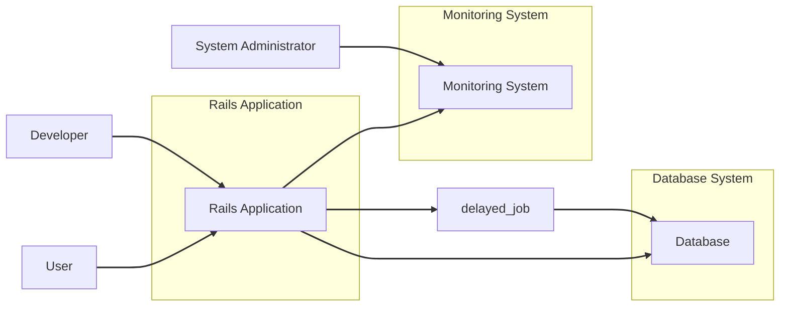
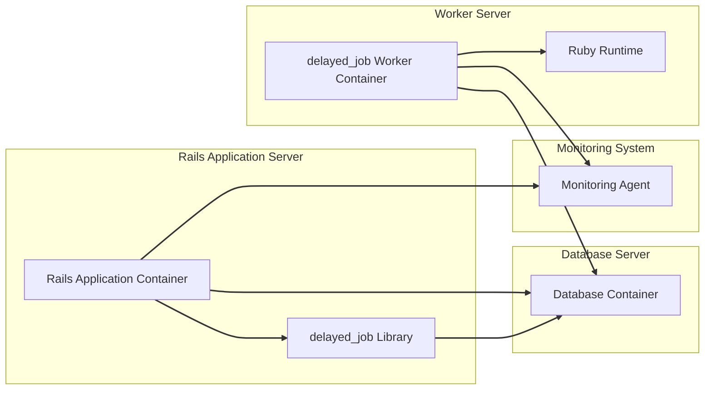
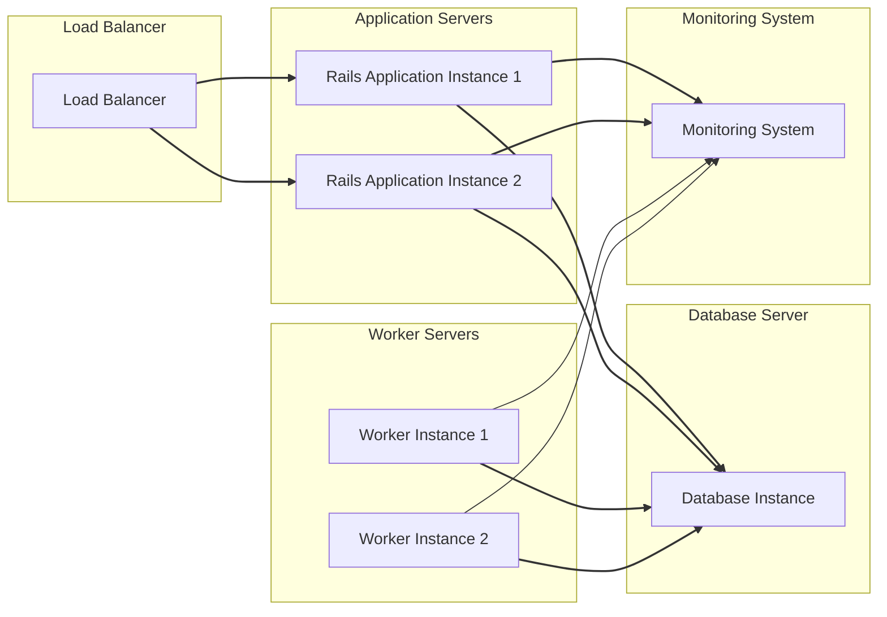
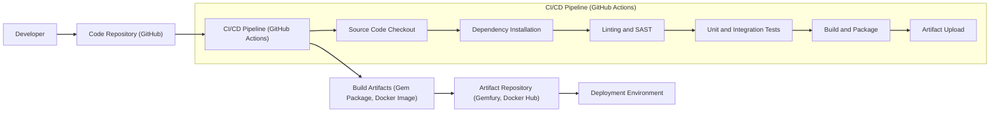

# BUSINESS POSTURE

The `delayed_job` project provides a mechanism for asynchronously processing background jobs in Ruby on Rails applications. This allows applications to offload time-consuming or resource-intensive tasks from the main request-response cycle, improving application responsiveness and user experience.

*   Business Priorities and Goals:
    *   Improve application performance and responsiveness by deferring non-critical tasks to background processing.
    *   Enhance user experience by reducing wait times for users interacting with the application.
    *   Increase application reliability by ensuring tasks are processed even if the main application is under heavy load or experiences temporary issues.
    *   Enable scalability by distributing workload across background workers.

*   Business Risks:
    *   Job processing failures leading to data inconsistencies or incomplete operations.
    *   Performance bottlenecks in job processing impacting overall application performance.
    *   Security vulnerabilities in job processing logic or dependencies potentially leading to unauthorized access or data breaches.
    *   Loss of jobs due to system failures or misconfigurations, resulting in data loss or incomplete business processes.
    *   Unintended resource consumption by background jobs impacting other application components or services.

# SECURITY POSTURE

The `delayed_job` project itself is a Ruby library and relies on the security posture of the Ruby on Rails application it is integrated into, as well as the underlying infrastructure.

*   Existing Security Controls:
    *   security control: Ruby on Rails application security framework - Implemented within the Rails application using `delayed_job`. This includes general web application security best practices, such as protection against common web vulnerabilities (CSRF, XSS, etc.).
    *   security control: Database security - Implemented by the database system used to store job queues. This includes access control, encryption at rest and in transit, and regular security updates.
    *   security control: Operating system security - Implemented by the operating system hosting the application and worker processes. This includes user access control, system hardening, and regular security updates.
    *   security control: Network security - Implemented by the network infrastructure, including firewalls, network segmentation, and intrusion detection/prevention systems.
    *   accepted risk: Dependency vulnerabilities - Ruby gems used by `delayed_job` and the Rails application may contain vulnerabilities. Risk is mitigated by regular dependency updates and vulnerability scanning, but not fully eliminated.
    *   accepted risk: Job data exposure in logs - Job arguments and processing details might be logged, potentially exposing sensitive information if not handled properly. Risk is mitigated by careful logging practices, but not fully eliminated.

*   Recommended Security Controls:
    *   security control: Input validation for job arguments - Implement strict input validation for all job arguments to prevent injection attacks and ensure data integrity.
    *   security control: Secure job serialization - Ensure job arguments are serialized and deserialized securely to prevent object injection vulnerabilities.
    *   security control: Job queue monitoring and alerting - Implement monitoring and alerting for job queue health, processing failures, and potential security incidents.
    *   security control: Secure logging practices - Implement secure logging practices, including sanitizing sensitive data before logging and secure log storage and access controls.
    *   security control: Dependency vulnerability scanning - Integrate automated dependency vulnerability scanning into the development and deployment pipeline.
    *   security control: Regular security audits and penetration testing - Conduct periodic security audits and penetration testing of the application and infrastructure, including background job processing components.

*   Security Requirements:
    *   Authentication:
        *   Requirement: `delayed_job` itself does not handle user authentication directly. Authentication is managed by the Rails application. Access to enqueue jobs should be restricted to authenticated and authorized users within the application context.
        *   Implementation: Rails application authentication mechanisms (e.g., Devise, custom authentication).
    *   Authorization:
        *   Requirement: Authorization should be enforced to control which users or roles can enqueue specific types of jobs. This prevents unauthorized users from triggering arbitrary background tasks.
        *   Implementation: Rails application authorization frameworks (e.g., Pundit, CanCanCan) to control job enqueueing based on user roles and permissions.
    *   Input Validation:
        *   Requirement: All job arguments must be thoroughly validated to prevent injection attacks and ensure data integrity. This is crucial as job arguments are often passed directly to backend processes.
        *   Implementation: Input validation logic within the job definition or enqueueing process. Use strong typing and validation libraries.
    *   Cryptography:
        *   Requirement: If sensitive data is processed in background jobs, it must be encrypted at rest and in transit. This includes encrypting job arguments, job results, and any sensitive data handled within job processing logic.
        *   Implementation: Use Rails encryption features or dedicated cryptography libraries to encrypt sensitive data. Ensure secure key management practices are in place.

# DESIGN

The `delayed_job` project is a Ruby library that extends the functionality of a Ruby on Rails application by providing asynchronous job processing capabilities. It relies on a database to store job queues and worker processes to execute jobs.

## C4 CONTEXT

*   Context Diagram Elements:
    *   Element:
        *   Name: Rails Application
        *   Type: Software System
        *   Description: The main Ruby on Rails web application that utilizes `delayed_job` for background processing. It handles user requests, business logic, and enqueues background jobs.
        *   Responsibilities:
            *   Handling user requests.
            *   Implementing core application business logic.
            *   Enqueuing background jobs using `delayed_job`.
            *   Authenticating and authorizing users.
        *   Security controls:
            *   security control: Rails application security framework.
            *   security control: Authentication and authorization mechanisms.
            *   security control: Input validation for web requests.

    *   Element:
        *   Name: Database
        *   Type: Software System
        *   Description: The database system used by the Rails application. It stores application data, including the `delayed_job` job queue.
        *   Responsibilities:
            *   Storing application data.
            *   Storing `delayed_job` job queues.
            *   Providing data persistence and retrieval.
        *   Security controls:
            *   security control: Database access control.
            *   security control: Database encryption at rest and in transit.
            *   security control: Database security hardening.

    *   Element:
        *   Name: Monitoring System
        *   Type: Software System
        *   Description: A system used to monitor the health and performance of the Rails application, database, and background job processing.
        *   Responsibilities:
            *   Monitoring application performance.
            *   Monitoring database performance.
            *   Monitoring `delayed_job` queue and worker status.
            *   Alerting on errors and performance issues.
        *   Security controls:
            *   security control: Access control to monitoring data.
            *   security control: Secure communication channels for monitoring data.

    *   Element:
        *   Name: Developer
        *   Type: Person
        *   Description: Software developers who develop and maintain the Rails application and `delayed_job` integration.
        *   Responsibilities:
            *   Developing and maintaining the Rails application code.
            *   Implementing background jobs using `delayed_job`.
            *   Writing secure code and following secure development practices.
        *   Security controls:
            *   security control: Secure development training.
            *   security control: Code review processes.
            *   security control: Access control to development environments and code repositories.

    *   Element:
        *   Name: System Administrator
        *   Type: Person
        *   Description: System administrators responsible for deploying, configuring, and maintaining the infrastructure and application environment.
        *   Responsibilities:
            *   Deploying and configuring the Rails application and database.
            *   Managing the infrastructure environment.
            *   Monitoring system health and performance.
            *   Implementing security configurations and updates.
        *   Security controls:
            *   security control: Access control to production environments.
            *   security control: System hardening and security configuration management.
            *   security control: Incident response procedures.

    *   Element:
        *   Name: User
        *   Type: Person
        *   Description: End-users who interact with the Rails application, indirectly triggering background jobs.
        *   Responsibilities:
            *   Using the Rails application.
            *   Generating requests that may enqueue background jobs.
        *   Security controls:
            *   security control: User authentication.
            *   security control: User authorization.

    *   Element:
        *   Name: delayed_job
        *   Type: Software System
        *   Description: The `delayed_job` library integrated within the Rails application, responsible for managing background job processing.
        *   Responsibilities:
            *   Providing API for enqueuing jobs.
            *   Managing job queues in the database.
            *   Orchestrating job execution by worker processes.
            *   Handling job retries and failures.
        *   Security controls:
            *   security control: Secure job serialization (as recommended).
            *   security control: Input validation for job arguments (as recommended).

## C4 CONTAINER

*   Container Diagram Elements:
    *   Element:
        *   Name: Rails Application Container
        *   Type: Container
        *   Description: A containerized environment hosting the Ruby on Rails application. It includes the application code, web server, and application runtime.
        *   Responsibilities:
            *   Serving web application requests.
            *   Executing application business logic.
            *   Enqueuing background jobs using the `delayed_job` library.
            *   Handling user authentication and authorization.
        *   Security controls:
            *   security control: Container image security scanning.
            *   security control: Web application firewall (WAF).
            *   security control: Rate limiting and request throttling.

    *   Element:
        *   Name: delayed_job Library
        *   Type: Library
        *   Description: The `delayed_job` Ruby library integrated within the Rails application. It provides the functionality for enqueuing and managing background jobs.
        *   Responsibilities:
            *   Providing the API for enqueuing jobs from the Rails application.
            *   Serializing and deserializing job arguments.
            *   Interacting with the database to manage job queues.
        *   Security controls:
            *   security control: Secure job serialization (as recommended).
            *   security control: Input validation for job arguments (as recommended).

    *   Element:
        *   Name: Database Container
        *   Type: Container
        *   Description: A containerized environment hosting the database system. It stores application data and the `delayed_job` job queue.
        *   Responsibilities:
            *   Storing application data.
            *   Storing `delayed_job` job queues.
            *   Managing database connections and transactions.
        *   Security controls:
            *   security control: Database container image security scanning.
            *   security control: Database access control lists (ACLs).
            *   security control: Database encryption at rest and in transit.

    *   Element:
        *   Name: delayed_job Worker Container
        *   Type: Container
        *   Description: A containerized environment running `delayed_job` worker processes. These processes dequeue and execute background jobs from the database queue.
        *   Responsibilities:
            *   Connecting to the database to retrieve jobs from the queue.
            *   Deserializing job arguments.
            *   Executing job processing logic.
            *   Updating job status in the database.
        *   Security controls:
            *   security control: Container image security scanning.
            *   security control: Least privilege principle for worker processes.
            *   security control: Secure logging of job execution.

    *   Element:
        *   Name: Ruby Runtime
        *   Type: Container Runtime
        *   Description: The Ruby runtime environment within the worker container, responsible for executing Ruby code for background jobs.
        *   Responsibilities:
            *   Executing Ruby code.
            *   Managing dependencies for job execution.
        *   Security controls:
            *   security control: Runtime environment security updates.
            *   security control: Dependency management and vulnerability scanning.

    *   Element:
        *   Name: Monitoring Agent
        *   Type: Agent
        *   Description: A monitoring agent running within each container (Rails Application and Worker) to collect metrics and logs for the monitoring system.
        *   Responsibilities:
            *   Collecting application and system metrics.
            *   Collecting logs from application and worker processes.
            *   Sending monitoring data to the Monitoring System.
        *   Security controls:
            *   security control: Secure communication channels to the Monitoring System.
            *   security control: Access control to monitoring agent configuration.

## DEPLOYMENT

Deployment can vary, but a common cloud-based deployment architecture is described below.

*   Deployment Diagram Elements:
    *   Element:
        *   Name: Load Balancer
        *   Type: Infrastructure
        *   Description: Distributes incoming web traffic across multiple Rails Application Instances for scalability and high availability.
        *   Responsibilities:
            *   Load balancing web traffic.
            *   Health checking application instances.
            *   SSL termination.
        *   Security controls:
            *   security control: DDoS protection.
            *   security control: Web application firewall (WAF) integration.
            *   security control: Access control to load balancer configuration.

    *   Element:
        *   Name: Rails Application Instance
        *   Type: Infrastructure (Virtual Machine or Container)
        *   Description: A virtual machine or container instance running the Rails Application Container. Multiple instances are deployed for scalability and redundancy.
        *   Responsibilities:
            *   Hosting the Rails Application Container.
            *   Serving web application requests.
            *   Enqueuing background jobs.
        *   Security controls:
            *   security control: Instance security hardening.
            *   security control: Security groups/firewall rules.
            *   security control: Regular security patching.

    *   Element:
        *   Name: Worker Instance
        *   Type: Infrastructure (Virtual Machine or Container)
        *   Description: A virtual machine or container instance running the `delayed_job` Worker Container. Multiple instances can be deployed to handle job processing load.
        *   Responsibilities:
            *   Hosting the `delayed_job` Worker Container.
            *   Processing background jobs from the database queue.
        *   Security controls:
            *   security control: Instance security hardening.
            *   security control: Security groups/firewall rules.
            *   security control: Regular security patching.

    *   Element:
        *   Name: Database Instance
        *   Type: Infrastructure (Database Server)
        *   Description: A database server instance hosting the database system. Can be a managed database service or a self-managed database server.
        *   Responsibilities:
            *   Storing application data and job queues.
            *   Providing database services to application and worker instances.
        *   Security controls:
            *   security control: Database server hardening.
            *   security control: Database access control lists (ACLs).
            *   security control: Database encryption at rest and in transit.
            *   security control: Database backups and recovery.

    *   Element:
        *   Name: Monitoring System
        *   Type: Infrastructure (Monitoring Service)
        *   Description: A centralized monitoring system that collects metrics and logs from all components. Can be a managed monitoring service or a self-hosted system.
        *   Responsibilities:
            *   Aggregating monitoring data.
            *   Providing dashboards and visualizations.
            *   Alerting on system issues.
        *   Security controls:
            *   security control: Access control to monitoring data and dashboards.
            *   security control: Secure communication channels for monitoring data.

## BUILD

The build process for a Rails application using `delayed_job` typically involves standard Ruby on Rails development and deployment practices, enhanced with security considerations.

*   Build Process Elements:
    *   Element:
        *   Name: Developer
        *   Type: Person
        *   Description: Software developers writing and committing code changes.
        *   Responsibilities:
            *   Writing application code and background jobs.
            *   Running local tests.
            *   Committing code to the code repository.
        *   Security controls:
            *   security control: Secure coding practices training.
            *   security control: Local development environment security.
            *   security control: Code review before commit.

    *   Element:
        *   Name: Code Repository (GitHub)
        *   Type: Software System
        *   Description: A version control system (e.g., GitHub) used to store and manage the source code.
        *   Responsibilities:
            *   Version control.
            *   Code collaboration.
            *   Triggering CI/CD pipelines.
        *   Security controls:
            *   security control: Access control to the repository.
            *   security control: Branch protection rules.
            *   security control: Audit logging of repository access.

    *   Element:
        *   Name: CI/CD Pipeline (GitHub Actions)
        *   Type: Software System
        *   Description: An automated CI/CD pipeline (e.g., GitHub Actions) that builds, tests, and packages the application.
        *   Responsibilities:
            *   Automated build process.
            *   Running linters and SAST scanners.
            *   Executing unit and integration tests.
            *   Packaging build artifacts.
            *   Uploading artifacts to the artifact repository.
        *   Security controls:
            *   security control: Secure pipeline configuration.
            *   security control: Secret management for pipeline credentials.
            *   security control: SAST and dependency scanning integration.
            *   security control: Pipeline execution logging.

    *   Element:
        *   Name: Build Artifacts (Gem Package, Docker Image)
        *   Type: Data
        *   Description: The packaged output of the build process, which can be a Ruby gem package, a Docker image, or other deployment artifacts.
        *   Responsibilities:
            *   Containing the application code and dependencies.
            *   Being deployable to target environments.
        *   Security controls:
            *   security control: Artifact signing and verification.
            *   security control: Vulnerability scanning of artifacts.

    *   Element:
        *   Name: Artifact Repository (Gemfury, Docker Hub)
        *   Type: Software System
        *   Description: A repository for storing and managing build artifacts (e.g., Gemfury for gems, Docker Hub for Docker images).
        *   Responsibilities:
            *   Storing build artifacts.
            *   Providing access to artifacts for deployment.
        *   Security controls:
            *   security control: Access control to the artifact repository.
            *   security control: Artifact repository security scanning.
            *   security control: Secure artifact storage.

    *   Element:
        *   Name: Deployment Environment
        *   Type: Infrastructure
        *   Description: The target environment where the application is deployed (e.g., staging, production).
        *   Responsibilities:
            *   Running the deployed application and worker processes.
        *   Security controls:
            *   security control: Environment isolation.
            *   security control: Infrastructure security controls (as described in Deployment section).

# RISK ASSESSMENT

*   Critical Business Processes:
    *   Background data processing: Jobs that perform essential data transformations, calculations, or updates that are critical for application functionality and data consistency.
    *   Asynchronous communication: Jobs that handle sending emails, notifications, or integrating with external systems, which are important for user engagement and business workflows.
    *   Reporting and analytics: Jobs that generate reports or perform data analysis, providing insights for business decision-making.

*   Data to Protect and Sensitivity:
    *   Job Arguments: Can contain sensitive data depending on the application. Sensitivity varies from low (e.g., processing non-sensitive data) to high (e.g., processing personally identifiable information (PII), financial data, or confidential business information).
    *   Job Results: May contain sensitive data depending on the job's purpose. Sensitivity is similar to job arguments.
    *   Application Data: The underlying data processed by jobs, which is managed by the Rails application and stored in the database. Sensitivity depends on the nature of the application and the type of data it handles.

# QUESTIONS & ASSUMPTIONS

*   Questions:
    *   What is the specific business context and purpose of the Rails application using `delayed_job`? Understanding the application's domain will help assess the criticality of background jobs and the sensitivity of data processed.
    *   What type of data is processed by background jobs? Knowing the data types will determine the necessary security controls for data protection (e.g., encryption, data masking).
    *   What are the existing security controls in place for the Rails application and the infrastructure environment? Understanding the current security posture will help identify gaps and prioritize security improvements.
    *   What is the organization's risk appetite? This will influence the balance between security controls and business agility.

*   Assumptions:
    *   The Rails application using `delayed_job` is a typical web application with moderate data sensitivity.
    *   The application is deployed in a cloud environment or a similar modern infrastructure.
    *   Standard security practices for web applications and cloud environments are generally followed, but there is room for improvement in specific areas like background job security.
    *   The organization is reasonably security-conscious and willing to invest in security controls to mitigate identified risks.