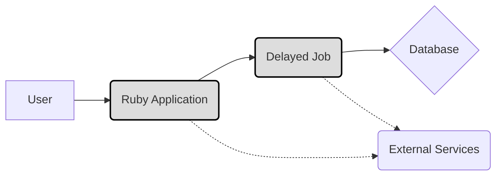
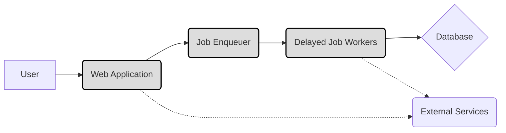
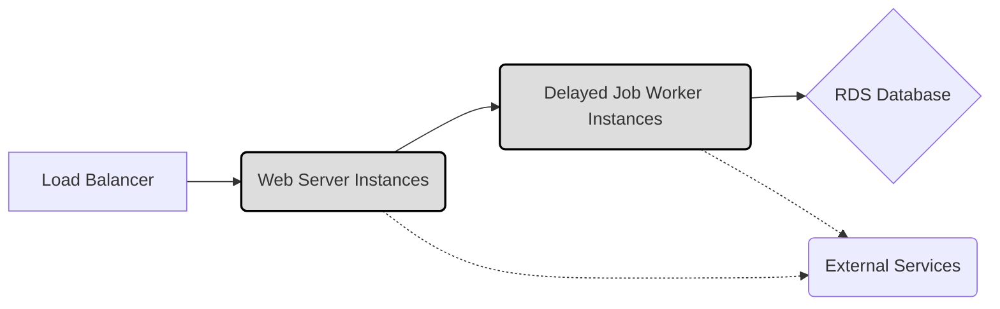
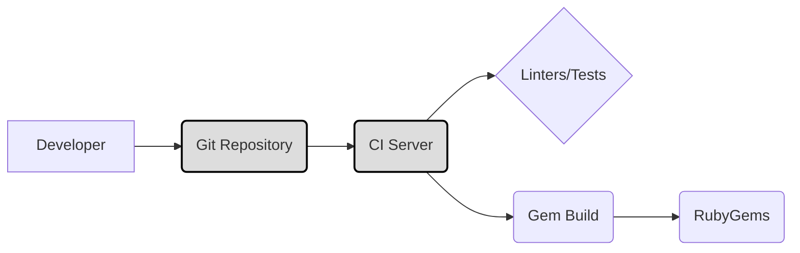

Okay, let's create a design document for the `delayed_job` project.

# BUSINESS POSTURE

Business Priorities and Goals:

*   Provide a reliable and robust background job processing mechanism for Ruby applications.
*   Improve application responsiveness by offloading time-consuming tasks to background workers.
*   Simplify the implementation of asynchronous operations within Ruby applications.
*   Offer a flexible and extensible solution adaptable to various use cases and environments.
*   Maintain a well-documented and easy-to-use library for developers.
*   Ensure compatibility with popular Ruby frameworks, particularly Ruby on Rails.

Most Important Business Risks:

*   Job processing failures leading to data inconsistencies or loss of critical operations.
*   Performance bottlenecks in job processing impacting application scalability.
*   Security vulnerabilities allowing unauthorized access or manipulation of job queues.
*   Lack of monitoring and alerting, hindering timely detection and resolution of issues.
*   Compatibility issues with different Ruby versions, frameworks, or database systems.
*   Complexity in configuration or deployment, increasing operational overhead.

# SECURITY POSTURE

Existing Security Controls:

*   security control: Delayed Job itself does not directly handle authentication or authorization. It relies on the application integrating it to manage user authentication and permissions.
*   security control: The library does not inherently encrypt job data. Data encryption is the responsibility of the application using Delayed Job. (Described in application using Delayed Job)
*   security control: Input validation is not a primary concern of Delayed Job itself. It's the responsibility of the application to sanitize any data passed to background jobs. (Described in application using Delayed Job)
*   security control: Delayed Job provides mechanisms for retrying failed jobs, offering some resilience against transient errors. (Described in Delayed Job documentation)
*   security control: The library supports different backends (like ActiveRecord, Mongoid) which may have their own security features and configurations. (Described in Delayed Job documentation)

Accepted Risks:

*   accepted risk: The application using Delayed Job is responsible for securing sensitive data passed to background jobs. Delayed Job does not provide built-in encryption or data masking.
*   accepted risk: The security of the database or other backend used by Delayed Job is outside the scope of the library itself.
*   accepted risk: Delayed Job workers run with the same privileges as the application. Compromise of the application could lead to compromise of the workers.

Recommended Security Controls:

*   security control: Implement robust monitoring and alerting for job queues, including failure rates, processing times, and queue lengths.
*   security control: Regularly update Delayed Job and its dependencies to address security patches.
*   security control: Consider using a dedicated, isolated user account for running Delayed Job workers, limiting their privileges to the minimum required.
*   security control: Implement a robust logging strategy to capture job execution details, including any errors or exceptions.
*   security control: If handling sensitive data, consider encrypting the job payload at the application level before enqueuing.

Security Requirements:

*   Authentication: Not directly applicable to Delayed Job itself. The application integrating Delayed Job is responsible for authentication.
*   Authorization: The application should ensure that only authorized users or processes can enqueue jobs. Delayed Job itself does not handle authorization.
*   Input Validation: The application enqueuing jobs is responsible for validating and sanitizing all data passed to Delayed Job. This is crucial to prevent injection attacks or other vulnerabilities.
*   Cryptography: If sensitive data is processed, the application should encrypt it before passing it to Delayed Job. Delayed Job does not provide built-in encryption. Consider using database-level encryption as well.

# DESIGN

## C4 CONTEXT

Element Descriptions:

*   Element 1:
    *   Name: User
    *   Type: Person
    *   Description: A user interacting with the Ruby Application.
    *   Responsibilities: Initiates actions that may result in background jobs being enqueued.
    *   Security Controls: Authentication and authorization are handled by the Ruby Application.

*   Element 2:
    *   Name: Ruby Application
    *   Type: Software System
    *   Description: The application that integrates Delayed Job for background processing.
    *   Responsibilities: Enqueues jobs, handles user requests, interacts with external services.
    *   Security Controls: Authentication, authorization, input validation, data encryption (if applicable).

*   Element 3:
    *   Name: Delayed Job
    *   Type: Software System
    *   Description: The background job processing library.
    *   Responsibilities: Manages the job queue, executes jobs, handles retries.
    *   Security Controls: Relies on the application and database for security.

*   Element 4:
    *   Name: Database
    *   Type: Database
    *   Description: Stores job queue data.
    *   Responsibilities: Persists job information.
    *   Security Controls: Database access controls, encryption at rest (if applicable).

*   Element 5:
    *   Name: External Services
    *   Type: Software System
    *   Description: Any external services that the Ruby Application or Delayed Job interacts with.
    *   Responsibilities: Varies depending on the specific service.
    *   Security Controls: Depends on the specific service; typically involves API keys, authentication tokens, or other security mechanisms.

## C4 CONTAINER

Element Descriptions:

*   Element 1:
    *   Name: User
    *   Type: Person
    *   Description: A user interacting with the Web Application.
    *   Responsibilities: Initiates actions that may result in background jobs being enqueued.
    *   Security Controls: Authentication and authorization are handled by the Web Application.

*   Element 2:
    *   Name: Web Application
    *   Type: Container: Ruby on Rails Application
    *   Description: The main application that handles user requests and interacts with other components.
    *   Responsibilities: Handles user requests, enqueues jobs, interacts with external services.
    *   Security Controls: Authentication, authorization, input validation, data encryption (if applicable).

*   Element 3:
    *   Name: Job Enqueuer
    *   Type: Component
    *   Description: A component within the Web Application responsible for creating and enqueuing jobs.
    *   Responsibilities: Creates job payloads, serializes data, enqueues jobs to the database.
    *   Security Controls: Input validation, data sanitization.

*   Element 4:
    *   Name: Delayed Job Workers
    *   Type: Container: Ruby Processes
    *   Description: Separate processes that run in the background and execute jobs from the queue.
    *   Responsibilities: Retrieves jobs from the database, executes job logic, handles retries.
    *   Security Controls: Runs with the application's privileges; relies on the application and database for security.

*   Element 5:
    *   Name: Database
    *   Type: Container: Database
    *   Description: Stores job queue data.
    *   Responsibilities: Persists job information.
    *   Security Controls: Database access controls, encryption at rest (if applicable).

*   Element 6:
    *   Name: External Services
    *   Type: Software System
    *   Description: Any external services that the Web Application or Delayed Job Workers interact with.
    *   Responsibilities: Varies depending on the specific service.
    *   Security Controls: Depends on the specific service; typically involves API keys, authentication tokens, or other security mechanisms.

## DEPLOYMENT

Possible Deployment Solutions:

1.  **Heroku:** Delayed Job can be deployed on Heroku using worker dynos.
2.  **AWS (Elastic Beanstalk, EC2, ECS, EKS):** Delayed Job can be deployed on various AWS services, with workers running as separate processes or containers.
3.  **Google Cloud Platform (GCE, GKE):** Similar to AWS, Delayed Job can be deployed on GCP using virtual machines or containers.
4.  **On-Premise Servers:** Delayed Job can be deployed on traditional servers, with workers running as background processes.

Chosen Solution (Example: AWS Elastic Beanstalk):

Element Descriptions:

*   Element 1:
    *   Name: Load Balancer
    *   Type: Infrastructure
    *   Description: Distributes incoming traffic across multiple web server instances.
    *   Responsibilities: Directs user requests to healthy web server instances.
    *   Security Controls: SSL/TLS termination, DDoS protection (if configured).

*   Element 2:
    *   Name: Web Server Instances
    *   Type: Infrastructure: EC2 Instances
    *   Description: Instances running the web application code.
    *   Responsibilities: Handles user requests, enqueues jobs.
    *   Security Controls: Security groups, IAM roles, system-level security hardening.

*   Element 3:
    *   Name: Delayed Job Worker Instances
    *   Type: Infrastructure: EC2 Instances
    *   Description: Instances running the Delayed Job worker processes.
    *   Responsibilities: Executes background jobs.
    *   Security Controls: Security groups, IAM roles, system-level security hardening.

*   Element 4:
    *   Name: RDS Database
    *   Type: Infrastructure: Managed Database Service
    *   Description: The managed database service used to store job queue data.
    *   Responsibilities: Persists job information.
    *   Security Controls: Database access controls, encryption at rest, network security.

*   Element 5:
    *   Name: External Services
    *   Type: Software System
    *   Description: Any external services accessed by the application or workers.
    *   Responsibilities: Varies depending on the service.
    *   Security Controls: API keys, authentication tokens, network security.

## BUILD

The build process for Delayed Job typically involves the following steps:

1.  **Developer:** Writes code and commits changes to a version control system (e.g., Git).
2.  **Continuous Integration (CI) Server (e.g., GitHub Actions, Jenkins):**
    *   Checks out the code from the repository.
    *   Runs linters and code style checks (e.g., Rubocop).
    *   Executes unit and integration tests.
    *   Builds the gem package.
3.  **Artifact Repository (e.g., RubyGems):** The gem package is published to a repository like RubyGems.org.

Security Controls in Build Process:

*   **Version Control:** Tracks code changes and allows for auditing and rollbacks.
*   **CI/CD Pipeline:** Automates the build and testing process, ensuring consistency and reducing manual errors.
*   **Linters and Code Style Checks:** Enforce coding standards and identify potential code quality issues.
*   **Automated Testing:** Runs unit and integration tests to verify code functionality and prevent regressions.
*   **Dependency Management:** Uses a package manager (e.g., Bundler) to manage dependencies and track their versions.
*   **Vulnerability Scanning:** Can be integrated into the CI/CD pipeline to scan dependencies for known vulnerabilities (e.g., using tools like Bundler Audit).
*   **Signed Commits:** Developers can sign their commits using GPG keys to verify the authenticity of the code.

# RISK ASSESSMENT

Critical Business Processes:

*   Asynchronous task execution: Delayed Job is critical for any business process that relies on background jobs, such as sending emails, processing payments, generating reports, or performing data synchronization.

Data Sensitivity:

*   Job Payload Data: The data passed to Delayed Job can vary in sensitivity. It may include:
    *   Personally Identifiable Information (PII): User data, email addresses, etc.
    *   Financial Data: Payment information, transaction details.
    *   Business-Sensitive Data: Internal reports, proprietary algorithms.
    *   Non-Sensitive Data: Log messages, status updates.

The sensitivity of the data depends entirely on the application using Delayed Job. The application is responsible for protecting sensitive data.

# QUESTIONS & ASSUMPTIONS

Questions:

*   What specific database backend is being used (e.g., MySQL, PostgreSQL, MongoDB)? This impacts security configurations.
*   What are the expected job queue volumes and processing times? This helps determine scaling requirements.
*   Are there any specific compliance requirements (e.g., GDPR, HIPAA) that need to be considered?
*   What monitoring and alerting tools are currently in place or planned?
*   What is the deployment environment (e.g., Heroku, AWS, on-premise)?

Assumptions:

*   BUSINESS POSTURE: The organization has a moderate risk appetite, prioritizing reliability and functionality but also recognizing the importance of security.
*   SECURITY POSTURE: The application using Delayed Job is responsible for handling authentication, authorization, and data encryption. Basic security measures are in place for the infrastructure (e.g., firewalls, access controls).
*   DESIGN: The application uses a relational database (e.g., PostgreSQL) as the backend for Delayed Job. The deployment environment is cloud-based (e.g., AWS). A CI/CD pipeline is used for building and deploying the application.