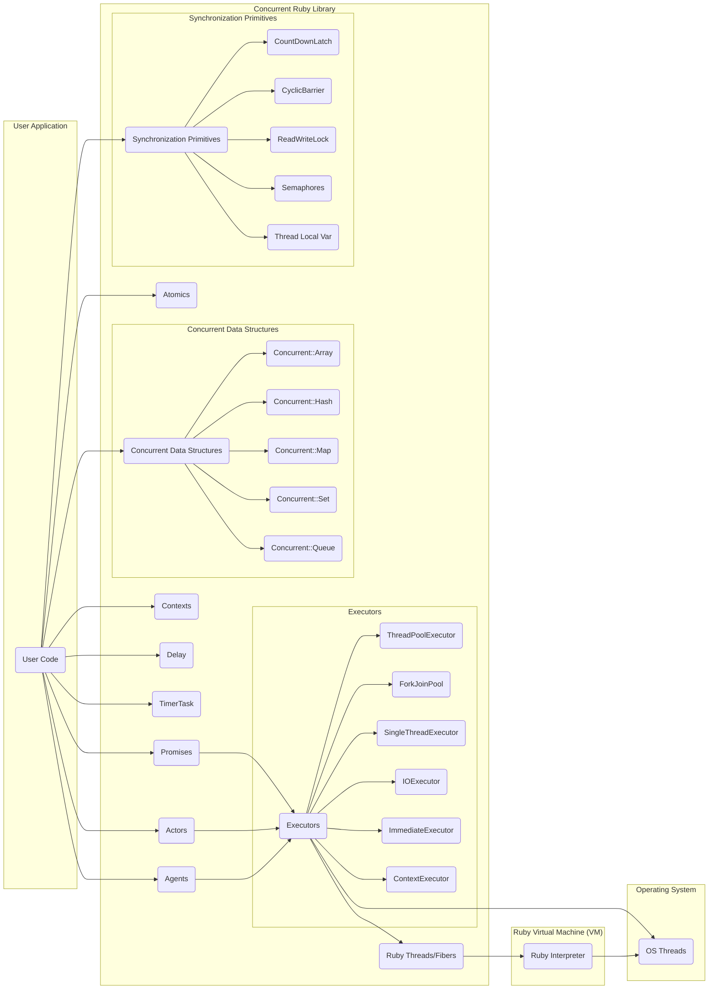
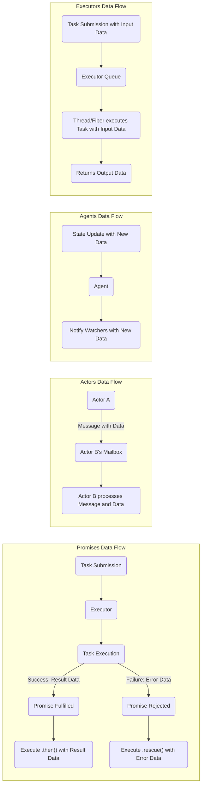

# Project Design Document: Concurrent Ruby

**Version:** 1.1
**Date:** October 26, 2023
**Author:** AI Software Architect

## 1. Introduction

This document provides a detailed design overview of the `concurrent-ruby` library, a toolkit designed to enhance concurrent and parallel programming capabilities within Ruby applications. The purpose of this document is to clearly articulate the library's architecture, its constituent components, and the flow of data within it. This detailed understanding will serve as a crucial foundation for subsequent threat modeling activities.

## 2. Goals of Concurrent Ruby

The primary objectives of the `concurrent-ruby` library are:

* To extend Ruby's native concurrency features with a richer set of abstractions.
* To deliver high-performing and efficient implementations of common concurrency patterns.
* To simplify the complexities of concurrent programming in Ruby, thereby reducing potential errors.
* To offer robust and scalable building blocks for developing concurrent applications.
* To ensure compatibility and interoperability across various concurrency models available in Ruby (e.g., threads, fibers).

## 3. Architectural Overview

`concurrent-ruby` is structured as a modular collection of classes and modules, each providing specific concurrency primitives and utilities. This modular design allows developers to selectively integrate only the necessary components into their applications.

**Key Architectural Components:**

* **Promises:**  Represent the eventual outcome of an asynchronous operation, simplifying the management of results that are not immediately available.
* **Executors:**  Provide a mechanism for managing and executing tasks concurrently, abstracting away the details of thread or fiber management.
* **Atomics:**  Offer atomic operations on variables, ensuring thread-safe modifications without the need for explicit locking for simple operations.
* **Concurrent Data Structures:**  Thread-safe implementations of common data structures, allowing for concurrent access and modification without data corruption.
* **Actors:**  A concurrency model based on independent entities that communicate through asynchronous message passing, promoting modularity and fault tolerance.
* **Agents:**  Similar to actors but focused on managing and reacting to changes in a specific piece of state.
* **Contexts:**  Provide a way to manage and propagate execution context information across asynchronous operations.
* **Delay:**  Represents a value that will become available after a specified duration.
* **TimerTask:**  Enables the scheduling of tasks for execution after a delay or at recurring intervals.
* **Synchronization Primitives:**  A suite of tools for controlling access to shared resources and coordinating the execution of concurrent tasks.

## 4. Component Details

This section provides a more detailed breakdown of the core components within the `concurrent-ruby` library.

* **Promises:**
    * Purpose: To represent the eventual result of an asynchronous computation.
    * States: Can be in a pending, fulfilled (with a value), or rejected (with an error) state.
    * Functionality: Allows for chaining operations using methods like `then`, `rescue`, and `ensure`. Relies on executors to run the associated code.

* **Executors:**
    * Purpose: To manage the execution of tasks concurrently.
    * Types:
        * `ThreadPoolExecutor`: Manages a pool of reusable threads.
        * `ForkJoinPool`: Optimized for tasks that can be broken down into smaller subtasks.
        * `SingleThreadExecutor`: Executes tasks sequentially in a single thread.
        * `IOExecutor`: Designed for I/O-bound operations, often using a larger thread pool.
        * `ImmediateExecutor`: Executes tasks immediately in the calling thread.
        * `ContextExecutor`: Executes tasks within a specific context (e.g., a fiber).

* **Atomics:**
    * Purpose: To provide thread-safe operations on single variables.
    * Examples: `AtomicBoolean`, `AtomicInteger`, `AtomicReference`.
    * Mechanism: Typically leverages underlying CPU instructions for atomic operations.

* **Concurrent Data Structures:**
    * Purpose: To offer thread-safe collections for concurrent access and modification.
    * Examples:
        * `Concurrent::Array`: A thread-safe dynamic array.
        * `Concurrent::Hash`: A thread-safe hash map.
        * `Concurrent::Map`: Another thread-safe hash map implementation.
        * `Concurrent::Set`: A thread-safe collection of unique elements.
        * `Concurrent::Queue::MPSCQueue`: A multi-producer, single-consumer queue.
        * `Concurrent::Queue::SPSCQueue`: A single-producer, single-consumer queue.
        * `Concurrent::ReentrantReadWriteLock`: A reentrant read-write lock for managing access to shared resources.

* **Actors:**
    * Purpose: To provide a concurrency model based on independent, message-passing entities.
    * Characteristics: Each actor has its own mailbox and processes messages sequentially.

* **Agents:**
    * Purpose: To manage a specific piece of state and react to changes in that state.
    * Functionality: Allow for attaching watchers that are notified when the agent's state changes.

* **Contexts:**
    * Purpose: To allow the propagation of execution context across asynchronous operations.
    * Use Cases: Storing and retrieving thread-local or fiber-local data.

* **Delay:**
    * Purpose: To represent a value that will be available after a specified delay.

* **TimerTask:**
    * Purpose: To schedule code for execution after a delay or at regular intervals.
    * Execution: Relies on executors for the actual execution of the scheduled tasks.

* **Synchronization Primitives:**
    * Purpose: To provide tools for controlling access to shared resources and coordinating thread execution.
    * Examples:
        * `CountDownLatch`: Allows one or more threads to wait until a set of operations in other threads completes.
        * `CyclicBarrier`: A synchronization point where multiple threads wait for each other to reach the barrier.
        * `ReadWriteLock`: Allows multiple readers or a single writer to access a resource.
        * `Semaphores`: Control access to a limited number of resources.
        * `Thread Local Var`: Provides thread-local storage for variables.

## 5. Data Flow

The flow of data within `concurrent-ruby` is highly dependent on the specific concurrency primitive being utilized. Common data flow patterns include:

* **Promises:**
    * A task is submitted to an "Executor".
    * The "Executor" executes the task.
    * Upon completion, the "Promise" is either fulfilled with the result or rejected with an error.
    * Registered callbacks (via `then`, `rescue`) are then executed, receiving the result or error data.

* **Actors:**
    * An "Actor" sends a message to another "Actor".
    * The message is placed in the recipient "Actor's" mailbox.
    * The recipient "Actor" processes messages from its mailbox sequentially, extracting the data from the message.

* **Agents:**
    * An update is made to the "Agent's" state.
    * The new state data is stored within the "Agent".
    * Watchers registered with the "Agent" are notified of the state change, receiving the new state data.

* **Executors:**
    * A task (code block or callable) is submitted to the "Executor".
    * The "Executor" manages the execution of the task, potentially passing data as arguments to the task.
    * The task executes and may return data as a result.

## 6. Security Considerations (Pre-Threat Modeling)

While `concurrent-ruby` focuses on concurrency management and doesn't directly handle external input or network communication, its improper use or vulnerabilities within its components can introduce security risks in applications. Here are some initial security considerations:

* **Resource Exhaustion:**
    * **Unbounded Queues:** Executors with unbounded queues can lead to excessive memory consumption if tasks are submitted faster than they can be processed, potentially causing denial of service.
    * **Thread Pool Saturation:**  Submitting a large number of tasks without proper control can exhaust the thread pool, preventing new tasks from being executed.

* **Race Conditions and Data Corruption:**
    * **Incorrect Synchronization:**  Improper use of synchronization primitives or relying on non-atomic operations for shared mutable state can lead to race conditions, resulting in data corruption or inconsistent application state. For example, incrementing a counter without using `AtomicInteger` could lead to lost updates.
    * **Concurrent Data Structure Misuse:**  While concurrent data structures are thread-safe, incorrect usage patterns or assumptions about their behavior can still lead to unexpected results or vulnerabilities.

* **Deadlocks:**
    * **Circular Dependencies in Locks:**  Improperly acquiring multiple locks in different orders can lead to deadlocks, where threads are blocked indefinitely, halting application progress.

* **Security of Dependencies:**
    * Vulnerabilities in the underlying dependencies of `concurrent-ruby` (like `thread_safe` or `atomic`) could indirectly impact applications using this library.

* **Actor System Vulnerabilities:**
    * **Message Handling Issues:**  Vulnerabilities in how actors handle messages could lead to unexpected behavior or denial of service if malicious messages are sent. For instance, an actor not validating message content could be exploited.
    * **Mailbox Flooding:**  An attacker could potentially flood an actor's mailbox with messages, causing it to become unresponsive or consume excessive resources.

* **Timing Attacks (Less Direct):**
    * While less likely in the core library, the timing of concurrent operations in application code built on `concurrent-ruby` could potentially be exploited in certain scenarios to infer sensitive information.

## 7. Dependencies

`concurrent-ruby` relies on other Ruby gems for its functionality. Understanding these dependencies is important for security assessments. Key dependencies include:

* **thread_safe:** Provides a collection of thread-safe data structures used internally by `concurrent-ruby`.
* **atomic:** Provides low-level atomic operations that are fundamental to some of `concurrent-ruby`'s primitives.

## 8. Deployment Considerations

`concurrent-ruby` is typically deployed as a Ruby gem and integrated into Ruby applications. Deployment considerations relevant to security include:

* **Dependency Management:** Ensuring that the `concurrent-ruby` gem and its dependencies are kept up-to-date to patch any known security vulnerabilities.
* **Configuration of Executors:**  Properly configuring executors, such as setting appropriate thread pool sizes and queue capacities, is crucial to prevent resource exhaustion issues in production environments.
* **Monitoring and Logging:**  Monitoring the application's concurrency behavior (e.g., thread pool usage, queue lengths) can help detect potential issues or attacks. Logging relevant events can aid in diagnosing problems.

## 9. Future Considerations

Potential future developments for `concurrent-ruby` might include:

* Further performance optimizations and efficiency improvements.
* Introduction of new concurrency primitives and higher-level abstractions.
* Enhanced integration with other Ruby concurrency features, such as Ractors.
* Continued focus on improving thread safety and robustness of existing components.

This revised design document provides a more detailed and structured overview of the `concurrent-ruby` library, enhancing its suitability for subsequent threat modeling activities.