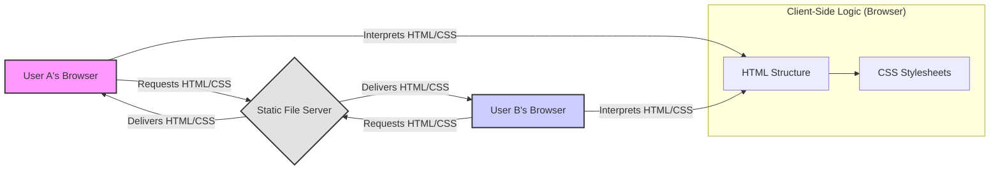
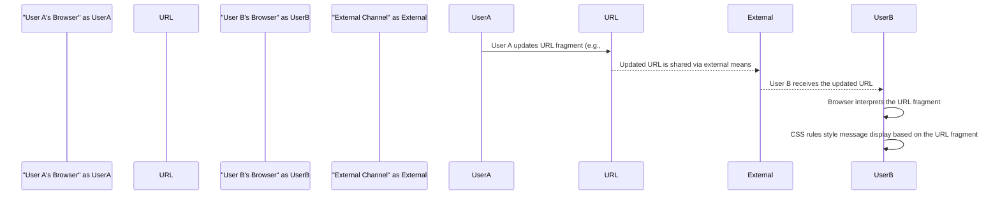

## Project Design Document: CSS-Only Chat (Improved)

**1. Introduction**

This document provides an enhanced design overview of the "CSS-Only Chat" project, a unique chat application implemented solely using Cascading Style Sheets (CSS). This revised document builds upon the previous version, offering greater detail and clarity regarding the system's architecture, data flow, and security considerations. It remains intended as a foundation for subsequent threat modeling activities.

**2. Project Overview**

The CSS-Only Chat project, accessible on GitHub ([https://github.com/kkuchta/css-only-chat](https://github.com/kkuchta/css-only-chat)), showcases an innovative and unconventional approach to chat application development. Eschewing traditional server-side logic and client-side JavaScript for core functionality, it cleverly employs CSS features, primarily URL fragments and CSS selectors, to manage application state and simulate message exchange.

**3. Goals**

*   To present a refined and more detailed architectural description of the CSS-Only Chat project.
*   To provide a clearer illustration of the data flow and interaction patterns within the system, including specific examples.
*   To elaborate on the functionalities of key components and their interdependencies.
*   To strengthen the foundation for conducting a comprehensive and targeted threat model.

**4. Target Audience**

This document is intended for:

*   Security engineers and architects tasked with performing threat modeling and security assessments.
*   Developers seeking a deeper understanding of the project's architecture and implementation nuances.
*   Individuals interested in analyzing the security implications of this novel approach to chat applications.

**5. System Architecture**

The CSS-Only Chat project exhibits a distinctive client-centric architecture, lacking a persistent server-side backend for message storage or relay.

*   **Core Components:**
    *   **HTML Structure:** Provides the foundational markup and elements for the chat interface, including input fields, message display areas, and potential user lists.
    *   **CSS Stylesheets:**  The central component, where CSS rules are strategically employed for:
        *   **State Management:**  Utilizing URL fragments (`#`) to represent distinct chat rooms or individual user states. The structure of these fragments is crucial (e.g., `#room-general&user-alice&message-hello`).
        *   **Message Display Logic:** Dynamically showing or hiding message elements based on the current URL fragment and sophisticated CSS selectors targeting specific patterns within the fragment.
        *   **User Interface Updates:**  Modifying the visual presentation of the chat interface based on the interpreted state from the URL fragment.
    *   **Static File Server:**  A web server (e.g., Nginx, Apache, or a basic file server) serves the static HTML and CSS files. This server does not execute any dynamic application code.
    *   **Client Browser:** The user's web browser acts as the execution environment, interpreting the HTML and CSS to render the chat interface and manage the application's state based on changes to the URL.

*   **Architectural Diagram (Mermaid):**

**6. Data Flow (Simulated Message Exchange)**

The "data flow" in this context is not a traditional client-server exchange. Instead, it relies on manipulating the browser's URL and leveraging CSS selectors to reflect changes across different users' browsers.

*   **Simulating Message Sending:**
    1. **User Input:** User A enters a message in the designated input field.
    2. **URL Fragment Encoding:**  Submitting the message (or a similar UI action) triggers a change in User A's browser's URL fragment. This fragment encodes information such as the sender's identity and the message content. For example, the URL might change to `#user-alice&says-hello`. More complex encoding schemes are possible.
    3. **Out-of-Band URL Synchronization:** The updated URL must be communicated to other participants (e.g., User B) through external means. This remains the most critical and inherently insecure aspect. Examples include:
        *   **Manual Copying and Pasting:** User A manually copies the updated URL and shares it with User B via a separate communication channel.
        *   **Sharing via External Platforms:** Users share the URL through email, instant messaging applications, social media, or other external platforms.
    4. **Browser Interpretation (User B):** User B's browser receives the updated URL (e.g., by clicking a link or manually entering it). The browser parses the new URL fragment.
    5. **CSS-Driven Message Display:** CSS rules within User B's browser are designed to react to specific patterns within the URL fragment. Based on the fragment's content, the CSS will:
        *   Select the appropriate message display area (e.g., an element with a class derived from the sender's name).
        *   Display the message content associated with the sender, potentially by manipulating the content of a specific HTML element based on the URL fragment.

*   **Data Flow Diagram (Mermaid):**

**7. Key Components and Functionality**

*   **Input Fields:** Standard HTML `<input>` elements where users enter their messages and potentially identify themselves (though this identification is client-side and easily spoofed).
*   **Message Display Areas:** HTML elements (e.g., `
`, ``, `<li>`) that are dynamically styled by CSS to show or hide messages based on the current URL fragment. CSS selectors play a crucial role in targeting these elements.
*   **User Identification (Client-Side):** The method used to associate messages with specific users is entirely client-side, likely encoded within the URL fragment or potentially through CSS classes applied to input elements. This is not a secure form of identification.
*   **URL Fragment Structure and Encoding:** The specific format and encoding scheme used within the URL fragment to represent chat rooms, users, and messages. This structure is the core of the application's state management. For example, `#room-general&sender-bob&message-howareyou`.
*   **CSS Selectors and Rules:** The fundamental logic of the application resides within the CSS rules. These rules use attribute selectors (targeting elements based on the URL fragment) and other CSS mechanisms to manipulate the visibility, content, and styling of elements, effectively simulating real-time updates.

**8. Security Considerations (Detailed)**

The unconventional architecture introduces significant security considerations:

*   **Complete Lack of Server-Side Security Controls:** The absence of a server-side component means no central authority exists to enforce security policies, validate user input, authenticate users, or authorize actions.
*   **Extreme Reliance on Client-Side Trust:** All application logic and state management reside within the user's browser, making it highly vulnerable to client-side manipulation and tampering.
*   **High Vulnerability to URL Manipulation:** Users can directly manipulate the URL to potentially:
    *   **Impersonate Other Users:** By altering the "sender" part of the URL fragment.
    *   **Inject Arbitrary Content (XSS):** By crafting malicious messages within the URL fragment, which could be rendered directly by other users' browsers if not carefully handled (though the CSS-only nature might limit the scope of traditional script execution).
    *   **Disrupt Chat Flow:** By sending malformed or unexpected URL fragments.
*   **No Input Sanitization or Validation:** Without server-side processing, there is no inherent mechanism to sanitize or validate user input before it is "transmitted" via the URL. This significantly increases the risk of XSS or other injection-based attacks. Even without JavaScript, malicious CSS could potentially be injected or crafted to cause harm.
*   **Data Confidentiality Risks:** Messages are essentially transmitted "in the clear" within the URL. Anyone who intercepts or gains access to the shared URL can read the message content. Browser history also becomes a record of all messages.
*   **Data Integrity Risks:** There is no mechanism to ensure the integrity of messages. Users can easily modify the URL to alter the content of messages they supposedly sent.
*   **Availability Concerns:** While the static files themselves might be readily available, the "application's" functionality relies on users correctly sharing and interpreting URLs. Disruptions to this out-of-band communication impact availability.
*   **Absence of Authentication and Authorization:** There is no inherent way to authenticate users or authorize access to specific "rooms" or conversations. Anyone with the URL can participate.
*   **Rudimentary Session Management:** The concept of a "session" is extremely basic and tied directly to the browser's current URL. There is no secure or persistent session management.
*   **Lack of Rate Limiting:** There is no mechanism to prevent users from rapidly sending messages (by repeatedly changing and sharing URLs), potentially disrupting the experience for others.

**9. Deployment Considerations**

*   **Simple Static File Hosting:** The application can be deployed on any standard web server capable of serving static files (HTML and CSS).
*   **Minimal Infrastructure Requirements:**  A significant advantage is the lack of any backend infrastructure or databases.
*   **Accessibility:** The application is accessible to anyone with a web browser and the shared URL. However, the usability relies heavily on users understanding how to share and interact with URLs.
*   **Potential CORS Issues:** If the HTML and CSS files are hosted on a different domain than where users are sharing the URLs from, Cross-Origin Resource Sharing (CORS) policies might need consideration, although this is less likely given the nature of the application.

**10. Assumptions and Constraints**

*   **Reliance on Modern Browser Features:** The application likely depends on CSS features available in modern web browsers. Compatibility with older browsers is not guaranteed.
*   **Strictly No JavaScript for Core Functionality:** The fundamental constraint is the absence of JavaScript for the core message passing and state management logic.
*   **Out-of-Band Communication is Necessary:** The application inherently relies on users utilizing external channels to share and synchronize URLs for communication to occur.
*   **Limited Scalability and Usability:** The architecture is not designed for high scalability or ease of use due to the manual URL sharing mechanism. It's more of a proof-of-concept or a demonstration of CSS capabilities.
*   **Users Understand URL Manipulation:**  A key assumption is that users understand how to copy, paste, and potentially interpret URLs, which might be a barrier for some users.

**11. Future Considerations**

While the CSS-Only Chat project is primarily a demonstration of the expressive power of CSS, understanding its design and limitations is crucial for recognizing the security implications of such unconventional approaches. This project serves as an interesting case study in how security principles are challenged when traditional architectural patterns are abandoned. Further analysis and threat modeling will explore specific attack scenarios and potential mitigations (though mitigations within the "CSS-only" constraint are extremely limited). The project's main value lies in its educational aspect, highlighting the boundaries of what's possible with CSS and the inherent security risks of relying solely on client-side mechanisms for application logic.