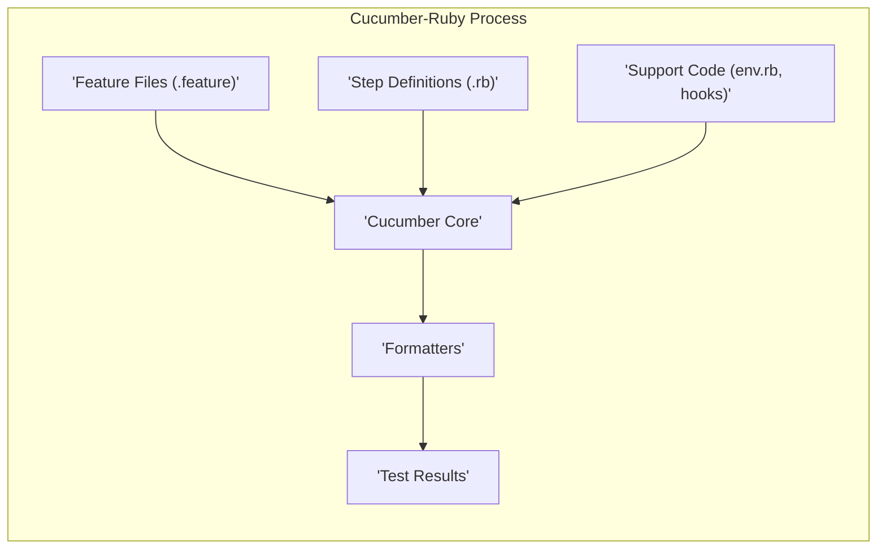
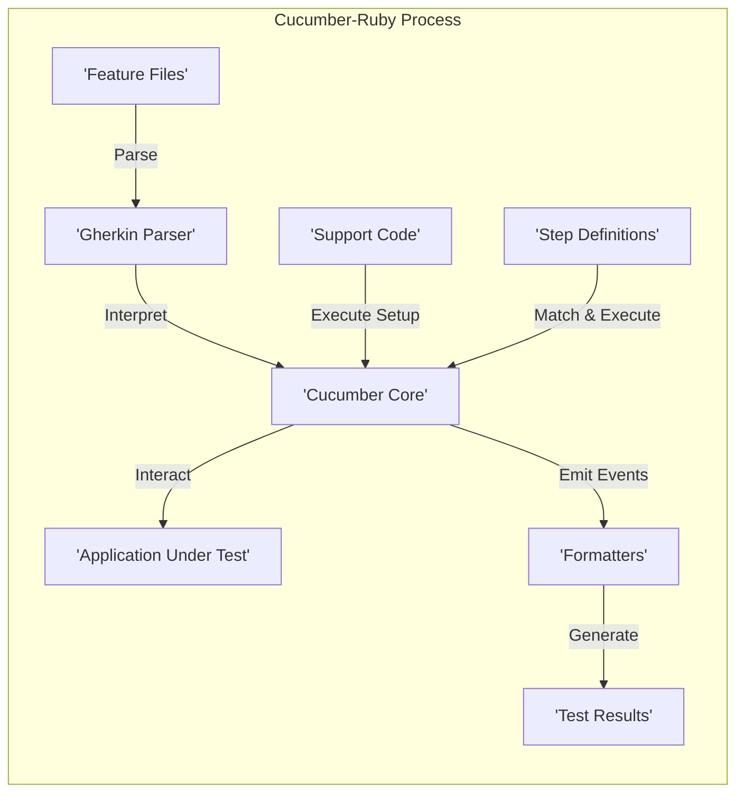

# Project Design Document: Cucumber-Ruby

**Version:** 1.1
**Date:** October 26, 2023
**Author:** AI Software Architect

## 1. Introduction

This document provides a detailed architectural design of the Cucumber-Ruby project, an open-source software tool for running automated acceptance tests written in a behavior-driven development (BDD) style. This document is intended to provide a comprehensive understanding of the system's components, data flow, and key considerations for security threat modeling. This version builds upon the initial design to provide more granular detail and focus on potential security vulnerabilities.

## 2. Project Overview

Cucumber-Ruby is a testing framework that enables users to create executable specifications of software behavior using a natural language format (Gherkin). It facilitates communication and collaboration among business stakeholders, testers, and developers by providing a shared language for describing and validating software functionality. The core of Cucumber-Ruby parses these feature files and executes corresponding Ruby code (step definitions) to automate the testing process against the application under test.

## 3. Goals

*   Provide a framework for executing human-readable acceptance tests that serve as living documentation.
*   Enable seamless collaboration between business stakeholders, testers, and developers through a common language.
*   Automate the verification of software behavior based on agreed-upon specifications.
*   Strictly adhere to the Gherkin syntax for writing clear and concise feature files.
*   Offer flexibility and power in defining step implementations using the Ruby programming language.
*   Provide a variety of customizable reporting formats for comprehensive test results and analysis.
*   Be highly extensible through a well-defined plugin system and hooks for custom behavior.

## 4. Non-Goals

*   To serve as a general-purpose programming language or scripting environment.
*   To provide a fully integrated development environment (IDE) with editing and debugging capabilities.
*   To handle the infrastructure provisioning or deployment of the application being tested.
*   To prescribe specific testing methodologies beyond the core principles of Behavior-Driven Development.
*   To be inherently responsible for the security of the application under test, though it can be used to test security aspects.

## 5. System Architecture

Cucumber-Ruby employs a modular architecture centered around the interpretation of feature files and the subsequent execution of associated step definitions.

### 5.1. High-Level Architecture Diagram

### 5.2. Component Description

*   **Feature Files (".feature"):**
    *   Plain text files written using the Gherkin syntax.
    *   Describe the intended behavior of the application from a user's perspective.
    *   Organized into features, scenarios, and steps.
    *   Serve as the primary input to the Cucumber-Ruby process.
    *   *Security Relevance:*  While primarily declarative, malicious content could be injected if write access is compromised, potentially influencing step execution.

*   **Cucumber Core:**
    *   The central processing unit of Cucumber-Ruby.
    *   Responsible for parsing feature files using the Gherkin parser.
    *   Matches steps defined in feature files to their corresponding Ruby step definitions.
    *   Orchestrates the execution of test scenarios and manages the overall test flow.
    *   Provides hooks and event listeners for extending functionality and reporting.
    *   *Security Relevance:*  Vulnerabilities in the core parsing logic could potentially be exploited with crafted feature files, though this is less common.

*   **Step Definitions (".rb"):**
    *   Ruby code files that contain the actual implementation logic for each step defined in the feature files.
    *   Use regular expressions to map steps in feature files to specific Ruby methods or blocks.
    *   Interact directly with the application under test, performing actions and assertions.
    *   *Security Relevance:* This is a critical component for security. Poorly written step definitions can introduce significant vulnerabilities like code injection, SQL injection, or command injection if they handle external input (even from feature files) unsafely.

*   **Support Code (env.rb, hooks):**
    *   Ruby code files that provide setup and teardown logic for the test environment.
    *   Often includes code for initializing test databases, setting up browser drivers, or configuring API clients.
    *   `env.rb` is a conventionally named file for global setup, and hooks (`Before`, `After`, etc.) allow for scenario-specific setup and teardown.
    *   *Security Relevance:*  Sensitive information like database credentials or API keys might be present in support code. Insecure initialization or cleanup routines could also introduce vulnerabilities.

*   **Formatters:**
    *   Components responsible for generating reports and output of the test execution results.
    *   Support various output formats, including plain text, HTML, JSON, and custom formats.
    *   Receive events from the Cucumber Core during test execution and format them for reporting.
    *   *Security Relevance:*  Formatters could potentially expose sensitive information present in the test execution context (e.g., error messages, data used in tests) if not configured or implemented carefully.

*   **Test Results:**
    *   The output generated by the formatters, indicating the success or failure of each scenario and step.
    *   Can include detailed logs, error messages, and execution times.
    *   Used for reporting, analysis, and debugging.
    *   *Security Relevance:*  Test results themselves might contain sensitive information depending on the nature of the tests and the format used. Access to test results should be controlled.

## 6. Data Flow

The execution flow of Cucumber-Ruby involves the following sequence of actions:

1. **Feature File Loading:** The Cucumber Core loads the specified feature files from the file system or other configured sources.
2. **Gherkin Parsing:** The Gherkin parser within the Cucumber Core analyzes the feature files, breaking them down into features, scenarios, and steps, creating an Abstract Syntax Tree (AST).
3. **Support Code Execution:** Files like `env.rb` and any defined hooks (`BeforeAll`, etc.) are loaded and executed to prepare the test environment.
4. **Step Definition Loading:** The Cucumber Core loads the step definition files, indexing the defined steps and their associated Ruby code.
5. **Step Matching:** For each step in a scenario, the Cucumber Core attempts to find a matching step definition by comparing the step text with the regular expressions defined in the step definitions.
6. **Step Execution:** When a match is found, the corresponding Ruby code in the step definition is executed. This code interacts with the application under test, performing actions and making assertions.
7. **Event Emission:** During execution, the Cucumber Core emits various events (e.g., scenario started, step passed, step failed, hook executed).
8. **Formatter Processing:** Registered formatters subscribe to these events and process the information to generate reports in their respective formats.
9. **Result Output:** The formatters produce the final test results, which can be saved to files, displayed on the console, or sent to other systems.

### 6.1. Data Flow Diagram

## 7. Security Considerations for Threat Modeling

When performing threat modeling for projects using Cucumber-Ruby, consider the following potential vulnerabilities and attack vectors:

*   **Feature Files:**
    *   **Threat:** Malicious modification of feature files by unauthorized users could lead to the execution of unintended or harmful code within step definitions.
    *   **Mitigation:** Implement strict access controls on feature files. Utilize version control systems and code review processes for all changes.

*   **Step Definitions:**
    *   **Threat:**  **Code Injection:** If step definitions construct and execute code (e.g., using `eval` or similar functions) based on input from feature files or external sources without proper sanitization, attackers could inject arbitrary code.
    *   **Threat:**  **SQL Injection:** If step definitions interact with databases and construct SQL queries by directly embedding values from feature files or external sources, attackers could manipulate the queries to gain unauthorized access or modify data.
    *   **Threat:**  **Command Injection:** If step definitions execute system commands using methods like `system` or backticks with unsanitized input, attackers could execute arbitrary commands on the server.
    *   **Threat:**  **Path Traversal:** If step definitions handle file paths based on external input without proper validation, attackers could access or modify files outside the intended directories.
    *   **Mitigation:**  Adhere to secure coding practices. Avoid dynamic code execution with external input. Use parameterized queries or ORM features for database interactions. Sanitize and validate all external input. Avoid executing system commands based on user-controlled input. Implement robust path validation.

*   **Support Code:**
    *   **Threat:**  **Exposure of Sensitive Information:** Hardcoding credentials (database passwords, API keys) directly in support code can lead to unauthorized access if the code is compromised.
    *   **Threat:**  **Insecure Dependencies:** Using outdated or vulnerable Ruby gems in support code can introduce security vulnerabilities.
    *   **Mitigation:**  Store sensitive information securely using environment variables or dedicated secrets management solutions. Regularly audit and update dependencies using tools like `bundler-audit`. Follow secure coding practices for any custom setup or teardown logic.

*   **Formatters:**
    *   **Threat:**  **Information Disclosure:** Formatters might inadvertently include sensitive information (e.g., API responses, database records) in their output, which could be exposed if the reports are not properly secured.
    *   **Mitigation:**  Choose formatters appropriate for the sensitivity of the test data. Review the output of formatters to ensure no unintended information disclosure. Restrict access to test reports.

*   **Cucumber Core:**
    *   **Threat:**  While less common, vulnerabilities in the Cucumber Core itself could potentially be exploited by crafting malicious feature files or through other means.
    *   **Mitigation:** Keep Cucumber-Ruby updated to the latest stable version to benefit from security patches and bug fixes.

*   **Dependencies:**
    *   **Threat:** Cucumber-Ruby relies on various Ruby gems. Vulnerabilities in these dependencies can introduce security risks.
    *   **Mitigation:** Regularly audit and update dependencies using tools like `bundler-audit`. Be mindful of the security advisories for the gems used.

*   **Execution Environment:**
    *   **Threat:**  Insecure CI/CD pipelines or development environments where Cucumber-Ruby is executed can be exploited to gain access to sensitive information or to manipulate the testing process.
    *   **Mitigation:** Secure the CI/CD pipeline and development environments. Implement proper access controls, use secure credentials management, and regularly scan for vulnerabilities.

## 8. Deployment Considerations

Cucumber-Ruby is primarily a development and testing tool and is typically integrated into:

*   **Local Development Environments:** Developers use Cucumber-Ruby locally to execute and debug acceptance tests during development. Security considerations here involve protecting the developer's machine and access to sensitive data used in tests.
*   **Continuous Integration/Continuous Deployment (CI/CD) Pipelines:** Automated Cucumber tests are a crucial part of CI/CD pipelines to ensure code quality and prevent regressions. Security considerations in this context include securing the CI/CD server, managing credentials used for testing, and protecting the test results.
*   **Test Environments:** Dedicated test environments might be used to run Cucumber tests against deployed applications. Security considerations involve securing the test environment itself and ensuring that test data is handled appropriately.

The deployment of Cucumber-Ruby itself is managed through Ruby's package manager, `gem`, and typically orchestrated by tools like Bundler. Ensuring the integrity of the gems used is important for supply chain security.

## 9. Technologies Used

*   **Ruby:** The core programming language for Cucumber-Ruby and step definitions.
*   **Gherkin:** The domain-specific language for writing human-readable feature files.
*   **Bundler:** For managing Ruby gem dependencies and ensuring consistent environments.
*   **Various Ruby Gems:** Including core Cucumber gems (`cucumber-core`, `cucumber-expressions`, `cucumber-gherkin`), formatters, and potentially gems for interacting with the application under test (e.g., `selenium-webdriver`, `capybara`, HTTP client libraries).

This improved design document provides a more detailed and security-focused overview of the Cucumber-Ruby project architecture, intended to be a valuable resource for threat modeling activities.