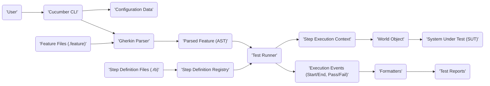

## Project Design Document: Cucumber-Ruby (Improved)

**Project Name:** Cucumber-Ruby

**Project Repository:** [https://github.com/cucumber/cucumber-ruby](https://github.com/cucumber/cucumber-ruby)

**Document Version:** 2.0

**Date:** October 26, 2023

**Prepared By:** Gemini (AI Language Model)

### 1. Introduction

This document provides an enhanced and more detailed design overview of the Cucumber-Ruby project. It elaborates on the core components, their interactions, and the system's operational flow. This comprehensive design serves as a critical foundation for subsequent threat modeling activities, enabling a thorough assessment of potential security vulnerabilities.

### 2. Project Overview

Cucumber-Ruby is a pivotal software tool facilitating Behavior-Driven Development (BDD). It empowers users to articulate software behavior as executable specifications using the natural language syntax of Gherkin. Cucumber then automates the execution of these specifications by running tests against the system under development, ensuring alignment between requirements and implementation.

**Key Goals:**

*   Foster seamless collaboration among business stakeholders, software developers, and quality assurance engineers.
*   Establish a transparent and easily comprehensible method for defining and validating software requirements.
*   Automate the execution of acceptance tests, enhancing efficiency and reducing manual effort.
*   Generate comprehensive reports detailing the status and outcomes of the defined specifications.

**Target Audience:**

*   Software Developers responsible for implementing and maintaining the system.
*   Quality Assurance Engineers tasked with verifying the system's behavior against specifications.
*   Business Analysts who define and refine the system's requirements.
*   Product Owners who oversee the product roadmap and acceptance criteria.
*   Cybersecurity Architects responsible for identifying and mitigating potential security risks.
*   Cloud Architects involved in the deployment and infrastructure of systems utilizing Cucumber-Ruby.

### 3. System Architecture (Detailed)

Cucumber-Ruby's architecture comprises distinct yet interconnected components that work in concert to execute behavioral specifications.

**Components:**

*   **Gherkin Parser:**
    *   Function: Reads and interprets feature files written in the Gherkin language, adhering to its specific syntax rules.
    *   Process: Transforms the human-readable Gherkin syntax into a structured, machine-understandable internal representation (Abstract Syntax Tree - AST).
    *   Validation: Performs rigorous syntax validation, identifying and reporting errors in the Gherkin files to ensure correctness.
*   **Step Definition Registry:**
    *   Purpose: Maintains a mapping between the steps defined in Gherkin feature files (e.g., "Given the user is logged in") and the corresponding Ruby code blocks (step definitions) that implement the action.
    *   Reusability: Enables developers to define reusable step definitions, promoting consistency and reducing code duplication across different scenarios.
    *   Matching Mechanism: Employs pattern matching (regular expressions or similar techniques) to accurately link steps in feature files to their corresponding registered step definitions.
*   **Test Runner:**
    *   Orchestration: Acts as the central execution engine, managing the execution flow of scenarios defined within the feature files.
    *   Iteration: Sequentially processes each step within a scenario, ensuring steps are executed in the defined order.
    *   Invocation: Calls the appropriate step definition from the Step Definition Registry based on the current step being processed.
    *   Context Management: Maintains the execution context and state relevant to the current scenario, potentially utilizing the `World` object.
*   **World:**
    *   Shared Context: A Ruby object serving as a shared workspace for step definitions within the scope of a single scenario execution.
    *   Data Sharing: Facilitates the sharing of data and state between different step definitions within the same scenario, enabling complex interactions.
    *   System Interaction: Often used as the primary interface for step definitions to interact with the **System Under Test (SUT)**.
*   **Hooks:**
    *   Lifecycle Management: Provide mechanisms to execute specific Ruby code blocks at predefined points during the test lifecycle.
    *   Types of Hooks: Support `Before` and `After` hooks for scenarios, steps, and features, allowing for setup, teardown, and other preparatory or concluding actions.
    *   Use Cases: Commonly used for tasks such as setting up test data, initializing the SUT, cleaning up resources, or logging activities.
*   **Formatters:**
    *   Reporting Engine: Responsible for generating reports summarizing the results of the test execution.
    *   Output Variety: Support a range of output formats, including plain text, HTML, JSON, and custom formats, catering to diverse reporting needs.
    *   Event Consumption: Listen for and process events emitted by the Test Runner during execution to gather information for the reports.
*   **Configuration:**
    *   Customization: Allows users to tailor Cucumber's behavior through various configuration options.
    *   Configuration Sources: Accepts configuration through command-line arguments, configuration files (e.g., `cucumber.yml`), and environment variables.
    *   Configurable Aspects: Controls aspects such as the location of feature files and step definitions, the reporting format, and various execution parameters.

**Detailed Architecture Diagram (Mermaid):**

```mermaid
graph LR
    subgraph "Cucumber-Ruby Core"
        A["'Feature Files (.feature)'"] --> B("'Gherkin Parser'");
        B --> C("'Internal Representation (AST)'");
        D["'Step Definition Files (e.g., .rb)'"] --> E("'Step Definition Registry'");
        C --> F("'Test Runner'");
        E --> F;
        G("'World Object'") --> F;
        H("'Hooks (Before/After)'") --> F;
        F --> I("'Formatters'");
        F --> J("'Execution Events'");
        J --> I;
        K["'Configuration (CLI, .yml)'"] --> F;
    end
    L["'System Under Test (SUT)'"] <--o-- G;
    M["'Test Reports (e.g., HTML, JSON)'"] <--o-- I;
    N["'User (Developer, Tester)'"] --> A;
    N --> D;
    N --> K;
```

### 4. Data Flow (Elaborated)

The execution of a Cucumber scenario involves a structured flow of data between its components:

1. **Initiation:** The **User** initiates the Cucumber test run via the command-line interface (CLI), potentially providing **Configuration** details and specifying the location of **Feature Files**.
2. **Parsing:** The **Gherkin Parser** reads and parses the designated **Feature Files**, transforming the Gherkin syntax into a structured **Internal Representation (AST)**.
3. **Registration:** The **Test Runner** loads and processes **Step Definition Files**, populating the **Step Definition Registry** with the mappings between Gherkin steps and their corresponding Ruby code.
4. **Scenario Processing:** The **Test Runner** iterates through each scenario within the parsed feature files.
5. **Step Matching:** For each step in a scenario, the **Test Runner** queries the **Step Definition Registry** to find the matching step definition based on the step's text.
6. **Execution:** The **Test Runner** invokes the Ruby code associated with the matched step definition. This execution might involve interaction with the **System Under Test (SUT)**, often facilitated through the **World Object**. Data is passed between the step definition and the SUT.
7. **Hook Execution:**  **Hooks** defined for specific lifecycle events (e.g., before a scenario, after a step) are executed by the **Test Runner** at the appropriate times.
8. **Event Emission:** The **Test Runner** emits **Execution Events** throughout the process, signaling the start and end of scenarios, steps, and their outcomes (pass, fail, pending).
9. **Report Generation:** **Formatters** subscribe to these **Execution Events** and process the information to generate **Test Reports** in the configured format.

**Detailed Data Flow Diagram (Mermaid):**



### 5. Security Considerations (Expanded)

A comprehensive threat model for Cucumber-Ruby should consider the following potential security risks:

*   **Malicious Feature Files (Input Injection):**
    *   Threat: Attackers could inject malicious code or commands within Gherkin feature files if they have control over their creation or modification.
    *   Impact: This could lead to arbitrary code execution within the test environment, potentially compromising the SUT or the testing infrastructure.
*   **Insecure Step Definitions (Code Vulnerabilities):**
    *   Threat: Step definitions that interact with external systems (databases, APIs, file systems) might be vulnerable to common code injection attacks (e.g., SQL injection, command injection) if input validation and sanitization are insufficient.
    *   Impact: Could result in unauthorized data access, modification, or deletion, or allow attackers to execute arbitrary commands on the target system.
*   **Dependency Vulnerabilities (Supply Chain Risks):**
    *   Threat: Cucumber-Ruby relies on external Ruby gems. Vulnerabilities in these dependencies could be exploited if not properly managed and updated.
    *   Impact: Could introduce various security flaws, depending on the nature of the vulnerability in the dependency.
*   **Exposure of Sensitive Information (Data Leakage):**
    *   Threat: Test reports or logs might inadvertently contain sensitive information (credentials, API keys, personal data) if not handled and sanitized appropriately.
    *   Impact: Could lead to unauthorized disclosure of confidential information.
*   **Configuration Exploitation (Misconfiguration Risks):**
    *   Threat: Insecure or incorrect configuration settings (e.g., overly permissive access controls, insecure logging) could be exploited by attackers.
    *   Impact: Could weaken the overall security posture of the testing environment and potentially the SUT.
*   **Compromised Test Environments (Infrastructure Security):**
    *   Threat: If the test environment itself is compromised, attackers could manipulate test results, gain access to sensitive data, or even pivot to attack the SUT.
    *   Impact: Undermines the integrity of the testing process and poses a direct threat to the SUT.
*   **Insecure Handling of Credentials:**
    *   Threat: Step definitions might directly embed or insecurely manage credentials required to interact with the SUT or other systems.
    *   Impact:  Exposes sensitive credentials, allowing unauthorized access.
*   **Lack of Input Validation in Step Definitions:**
    *   Threat: Step definitions that accept parameters from feature files might not properly validate this input, leading to unexpected behavior or vulnerabilities.
    *   Impact: Could be exploited to cause errors, bypass security checks, or inject malicious data.

### 6. Dependencies (Representative List)

Cucumber-Ruby depends on the following key Ruby gems:

*   `gherkin`:  The core library for parsing Gherkin feature files.
*   `cucumber-expressions`:  Used for matching step definitions to the steps in feature files.
*   `multi_test`:  Provides an abstraction layer for running tests across different testing frameworks.
*   `cucumber-core`:  The underlying core logic of Cucumber.
*   Various formatter gems (e.g., `cucumber-pretty`, `cucumber-html-formatter`):  For generating different types of reports.
*   Potentially other gems depending on specific project needs and step definitions (e.g., gems for HTTP requests, database interactions).

### 7. Deployment and Usage (Typical Scenario)

Cucumber-Ruby is typically integrated as a development dependency within a Ruby project, often managed using Bundler.

**Typical Usage Workflow:**

1. **Authoring Feature Files:** Developers or business analysts write feature files using the Gherkin syntax to describe the desired behavior of the application.
2. **Implementing Step Definitions:** Developers create Ruby files containing step definitions that map the Gherkin steps to executable code that interacts with the **System Under Test (SUT)**.
3. **Configuration:**  Project-specific configuration is set up, often through a `cucumber.yml` file or command-line arguments, specifying feature file locations, report formats, and other settings.
4. **Execution:** The `cucumber` command is executed from the project's root directory. This triggers the following sequence:
    *   Parsing of feature files by the **Gherkin Parser**.
    *   Loading of step definitions and population of the **Step Definition Registry**.
    *   Execution of scenarios by the **Test Runner**, invoking corresponding step definitions.
    *   Generation of reports by the configured **Formatters**.
5. **Reviewing Reports:** Stakeholders review the generated reports to understand the test results and identify any discrepancies between the expected and actual behavior.

### 8. Future Considerations

*   Enhanced integration with cloud-native testing platforms and CI/CD pipelines.
*   Advanced reporting and analytics dashboards for better insights into test execution trends.
*   Improved support for asynchronous and event-driven systems testing.
*   Strengthening security features, such as built-in mechanisms for sanitizing test data and securely managing credentials.

This enhanced design document provides a more in-depth understanding of the Cucumber-Ruby project's architecture and operation. It serves as a more robust foundation for conducting thorough threat modeling and identifying potential security vulnerabilities.