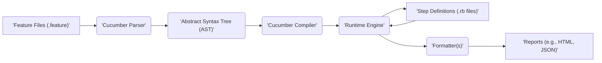
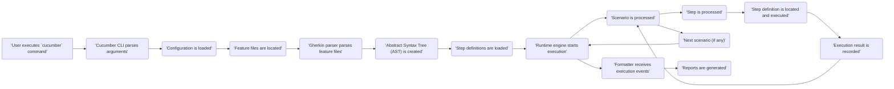

# Project Design Document: Cucumber-Ruby

**Version:** 1.1
**Date:** October 26, 2023
**Author:** AI Software Architect

## 1. Introduction

This document provides an enhanced design overview of the Cucumber-Ruby project, a widely adopted open-source software tool facilitating Behavior-Driven Development (BDD). The primary purpose of this document is to offer a clear and detailed articulation of Cucumber-Ruby's architecture, core components, and data flow. This level of detail is crucial for conducting a comprehensive threat modeling exercise, enabling the identification of potential security vulnerabilities and risks.

## 2. Goals and Objectives

The fundamental goals of the Cucumber-Ruby project are:

*   To foster effective collaboration among business stakeholders, quality assurance testers, and software developers by providing a common language for describing software behavior.
*   To enable the automated execution of human-readable specifications, ensuring that the implemented software aligns with the defined requirements.
*   To offer a transparent and easily understandable method for defining and verifying software behavior through concrete examples.
*   To provide flexibility by supporting various programming languages for implementing the underlying step definitions, although this document primarily focuses on the Ruby implementation.

This design document specifically concentrates on the internal architecture and operational mechanisms of the Cucumber-Ruby gem itself, rather than the broader ecosystem of BDD practices.

## 3. High-Level Architecture

At a high level, Cucumber-Ruby functions by processing feature files written in the Gherkin domain-specific language. It then matches the steps described in these files with corresponding Ruby code defined in step definition files. The Cucumber runtime engine executes this code, and finally, formatters generate reports summarizing the execution results.

*   **'Feature Files (.feature)':** These are plain text files authored using the Gherkin syntax. They describe the intended behavior of the software from a user's perspective, using a structured, natural language format.
*   **'Cucumber Parser':** This component is responsible for reading the content of the feature files and interpreting the Gherkin syntax. It transforms the textual representation into a structured, in-memory representation known as the Abstract Syntax Tree (AST).
*   **'Abstract Syntax Tree (AST)':** The AST is a hierarchical data structure that represents the syntactic structure of the feature files. It allows Cucumber to programmatically access and manipulate the elements of the feature files, such as features, scenarios, and steps.
*   **'Cucumber Compiler':** This stage processes the AST, potentially performing optimizations or transformations to prepare it for efficient execution by the runtime engine. This might involve tasks like resolving ambiguities or preparing data structures for faster lookup.
*   **'Runtime Engine':** This is the core orchestrator of the Cucumber execution process. It traverses the AST, identifies the steps to be executed, and manages the interaction with the step definitions. It also handles the execution of hooks and manages the overall flow of the test execution.
*   **'Step Definitions (.rb files)':** These are Ruby code files where developers define the actions to be performed when a specific step in a feature file is encountered. Step definitions use regular expressions or other matching mechanisms to link the natural language steps to executable code.
*   **'Formatter(s)':** These are pluggable components responsible for generating reports based on the events emitted by the runtime engine during test execution. Cucumber supports various built-in formatters and allows for the creation of custom formatters to suit specific reporting needs.
*   **'Reports (e.g., HTML, JSON)':** These are the output files generated by the formatters, providing a summary of the test execution results. Reports can be generated in various formats, including human-readable formats like HTML and machine-readable formats like JSON.

## 4. Detailed Component Design

This section provides a more in-depth look at the key components within the Cucumber-Ruby gem and their specific responsibilities.

*   **`Cucumber::Core`:**
    *   Provides the foundational domain model and core interfaces that underpin Cucumber's functionality.
    *   Defines the fundamental concepts within Cucumber, such as `Feature`, `Scenario`, `Step`, `Tag`, and `Result`, representing the building blocks of a BDD specification.
    *   Implements a visitor pattern, enabling different parts of the system to traverse and interact with the Abstract Syntax Tree (AST) in a structured manner.
*   **`Cucumber::Gherkin`:**
    *   Specifically responsible for the parsing of feature files written in the Gherkin language.
    *   Leverages a parser generator (historically Treetop, potentially others) to create the parser that transforms Gherkin text into the Abstract Syntax Tree (AST).
    *   Performs syntax validation on the feature files, ensuring they adhere to the Gherkin language rules and reporting any syntax errors.
*   **`Cucumber::Runtime`:**
    *   Manages the complete execution lifecycle of scenarios and individual steps within those scenarios.
    *   Takes the parsed AST and orchestrates the execution of the defined behaviors.
    *   Is responsible for locating and invoking the appropriate step definitions that match the steps in the feature files.
    *   Handles the execution of lifecycle hooks (e.g., `Before`, `After`, `BeforeStep`, `AfterStep`) that allow for setup and teardown actions.
    *   Manages the creation and scope of "world" objects, which can be used for state management and dependency injection within step definitions.
*   **`Cucumber::Glue`:**
    *   Focuses on the process of loading and managing step definitions from Ruby files.
    *   Provides the mechanism for associating the natural language steps in feature files with their corresponding executable Ruby code.
    *   Utilizes regular expressions or other pattern-matching techniques to match steps in feature files to the defined step definitions.
*   **`Cucumber::Formatter`:**
    *   Defines an interface that allows developers to create custom report formats tailored to specific needs.
    *   Includes a set of built-in formatters, such as `Pretty` (for human-readable output), `HTML`, `JSON`, and `Progress`, providing common reporting options.
    *   Receives events from the `Runtime` during the execution process, capturing information about the progress and results of each step and scenario, which it then uses to generate reports.
*   **`Cucumber::Configuration`:**
    *   Handles the loading, management, and validation of configuration options that control Cucumber's behavior.
    *   Reads configuration settings from various sources, including command-line arguments, configuration files (typically `cucumber.yml`), and environment variables, allowing for flexible customization.
*   **`Cucumber::Cli`:**
    *   Serves as the command-line interface (CLI) for interacting with Cucumber-Ruby.
    *   Parses the arguments provided by the user when running the `cucumber` command, determining which features to run, which formatters to use, and other execution parameters.
    *   Instantiates and orchestrates the other Cucumber components based on the parsed command-line arguments and configuration.
*   **`Cucumber::Hooks`:**
    *   Manages the execution of `Before`, `After`, `BeforeStep`, and `AfterStep` hooks, providing a mechanism for executing code at specific points during the test lifecycle.
    *   Allows users to define code that should be run before or after each scenario or step, enabling setup, teardown, or other auxiliary actions.

## 5. Data Flow

The execution flow within Cucumber-Ruby involves a series of steps, starting with the user initiating the process and culminating in the generation of reports.

*   **'User executes `cucumber` command':** The process begins when a user initiates the Cucumber test execution by typing the `cucumber` command in their terminal or through an integrated development environment (IDE).
*   **'Cucumber CLI parses arguments':** The `Cucumber::Cli` component takes over, parsing the command-line arguments provided by the user. These arguments specify various options, such as the location of feature files, the desired report format, and specific tags to filter scenarios.
*   **'Configuration is loaded':** Next, the `Cucumber::Configuration` component loads the configuration settings. This involves reading settings from command-line arguments, configuration files (like `cucumber.yml`), and environment variables, with precedence typically given to command-line arguments.
*   **'Feature files are located':** Based on the provided paths or configured settings, Cucumber identifies the feature files that need to be processed. This involves searching the file system for files matching the specified patterns.
*   **'Gherkin parser parses feature files':** The `Cucumber::Gherkin` component reads the content of the identified feature files and parses them according to the rules of the Gherkin syntax. This process transforms the plain text into a structured representation.
*   **'Abstract Syntax Tree (AST) is created':** The output of the parsing stage is the Abstract Syntax Tree (AST), a hierarchical data structure that represents the structure and content of the feature files in a way that Cucumber can programmatically understand and manipulate.
*   **'Step definitions are loaded':** The `Cucumber::Glue` component loads the step definitions from the specified Ruby files. This involves reading the Ruby code and identifying the methods that are annotated or structured in a way that makes them eligible as step definitions.
*   **'Runtime engine starts execution':** The `Cucumber::Runtime` component takes control and begins the core execution process. It iterates through the scenarios defined in the AST and orchestrates the execution of each step within those scenarios.
*   **'Scenario is processed':** The runtime engine picks a scenario from the AST to execute. This involves setting up the necessary context and preparing to execute the steps within that scenario.
*   **'Step is processed':** For each step within the current scenario, the runtime engine attempts to find a matching step definition. This involves comparing the text of the step with the patterns defined in the loaded step definitions.
*   **'Step definition is located and executed':** Once a matching step definition is found, the `Cucumber::Glue` component invokes the corresponding Ruby code. The code within the step definition performs the actions necessary to interact with the system under test.
*   **'Execution result is recorded':** After the step definition is executed, the result of the execution (pass, fail, pending, skipped) is recorded. This information is crucial for generating reports and determining the overall outcome of the test run.
*   **'Next scenario (if any)':** If there are more scenarios in the feature files, the runtime engine proceeds to process the next one, repeating the steps from 'Scenario is processed'.
*   **'Formatter receives execution events':** Throughout the execution process, the runtime engine emits events that describe what is happening (e.g., scenario started, step passed, hook executed). These events are received by the configured formatters.
*   **'Reports are generated':** Finally, the formatters process the received execution events and generate reports in the specified formats. These reports provide a summary of the test execution, including the status of each scenario and step.

## 6. Security Considerations (Detailed for Threat Modeling)

This section expands on the potential security considerations, providing more detail relevant to threat modeling.

*   **Feature File Injection Vulnerabilities:**
    *   **Threat:** If feature files are dynamically generated or their content is influenced by external, untrusted sources (e.g., user input, data from external APIs), malicious actors could inject crafted Gherkin syntax.
    *   **Impact:** This could lead to unexpected test behavior, bypassing intended test logic, or even triggering the execution of unintended step definitions with harmful side effects. For instance, an attacker might inject steps that interact with sensitive data or external systems in unauthorized ways.
    *   **Mitigation:** Implement robust input validation and sanitization for any external data used to generate feature files. Treat externally sourced feature files as untrusted and potentially malicious.
*   **Step Definition Code Injection Risks:**
    *   **Threat:** Step definitions, being Ruby code, have the inherent capability to execute arbitrary commands on the system where Cucumber is running. If step definitions are sourced from untrusted repositories, are written without proper security considerations, or dynamically construct commands based on untrusted input, they can introduce significant vulnerabilities.
    *   **Impact:** This could allow attackers to execute arbitrary system commands, read or modify sensitive files, or compromise the testing environment. For example, a poorly written step definition might use `system()` or backticks to execute shell commands based on user-provided data.
    *   **Mitigation:** Enforce strict code review processes for step definitions. Avoid constructing commands dynamically from user input within step definitions. Implement secure coding practices and the principle of least privilege.
*   **Dependency Vulnerabilities in Gems:**
    *   **Threat:** Cucumber-Ruby relies on a number of external Ruby gems as dependencies. These dependencies may contain known security vulnerabilities that could be exploited if not properly managed.
    *   **Impact:** Vulnerabilities in dependencies could allow attackers to compromise the system running Cucumber, potentially leading to remote code execution or data breaches.
    *   **Mitigation:** Regularly update dependencies to their latest secure versions. Utilize tools like `bundler-audit` or `rails_best_practices` to identify and address known vulnerabilities in dependencies. Implement a Software Bill of Materials (SBOM) to track dependencies.
*   **Reporting Vulnerabilities (Cross-Site Scripting - XSS):**
    *   **Threat:** If Cucumber reports are generated in formats that can execute code, such as HTML, and the content within these reports is not properly sanitized, it could be susceptible to Cross-Site Scripting (XSS) attacks.
    *   **Impact:** If an attacker can inject malicious scripts into the report content, they could potentially execute arbitrary JavaScript in the context of a user viewing the report, leading to session hijacking, information theft, or other malicious actions.
    *   **Mitigation:** Ensure that all user-generated or external data included in reports is properly sanitized and escaped before being rendered in HTML or other potentially executable formats. Utilize Content Security Policy (CSP) to mitigate XSS risks.
*   **Configuration Vulnerabilities and Information Disclosure:**
    *   **Threat:** Insecure default configurations or the ability to load configuration from untrusted sources could expose sensitive information or alter Cucumber's behavior in unintended ways. For example, allowing arbitrary file paths in configuration could lead to the disclosure of sensitive files.
    *   **Impact:** Attackers could potentially gain access to sensitive configuration details, such as database credentials or API keys, or manipulate Cucumber's behavior to bypass security checks or execute malicious code.
    *   **Mitigation:** Implement secure default configurations. Restrict the sources from which configuration can be loaded. Validate and sanitize all configuration parameters. Avoid storing sensitive information directly in configuration files; use secure secrets management practices.
*   **Hook Abuse and Privilege Escalation:**
    *   **Threat:** `Before` and `After` hooks execute arbitrary Ruby code before and after scenarios or steps. If these hooks are not carefully managed or are sourced from untrusted locations, they could be exploited to perform unauthorized actions or escalate privileges.
    *   **Impact:** Malicious hooks could be used to modify system state, access sensitive resources, or perform actions that the user running Cucumber is not authorized to perform.
    *   **Mitigation:** Exercise caution when using hooks, especially those sourced from external or untrusted sources. Implement thorough code reviews for hook implementations. Adhere to the principle of least privilege when defining the actions performed within hooks.
*   **World Object Security and Data Integrity:**
    *   **Threat:** The "world" object in Cucumber is shared across steps within a scenario. If not managed carefully, it could lead to unintended data sharing or manipulation, potentially compromising the integrity of test data or exposing sensitive information.
    *   **Impact:** Steps might inadvertently access or modify data intended for other steps, leading to unpredictable test outcomes or the leakage of sensitive information.
    *   **Mitigation:** Carefully manage the state stored in the world object. Avoid storing sensitive information directly in the world object if possible. Consider using more isolated state management mechanisms if necessary.

## 7. Deployment Considerations

Cucumber-Ruby is typically deployed as a Ruby gem and integrated into Ruby projects as a development dependency, usually managed by Bundler. Security considerations during deployment primarily focus on ensuring the integrity of the gem source and the security of the environment where tests are executed.

*   **Secure Gem Sources:** Ensure that Cucumber-Ruby and its dependencies are sourced from trusted and secure gem repositories (e.g., rubygems.org). Avoid using unofficial or potentially compromised gem sources.
*   **Dependency Management Security:** Utilize Bundler's features like lockfiles (`Gemfile.lock`) to ensure consistent dependency versions across environments and to prevent the introduction of unexpected or vulnerable dependencies.
*   **Secure Test Environment:** The environment where Cucumber tests are executed should be secured to prevent unauthorized access and modification. This includes securing the underlying operating system, network, and any resources that the tests interact with.
*   **Secrets Management:** Avoid hardcoding sensitive credentials (e.g., database passwords, API keys) within step definitions or configuration files. Utilize secure secrets management solutions to handle sensitive information.

## 8. Future Considerations

Potential future developments that could influence the architecture and security landscape of Cucumber-Ruby include:

*   **Enhanced Parallel Execution Capabilities:**  Significant changes to the runtime engine to support more robust and efficient parallel test execution, potentially involving new concurrency models or process management. This could introduce new security considerations related to data sharing and synchronization.
*   **Advanced and Interactive Reporting Features:**  The introduction of new formatters or features for generating more detailed, interactive, and potentially real-time reports. This could raise new security concerns related to the handling and display of potentially sensitive test data.
*   **Direct Integration with Cloud-Based Testing Services:**  Closer integration with cloud testing platforms or services, potentially involving new authentication mechanisms, data transfer protocols, and security considerations related to cloud environments.
*   **More Flexible and Extensible Step Definition Matching Mechanisms:**  Exploring alternative step definition matching mechanisms beyond regular expressions, potentially involving more complex parsing or natural language processing techniques. This could introduce new vulnerabilities if not implemented securely.

This enhanced design document provides a more detailed and comprehensive overview of the Cucumber-Ruby project's architecture and security considerations. This information is intended to serve as a solid foundation for conducting a thorough threat modeling exercise, enabling the proactive identification and mitigation of potential security vulnerabilities.