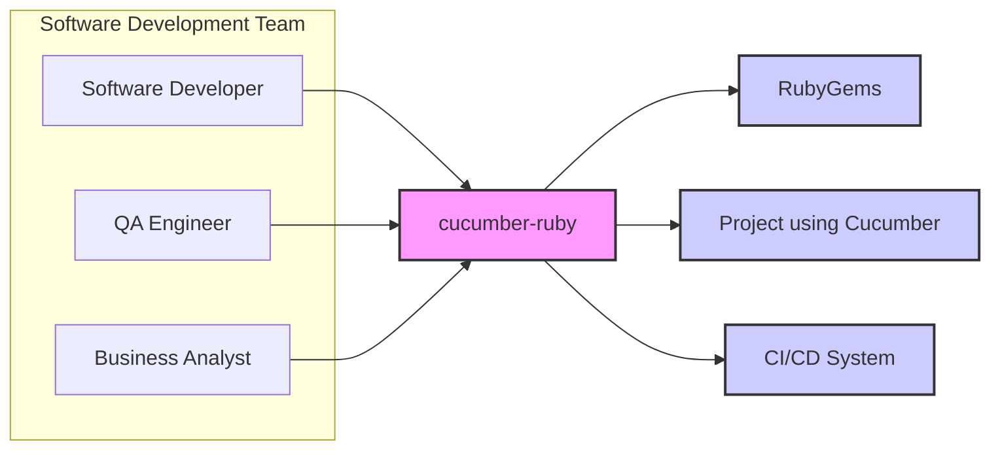
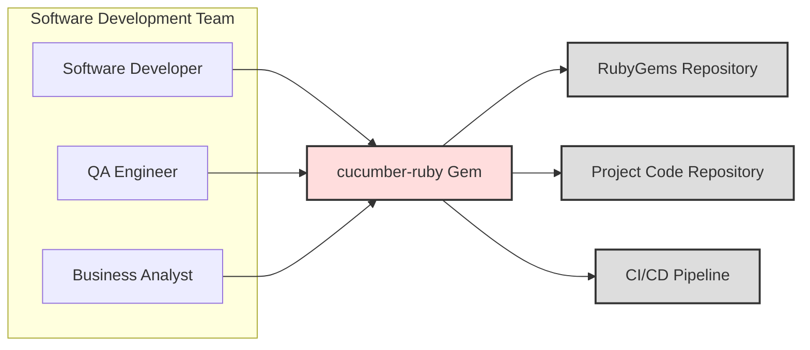
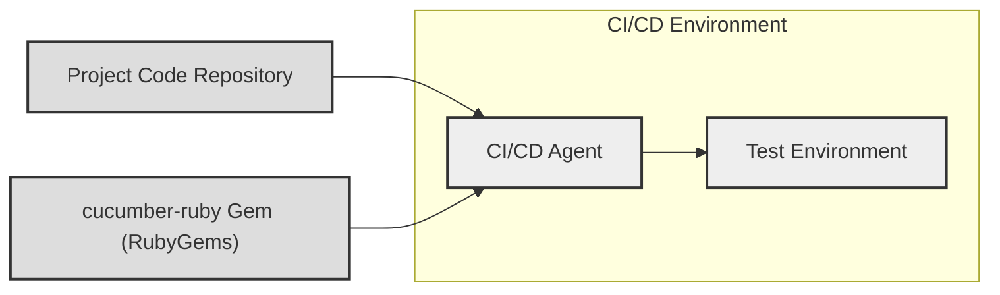

# BUSINESS POSTURE

This project, `cucumber-ruby`, is a core component in Behavior-Driven Development (BDD) workflows within the Ruby ecosystem. It provides a framework for writing and executing automated tests based on human-readable descriptions of software behavior.

- Business Priorities:
  - Enable clear communication and collaboration between business stakeholders, developers, and testers.
  - Improve software quality through automated testing and behavior specification.
  - Facilitate faster feedback loops in the software development lifecycle.
  - Support agile development methodologies by providing a flexible and adaptable testing framework.

- Business Risks:
  - Defects in the `cucumber-ruby` library could impact the reliability of testing processes for projects that depend on it.
  - Security vulnerabilities in `cucumber-ruby` could be exploited by malicious actors if used in vulnerable applications or environments.
  - Lack of maintenance or community support could lead to stagnation and increased risk over time.

# SECURITY POSTURE

- Security Controls:
  - security control: Code hosted on GitHub, leveraging GitHub's security features for repository management and access control. (Implemented: GitHub)
  - security control: Open-source project with community review and contributions, potentially leading to broader security scrutiny. (Implemented: Community Driven Development)
  - security control: Dependency management using RubyGems, relying on RubyGems ecosystem security practices. (Implemented: RubyGems)

- Accepted Risks:
  - accepted risk: As an open-source project, the project relies on community contributions for security vulnerability identification and patching. Response times to security issues may vary.
  - accepted risk: Dependencies on external Ruby gems introduce potential supply chain risks.

- Recommended Security Controls:
  - security control: Implement automated dependency scanning to identify known vulnerabilities in project dependencies.
  - security control: Integrate Static Application Security Testing (SAST) tools into the CI/CD pipeline to detect potential security flaws in the codebase.
  - security control: Conduct regular security audits and penetration testing, especially before major releases.
  - security control: Establish a clear process for reporting and handling security vulnerabilities, including a security policy and contact information.
  - security control: Implement Software Composition Analysis (SCA) to manage open source components and their licenses.

- Security Requirements:
  - Authentication: Not directly applicable to the `cucumber-ruby` library itself, as it is a testing framework. Authentication is relevant in the context of systems that *use* `cucumber-ruby` for testing, and in the infrastructure where tests are executed (e.g., CI/CD systems).
  - Authorization: Similar to authentication, authorization is relevant in the context of systems using `cucumber-ruby` and the infrastructure where tests are run. Access control to feature files, test results, and execution environments should be considered in those contexts.
  - Input Validation: `cucumber-ruby` parses feature files written in Gherkin. Robust input validation is crucial to prevent injection attacks or denial-of-service vulnerabilities through maliciously crafted feature files. This should be implemented in the Gherkin parsing logic.
  - Cryptography: `cucumber-ruby` itself is unlikely to directly implement cryptographic functions. However, projects using `cucumber-ruby` for testing might interact with systems that use cryptography. Testing these systems would require handling cryptographic elements securely within the test environment, but this is outside the scope of the `cucumber-ruby` library itself. If `cucumber-ruby` were to introduce features that require cryptography (e.g., secure reporting), then appropriate cryptographic libraries and best practices should be used.

# DESIGN

## C4 CONTEXT



- Context Diagram Elements:
  - - Name: Software Developer
    - Type: User
    - Description: Developers who write and execute Cucumber tests as part of their development workflow.
    - Responsibilities: Writing feature files, implementing step definitions, running Cucumber tests, and integrating Cucumber into development processes.
    - Security controls: Access control to development environments, code repositories, and testing infrastructure.
  - - Name: QA Engineer
    - Type: User
    - Description: Quality Assurance engineers who use Cucumber to automate functional and acceptance tests.
    - Responsibilities: Designing and implementing test scenarios using Cucumber, executing tests, and analyzing test results.
    - Security controls: Access control to test environments, test data, and reporting systems.
  - - Name: Business Analyst
    - Type: User
    - Description: Business analysts who may contribute to defining features and acceptance criteria in Gherkin format, using Cucumber as a communication and validation tool.
    - Responsibilities: Defining and reviewing feature files, ensuring alignment between business requirements and test specifications.
    - Security controls: Access control to feature files and requirements documentation.
  - - Name: `cucumber-ruby`
    - Type: System
    - Description: The Cucumber library for Ruby, providing the core framework for BDD testing.
    - Responsibilities: Parsing Gherkin feature files, executing step definitions, generating test reports, and providing a testing DSL.
    - Security controls: Input validation of feature files, secure handling of test data (within the context of tests), and adherence to secure coding practices.
  - - Name: RubyGems
    - Type: External System
    - Description: The Ruby package manager, used to distribute and install `cucumber-ruby` and its dependencies.
    - Responsibilities: Hosting and distributing Ruby gems, managing gem dependencies.
    - Security controls: RubyGems security policies, gem signing, and vulnerability scanning of gems.
  - - Name: Project using Cucumber
    - Type: External System
    - Description: Software projects that integrate `cucumber-ruby` for behavior-driven testing.
    - Responsibilities: Utilizing `cucumber-ruby` to define and execute automated tests, ensuring software quality and meeting business requirements.
    - Security controls: Security controls implemented within the project itself, including secure coding practices, input validation, authentication, and authorization.
  - - Name: CI/CD System
    - Type: External System
    - Description: Continuous Integration and Continuous Delivery systems that automate the build, test, and deployment processes, including the execution of Cucumber tests.
    - Responsibilities: Automating software builds, running tests (including Cucumber tests), and deploying applications.
    - Security controls: Access control to CI/CD pipelines, secure configuration of CI/CD jobs, and secure storage of credentials and artifacts.

## C4 CONTAINER



- Container Diagram Elements:
  - - Name: `cucumber-ruby Gem`
    - Type: Container
    - Description: The distributable Ruby Gem containing the `cucumber-ruby` library. This is the core component that provides the BDD testing framework.
    - Responsibilities: Gherkin parsing, step definition execution, test reporting, core testing logic.
    - Security controls: Input validation within Gherkin parsing, secure coding practices in the gem development, dependency scanning of gem dependencies.
  - - Name: RubyGems Repository
    - Type: External Container
    - Description: The online repository where the `cucumber-ruby` gem is published and distributed.
    - Responsibilities: Hosting and serving the `cucumber-ruby` gem for download and installation.
    - Security controls: RubyGems platform security, gem signing and verification.
  - - Name: Project Code Repository
    - Type: External Container
    - Description: Version control system (e.g., Git) where projects using `cucumber-ruby` store their code, including feature files and step definitions.
    - Responsibilities: Storing project code, managing versions, and providing access control to project resources.
    - Security controls: Repository access controls, branch protection, and code review processes.
  - - Name: CI/CD Pipeline
    - Type: External Container
    - Description: Automated pipeline for building, testing, and deploying projects that use `cucumber-ruby`. This pipeline executes Cucumber tests as part of the automated testing phase.
    - Responsibilities: Automating the build and test process, executing Cucumber tests, and generating test reports within the CI/CD environment.
    - Security controls: Secure pipeline configuration, access control to pipeline resources, secure handling of credentials and artifacts within the pipeline.

## DEPLOYMENT

`cucumber-ruby` itself is a library and is not "deployed" in the traditional sense of a web application or service. It is included as a dependency within other Ruby projects. Therefore, the "deployment" context here refers to how projects *using* `cucumber-ruby` are deployed and how Cucumber tests are executed within those deployment environments.

We will consider a common deployment scenario: running Cucumber tests in a CI/CD environment.



- Deployment Diagram Elements:
  - - Name: CI/CD Agent
    - Type: Node (Software)
    - Description: The CI/CD agent responsible for executing build and test jobs, including running Cucumber tests. This agent typically runs within a CI/CD platform like GitHub Actions, Jenkins, or GitLab CI.
    - Responsibilities: Downloading project code, installing dependencies (including `cucumber-ruby`), executing Cucumber tests, and reporting test results.
    - Security controls: Secure configuration of CI/CD agent, access control to agent resources, secure handling of credentials and environment variables.
  - - Name: Test Environment
    - Type: Node (Software/Infrastructure)
    - Description: The environment where the software project being tested is deployed and where Cucumber tests are executed against it. This could be a staging environment, a dedicated test environment, or even a production-like environment for specific test types.
    - Responsibilities: Hosting the application under test, providing necessary services and data for testing, and allowing the CI/CD agent to execute tests against it.
    - Security controls: Network segmentation, access control to the test environment, secure configuration of services, and data protection within the test environment.
  - - Name: Project Code Repository
    - Type: External Node (Infrastructure)
    - Description: The repository (e.g., GitHub, GitLab) where the project's source code, including feature files and step definitions, is stored.
    - Responsibilities: Providing access to the project's codebase for the CI/CD agent.
    - Security controls: Repository access controls, authentication and authorization for accessing the repository.
  - - Name: `cucumber-ruby` Gem (RubyGems)
    - Type: External Node (Infrastructure)
    - Description: The RubyGems repository from which the `cucumber-ruby` gem is downloaded and installed by the CI/CD agent.
    - Responsibilities: Providing the `cucumber-ruby` gem for download and installation.
    - Security controls: RubyGems platform security, gem signing and verification.

## BUILD

```mermaid
flowchart LR
    A[Developer] --> B{Code Changes};
    B --> C[Code Repository (GitHub)];
    C --> D[CI/CD System (GitHub Actions)];
    D --> E[Build Environment];
    E --> F{Dependency Scan};
    F --> G{SAST Scan};
    G --> H[Build Artifacts (Gem)];
    H --> I[RubyGems Repository];

    style B fill:#ccf,stroke:#333,stroke-width:2px
    style F fill:#ccf,stroke:#333,stroke-width:2px
    style G fill:#ccf,stroke:#333,stroke-width:2px
```

- Build Process Elements:
  - - Name: Developer
    - Type: Actor
    - Description: Software developers who write code and contribute to the `cucumber-ruby` project.
    - Responsibilities: Writing code, committing changes, and participating in code reviews.
    - Security controls: Developer workstation security, secure coding practices, and authentication to code repository.
  - - Name: Code Changes
    - Type: Data
    - Description: Modifications to the `cucumber-ruby` codebase.
    - Responsibilities: Representing the changes being introduced to the project.
    - Security controls: Version control using Git, code review process.
  - - Name: Code Repository (GitHub)
    - Type: System
    - Description: GitHub repository hosting the `cucumber-ruby` source code.
    - Responsibilities: Storing and managing the codebase, controlling access, and triggering CI/CD pipelines.
    - Security controls: GitHub access controls, branch protection rules, audit logs.
  - - Name: CI/CD System (GitHub Actions)
    - Type: System
    - Description: GitHub Actions workflows configured to automate the build, test, and release process for `cucumber-ruby`.
    - Responsibilities: Automating build, test, and release processes, running security scans, and publishing build artifacts.
    - Security controls: Secure workflow definitions, secret management, access control to CI/CD configurations.
  - - Name: Build Environment
    - Type: Environment
    - Description: Isolated environment where the `cucumber-ruby` gem is built. This environment includes necessary tools like Ruby, Bundler, and build dependencies.
    - Responsibilities: Providing a consistent and reproducible environment for building the gem.
    - Security controls: Secure environment configuration, access control to build environment, and regular patching of build tools.
  - - Name: Dependency Scan
    - Type: Security Check
    - Description: Automated scanning of project dependencies to identify known vulnerabilities.
    - Responsibilities: Identifying vulnerable dependencies and reporting findings.
    - Security controls: Integration of dependency scanning tools in the CI/CD pipeline, vulnerability database updates.
  - - Name: SAST Scan
    - Type: Security Check
    - Description: Static Application Security Testing to analyze the source code for potential security vulnerabilities.
    - Responsibilities: Identifying potential security flaws in the code and reporting findings.
    - Security controls: Integration of SAST tools in the CI/CD pipeline, configuration of SAST rules and thresholds.
  - - Name: Build Artifacts (Gem)
    - Type: Artifact
    - Description: The compiled and packaged `cucumber-ruby` gem file.
    - Responsibilities: Distributable package of the `cucumber-ruby` library.
    - Security controls: Gem signing to ensure integrity and authenticity.
  - - Name: RubyGems Repository
    - Type: System
    - Description: The RubyGems platform where the built `cucumber-ruby` gem is published.
    - Responsibilities: Hosting and distributing the `cucumber-ruby` gem.
    - Security controls: RubyGems platform security, gem verification and signing.

# RISK ASSESSMENT

- Critical Business Processes:
  - Maintaining the quality and reliability of the `cucumber-ruby` library.
  - Ensuring the security of the `cucumber-ruby` library to prevent vulnerabilities in projects that depend on it.
  - Supporting the Ruby BDD testing community with a stable and well-maintained framework.

- Data to Protect and Sensitivity:
  - Source code of `cucumber-ruby`: Sensitivity - High (Confidentiality and Integrity). Unauthorized access or modification could lead to vulnerabilities and compromise the project.
  - Build artifacts (RubyGems package): Sensitivity - High (Integrity and Availability). Tampering with the gem package could introduce malicious code or break functionality for users.
  - Issue tracker and communication channels: Sensitivity - Medium (Confidentiality and Integrity). Information about vulnerabilities or project roadmap should be managed appropriately.
  - User data (in the context of the library itself, minimal): Sensitivity - Low. `cucumber-ruby` primarily processes feature files and test data provided by users, which are not directly managed by the library itself. However, projects using Cucumber might handle sensitive data in their tests, which is a separate concern for those projects.

# QUESTIONS & ASSUMPTIONS

- Questions:
  - What is the target risk appetite for the `cucumber-ruby` project? Is it a high priority to achieve a very high level of security, or is a more pragmatic approach acceptable given its open-source nature?
  - Are there specific compliance requirements or security standards that the `cucumber-ruby` project needs to adhere to?
  - What are the expected deployment environments for projects using `cucumber-ruby`? Are there specific security considerations for those environments that should be addressed in the `cucumber-ruby` design or documentation?
  - What is the process for handling security vulnerability reports for `cucumber-ruby`? Is there a dedicated security team or contact?

- Assumptions:
  - The `cucumber-ruby` project aims to follow general secure coding practices for Ruby development.
  - The project relies on the security features provided by GitHub and RubyGems platforms.
  - The community is expected to contribute to identifying and reporting security vulnerabilities.
  - Security is considered an important aspect of the project, but resources for dedicated security efforts may be limited due to its open-source nature.