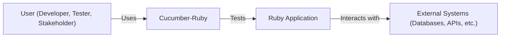
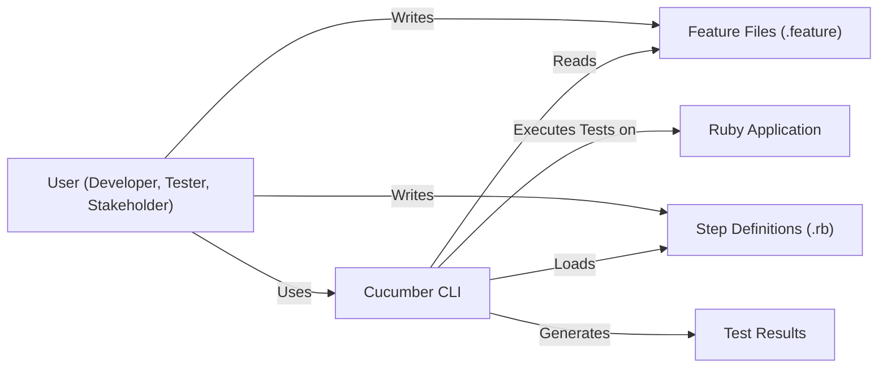
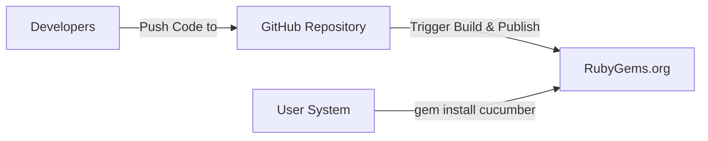
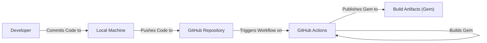

# BUSINESS POSTURE

Business Priorities and Goals:

*   Provide a robust and reliable testing framework (Cucumber-Ruby) that supports Behavior-Driven Development (BDD) for Ruby projects.
*   Enable clear communication and collaboration between developers, testers, and business stakeholders through a common, human-readable language (Gherkin).
*   Facilitate the creation of executable specifications that serve as both documentation and automated tests.
*   Maintain a well-documented, open-source project with an active community and ongoing support.
*   Ensure compatibility with a wide range of Ruby versions and related testing tools.
*   Provide a user-friendly and extensible framework that can be adapted to various project needs.

Business Risks:

*   Vulnerabilities in the framework could lead to incorrect test results, potentially masking critical bugs in applications that rely on Cucumber-Ruby for testing.
*   Supply chain attacks targeting dependencies of Cucumber-Ruby could introduce malicious code into projects using the framework.
*   Lack of proper input validation or sanitization in the framework could expose applications to injection attacks or other security vulnerabilities.
*   Inadequate security controls in the build and deployment process could allow attackers to compromise the integrity of the released software.
*   Failure to address security vulnerabilities promptly could damage the reputation of the project and erode user trust.

# SECURITY POSTURE

Existing Security Controls:

*   security control: The project uses GitHub Actions for continuous integration, which includes automated testing and linting. (Described in GitHub Actions workflows).
*   security control: Dependency management is handled by Bundler, which helps ensure consistent and reproducible builds. (Described in Gemfile and Gemfile.lock).
*   security control: The project has a Code of Conduct to foster a safe and respectful community. (Described in CODE_OF_CONDUCT.md).
*   security control: The project uses RuboCop for static code analysis to enforce coding standards and identify potential issues. (Described in .rubocop.yml).
*   security control: The project's test suite includes security-related scenarios to verify the correct handling of potentially malicious input. (Implicit in test suite).

Accepted Risks:

*   accepted risk: The project relies on third-party dependencies, which may introduce vulnerabilities that are outside the direct control of the Cucumber-Ruby maintainers.
*   accepted risk: While the project aims to be secure, there is always a residual risk of unknown vulnerabilities or zero-day exploits.

Recommended Security Controls:

*   security control: Implement a Software Bill of Materials (SBOM) generation process to track all dependencies and their versions.
*   security control: Integrate a vulnerability scanning tool (e.g., Dependabot, Snyk) into the CI pipeline to automatically detect known vulnerabilities in dependencies.
*   security control: Conduct regular security audits and penetration testing to identify potential weaknesses in the framework.
*   security control: Establish a clear security vulnerability disclosure and response process.
*   security control: Implement code signing for released artifacts to ensure their integrity and authenticity.

Security Requirements:

*   Authentication: Not directly applicable to the Cucumber-Ruby framework itself, as it's a testing tool. However, any web applications or services used in conjunction with Cucumber-Ruby should implement proper authentication mechanisms.
*   Authorization: Not directly applicable to the framework itself. However, applications being tested should have appropriate authorization controls.
*   Input Validation: Cucumber-Ruby should handle various types of input gracefully, including potentially malicious or unexpected input, without causing crashes or security vulnerabilities. The framework should not execute arbitrary code provided in feature files or step definitions.
*   Cryptography: If Cucumber-Ruby interacts with any APIs or services that require cryptographic operations (e.g., encryption, hashing), it should use well-established and secure cryptographic libraries and algorithms.

# DESIGN

## C4 CONTEXT

Element Descriptions:

*   Element:
    *   Name: User (Developer, Tester, Stakeholder)
    *   Type: Person
    *   Description: Individuals involved in the software development process, including developers writing code, testers creating and executing tests, and business stakeholders defining requirements.
    *   Responsibilities: Writing feature files, implementing step definitions, running tests, and analyzing results.
    *   Security controls: Not directly applicable to the user in the context of the framework itself.

*   Element:
    *   Name: Cucumber-Ruby
    *   Type: Software System
    *   Description: The Cucumber-Ruby testing framework.
    *   Responsibilities: Parsing feature files, executing step definitions, and reporting test results.
    *   Security controls: Input validation, secure handling of dependencies, secure build and deployment process.

*   Element:
    *   Name: Ruby Application
    *   Type: Software System
    *   Description: The Ruby application being tested using Cucumber-Ruby.
    *   Responsibilities: Implementing the business logic and functionality of the application.
    *   Security controls: Authentication, authorization, input validation, output encoding, secure communication, etc. (These are the responsibility of the application, not Cucumber-Ruby itself).

*   Element:
    *   Name: External Systems (Databases, APIs, etc.)
    *   Type: Software System
    *   Description: External systems that the Ruby application interacts with.
    *   Responsibilities: Providing data or services to the Ruby application.
    *   Security controls: Authentication, authorization, data encryption, secure communication, etc. (These are the responsibility of the external systems, not Cucumber-Ruby).

## C4 CONTAINER

Element Descriptions:

*   Element:
    *   Name: User (Developer, Tester, Stakeholder)
    *   Type: Person
    *   Description: Individuals involved in the software development process.
    *   Responsibilities: Writing feature files, implementing step definitions, running tests, and analyzing results.
    *   Security controls: Not directly applicable.

*   Element:
    *   Name: Cucumber CLI
    *   Type: Container (Command-Line Interface)
    *   Description: The command-line interface for interacting with Cucumber-Ruby.
    *   Responsibilities: Parsing command-line arguments, loading feature files and step definitions, executing tests, and reporting results.
    *   Security controls: Input validation, secure handling of command-line arguments.

*   Element:
    *   Name: Feature Files (.feature)
    *   Type: Container (Text Files)
    *   Description: Plain-text files written in Gherkin that describe the desired behavior of the application.
    *   Responsibilities: Defining scenarios and steps in a human-readable format.
    *   Security controls: None (These are input files, not executable code).

*   Element:
    *   Name: Step Definitions (.rb)
    *   Type: Container (Ruby Code)
    *   Description: Ruby code that maps the steps in feature files to executable actions.
    *   Responsibilities: Implementing the logic to interact with the application and perform assertions.
    *   Security controls: Secure coding practices, avoiding execution of arbitrary code from feature files.

*   Element:
    *   Name: Test Results
    *   Type: Container (Report)
    *   Description: The output of the Cucumber test run, typically in a human-readable or machine-readable format (e.g., HTML, JSON).
    *   Responsibilities: Reporting the results of the test execution, including passed, failed, and pending steps.
    *   Security controls: None (This is output data).

*   Element:
    *   Name: Ruby Application
    *   Type: Software System
    *   Description: The application under test.
    *   Responsibilities: Implementing business logic.
    *   Security controls: Authentication, authorization, input validation, etc. (These are the responsibility of the application, not Cucumber-Ruby).

## DEPLOYMENT

Possible Deployment Solutions:

1.  RubyGems: Cucumber-Ruby is primarily distributed as a gem through RubyGems.
2.  Docker: Cucumber-Ruby can be used within Docker containers for testing applications in isolated environments.
3.  CI/CD Pipelines: Cucumber-Ruby is often integrated into CI/CD pipelines (e.g., GitHub Actions, Jenkins) to automate testing as part of the build and deployment process.

Chosen Solution (RubyGems):

Element Descriptions:

*   Element:
    *   Name: Developers
    *   Type: Person
    *   Description: Individuals contributing to the Cucumber-Ruby project.
    *   Responsibilities: Writing code, tests, and documentation.
    *   Security controls: Code review, secure coding practices.

*   Element:
    *   Name: GitHub Repository
    *   Type: Infrastructure Node (Version Control System)
    *   Description: The source code repository for Cucumber-Ruby.
    *   Responsibilities: Storing the project's code, managing versions, and facilitating collaboration.
    *   Security controls: Access controls, branch protection rules, code scanning.

*   Element:
    *   Name: RubyGems.org
    *   Type: Infrastructure Node (Package Repository)
    *   Description: The public repository for Ruby gems.
    *   Responsibilities: Hosting and distributing released versions of Cucumber-Ruby.
    *   Security controls: Package signing (optional), vulnerability scanning, access controls.

*   Element:
    *   Name: User System
    *   Type: Infrastructure Node (Development/Testing Environment)
    *   Description: The system where a user installs and uses Cucumber-Ruby.
    *   Responsibilities: Running Cucumber tests.
    *   Security controls: Secure configuration, up-to-date software.

## BUILD

Build Process Description:

1.  A developer commits code changes to their local machine.
2.  The changes are pushed to the Cucumber-Ruby GitHub repository.
3.  This triggers a GitHub Actions workflow.
4.  The workflow checks out the code, sets up the Ruby environment, and installs dependencies.
5.  The workflow runs the test suite using RSpec and Cucumber.
6.  If the tests pass, the workflow builds the Cucumber-Ruby gem.
7.  The built gem is then published as a build artifact and potentially to RubyGems.org (deployment step).

Security Controls:

*   security control: GitHub Actions workflows are defined in YAML files within the repository, ensuring that the build process is version-controlled and auditable.
*   security control: The workflow uses Bundler to manage dependencies, ensuring consistent and reproducible builds.
*   security control: The workflow runs the test suite, which includes security-related scenarios, to verify the integrity and security of the code.
*   security control: The workflow can be configured to use static analysis tools (e.g., RuboCop) to identify potential code quality and security issues.
*   security control: The workflow can be integrated with vulnerability scanning tools (e.g., Dependabot, Snyk) to detect known vulnerabilities in dependencies.

# RISK ASSESSMENT

Critical Business Processes:

*   The primary critical business process is providing a reliable and secure testing framework for Ruby applications. This includes ensuring the accuracy of test results, protecting against supply chain attacks, and maintaining the integrity of the released software.

Data Sensitivity:

*   Cucumber-Ruby itself does not handle sensitive data directly. However, it is used to test applications that may process sensitive data. The framework should be designed to avoid introducing vulnerabilities that could expose or compromise this data. Feature files and step definitions might contain sensitive information (e.g., credentials, API keys) if not managed properly. This is a risk associated with *using* Cucumber-Ruby, not with Cucumber-Ruby itself.

# QUESTIONS & ASSUMPTIONS

Questions:

*   Are there any specific compliance requirements (e.g., PCI DSS, HIPAA) that apply to applications commonly tested with Cucumber-Ruby?
*   What is the expected level of security expertise of the typical Cucumber-Ruby user?
*   Are there any plans to integrate Cucumber-Ruby with other security tools or services?
*   What is the process for handling security vulnerabilities reported by external researchers?
*   Is there a dedicated security team or individual responsible for the security of Cucumber-Ruby?

Assumptions:

*   business posture: The Cucumber-Ruby project prioritizes security and aims to provide a secure testing framework.
*   business posture: The project maintainers are responsive to security concerns and will address vulnerabilities promptly.
*   security posture: Users of Cucumber-Ruby are responsible for the security of their own applications and for securely managing any sensitive data used in tests.
*   security posture: The build and deployment process for Cucumber-Ruby is reasonably secure, but there is always room for improvement.
*   design: The primary distribution method for Cucumber-Ruby is through RubyGems.
*   design: GitHub Actions is the primary CI/CD platform used for building and testing Cucumber-Ruby.