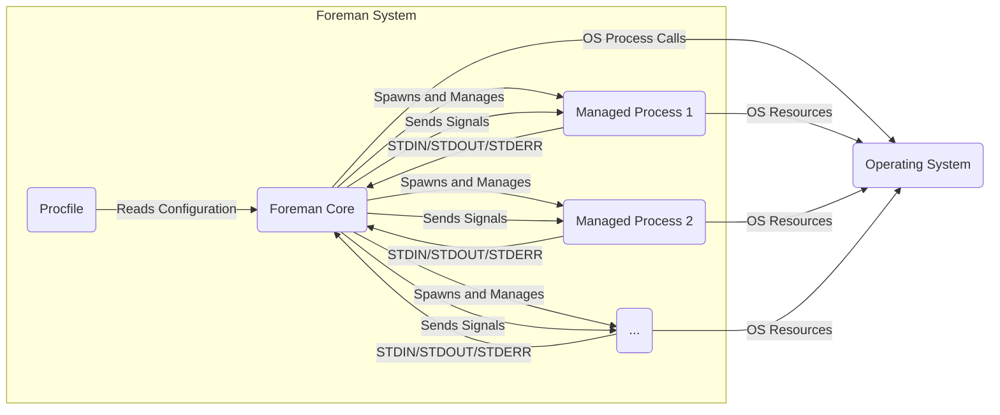
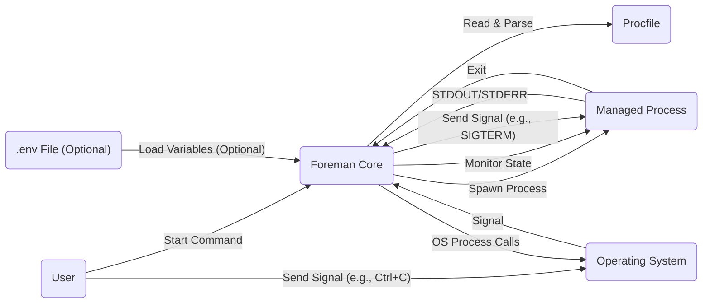

## Project Design Document: Foreman (Improved)

**1. Introduction**

This document provides a comprehensive design specification for the Foreman project, a utility designed to manage and execute multiple application processes as defined within a `Procfile`. The primary objective of this document is to offer a clear and detailed understanding of Foreman's architecture, components, and operational flow. This detailed design will serve as the foundation for subsequent threat modeling activities, enabling a thorough assessment of potential security vulnerabilities.

**2. Goals and Non-Goals**

* **Goals:**
    * To provide a straightforward mechanism for developers to define and manage application processes using a declarative `Procfile`.
    * To simplify the execution and lifecycle management (starting, stopping, restarting) of multiple interconnected application processes.
    * To abstract the underlying operating system process management complexities, offering a consistent interface.
    * To facilitate running applications composed of multiple processes in both development and production-like environments.
    * To offer basic real-time monitoring of the standard output and error streams of managed processes.

* **Non-Goals:**
    * Comprehensive application deployment automation, including infrastructure provisioning, scaling, or complex orchestration workflows.
    * Advanced application performance monitoring, alerting, or metrics collection beyond basic output stream observation.
    * Sophisticated inter-process communication mechanisms beyond standard input/output and operating system signals.
    * Robust security hardening measures beyond basic process isolation provided by the underlying operating system.
    * Built-in user authentication, authorization, or access control mechanisms for Foreman itself.

**3. System Architecture**

The Foreman system is architected around a central core that interacts with the operating system to manage application processes defined in a `Procfile`. The key components are:

* **Foreman Core:** The central control unit responsible for parsing the `Procfile`, spawning and managing the lifecycle of application processes, and aggregating their output.
* **Procfile:** A declarative configuration file specifying the application's processes and their execution commands.
* **Managed Processes:** The individual application processes launched and supervised by the Foreman Core.
* **Standard Streams (STDIN, STDOUT, STDERR):** The standard communication channels between the Foreman Core and the managed processes.
* **Operating System Signals:** The primary mechanism used by the Foreman Core to control and interact with the managed processes.

**3.1. High-Level Architecture Diagram**

**3.2. Detailed Component Description**

* **Foreman Core:**
    * **Procfile Parser:** Responsible for reading and interpreting the `Procfile`, extracting process names and their corresponding execution commands. This component handles syntax validation of the `Procfile`.
    * **Process Spawner:** Utilizes operating system-level calls (e.g., `fork`, `exec` on Unix-like systems) to create new processes based on the definitions in the parsed `Procfile`. It manages the environment variables passed to these processes.
    * **Process Manager:** Tracks the state of each managed process (e.g., running, starting, stopping, crashed). It maintains a list of active processes and their associated process IDs (PIDs).
    * **Signal Handler:**  Intercepts and processes operating system signals (e.g., `SIGTERM`, `SIGINT`, `SIGHUP`). This component determines the appropriate action to take based on the received signal, such as gracefully terminating processes or restarting them.
    * **Output Aggregator:** Collects and potentially timestamps the standard output (STDOUT) and standard error (STDERR) streams from each managed process. It typically multiplexes these streams to the Foreman's own output, providing a consolidated view of the application's activity.
    * **Environment Variable Loader:**  Handles the loading and management of environment variables that are made available to the managed processes. This may involve reading from `.env` files or inheriting environment variables from the Foreman's execution environment.

* **Procfile:**
    * A plain text file adhering to a specific syntax. Each line defines a process type (e.g., `web`, `worker`) and the command to execute for that process type.
    * Example: `web: bundle exec rails server -p $PORT`
    * The format typically follows `process_name: command_to_execute`.

* **Managed Processes:**
    * Independent operating system processes that are spawned and controlled by the Foreman Core.
    * Execute the commands specified in the `Procfile`.
    * Communicate with the Foreman Core primarily through standard input, standard output, standard error, and operating system signals.
    * Their lifecycle (start, stop, restart) is managed by the Foreman Core.

* **Standard Streams (STDIN, STDOUT, STDERR):**
    * Standard communication channels provided by the operating system.
    * Foreman Core typically captures the STDOUT and STDERR streams of managed processes for logging and display.
    * While less common, Foreman could potentially provide input to managed processes via STDIN.

* **Operating System Signals:**
    * Signals are the primary mechanism for the Foreman Core to control the lifecycle of managed processes.
    * Common signals used include:
        * `SIGTERM`: A signal requesting graceful termination of a process. Foreman typically sends this first.
        * `SIGINT`: An interrupt signal, often generated by pressing Ctrl+C in the terminal.
        * `SIGHUP`: A hangup signal, which can be used to request a process to reload its configuration.
        * `SIGKILL`: A signal that forces immediate termination of a process. Foreman typically uses this as a last resort if `SIGTERM` is ignored.

**4. Data Flow**

The primary data flow within the Foreman system involves the following stages:

1. **Initialization:**
    * The user initiates the execution of the Foreman Core, typically by running a command-line interface.
    * The Foreman Core reads and parses the `Procfile` to understand the processes that need to be managed.
    * Environment variables are loaded and prepared for use by the managed processes.

2. **Process Spawning:**
    * For each process defined in the `Procfile`, the Process Spawner component of the Foreman Core utilizes operating system calls to create new processes.
    * Environment variables are passed to the newly spawned processes.
    * The Foreman Core starts monitoring the state of these newly created processes.

3. **Runtime Operation and Monitoring:**
    * Managed processes execute their designated commands.
    * Managed processes may write data to their standard output (STDOUT) and standard error (STDERR) streams.
    * The Output Aggregator component of the Foreman Core captures and aggregates these STDOUT and STDERR streams, often displaying them in a unified and potentially timestamped manner.
    * The Process Manager component continuously monitors the status of the managed processes, detecting crashes or unexpected exits.

4. **Signal Handling and Process Control:**
    * When the Foreman Core receives an operating system signal (e.g., from the user initiating a shutdown or a system event), the Signal Handler component intercepts it.
    * Based on the type of signal received, the Foreman Core sends appropriate signals to the managed processes. For example, upon receiving `SIGTERM`, Foreman will send `SIGTERM` to all managed processes to initiate a graceful shutdown.
    * Managed processes react to these signals, typically by performing cleanup operations and then exiting.

5. **Shutdown:**
    * Upon receiving a termination signal (e.g., `SIGINT` or `SIGTERM`), the Foreman Core initiates the shutdown sequence.
    * It sends termination signals (typically `SIGTERM`) to all running managed processes.
    * The Foreman Core waits for the managed processes to exit gracefully. If processes do not exit within a reasonable timeframe, it may send a more forceful signal like `SIGKILL`.
    * Once all managed processes have terminated, the Foreman Core itself exits.

**4.1. Data Flow Diagram**

**5. Security Considerations (Detailed)**

This section expands on potential security considerations, providing more specific examples of potential threats that will be further analyzed during the threat modeling process.

* **Procfile Injection Vulnerability:** If the `Procfile` is sourced from an untrusted location or can be modified by an attacker, malicious commands could be injected into the process definitions. When Foreman parses and executes these commands, it could lead to arbitrary code execution on the host system with the privileges of the Foreman process.
* **Insufficient Process Isolation:** While Foreman relies on the operating system for process isolation, vulnerabilities in the OS or misconfigurations could allow managed processes to interfere with each other, access sensitive data belonging to other processes, or even compromise the host system. Containerization technologies can mitigate this but are outside Foreman's core functionality.
* **Exposure of Sensitive Environment Variables:** If sensitive information (e.g., API keys, database credentials) is stored in environment variables and not handled securely, it could be exposed through process listings or memory dumps. Improperly secured `.env` files also pose a risk.
* **Log Data Security:** The logs generated by Foreman and the managed processes might contain sensitive information. If these logs are not stored and accessed securely, they could be targets for unauthorized access or tampering.
* **Resource Exhaustion Attacks:** A maliciously crafted `Procfile` could define a large number of processes or processes that consume excessive resources (CPU, memory, network), leading to a denial-of-service condition on the host system.
* **Signal Handling Exploits:** Although less common, vulnerabilities in Foreman's signal handling logic could potentially be exploited to cause unexpected behavior, such as forcing restarts or preventing proper shutdown of processes.
* **Dependency on Underlying OS Security:** Foreman's security is inherently tied to the security of the underlying operating system. Vulnerabilities in the OS kernel or system libraries could be exploited to bypass Foreman's intended security boundaries.
* **Lack of Input Validation:** Foreman might not perform extensive validation on the commands specified in the `Procfile`. This could allow for the execution of commands with unexpected or dangerous arguments.

**6. Deployment Considerations**

* Foreman is typically deployed as a command-line utility on the target machine where the application processes need to be executed.
* It requires read access to the `Procfile` and execute permissions for the commands specified within it.
* In development environments, Foreman is often run directly by developers.
* In production environments, Foreman might be used in conjunction with process supervisors (e.g., systemd, Upstart) or container orchestration platforms (e.g., Docker, Kubernetes) to ensure high availability and resilience.
* Security considerations during deployment include ensuring the `Procfile` is stored securely and that the user running Foreman has appropriate (and least) privileges.

**7. Future Considerations (Potential Enhancements)**

* **Enhanced Process Monitoring and Health Checks:** Integrating more sophisticated mechanisms for monitoring the health and performance of managed processes, potentially including custom health check endpoints.
* **Remote Management Interface:** Adding an API or command-line interface to allow for remote management of Foreman instances and their managed processes. This would introduce new security considerations related to authentication and authorization.
* **Improved Security Hardening:** Implementing features such as process sandboxing (e.g., using seccomp or AppArmor profiles) to further isolate managed processes.
* **More Robust Input Validation for Procfile:** Implementing stricter validation of the commands and arguments specified in the `Procfile` to prevent the execution of potentially harmful commands.
* **Integration with Logging and Monitoring Systems:** Providing built-in support for forwarding logs and metrics to external logging and monitoring platforms.
* **Support for Process Dependencies and Orchestration:**  Adding features to define dependencies between processes and manage their startup and shutdown order more explicitly.

This improved design document provides a more detailed and nuanced understanding of the Foreman project, offering a stronger foundation for subsequent threat modeling activities. The expanded descriptions of components, data flow, and security considerations aim to facilitate a more thorough and effective security assessment.