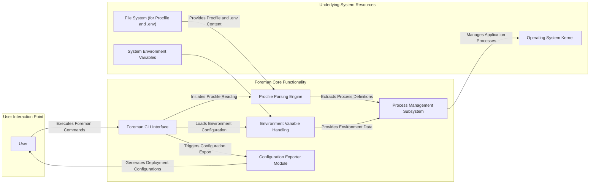
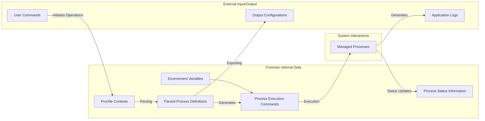

# Project Design Document: Foreman

**Version:** 1.1
**Date:** October 26, 2023
**Author:** Gemini (AI Language Model)

## 1. Introduction

This document provides an enhanced and detailed design overview of the Foreman project, a tool designed for managing applications based on the structure defined in a `Procfile`. It thoroughly outlines the system's architecture, delves deeper into the functionality of its key components, clarifies data flow, and expands on deployment and security considerations. This document is specifically crafted to serve as a robust foundation for subsequent threat modeling exercises.

## 2. Goals and Objectives

The core goals and objectives of the Foreman project are:

* To significantly simplify the process of managing and executing applications whose structure and dependencies are described within a `Procfile`.
* To ensure a consistent and reproducible method for running these applications across various environments, from development workstations to production servers.
* To facilitate the management of multiple independent processes that constitute an application, offering control over their lifecycle.
* To provide flexible mechanisms for exporting application configurations into formats suitable for different deployment platforms and process supervisors.
* To abstract away the complexities of process management, allowing developers to focus on application logic.

## 3. Target Audience

This document is primarily intended for:

* Security architects and engineers tasked with performing threat modeling and security assessments of systems employing Foreman.
* Developers and operations personnel requiring a comprehensive and in-depth understanding of Foreman's internal architecture and operational mechanisms.
* Individuals involved in the design, development, deployment, maintenance, and security auditing of applications that leverage Foreman for process management.

## 4. System Architecture

Foreman's architecture is centered around the interpretation of a `Procfile` and the subsequent management of the processes defined within it. The system orchestrates the reading of configuration, the launching and monitoring of processes, and the potential export of configurations.

**Detailed Component Descriptions:**

* **User:** The entity interacting with Foreman, typically a developer or operator using the command-line interface.
* **Foreman CLI Interface:** The primary command-line interface through which users interact with Foreman. It handles command parsing, argument validation, and orchestrates the execution of other internal components.
* **Procfile Parsing Engine:** This component is responsible for reading, interpreting, and validating the syntax of the `Procfile`. It extracts the definitions of each process type and their associated execution commands.
* **Process Management Subsystem:** The core of Foreman, responsible for the lifecycle management of application processes. This includes starting, stopping, restarting, and monitoring the processes defined in the `Procfile`. It directly interacts with the operating system to manage these processes.
* **Environment Variable Handling:** This module manages the loading and provision of environment variables to the application processes. It typically loads variables from a `.env` file (if present) and merges them with system environment variables.
* **Configuration Exporter Module:** This component generates configuration files in various formats (e.g., Systemd unit files, Upstart configurations) based on the `Procfile` definitions. This facilitates the deployment of Foreman-managed applications to different platforms.
* **Operating System Kernel:** The underlying operating system kernel that provides the necessary functionalities for process creation, management, and resource allocation.
* **System Environment Variables:**  Environment variables set at the system level, which can be inherited or overridden by Foreman.
* **File System (for Procfile and .env):** The file system where the `Procfile` and optional `.env` files are located.

## 5. Data Flow

The flow of data within Foreman encompasses the reading of configuration files, the management of process states, and the generation of output.

**Detailed Data Flow Description:**

* **User Commands:**  Commands issued by the user through the Foreman CLI to initiate actions like starting, stopping, or exporting the application.
* **Output Configurations:** The generated configuration files for different deployment targets, produced by the Exporter module.
* **Application Logs:** Log output generated by the managed application processes.
* **Procfile Contents:** The raw content of the `Procfile`, defining the application's processes.
* **Environment Variables:** The collection of environment variables loaded from the system and `.env` file.
* **Parsed Process Definitions:** The structured representation of the processes after the `Procfile` has been parsed.
* **Process Execution Commands:** The specific commands that will be executed for each defined process.
* **Process Status Information:**  Data regarding the current state of the managed processes (e.g., running, stopped, PID, resource usage).
* **Managed Processes:** The actual application processes being managed by Foreman.

## 6. Key Components in Detail

* **Foreman CLI Interface:**
    * **Functionality:** Acts as the primary interface for user interaction. It parses user commands, validates input, and orchestrates the execution of internal Foreman functionalities. It handles different commands such as `start`, `export`, `run`, etc.
    * **Security Considerations:**  Susceptible to command injection vulnerabilities if user-provided input is not properly sanitized before being passed to shell commands or internal functions. Access control mechanisms for Foreman commands might be relevant in shared environments. Input validation is crucial to prevent unexpected behavior.

* **Procfile Parsing Engine:**
    * **Functionality:**  Reads and interprets the `Procfile`, adhering to its defined syntax. It extracts process names and their corresponding execution commands. It might also perform basic validation of the `Procfile` content.
    * **Security Considerations:**  Vulnerabilities could arise if the parser is not robust and can be exploited through maliciously crafted `Procfile` content, potentially leading to arbitrary code execution or denial of service. The parser should handle unexpected or malformed input gracefully.

* **Process Management Subsystem:**
    * **Functionality:**  Manages the lifecycle of application processes. This includes starting processes as child processes of the Foreman process, monitoring their status, and providing mechanisms for stopping or restarting them. It interacts directly with the operating system's process management capabilities (e.g., `fork`, `exec`, signal handling).
    * **Security Considerations:**  Needs to ensure secure process execution, preventing privilege escalation or unintended access to system resources. Proper isolation of managed processes is essential to prevent one compromised process from affecting others. The subsystem should handle signals and process termination securely.

* **Environment Variable Handling:**
    * **Functionality:**  Loads environment variables, typically from a `.env` file, and merges them with existing system environment variables. These variables are then made available to the managed application processes.
    * **Security Considerations:**  Sensitive information (e.g., API keys, database credentials) is often stored in `.env` files. Secure handling and storage of these files are paramount. Foreman needs to prevent the accidental exposure of these variables to unauthorized processes or through insecure logging. Permissions on `.env` files are critical.

* **Configuration Exporter Module:**
    * **Functionality:**  Generates configuration files in various formats (e.g., Systemd unit files, Upstart configurations, Docker Compose files). This simplifies the deployment of Foreman-managed applications to different target platforms.
    * **Security Considerations:**  The generated configuration files should be secure and not introduce vulnerabilities in the target deployment environment. Care must be taken to avoid embedding sensitive information directly in the generated files. The exporter should adhere to the security best practices of the target configuration format.

## 7. Deployment Model

Foreman is commonly deployed in the following scenarios:

* **Local Development Environments:** Developers use Foreman to easily run and manage their application's processes on their local machines, mirroring the setup they might have in production.
* **Server Environments:** Foreman can be used to manage applications on individual servers. In this case, it might be integrated with system-level process managers like Systemd or Upstart using the exporter functionality to ensure processes are started automatically on boot and managed reliably.
* **Containerized Environments (Indirectly):** While not a container orchestrator itself, Foreman's `export` functionality can generate configurations for container orchestration tools like Docker Compose, making it a useful tool in containerized workflows.

## 8. Security Considerations (Detailed)

This section expands upon potential security concerns, providing more specific examples and potential attack vectors.

* **Command Injection Vulnerabilities:**  If Foreman does not properly sanitize user input passed to the CLI or within the `Procfile`, an attacker could inject malicious commands that are then executed by the system with the privileges of the Foreman process. For example, a crafted process name or command in the `Procfile` could execute arbitrary code.
* **Procfile Manipulation Attacks:** If an attacker gains write access to the `Procfile`, they can modify it to include malicious commands that will be executed when Foreman starts the application. This highlights the importance of securing the `Procfile` and its directory.
* **Environment Variable Exposure Risks:**  If the `.env` file containing sensitive information is not properly secured with appropriate file system permissions, unauthorized users could access this information. Additionally, if Foreman logs environment variables or passes them insecurely, this could lead to information disclosure.
* **Inadequate Process Isolation:** If Foreman does not properly isolate the managed processes, a vulnerability in one process could potentially be exploited to gain access to other processes or system resources. Techniques like using separate user accounts or namespaces for each process can mitigate this.
* **Privilege Escalation Potential:**  If Foreman itself runs with elevated privileges, vulnerabilities in its code could be exploited by an attacker to gain those elevated privileges on the system. Running Foreman with the minimum necessary privileges is a key security principle.
* **Supply Chain Vulnerabilities:**  Foreman depends on various libraries and dependencies. If any of these dependencies have known vulnerabilities, they could be exploited to compromise Foreman itself. Regularly updating dependencies and using dependency scanning tools is important.
* **Denial of Service (DoS) Attacks:** An attacker could craft a `Procfile` with a large number of processes or processes that consume excessive resources, potentially overwhelming the system and causing a denial of service. Foreman should have mechanisms to limit resource consumption.
* **Information Disclosure through Logging:**  If Foreman's logging mechanisms inadvertently include sensitive information from the `Procfile`, environment variables, or process output, this could lead to information disclosure. Secure logging practices are essential.

## 9. Future Considerations

Potential future enhancements and considerations for Foreman include:

* **Enhanced Security Features:**
    * **Secure Credential Management:**  Integration with secure secret stores or mechanisms to avoid storing sensitive information directly in `.env` files.
    * **Process Sandboxing:**  Implementing mechanisms to further isolate managed processes, limiting their access to system resources.
    * **Role-Based Access Control (RBAC):**  For environments where multiple users interact with Foreman, implementing RBAC could enhance security.
* **Remote Management Capabilities:**  Allowing users to manage Foreman instances and applications running on remote servers.
* **Web-Based User Interface:**  Providing a graphical user interface for easier management and monitoring of applications.
* **Advanced Monitoring and Logging Integration:**  Deeper integration with monitoring and logging platforms for better observability.
* **Health Checks and Automated Restarts:**  Implementing built-in health check mechanisms for managed processes and automated restart policies.

## 10. Terminology

* **Procfile:** A text file, typically located in the root directory of an application, that defines the different process types of the application and the commands required to execute each process type.
* **Process Type:** A named category of processes within an application (e.g., `web`, `worker`, `scheduler`). Each process type defines a specific role or function within the application.
* **Environment Variable:** A dynamic-named value that can affect the behavior of running processes on a computer. They are often used to configure application settings, API keys, and other sensitive information.
* **CLI:** Command-Line Interface. A text-based interface used to interact with a computer system or application by typing commands.
* **PID:** Process ID. A unique number used by the operating system to identify an active process.

This improved design document provides a more detailed and comprehensive understanding of the Foreman project, specifically tailored for informing thorough threat modeling activities. It clarifies the architecture, data flows, and security considerations, offering a solid foundation for identifying and mitigating potential risks.