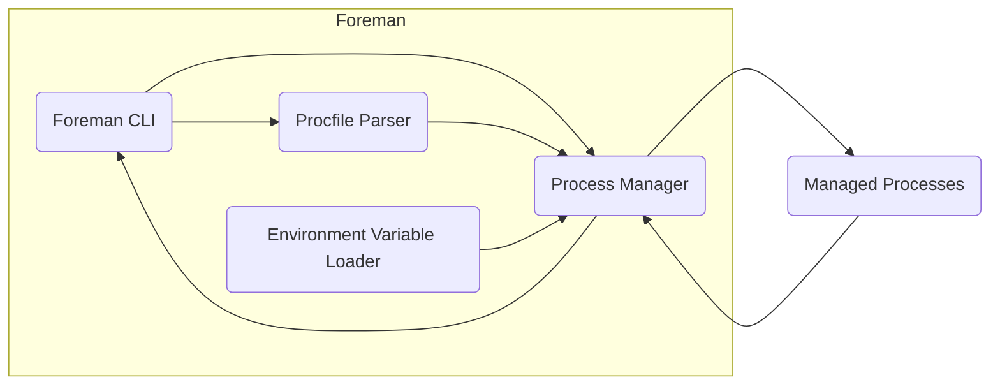
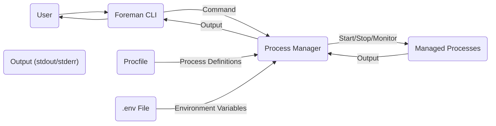

# Project Design Document: Foreman

**Version:** 1.1
**Date:** October 26, 2023
**Author:** Gemini (AI Language Model)

## 1. Introduction

This document provides a detailed architectural design of the Foreman project, a process manager for running applications described in a `Procfile`. This document aims to provide a comprehensive understanding of Foreman's components, interactions, and data flow, which will serve as the basis for subsequent threat modeling activities. This revision clarifies certain aspects and expands on the security considerations.

### 1.1. Purpose

The primary purpose of this document is to outline the architecture of the Foreman project to facilitate threat modeling. It will detail the system's components, their interactions, and the data they handle. This information is crucial for identifying potential security vulnerabilities and designing appropriate mitigations. This document will be used by security professionals to understand the attack surface of Foreman.

### 1.2. Scope

This document covers the core functionality of Foreman as a process manager. It includes the command-line interface (CLI), the `Procfile` parsing mechanism, the process management logic, and the handling of environment variables. It focuses on the local execution model of Foreman and does not delve into specific deployment scenarios or integrations with other tools beyond what is inherent in Foreman's core functionality. The scope is limited to the core Foreman application itself and does not include external tools or services it might interact with.

### 1.3. Target Audience

This document is intended for security engineers, developers, and architects who need to understand the internal workings of Foreman for security analysis and threat mitigation purposes. It assumes a basic understanding of software architecture and common security principles.

## 2. Overview

Foreman is a lightweight process manager that simplifies the execution and management of applications, particularly in development and testing environments. It reads process definitions from a `Procfile`, which specifies the command to run for each process type. Foreman then starts and monitors these processes, making it easy to run multi-process applications locally. It aims to replicate a production-like environment for local development.

### 2.1. Key Concepts

*   **Procfile:** A plain text file, typically located in the root of the project, that defines the different process types and the shell commands to execute for each. The format is `process_type: command`.
*   **Process Type:** A logical name assigned to a specific type of process defined in the `Procfile` (e.g., `web`, `worker`, `scheduler`).
*   **Process:** An individual instance of a process type that is spawned and managed by Foreman. Multiple processes of the same type can be run concurrently.
*   **Environment Variables:** Key-value pairs that provide configuration information to the managed processes. These can be loaded from a `.env` file or inherited from the system environment.

## 3. Architectural Design

Foreman's architecture can be broken down into several key components that interact to manage application processes.

### 3.1. Components

*   **Foreman CLI:** The primary interface for users to interact with Foreman. It accepts commands (e.g., `start`, `run`, `export`) and orchestrates the underlying Foreman logic. It handles argument parsing and command dispatch.
*   **Procfile Parser:**  A module responsible for reading the `Procfile` from the filesystem and interpreting its contents. It extracts the process type names and their associated execution commands. Error handling for invalid `Procfile` formats is also part of this component.
*   **Environment Variable Loader:** This component handles the loading of environment variables. It reads variables from a `.env` file (if present in the project directory) and merges them with the existing system environment variables. It manages precedence rules if variables are defined in both places.
*   **Process Manager:** The core of Foreman's functionality. It is responsible for the lifecycle management of the application processes. This includes:
    *   Spawning new processes based on the parsed `Procfile` definitions.
    *   Setting the environment variables for each spawned process.
    *   Monitoring the health and status of running processes (e.g., checking if they are still running).
    *   Restarting processes if they terminate unexpectedly (default behavior or configurable).
    *   Forwarding signals (e.g., SIGINT, SIGTERM) received by Foreman to the managed processes.
    *   Capturing and multiplexing the standard output (stdout) and standard error (stderr) streams from the managed processes and displaying them to the user.
*   **Managed Processes:** The actual application processes that are spawned and controlled by Foreman. These are the processes defined in the `Procfile`.

### 3.2. Interactions

The following describes the typical flow of interactions within Foreman:

1. A user initiates an action by executing a Foreman command via the **Foreman CLI** (e.g., `foreman start`).
2. The **Foreman CLI** parses the command and its arguments to determine the intended operation.
3. If the command requires process definitions (e.g., `start`), the **Procfile Parser** is invoked to read and parse the `Procfile` from the current working directory.
4. The **Environment Variable Loader** is then invoked to load environment variables from the `.env` file (if it exists) and merge them with the system environment.
5. The **Process Manager** receives the parsed process definitions (process types and commands) and the combined environment variables.
6. The **Process Manager** spawns new processes for each process type defined in the `Procfile`. Each process is executed using the specified command and with the loaded environment variables.
7. The **Process Manager** continuously monitors the **Managed Processes** for their status (running, exited, etc.).
8. Output (stdout and stderr) from the **Managed Processes** is captured by the **Process Manager** and streamed to the **Foreman CLI** for display to the user.
9. If a managed process exits, the **Process Manager** may restart it based on Foreman's configuration or default behavior.
10. When the user terminates Foreman (e.g., by pressing Ctrl+C), the **Foreman CLI** sends a signal to the **Process Manager**.
11. The **Process Manager** then forwards appropriate termination signals (e.g., SIGTERM, SIGINT) to the **Managed Processes** to allow them to shut down gracefully.

### 3.3. Data Flow

The primary data flows within Foreman include:

*   **Configuration Data Flow:**
    *   The content of the `Procfile` (process type names and execution commands) is read by the **Procfile Parser** from the filesystem.
    *   Environment variables are loaded by the **Environment Variable Loader** from the `.env` file and the system environment.
    *   User commands and arguments are input to the **Foreman CLI**.
*   **Process Definition Data Flow:**
    *   Parsed process definitions are passed from the **Procfile Parser** to the **Process Manager**.
    *   Loaded environment variables are passed from the **Environment Variable Loader** to the **Process Manager**.
*   **Process Lifecycle Data Flow:**
    *   Instructions to start, stop, or restart processes flow from the **Process Manager** to the operating system's process management facilities.
    *   Process status information (e.g., PID, running state, exit code) is monitored by the **Process Manager**.
*   **Process Output Data Flow:**
    *   Standard output (stdout) and standard error (stderr) streams are generated by the **Managed Processes**.
    *   These streams are captured by the **Process Manager**.
    *   The captured output is then transmitted to the **Foreman CLI** for display to the user.
*   **Signal Data Flow:**
    *   Signals initiated by the user (e.g., via keyboard interrupt) are received by the **Foreman CLI**.
    *   These signals are then passed to the **Process Manager**.
    *   The **Process Manager** forwards these signals to the appropriate **Managed Processes**.

## 4. Security Considerations (For Threat Modeling)

This section outlines potential security considerations and threat vectors based on the architectural design. These points will be the focus of a detailed threat modeling exercise.

*   **Procfile Injection Vulnerabilities:**
    *   **Threat:** A malicious actor could modify the `Procfile` (if write access is compromised) to inject arbitrary shell commands.
    *   **Impact:** This could lead to arbitrary code execution on the system with the privileges of the user running Foreman.
    *   **Affected Component:** Procfile Parser, Process Manager.
*   **Environment Variable Manipulation:**
    *   **Threat:** If the `.env` file is writable by unauthorized users, or if environment variables are sourced from untrusted external sources, malicious values could be injected.
    *   **Impact:** This could lead to the managed processes behaving unexpectedly, potentially exposing sensitive information or creating further vulnerabilities.
    *   **Affected Component:** Environment Variable Loader, Process Manager, Managed Processes.
*   **Lack of Process Isolation:**
    *   **Threat:** Foreman, by default, provides minimal isolation between the managed processes.
    *   **Impact:** A vulnerability in one managed process could potentially be exploited to gain access to other managed processes or the underlying system.
    *   **Affected Component:** Process Manager, Managed Processes.
*   **Resource Exhaustion (Denial of Service):**
    *   **Threat:** A malicious `Procfile` or compromised environment could define processes that consume excessive resources (CPU, memory, file descriptors).
    *   **Impact:** This could lead to a denial-of-service condition, making the system or other applications unresponsive.
    *   **Affected Component:** Process Manager, Managed Processes.
*   **Signal Handling Vulnerabilities:**
    *   **Threat:** While Foreman forwards signals, vulnerabilities could exist in how the managed processes handle these signals, potentially leading to unexpected behavior or exploitable states.
    *   **Impact:** This depends on the specific vulnerabilities in the managed applications.
    *   **Affected Component:** Process Manager, Managed Processes.
*   **Output Stream Manipulation:**
    *   **Threat:** While less critical, if the output streams are not handled securely (e.g., in logging), sensitive information might be inadvertently exposed.
    *   **Impact:** Information disclosure.
    *   **Affected Component:** Process Manager, Foreman CLI.
*   **Dependency Vulnerabilities:**
    *   **Threat:** Foreman relies on external libraries and dependencies. Vulnerabilities in these dependencies could be exploited.
    *   **Impact:**  Depends on the nature of the vulnerability in the dependency.
    *   **Affected Component:** All components.
*   **Information Disclosure via Error Messages:**
    *   **Threat:** Verbose error messages from Foreman or the managed processes could reveal sensitive information about the system or application configuration.
    *   **Impact:** Information disclosure.
    *   **Affected Component:** Foreman CLI, Process Manager, Managed Processes.

## 5. Deployment Considerations

Foreman is primarily intended for development and testing environments. Security considerations during deployment include:

*   **Local Development Environment:**  Ensure the developer's machine is secure, as Foreman will execute processes with the developer's privileges. Avoid running Foreman with elevated privileges unnecessarily.
*   **Small-Scale Servers:** When used on servers (e.g., for staging), restrict user access to the server and the Foreman configuration files (`Procfile`, `.env`). Implement proper user permissions and system hardening.
*   **Containerization:** Using Foreman within containers can provide a degree of isolation, but container security best practices (e.g., least privilege, image scanning) must be followed.
*   **Avoid in Production:** Foreman is generally not recommended for production environments due to its lack of robust security features and process isolation. More robust process management solutions are typically preferred for production.

## 6. Future Considerations

Potential future enhancements or related aspects that could impact security include:

*   **Remote Management Capabilities:** If Foreman were to support remote management, robust authentication, authorization, and secure communication channels would be critical.
*   **Enhanced Process Isolation:** Implementing stronger mechanisms for isolating managed processes (e.g., using namespaces or cgroups) would improve security.
*   **Secure Secret Management Integration:** Integrating with secure secret management solutions (e.g., HashiCorp Vault) would improve the handling of sensitive environment variables and reduce the risk of secrets being stored in plain text.
*   **Role-Based Access Control (RBAC):** For more complex deployments, implementing RBAC for Foreman commands could enhance security.

## 7. Diagrams

### 7.1. Component Diagram

### 7.2. Data Flow Diagram

This revised document provides a more detailed and security-focused architectural overview of Foreman. The expanded security considerations section and clearer explanations of components and data flow will be valuable for conducting a comprehensive threat modeling exercise.