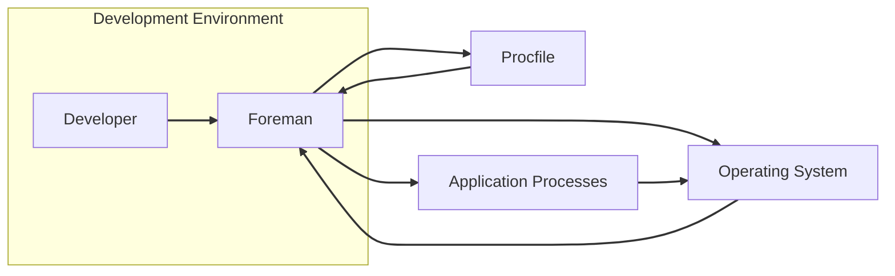
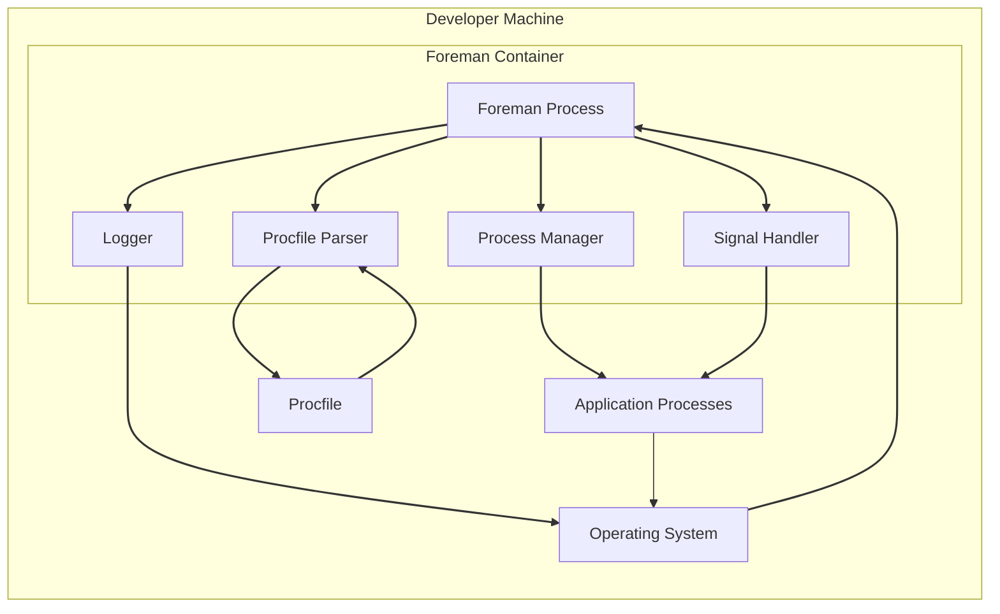
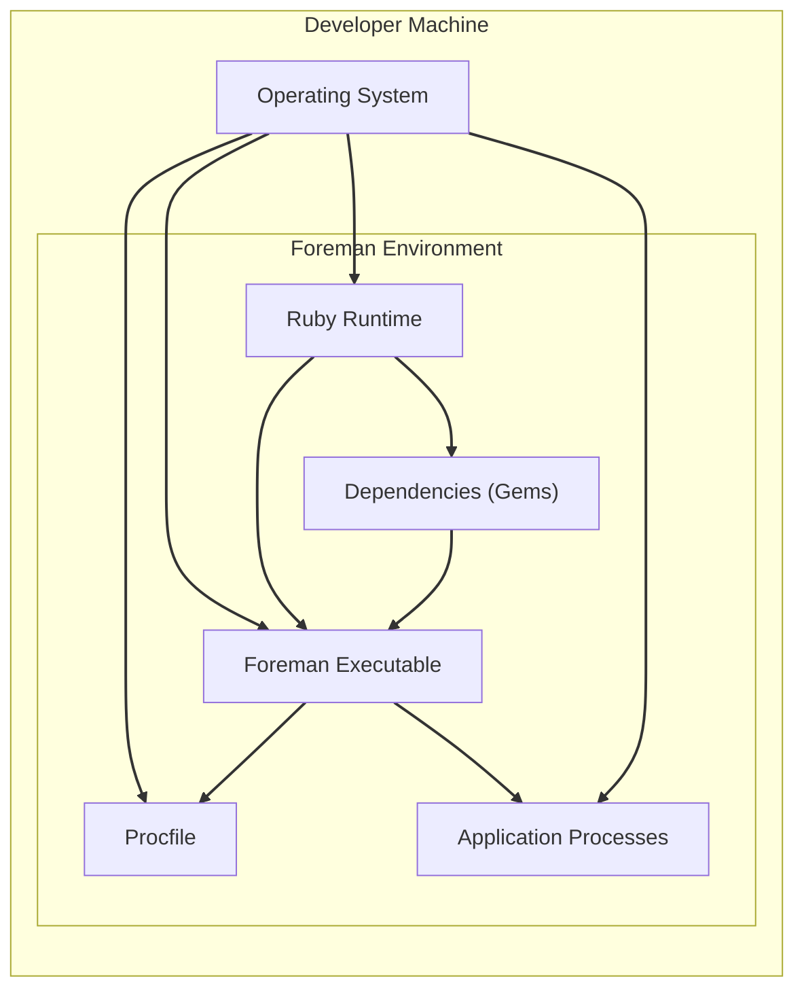
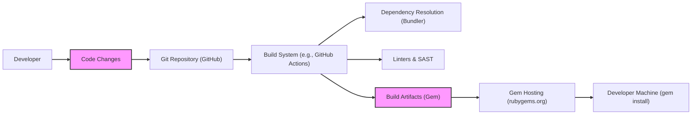

# BUSINESS POSTURE

- Business Priorities and Goals:
 - Goal: To provide developers with a simple and efficient way to manage and run Procfile-based applications locally, mimicking a production-like environment.
 - Priority: Ease of use and developer productivity.
 - Priority: Consistency between development and production environments.
 - Priority: Support for various application types and dependencies managed through Procfiles.

- Business Risks:
 - Risk: Misconfiguration of local development environments leading to discrepancies with production, causing deployment issues.
 - Risk: Security vulnerabilities in Foreman itself or its dependencies could expose developer machines or local development environments.
 - Risk: Lack of standardization in development environments across teams can lead to inconsistencies and collaboration challenges.
 - Risk: Potential for developers to inadvertently expose sensitive data if Foreman is not properly secured or configured.

# SECURITY POSTURE

- Existing Security Controls:
 - security control: Operating system level security controls on developer machines (e.g., user permissions, firewalls). Implemented by: Operating System.
 - security control: Network security controls on developer networks (e.g., firewalls, network segmentation). Implemented by: Network Infrastructure.
 - security control: Code review processes for contributions to the Foreman project itself. Implemented by: Foreman project maintainers (GitHub repository).
 - accepted risk: Reliance on developer machines' security posture, which can vary significantly.
 - accepted risk: Potential vulnerabilities in third-party dependencies used by Foreman.

- Recommended Security Controls:
 - security control: Dependency scanning for Foreman and its dependencies to identify and mitigate known vulnerabilities.
 - security control: Regular security audits of Foreman codebase to identify potential security flaws.
 - security control: Secure configuration guidelines for Foreman to minimize potential security risks.
 - security control: Least privilege principle applied to Foreman processes and file system access.
 - security control: Consider signing releases of Foreman to ensure integrity and authenticity.

- Security Requirements:
 - Authentication:
  - Requirement: Foreman itself does not require user authentication as it is primarily a local development tool.
  - Requirement: If Foreman is extended or used in a shared development environment, consider adding authentication mechanisms to control access.
 - Authorization:
  - Requirement: Foreman should operate with the least privileges necessary to manage processes and access required resources.
  - Requirement: Access to Foreman configuration and control should be limited to authorized developers.
 - Input Validation:
  - Requirement: Foreman should validate inputs from Procfiles and command-line arguments to prevent injection attacks or unexpected behavior.
  - Requirement: Handle errors and exceptions gracefully to avoid exposing sensitive information.
 - Cryptography:
  - Requirement: Cryptography is not a primary requirement for Foreman in its core functionality as a local process manager.
  - Requirement: If Foreman is extended to handle sensitive data or network communication, appropriate cryptographic measures should be implemented to protect data in transit and at rest.

# DESIGN

## C4 CONTEXT

- Elements of Context Diagram:
 - - Name: Developer
   - Type: Person
   - Description: A software developer who uses Foreman to manage and run applications locally during development.
   - Responsibilities: Defines application processes in a Procfile, interacts with Foreman to start, stop, and manage these processes.
   - Security controls: Operating system user account controls, strong passwords, multi-factor authentication for developer accounts (managed by the organization, outside of Foreman).
 - - Name: Foreman
   - Type: Software System
   - Description: A Ruby gem that manages Procfile-based applications, allowing developers to easily run and manage multiple processes locally.
   - Responsibilities: Parses Procfile, starts and stops application processes, manages process lifecycle, forwards signals, provides basic process monitoring.
   - Security controls: Input validation of Procfile content, least privilege execution of managed processes, dependency scanning, code reviews.
 - - Name: Procfile
   - Type: Configuration File
   - Description: A text file that specifies the types of processes required to run an application.
   - Responsibilities: Defines process commands, dependencies, and startup behavior for Foreman to manage.
   - Security controls: File system permissions to restrict access to Procfile, input validation by Foreman when parsing Procfile content.
 - - Name: Operating System
   - Type: Infrastructure
   - Description: The operating system (e.g., macOS, Linux, Windows) on which Foreman and the application processes are executed.
   - Responsibilities: Provides the runtime environment for Foreman and application processes, manages system resources, enforces security policies.
   - Security controls: User account management, access control lists, firewalls, security patches, system hardening.
 - - Name: Application Processes
   - Type: Software System
   - Description: The individual processes defined in the Procfile that constitute the application being developed and managed by Foreman.
   - Responsibilities: Execute the application logic, interact with system resources, and provide the application's functionality.
   - Security controls: Application-level security controls (authentication, authorization, input validation within the application code itself), process isolation provided by the operating system.

## C4 CONTAINER

- Elements of Container Diagram:
 - - Name: Foreman Process
   - Type: Process
   - Description: The main Ruby process running the Foreman application. It orchestrates all other components within the Foreman container.
   - Responsibilities: Initializes and manages Foreman components, handles user commands, and coordinates process management.
   - Security controls: Input validation, error handling, logging, least privilege execution.
 - - Name: Process Manager
   - Type: Component
   - Description: Responsible for starting, stopping, and monitoring application processes defined in the Procfile.
   - Responsibilities: Process lifecycle management, process monitoring, signal forwarding.
   - Security controls: Process isolation (provided by OS), resource management, secure process execution.
 - - Name: Procfile Parser
   - Type: Component
   - Description: Parses the Procfile to extract process definitions and commands.
   - Responsibilities: Reads and interprets Procfile syntax, validates process definitions.
   - Security controls: Input validation of Procfile content, secure file handling.
 - - Name: Signal Handler
   - Type: Component
   - Description: Handles signals (e.g., SIGINT, SIGTERM) sent to Foreman and forwards them to managed application processes.
   - Responsibilities: Graceful shutdown of application processes, signal propagation.
   - Security controls: Secure signal handling, preventing signal injection vulnerabilities.
 - - Name: Logger
   - Type: Component
   - Description: Handles logging of Foreman events and process output.
   - Responsibilities: Logs events, errors, and process output for debugging and monitoring.
   - Security controls: Secure logging practices, preventing log injection vulnerabilities, log rotation and management.
 - - Name: Procfile
   - Type: Configuration File
   - Description: Same as in Context Diagram.
   - Responsibilities: Same as in Context Diagram.
   - Security controls: Same as in Context Diagram.
 - - Name: Operating System
   - Type: Infrastructure
   - Description: Same as in Context Diagram.
   - Responsibilities: Same as in Context Diagram.
   - Security controls: Same as in Context Diagram.
 - - Name: Application Processes
   - Type: Process
   - Description: Same as in Context Diagram.
   - Responsibilities: Same as in Context Diagram.
   - Security controls: Same as in Context Diagram.

## DEPLOYMENT

- Deployment Architecture:
 - Foreman is primarily a development tool and is not typically deployed in a production environment in the same way as an application. However, it is deployed on developer machines. We will describe the deployment on a developer's local machine.

- Elements of Deployment Diagram:
 - - Name: Operating System
   - Type: Infrastructure
   - Description: The operating system (e.g., macOS, Linux, Windows) on the developer's machine.
   - Responsibilities: Provides the base environment for Foreman and its dependencies.
   - Security controls: Operating system security controls (user accounts, firewalls, security updates).
 - - Name: Foreman Executable
   - Type: Software
   - Description: The Foreman Ruby gem executable file installed on the developer's machine.
   - Responsibilities: Runs the Foreman application logic.
   - Security controls: File system permissions, integrity checks (if signed releases are used).
 - - Name: Ruby Runtime
   - Type: Software
   - Description: The Ruby interpreter required to run Foreman, typically installed via system package manager or a Ruby version manager (e.g., rvm, rbenv).
   - Responsibilities: Executes the Foreman Ruby code.
   - Security controls: Keeping Ruby runtime updated with security patches, secure installation practices.
 - - Name: Dependencies (Gems)
   - Type: Software Libraries
   - Description: Ruby gems that Foreman depends on, installed via `gem install`.
   - Responsibilities: Provide necessary functionalities for Foreman.
   - Security controls: Dependency scanning, using trusted gem sources, keeping dependencies updated.
 - - Name: Procfile
   - Type: Configuration File
   - Description: Same as in Context and Container Diagrams. Located in the application's project directory.
   - Responsibilities: Same as in Context and Container Diagrams.
   - Security controls: File system permissions.
 - - Name: Application Processes
   - Type: Software Processes
   - Description: Same as in Context and Container Diagrams. Run as child processes of Foreman.
   - Responsibilities: Same as in Context and Container Diagrams.
   - Security controls: Process isolation, application-level security controls.

## BUILD

- Build Process Description:
 - 1. Developer makes code changes and commits them to a Git repository (e.g., GitHub).
 - 2. A Build System (e.g., GitHub Actions, Jenkins, or manual build process) is triggered upon code changes (e.g., push to repository, tag creation).
 - 3. Dependency Resolution: The build system resolves and downloads project dependencies using a dependency management tool like Bundler for Ruby gems.
 - 4. Linters & SAST: Static analysis security testing (SAST) tools and linters are run to identify potential code quality issues and security vulnerabilities.
 - 5. Build Artifacts: The project is built, and build artifacts are created. For a Ruby gem, this would be a `.gem` file.
 - 6. Gem Hosting: The build artifact (gem file) is published to a gem hosting service like rubygems.org, making it available for download and installation.
 - 7. Developer Machine: Developers install Foreman on their machines using `gem install foreman`, downloading the gem from the hosting service.

- Build Process Security Controls:
 - security control: Secure coding practices followed by developers. Implemented by: Developer training, code reviews.
 - security control: Code repository access control (e.g., GitHub permissions). Implemented by: Git repository hosting platform.
 - security control: Branch protection and pull request reviews. Implemented by: Git repository hosting platform.
 - security control: Automated build pipeline (e.g., GitHub Actions) to ensure consistent and repeatable builds. Implemented by: CI/CD system configuration.
 - security control: Dependency scanning during build process to identify vulnerable dependencies. Implemented by: Dependency scanning tools integrated into CI/CD pipeline.
 - security control: Static Application Security Testing (SAST) tools integrated into the build pipeline to detect code-level vulnerabilities. Implemented by: SAST tools in CI/CD pipeline.
 - security control: Code linting and style checks to improve code quality and reduce potential errors. Implemented by: Linters in CI/CD pipeline.
 - security control: Signing of build artifacts (e.g., gem signing) to ensure integrity and authenticity. Implemented by: Build process and gem signing tools.
 - security control: Secure storage and access control for build artifacts and signing keys. Implemented by: Secure artifact repository, key management practices.
 - security control: Regular security audits of the build pipeline and related infrastructure. Implemented by: Security team, DevOps team.

# RISK ASSESSMENT

- Critical Business Processes:
 - Protecting developer productivity and efficiency by providing a reliable and easy-to-use local development environment.
 - Ensuring consistency between development and production environments to reduce deployment issues.
 - Maintaining the integrity and security of the Foreman tool itself to prevent it from becoming a source of vulnerabilities in developer workflows.

- Data to Protect and Sensitivity:
 - Procfile content: May contain sensitive information like environment variables, command-line arguments, or application configurations. Sensitivity: Medium to High, depending on the content.
 - Application code and data managed by Foreman: Can be highly sensitive, depending on the application being developed. Sensitivity: High, potentially including intellectual property, personal data, or financial information.
 - Developer machine security: Compromise of developer machines can lead to broader security breaches. Sensitivity: High.
 - Foreman gem itself: If compromised, could be used to distribute malware to developers. Sensitivity: High.

# QUESTIONS & ASSUMPTIONS

- Questions:
 - What is the intended scope of usage for Foreman? Is it strictly for individual developer machines, or are there plans for shared development environments?
 - Are there any specific compliance requirements that Foreman needs to adhere to (e.g., PCI DSS, HIPAA, GDPR)?
 - What is the organization's risk appetite regarding the security of developer tools?
 - Are there existing security policies or guidelines that Foreman development and usage should align with?
 - What is the process for reporting and addressing security vulnerabilities in Foreman?

- Assumptions:
 - Foreman is primarily used as a local development tool by individual developers.
 - Security focus is on preventing vulnerabilities in Foreman itself and ensuring it does not introduce security risks to developer machines or workflows.
 - Standard secure software development lifecycle practices are expected for the Foreman project.
 - Developers using Foreman are responsible for the security of their own applications and data managed by Foreman.
 - The organization using Foreman has basic security controls in place for developer machines and networks.