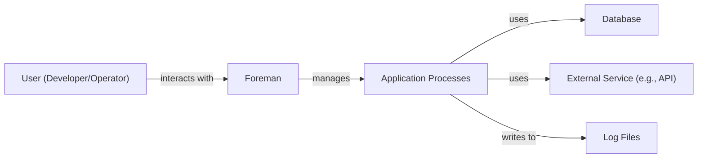
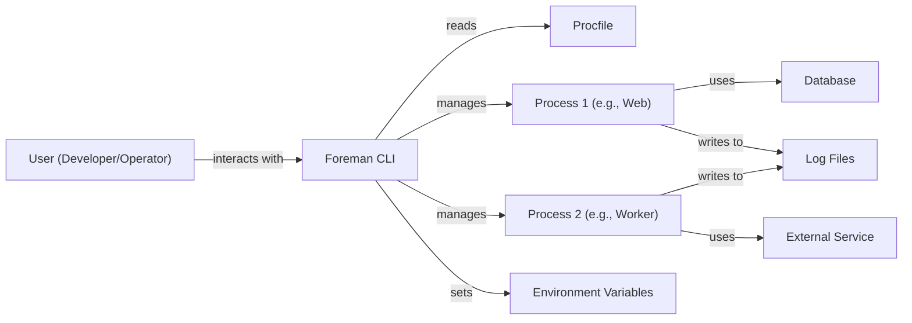
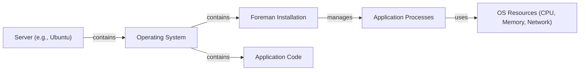
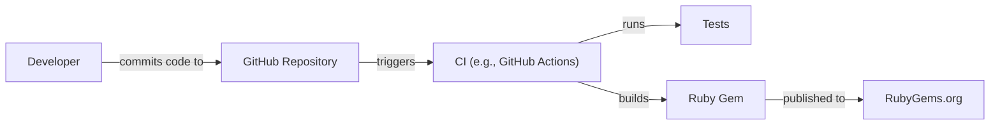

Okay, let's create a design document for the Foreman project.

# BUSINESS POSTURE

Foreman is a process manager that simplifies the development and deployment of applications that run multiple processes.  The primary business goal is to improve developer productivity and operational efficiency by providing a consistent and reliable way to manage application processes across different environments (development, staging, production).  It aims to reduce the complexity of managing Procfile-based applications.

Business Priorities:

*   Developer Productivity: Streamline the process of starting, stopping, and managing application processes.
*   Operational Efficiency: Provide a consistent and reliable way to manage processes in different environments.
*   Application Stability: Ensure that applications can be easily monitored and restarted if necessary.
*   Ease of Use: Offer a simple and intuitive command-line interface.
*   Portability: Support various operating systems and environments.

Business Risks:

*   Inconsistent Process Management: If Foreman fails to manage processes correctly, it could lead to application instability or downtime.
*   Configuration Errors: Incorrectly configured Procfiles or environment variables could lead to application failures.
*   Security Vulnerabilities:  While Foreman itself isn't directly handling sensitive data, vulnerabilities in the managed applications or their dependencies could be exploited. Foreman's role in managing these applications makes it a potential point of interest for attackers.
*   Dependency Conflicts:  Issues with Foreman's dependencies could impact its functionality.
*   Lack of Observability: Insufficient logging or monitoring capabilities could make it difficult to troubleshoot issues.

# SECURITY POSTURE

Foreman, as a process manager, has a limited direct security scope. It primarily relies on the security of the underlying operating system and the applications it manages. However, certain aspects of its design and usage have security implications.

Existing Security Controls:

*   security control: Process Isolation: Foreman leverages the operating system's process isolation mechanisms (e.g., separate processes, user accounts) to prevent interference between different application processes. Implemented by the operating system.
*   security control: Least Privilege: Foreman itself should be run with the least necessary privileges. It doesn't require root access for most operations. Implemented during deployment and operational procedures.
*   security control: Environment Variable Management: Foreman allows managing environment variables, which can be used to store secrets. However, it's crucial to ensure these secrets are not exposed in logs or configuration files. Implemented by user best practices and potentially by integrating with secure environment variable management tools.

Accepted Risks:

*   accepted risk: Dependency Vulnerabilities: Foreman relies on external libraries (e.g., for parsing Procfiles, handling signals). Vulnerabilities in these dependencies could potentially be exploited.
*   accepted risk: Misconfiguration: Incorrectly configured Procfiles or environment variables could lead to security issues in the managed applications.
*   accepted risk: Limited Input Validation: Foreman performs limited input validation on Procfiles and environment variables. It primarily relies on the underlying applications to handle input validation securely.

Recommended Security Controls:

*   security control: Regular Updates: Keep Foreman and its dependencies updated to patch any security vulnerabilities.
*   security control: Integrate with Secret Management: Integrate with secure secret management solutions (e.g., HashiCorp Vault, AWS Secrets Manager, Azure Key Vault) to avoid storing secrets directly in environment variables or configuration files.
*   security control: Enhanced Logging: Implement more comprehensive logging to capture relevant events for security auditing and incident response.

Security Requirements:

*   Authentication: Not directly applicable to Foreman itself, as it's a command-line tool. Authentication is handled by the underlying operating system and any authentication mechanisms within the managed applications.
*   Authorization: Foreman itself doesn't implement authorization. Authorization is the responsibility of the managed applications and the operating system's user/group permissions.
*   Input Validation: Foreman performs basic parsing of Procfiles and environment variables. However, robust input validation is primarily the responsibility of the managed applications.
*   Cryptography: Foreman doesn't directly handle cryptographic operations. Cryptography is the responsibility of the managed applications if they require it (e.g., for secure communication, data encryption).

# DESIGN

## C4 CONTEXT

Element Descriptions:

*   Element:
    *   Name: User (Developer/Operator)
    *   Type: Person
    *   Description: A developer or operator who uses Foreman to manage application processes.
    *   Responsibilities: Interacts with Foreman via the command-line interface to start, stop, and manage applications.
    *   Security controls: Operating system user authentication.

*   Element:
    *   Name: Foreman
    *   Type: Software System
    *   Description: The Foreman process manager.
    *   Responsibilities: Reads Procfiles, manages application processes, handles environment variables, and provides a command-line interface.
    *   Security controls: Process isolation, least privilege execution.

*   Element:
    *   Name: Application Processes
    *   Type: Software System
    *   Description: The processes defined in the Procfile and managed by Foreman.
    *   Responsibilities: Perform the application's core functionality.
    *   Security controls: Application-specific security controls (authentication, authorization, input validation, cryptography, etc.).

*   Element:
    *   Name: Database
    *   Type: Software System
    *   Description: A database used by the application.
    *   Responsibilities: Stores and retrieves application data.
    *   Security controls: Database security controls (authentication, authorization, encryption, etc.).

*   Element:
    *   Name: External Service (e.g., API)
    *   Type: Software System
    *   Description: An external service that the application interacts with.
    *   Responsibilities: Provides external functionality to the application.
    *   Security controls: External service's security controls (authentication, authorization, encryption, etc.).

*   Element:
    *   Name: Log Files
    *   Type: Data Store
    *   Description: Files where application logs are written.
    *   Responsibilities: Store log data for monitoring and troubleshooting.
    *   Security controls: File system permissions, log rotation, and potentially log encryption.

## C4 CONTAINER

Element Descriptions:

*   Element:
    *   Name: User (Developer/Operator)
    *   Type: Person
    *   Description: A developer or operator who uses Foreman to manage application processes.
    *   Responsibilities: Interacts with Foreman via the command-line interface.
    *   Security controls: Operating system user authentication.

*   Element:
    *   Name: Foreman CLI
    *   Type: Container (Command-Line Interface)
    *   Description: The command-line interface for Foreman.
    *   Responsibilities: Parses commands, reads the Procfile, manages processes, and sets environment variables.
    *   Security controls: Least privilege execution.

*   Element:
    *   Name: Procfile
    *   Type: Configuration File
    *   Description: A text file that defines the application's processes.
    *   Responsibilities: Specifies the commands to run for each process type.
    *   Security controls: File system permissions.

*   Element:
    *   Name: Process 1 (e.g., Web)
    *   Type: Container (Process)
    *   Description: An instance of an application process (e.g., a web server).
    *   Responsibilities: Handles web requests.
    *   Security controls: Application-specific security controls.

*   Element:
    *   Name: Process 2 (e.g., Worker)
    *   Type: Container (Process)
    *   Description: An instance of an application process (e.g., a background worker).
    *   Responsibilities: Performs background tasks.
    *   Security controls: Application-specific security controls.

*   Element:
    *   Name: Environment Variables
    *   Type: Configuration
    *   Description: Environment variables used by the application processes.
    *   Responsibilities: Provide configuration settings to the processes.
    *   Security controls: Secure storage and management of sensitive environment variables.

*   Element:
    *   Name: Database
    *   Type: Container (Database)
    *   Description: A database used by the application.
    *   Responsibilities: Stores and retrieves application data.
    *   Security controls: Database security controls.

*   Element:
    *   Name: External Service
    *   Type: Container (External Service)
    *   Description: An external service that the application interacts with.
    *   Responsibilities: Provides external functionality.
    *   Security controls: External service's security controls.

*   Element:
    *   Name: Log Files
    *   Type: Data Store
    *   Description: Files where application logs are written.
    *   Responsibilities: Store log data for monitoring and troubleshooting.
    *   Security controls: File system permissions, log rotation, and potentially log encryption.

## DEPLOYMENT

Foreman itself is typically installed as a command-line tool on a developer's machine or a server.  It doesn't have a complex deployment architecture of its own.  It manages the deployment of *other* applications.  Here are some possible deployment scenarios:

1.  **Local Development:** Foreman is installed directly on the developer's machine (e.g., via `gem install foreman`).
2.  **Server Deployment (Traditional):** Foreman is installed on a server (e.g., via a package manager or by building from source).  It's used to manage application processes on that server.
3.  **Server Deployment (Containerized):** Foreman could be included within a container image alongside the application it manages. This is less common, as container orchestration tools (like Docker Compose or Kubernetes) often handle process management.
4.  **Cloud Platforms (e.g., Heroku):** Foreman is implicitly used on platforms like Heroku, which use a Procfile-based deployment model.

We'll describe the "Server Deployment (Traditional)" scenario in detail:

Element Descriptions:

*   Element:
    *   Name: Server (e.g., Ubuntu)
    *   Type: Infrastructure Node (Server)
    *   Description: A physical or virtual server where the application is deployed.
    *   Responsibilities: Provides the computing resources for the application.
    *   Security controls: Server hardening, firewall, intrusion detection/prevention systems.

*   Element:
    *   Name: Operating System
    *   Type: Software
    *   Description: The server's operating system (e.g., Ubuntu, CentOS).
    *   Responsibilities: Manages hardware resources and provides a platform for running applications.
    *   Security controls: OS security updates, user management, file system permissions.

*   Element:
    *   Name: Foreman Installation
    *   Type: Software
    *   Description: The installed Foreman process manager.
    *   Responsibilities: Manages application processes based on the Procfile.
    *   Security controls: Least privilege execution, regular updates.

*   Element:
    *   Name: Application Code
    *   Type: Software
    *   Description: The application's source code.
    *   Responsibilities: Implements the application's functionality.
    *   Security controls: Secure coding practices, input validation, output encoding.

*   Element:
    *   Name: Application Processes
    *   Type: Software
    *   Description: The running instances of the application's processes.
    *   Responsibilities: Perform the application's tasks.
    *   Security controls: Application-specific security controls.

*   Element:
    *   Name: OS Resources (CPU, Memory, Network)
    *   Type: Infrastructure
    *   Description: The computing resources used by the application processes.
    *   Responsibilities: Provide the necessary resources for the application to run.
    *   Security controls: Resource limits, monitoring.

## BUILD

Foreman itself is typically built and distributed as a Ruby gem. The build process is relatively simple.

Security Controls in Build Process:

*   Source Code Management: The code is hosted on GitHub, which provides access control and version history.
*   Automated Testing: The CI pipeline (likely GitHub Actions) runs automated tests to ensure code quality and prevent regressions.
*   Dependency Management: Dependencies are managed using a package manager (likely Bundler for Ruby), and their versions are tracked.
*   Gem Signing (Optional): The Ruby gem could be digitally signed to ensure its integrity and authenticity. This is not explicitly mentioned in the Foreman repository, but it's a recommended practice.
*   Supply Chain Security: While not explicitly addressed, using tools like Dependabot (for GitHub) can help identify and update vulnerable dependencies.

# RISK ASSESSMENT

*   Critical Business Processes:
    *   Application deployment and management.
    *   Consistent application execution across environments.
    *   Developer workflow for running applications locally.

*   Data:
    *   Foreman itself does not directly handle sensitive data. However, it manages applications that *may* handle sensitive data. The sensitivity of the data depends on the specific application.
    *   Environment variables managed by Foreman *may* contain secrets (e.g., API keys, database credentials). These are highly sensitive.
    *   Procfiles define the application's processes and could be considered moderately sensitive, as they reveal information about the application's architecture.
    *   Application logs (managed indirectly by Foreman) may contain sensitive data, depending on the application's logging practices.

# QUESTIONS & ASSUMPTIONS

*   Questions:
    *   Are there any specific compliance requirements (e.g., PCI DSS, HIPAA) that apply to applications managed by Foreman? This would influence the security controls needed for those applications.
    *   What is the expected threat model for applications managed by Foreman? (e.g., Are they exposed to the public internet? Are they internal applications?)
    *   What are the existing security practices for managing secrets (environment variables) in the development and deployment workflows?
    *   Is there a process for vulnerability scanning and patching of Foreman and its dependencies?
    *   What level of logging and monitoring is required for applications managed by Foreman?

*   Assumptions:
    *   Business Posture: The primary goal is to improve developer productivity and operational efficiency, with a moderate risk appetite.
    *   Security Posture: Basic security controls are in place (process isolation, least privilege), but there's room for improvement (secret management, enhanced logging).
    *   Design: Foreman is used as a command-line tool, primarily for managing Procfile-based applications. The deployment environment is likely a traditional server or a cloud platform with a similar process management model. The build process relies on standard Ruby gem practices.
    *   The managed applications are responsible for their own security (authentication, authorization, input validation, etc.). Foreman's role is limited to process management.
    *   Developers and operators using Foreman have a basic understanding of security best practices.