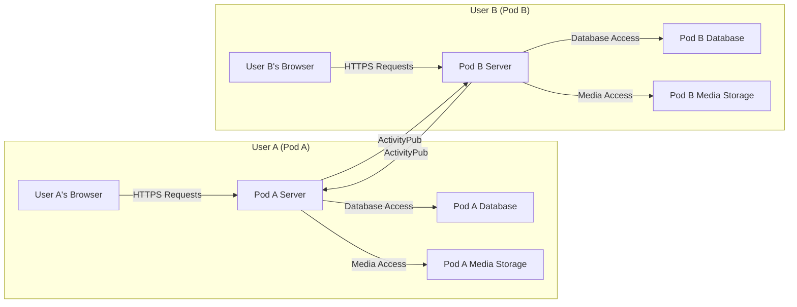
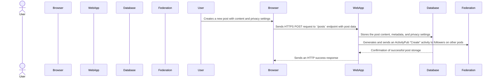
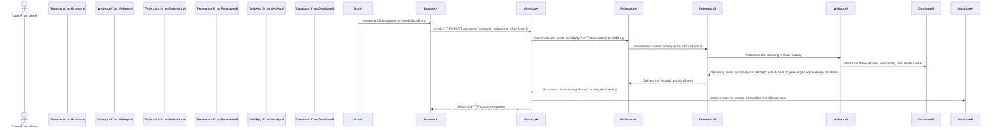

# Project Design Document: Diaspora Social Network

**Version:** 1.1
**Date:** October 26, 2023
**Prepared By:** AI Software Architect

## 1. Introduction

This document provides a detailed architectural design of the Diaspora social network project, based on the information available in the provided GitHub repository (https://github.com/diaspora/diaspora). This document aims to clearly outline the system's components, their interactions, and data flows. It will serve as a foundation for subsequent threat modeling activities, enabling the identification of potential security vulnerabilities and the design of appropriate mitigations.

### 1.1. Purpose

The primary purpose of this document is to provide a comprehensive and understandable description of the Diaspora architecture, specifically tailored for security analysis. This detailed view will empower security professionals and developers to effectively identify potential security vulnerabilities, understand attack surfaces, and design appropriate security controls.

### 1.2. Scope

This document covers the core architectural components of the Diaspora social network, emphasizing its decentralized nature, key functionalities, and data storage and exchange mechanisms. It focuses on the logical and physical components and their interactions, which are directly relevant for threat modeling and security assessments.

### 1.3. Target Audience

This document is intended for:

*   Security engineers and architects responsible for threat modeling, security assessments, and penetration testing.
*   Software developers working on the Diaspora project, particularly those involved in backend development and federation implementation.
*   System administrators responsible for deploying, configuring, and maintaining Diaspora pod instances.
*   Anyone needing a detailed understanding of the Diaspora architecture from a security perspective.

## 2. System Overview

Diaspora is a decentralized social network platform designed with user privacy and data ownership in mind. Unlike centralized platforms, user data is distributed across independent server instances called "pods." Users choose a pod to register with, and their data primarily resides on that pod, giving them greater control. Federation is the core mechanism that allows users on different pods to seamlessly interact with each other.

### 2.1. Key Concepts

*   **Pods:** Independent, self-contained server instances running the Diaspora software. Each pod operates autonomously, managing its own users, data storage, and security policies.
*   **Aspects:** User-defined groups or circles of contacts, enabling granular control over content visibility and sharing.
*   **Federation:** The standardized process by which different Diaspora pods communicate and exchange information, enabling cross-pod interactions such as following, sharing posts, and commenting. This relies heavily on the ActivityPub protocol.
*   **Activities:** Represent specific actions performed by users within the network. These are the fundamental units of information exchanged during federation, such as creating a post, liking a comment, or following another user.
*   **ActivityPub:** The W3C standard protocol used for decentralized social networking federation in modern Diaspora versions. It defines the format and methods for exchanging activities between actors on different servers.

### 2.2. High-Level Architecture

### 2.3. Key Functionalities

*   **User Registration and Authentication:** Secure process for users to create accounts on a chosen pod, including password management and potentially multi-factor authentication.
*   **Profile Management:** Functionality for users to create and manage their profiles, including personal information and privacy settings.
*   **Posting and Sharing Content:**  Allows users to create and share various types of content, including text posts, images, and videos, with options for privacy control.
*   **Following and Connecting:** Enables users to follow other users, both on their own pod and on remote pods, establishing connections for content sharing.
*   **Aspects and Privacy Control:**  Provides a mechanism for users to organize their contacts into aspects and control the visibility of their posts to specific groups.
*   **Direct Messaging:**  Allows users to send private, encrypted messages to other users, either on the same pod or on different pods.
*   **Notifications:** System for informing users about interactions with their content, such as new comments, likes, and follows.
*   **Search:** Functionality for users to search for content and users within their pod and, to a limited extent, across federated pods.
*   **Federated Interactions:** Core functionality enabling users to seamlessly interact with users on other pods, including following, commenting, liking, and sharing content.

## 3. Component Details

This section provides a more detailed description of the major components within a Diaspora pod, highlighting their responsibilities and technologies.

### 3.1. Web Application (Ruby on Rails)

*   **Purpose:** Serves as the primary interface for user interaction and handles the core application logic of the Diaspora pod.
*   **Technology:** Built using the Ruby on Rails framework, known for its convention-over-configuration approach and rapid development capabilities.
*   **Responsibilities:**
    *   Handling incoming HTTP requests and generating appropriate responses.
    *   Managing user authentication (login, logout) and authorization (access control).
    *   Rendering dynamic user interfaces using HTML, CSS, and JavaScript.
    *   Implementing the core social networking features, such as post creation, comment handling, and aspect management.
    *   Managing user sessions and maintaining user state.
    *   Interacting with the database to persist and retrieve data.
    *   Implementing the client-side of the ActivityPub protocol for initiating federation requests.
*   **Key Modules:**
    *   `User Management`: Handles registration, login, profile management, and password resets.
    *   `Post Management`:  Manages the creation, editing, deletion, and display of user posts.
    *   `Comment and Like Handling`: Processes user interactions with posts, including adding comments and likes.
    *   `Aspect Management`:  Allows users to create and manage their contact aspects.
    *   `Federation Logic`:  Handles the initiation and processing of ActivityPub interactions.
    *   `Notification System`:  Generates and manages notifications for user activities.
    *   `Search Functionality`: Implements search capabilities for posts and users.

### 3.2. Database

*   **Purpose:** Provides persistent storage for all critical data within the Diaspora pod.
*   **Technology:**  Typically PostgreSQL, a robust and feature-rich open-source relational database.
*   **Data Stored:**
    *   User account information (usernames, email addresses, hashed passwords, profile details).
    *   Posts and associated metadata (timestamps, author information, privacy settings).
    *   Comments, likes, and other interactions on posts.
    *   Aspect definitions and contact relationships between users.
    *   Direct messages and their associated metadata.
    *   Notification records and their status.
    *   Federation-related data, such as information about known remote users, activities, and inbox/outbox queues.

### 3.3. Background Job Processor

*   **Purpose:** Executes asynchronous tasks that do not require immediate processing during a user request, improving application responsiveness.
*   **Technology:** Commonly uses Sidekiq, a popular background job processing library for Ruby, which relies on Redis for queue management.
*   **Responsibilities:**
    *   Processing outgoing federation requests to other pods.
    *   Handling incoming federation activities received from other pods.
    *   Sending asynchronous email notifications to users.
    *   Performing periodic maintenance tasks, such as cleaning up old data or processing statistics.

### 3.4. Storage Service

*   **Purpose:**  Stores user-uploaded media files, such as images and videos, associated with their posts.
*   **Technology:** Can be implemented using local file system storage or a cloud-based object storage service like AWS S3, providing scalability and reliability.
*   **Responsibilities:**
    *   Storing uploaded media files securely.
    *   Retrieving media files for display to users.
    *   Potentially handling image resizing, thumbnail generation, and format conversions.
    *   Managing access control to media files to ensure privacy.

### 3.5. Federation Component (ActivityPub Implementation)

*   **Purpose:** Implements the ActivityPub protocol, enabling the Diaspora pod to communicate and interact with other Diaspora pods and compatible services in the decentralized network.
*   **Responsibilities:**
    *   Constructing and sending outgoing ActivityPub messages (e.g., `Create`, `Update`, `Delete`, `Follow`, `Accept`).
    *   Receiving and parsing incoming ActivityPub messages from other servers.
    *   Verifying the cryptographic signatures of incoming messages to ensure authenticity and prevent tampering.
    *   Generating cryptographic signatures for outgoing messages to prove the pod's identity.
    *   Managing the pod's actor representation and related ActivityPub objects (e.g., inbox, outbox).
    *   Handling the discovery of remote actors and their associated information.

### 3.6. User Interface (Frontend)

*   **Purpose:** Provides the visual interface through which users interact with the Diaspora pod.
*   **Technology:**  A combination of HTML for structure, CSS for styling, and JavaScript for dynamic behavior. May utilize JavaScript frameworks or libraries to enhance interactivity and manage the user interface state.
*   **Responsibilities:**
    *   Rendering web pages and displaying information to the user.
    *   Handling user interactions, such as clicks, form submissions, and keyboard input.
    *   Making asynchronous API requests to the backend web application to retrieve data and trigger actions.
    *   Displaying data received from the backend in a user-friendly format.

### 3.7. Email Service

*   **Purpose:**  Sends email notifications to users for various events, such as new followers, direct messages, and mentions.
*   **Technology:** Typically integrates with an external SMTP server or a third-party email service provider (e.g., SendGrid, Mailgun) for reliable email delivery.
*   **Responsibilities:**
    *   Composing and sending email messages.
    *   Managing email queues and handling delivery failures.

### 3.8. Search Service

*   **Purpose:**  Provides functionality for users to search for content and other users within the Diaspora network.
*   **Technology:** Can be implemented using database-level full-text search capabilities or a dedicated search engine like Elasticsearch or Solr for more advanced features and scalability.

## 4. Data Flow Diagrams

### 4.1. User Posting Content

### 4.2. Federated Interaction (Following a User on Another Pod)

## 5. Security Considerations (Initial Thoughts for Threat Modeling)

This section outlines initial security considerations based on the architecture, providing a starting point for a more in-depth threat modeling exercise.

*   **Authentication and Authorization:**
    *   **Threat:** Brute-force attacks on login endpoints to guess user credentials.
    *   **Threat:** Weak password policies leading to easily compromised accounts.
    *   **Threat:** Session hijacking vulnerabilities allowing attackers to impersonate legitimate users.
    *   **Threat:** Inadequate authorization checks allowing users to access or modify resources they shouldn't.
*   **Data Privacy and Confidentiality:**
    *   **Threat:** Exposure of sensitive user data in database breaches due to inadequate encryption at rest.
    *   **Threat:** Man-in-the-middle attacks intercepting communication between the browser and the server if HTTPS is not enforced or configured correctly.
    *   **Threat:** Privacy leaks due to improper handling of aspect visibility settings or bugs in the federation logic.
    *   **Threat:** Unintended disclosure of private messages or other sensitive information.
*   **Federation Security:**
    *   **Threat:** Spoofing of ActivityPub messages, allowing malicious actors to impersonate other users or pods.
    *   **Threat:** Attacks from compromised or malicious pods injecting harmful content or attempting to disrupt the network.
    *   **Threat:** Vulnerabilities in the ActivityPub implementation leading to denial-of-service or information disclosure.
*   **Input Validation and Output Encoding:**
    *   **Threat:** Cross-Site Scripting (XSS) attacks due to insufficient sanitization of user-generated content.
    *   **Threat:** SQL Injection vulnerabilities arising from improperly sanitized user input in database queries.
    *   **Threat:** Command Injection vulnerabilities if user input is used in system commands.
*   **Storage Security:**
    *   **Threat:** Unauthorized access to stored media files if permissions are not correctly configured.
    *   **Threat:** Data breaches affecting the storage service, potentially exposing user-uploaded content.
*   **Dependency Management:**
    *   **Threat:** Exploitation of known vulnerabilities in outdated dependencies (e.g., Rails gems).
*   **Denial of Service (DoS):**
    *   **Threat:** Attackers overwhelming a pod with requests, making it unavailable to legitimate users.
    *   **Threat:** Distributed Denial of Service (DDoS) attacks targeting the pod's infrastructure.
    *   **Threat:** Resource exhaustion attacks exploiting inefficient federation handling.
*   **Account Takeover:**
    *   **Threat:** Phishing attacks targeting user credentials.
    *   **Threat:** Exploiting vulnerabilities in password reset mechanisms.
*   **Information Disclosure:**
    *   **Threat:** Exposure of sensitive information through error messages or debugging information.
    *   **Threat:** Insecure API endpoints revealing more data than intended.

## 6. Assumptions and Constraints

*   This design document is based on the general architecture of Diaspora as understood from the public GitHub repository and common practices for such applications. Specific implementations may vary between different pod instances.
*   The focus is on the core components and their interactions relevant for security analysis and threat modeling. Operational aspects like deployment infrastructure and monitoring are not covered in detail.
*   It is assumed that the latest stable versions of the software and protocols are being used, including ActivityPub for federation.
*   The security considerations listed are initial thoughts and require further detailed analysis during a dedicated threat modeling exercise.

## 7. Future Considerations

*   Detailed design specifications for specific modules and functionalities, including API documentation.
*   Consideration of different deployment models and their security implications (e.g., single-user pods vs. larger community pods).
*   Detailed analysis of the security implications of integrating with other ActivityPub-compatible services.
*   Scalability and performance considerations for handling a large number of users and federated interactions, including security implications at scale.
*   Development of a comprehensive security architecture document outlining specific security controls and best practices.
*   Regular security audits and penetration testing to identify and address potential vulnerabilities.

This improved document provides a more detailed and security-focused view of the Diaspora architecture, making it a more effective foundation for threat modeling and security assessments.
