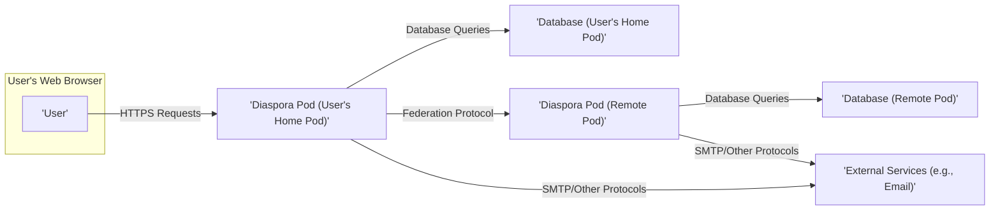
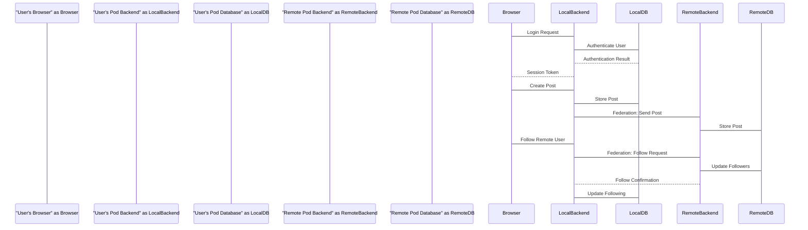

# Project Design Document: Diaspora Social Network

**Project:** Diaspora
**Version:** 1.1
**Date:** October 26, 2023
**Prepared By:** AI Software Architect

## 1. Introduction

This document provides an enhanced and detailed design overview of the Diaspora social network project. It elaborates on the system's architecture, components, data flow, and key technologies. This revised document serves as a more robust foundation for subsequent activities, particularly threat modeling, by offering a deeper understanding of the system's structure, functionality, and potential vulnerabilities.

## 2. Goals and Objectives

The primary goals of the Diaspora project are to:

*   Provide a decentralized and user-owned social networking platform, empowering individuals with control over their data.
*   Enable users to seamlessly share various forms of content, including text posts, images, and links.
*   Facilitate meaningful connections and interactions between users through features like following, commenting, and liking.
*   Offer granular and intuitive control over privacy and data sharing, allowing users to define who can see their content.
*   Promote an open and federated social web, resisting centralized control and fostering a diverse ecosystem of interconnected pods.

## 3. High-Level Architecture

The Diaspora architecture leverages a federated model centered around independent "pods." Each pod is a self-contained server instance running the Diaspora application. Users establish accounts on specific pods, and these pods communicate with one another using a defined protocol to enable social interactions across the network.

**Components:**

*   **User:** An individual who interacts with the Diaspora network through a web browser or a dedicated client application.
*   **Diaspora Pod:** A server instance hosting the core Diaspora application. This is the fundamental building block responsible for managing user accounts, content storage, and inter-pod communication.
    *   **Frontend:** The user-facing web interface, typically implemented using HTML, CSS, and JavaScript, providing the visual and interactive elements of the platform.
    *   **Backend:** The application logic layer, primarily developed in Ruby on Rails, responsible for handling user requests, processing data, enforcing business rules, and managing federation.
    *   **Background Jobs:** Asynchronous processes that execute tasks independently of the main application flow, such as sending email notifications, processing federation updates, and performing maintenance operations.
*   **Database:** The persistent storage mechanism for a Diaspora pod, holding user data, posts, relationships, and other critical information. Typically a relational database management system like PostgreSQL.
*   **External Services:** External systems that the Diaspora pod interacts with to provide additional functionality, such as email servers for sending notifications and potentially other services for media storage or integrations with other platforms.

## 4. Detailed Component Breakdown

### 4.1. User

*   Represents an authenticated individual with a registered account on a specific Diaspora pod.
*   Interacts with the system primarily through a web browser, accessing the frontend of their home pod. Dedicated client applications may also exist.
*   Authenticates with their home pod using credentials (username/password or potentially other methods) to establish a secure session and access their personalized data and network interactions.
*   Retains control over their personal data and can configure privacy settings to manage the visibility and sharing of their content and profile information.

### 4.2. Diaspora Pod

This is the core logical and physical unit of the Diaspora network. Each pod functions as an independent server but participates in the federated network.

*   **Frontend (Web Interface):**
    *   Built using a combination of HTML for structure, CSS for styling, and JavaScript for dynamic behavior and user interaction.
    *   Handles user input and displays information retrieved from the backend, providing the visual representation of the social network.
    *   Manages user sessions, typically using cookies or local storage to maintain authentication state after successful login.
    *   Communicates with the backend via API calls (e.g., RESTful APIs) to retrieve data and trigger actions.
*   **Backend (Ruby on Rails Application):**
    *   Responsible for user authentication and authorization, verifying user credentials and controlling access to specific resources and functionalities.
    *   Manages user accounts, including profile information, settings, and password management.
    *   Handles the creation, storage, modification, and deletion of user-generated content, such as posts, comments, and likes.
    *   Implements the Diaspora federation protocol, enabling communication and data exchange with other Diaspora pods. This includes sending and receiving posts, follow requests, and other social interactions.
    *   Provides a well-defined API for the frontend to interact with the backend logic and data.
    *   Interacts with the database to persist and retrieve data.
    *   Manages media uploads, including validation, storage (potentially using local storage or external services), and serving.
*   **Background Jobs (e.g., using Sidekiq):**
    *   Executes tasks asynchronously to avoid blocking the main application thread, improving responsiveness.
    *   Handles sending email notifications for various events, such as new mentions, follows, and comments.
    *   Manages the complexities of the federation process, including fetching new posts from followed users on remote pods and delivering local posts to relevant remote pods.
    *   Performs periodic maintenance tasks, such as cleaning up temporary files or performing database optimizations.

### 4.3. Database

*   Serves as the persistent data store for the Diaspora pod, ensuring data survives application restarts and server outages.
*   Typically implemented using a robust relational database management system like PostgreSQL, chosen for its reliability and features.
*   Stores a wide range of data entities, including:
    *   Detailed information about users and their profiles, including usernames, email addresses, profile details, and privacy settings.
    *   All user-generated content, such as posts (including text, timestamps, and associated metadata), and linked media.
    *   Comments and likes associated with posts, including timestamps and user associations.
    *   Information about relationships between users, including "aspects" (user-defined groups for sharing), follow relationships, and blocked users.
    *   Private messages exchanged between users.
    *   Notifications generated by various events within the system.
    *   Configuration settings for the pod itself.

### 4.4. External Services

*   **Email Server (SMTP):** Used by the backend and background jobs to send out transactional and notification emails to users.
*   **Potentially other services:**
    *   **Media Storage (Object Storage):** Could be used to offload the storage and serving of user-uploaded images and videos to services like Amazon S3 or similar platforms, improving scalability and performance.
    *   **Search Indexing Service:**  A service like Elasticsearch could be integrated to provide more efficient and powerful search capabilities across posts and user profiles.
    *   **Analytics Services:**  Potentially integrated for gathering usage statistics and identifying trends (subject to privacy considerations).

## 5. Data Flow

The following describes the typical flow of data during common user interactions within the Diaspora system:

*   **User Login:**
    1. The user enters their login credentials (username/email and password) into the login form on the frontend.
    2. The frontend sends an HTTPS authentication request containing the credentials to the backend API.
    3. The backend receives the request and verifies the provided credentials against the stored user data in the database.
    4. Upon successful authentication, the backend creates a new session for the user and generates a unique session token.
    5. The backend sends the session token back to the frontend, typically setting it as an HTTP cookie or storing it in local storage.
    6. The frontend stores the session token, which will be included in subsequent requests to authenticate the user.
*   **Posting Content:**
    1. The user composes their post (text, images, links) within the frontend interface.
    2. The frontend sends an HTTPS request containing the post data to the backend API endpoint for creating posts.
    3. The backend receives the request, authenticates the user using the provided session token, and validates the post data (e.g., checking for length limits, allowed media types).
    4. The backend stores the new post data in the database, associating it with the authenticated user.
    5. The backend initiates the federation process to distribute the newly created post to other Diaspora pods where the author has followers. This involves sending the post data to the relevant remote pods using the federation protocol.
*   **Following a User on a Remote Pod:**
    1. The user initiates a follow request on the frontend, typically by clicking a "Follow" button on a remote user's profile.
    2. The frontend sends an HTTPS request to the backend API, indicating the user to be followed.
    3. The backend receives the request, authenticates the user, and sends a "follow request" message to the target user's pod using the federation protocol.
    4. The remote pod's backend receives the follow request, verifies its authenticity, and updates its database to record the new follower.
    5. The remote pod may send a confirmation back to the local pod. The local pod also updates its database to reflect the new follow relationship.
*   **Receiving a Post from a Remote Pod:**
    1. A remote Diaspora pod, where a user on the local pod has a follower, sends a new post to the local pod via the federation protocol.
    2. The local pod's backend receives the incoming post.
    3. The backend verifies the authenticity and integrity of the post based on the federation protocol.
    4. The backend stores the received post in its local database.
    5. The backend identifies the local users who follow the author of the received post and updates their activity feeds to include the new content. Background jobs might handle this distribution.

## 6. Key Technologies

*   **Programming Languages:** Primarily Ruby for the backend, JavaScript for the frontend.
*   **Framework:** Ruby on Rails for the backend application framework, providing structure and conventions.
*   **Frontend Technologies:** HTML for content structure, CSS for styling and presentation, JavaScript for interactive elements and dynamic behavior.
*   **Database:** Typically PostgreSQL, a robust and feature-rich open-source relational database.
*   **Background Job Processing:** Commonly Sidekiq, a background processing library for Ruby, utilizing Redis for job queuing.
*   **Web Server:** Often Puma, a concurrent HTTP server for Ruby applications.
*   **Federation Protocol:** Diaspora's custom federation protocol, which shares similarities with and is influenced by protocols like ActivityPub, enabling communication between pods.
*   **Version Control:** Git, with the project hosted on platforms like GitHub.
*   **Operating System:** Linux is the most common operating system for deploying Diaspora pods in production environments.

## 7. Security Considerations (Detailed for Threat Modeling)

This section outlines potential security threats and vulnerabilities that need to be carefully considered during threat modeling.

*   **Authentication and Authorization Vulnerabilities:**
    *   **Brute-force attacks:** Attempts to guess user credentials through repeated login attempts.
    *   **Credential stuffing:** Using compromised credentials from other services to attempt login.
    *   **Insecure password storage:** If passwords are not properly hashed and salted, they could be compromised.
    *   **Missing or weak multi-factor authentication (MFA):** Lack of MFA makes accounts more susceptible to takeover.
    *   **Authorization bypass:** Vulnerabilities that allow users to access resources or perform actions they are not authorized for.
*   **Session Management Weaknesses:**
    *   **Session fixation:** An attacker forces a user to use a specific session ID, potentially leading to account hijacking.
    *   **Session hijacking:** An attacker obtains a valid session ID and uses it to impersonate the user.
    *   **Insecure session storage:** If session data is not properly protected, it could be compromised.
    *   **Lack of session expiration or revocation:** Sessions that persist indefinitely or cannot be easily revoked pose a security risk.
*   **Input Validation Failures:**
    *   **Cross-Site Scripting (XSS):** Allowing attackers to inject malicious scripts into web pages viewed by other users.
    *   **SQL Injection:** Exploiting vulnerabilities in database queries to gain unauthorized access or manipulate data.
    *   **Command Injection:** Allowing attackers to execute arbitrary commands on the server.
    *   **Path Traversal:** Exploiting vulnerabilities to access files and directories outside the intended webroot.
*   **Data Privacy and Security Risks:**
    *   **Data breaches:** Unauthorized access and exfiltration of sensitive user data from the database.
    *   **Insufficient data encryption at rest and in transit:** Exposing data if storage or communication channels are compromised.
    *   **Privacy violations:** Improper handling of user data according to privacy settings and regulations (e.g., GDPR).
*   **Federation Security Concerns:**
    *   **Spoofed or malicious pods:** Attackers setting up fake pods to spread misinformation or harvest user data.
    *   **Man-in-the-middle attacks on federation traffic:** Intercepting and potentially manipulating communication between pods.
    *   **Denial-of-service attacks against the federation:** Overwhelming pods with malicious federation requests.
*   **Cross-Site Request Forgery (CSRF):** Allowing attackers to trick logged-in users into performing unintended actions.
*   **Media Handling Vulnerabilities:**
    *   **Malicious file uploads:** Allowing users to upload files containing malware that could compromise the server or other users.
    *   **Insecure storage and serving of media:** Exposing media files to unauthorized access.
*   **Denial of Service (DoS) and Distributed Denial of Service (DDoS) Attacks:** Overwhelming the pod's resources to make it unavailable to legitimate users.
*   **Account Takeover:** Various methods attackers might use to gain unauthorized access to user accounts.

## 8. Deployment Architecture

A typical deployment of a Diaspora pod involves several key components working together:

*   **Web Server (e.g., Nginx, Apache):** Handles incoming HTTP/HTTPS requests from users' browsers. It often acts as a reverse proxy, forwarding requests to the application server. It can also serve static assets efficiently and handle SSL/TLS termination.
*   **Application Server (e.g., Puma, Unicorn):** Runs the core Ruby on Rails application code, processing user requests and generating dynamic content. Multiple instances may be deployed behind a load balancer for increased capacity and resilience.
*   **Database Server (PostgreSQL):** Stores all persistent data for the pod. For larger deployments, database clustering or replication might be used for high availability and scalability.
*   **Background Job Processor (Sidekiq Workers):** Executes asynchronous tasks, often running as separate processes. Requires a message queue like Redis to manage the job queue.
*   **Load Balancer (e.g., HAProxy, Nginx):** Distributes incoming traffic across multiple application server instances, improving performance and availability.
*   **Reverse Proxy (e.g., Nginx):** As mentioned, handles SSL termination, routing requests to the appropriate backend servers, and can provide additional security features.
*   **Firewall:** Controls network traffic to and from the server, blocking unauthorized access and protecting against malicious attacks.
*   **Caching Layer (Optional, e.g., Redis, Memcached):** Can be used to cache frequently accessed data, reducing database load and improving response times.

Pods can be deployed on various infrastructure options:

*   **Virtual Private Servers (VPS):** A common and cost-effective option for hosting individual pods.
*   **Cloud Platforms (e.g., AWS, Google Cloud, Azure):** Offer scalable and managed infrastructure services, simplifying deployment and management.
*   **Bare Metal Servers:** Providing dedicated hardware resources for maximum performance and control.
*   **Containerized Environments (e.g., Docker, Kubernetes):** Facilitating consistent deployments and easier scaling across different environments.

## 9. Assumptions and Constraints

*   It is assumed that pod administrators will implement standard security best practices for server configuration and maintenance.
*   The design assumes the use of secure communication protocols (HTTPS) for all sensitive data transmission.
*   Performance and scalability considerations are important but detailed performance engineering is outside the scope of this document.
*   This document primarily focuses on the core Diaspora application and may not cover all aspects of community-developed extensions or modifications.

## 10. Future Considerations

*   **Enhancements to the Federation Protocol:** Exploring improvements for efficiency, security, and richer interactions between pods, potentially aligning more closely with evolving standards.
*   **Advanced Privacy Features:** Investigating and implementing more sophisticated privacy controls, such as differential privacy or homomorphic encryption for specific data aspects.
*   **Official Mobile Applications:** Developing and maintaining official mobile applications for iOS and Android to improve user accessibility.
*   **Improved Search Functionality:** Integrating more robust search capabilities, potentially using dedicated search indexing services, to allow users to easily find content and users.
*   **Interoperability with other Federated Platforms:** Exploring and implementing standards-based interoperability with other ActivityPub-based platforms to broaden the reach of the Diaspora network.
*   **Scalability and Performance Optimizations:** Continuously improving the performance and scalability of the platform to handle a growing user base and increasing data volume.
*   **Modularization and Plugin System:**  Developing a more robust plugin or extension system to allow for community contributions and easier addition of new features.
*   **Enhanced Media Handling:**  Improving the handling of various media types, including video and audio, and potentially integrating with decentralized storage solutions.