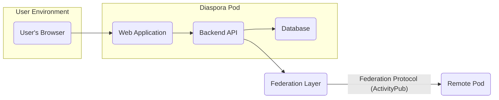
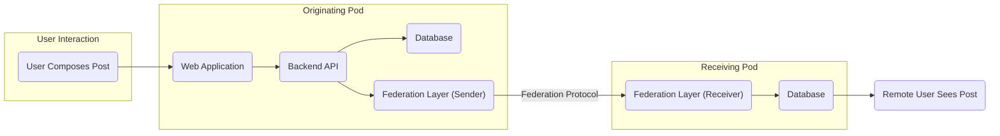

# Project Design Document: Diaspora

**Version:** 1.1
**Date:** October 26, 2023
**Author:** AI Software Architect

## 1. Project Overview

Diaspora is a decentralized social networking platform designed to empower users with greater control over their data and online identity. It achieves this through a distributed network of independently operated servers known as "pods." Users select a pod to host their data and interact with the network, fostering a more privacy-centric and user-controlled social media experience. This document details the architectural design of Diaspora, providing a foundation for subsequent threat modeling activities.

## 2. Goals and Objectives

*   Establish a decentralized social networking alternative to centralized platforms.
*   Grant users autonomy over their personal data and privacy settings.
*   Facilitate secure and private communication channels between users.
*   Promote an open-source and community-driven development environment.

## 3. Target Audience

This document is primarily intended for:

*   Security engineers and architects tasked with performing threat modeling and security assessments of Diaspora.
*   Software developers actively contributing to the Diaspora project's codebase.
*   System administrators responsible for the deployment, configuration, and maintenance of Diaspora pods.
*   Individuals seeking a comprehensive understanding of Diaspora's underlying architecture.

## 4. Scope

This document focuses on the core architectural elements of the Diaspora platform, specifically:

*   The user's interaction flow with a Diaspora pod via a web browser.
*   The mechanisms of communication and data exchange between different Diaspora pods within the federation.
*   The internal data storage and management practices within an individual pod.
*   Key external dependencies that the platform relies upon.

The following aspects are explicitly excluded from the scope of this document:

*   Detailed specifications of the user interface's visual design and user experience elements.
*   In-depth implementation specifics of individual features and functionalities.
*   Granular code-level analysis of the Diaspora codebase.
*   Highly specific deployment configurations tailored to individual pod operators.

## 5. High-Level Architecture

Diaspora's architecture is characterized by a federated network of independent pods. Users interact directly with their chosen pod, and these pods communicate with each other to enable social interactions across the entire network.

*   **User's Browser:** The primary interface through which users interact with the Diaspora platform.
*   **Web Application (Pod Instance):** The frontend component, typically built using Ruby on Rails and associated web technologies, responsible for rendering the user interface and handling user interactions.
*   **Backend API (Pod Instance):**  A Ruby on Rails application that processes requests from the web application, manages data persistence, and orchestrates communication with the database and the federation layer.
*   **Database (Pod Instance):**  A persistent data store, commonly PostgreSQL or MySQL, that holds user data, posts, relationships, and other essential information for the specific pod.
*   **Federation Layer:** The component responsible for implementing the Diaspora federation protocol (based on ActivityPub), enabling communication and data exchange with other Diaspora pods.
*   **Remote Pod:** Another independent instance of the Diaspora platform, potentially running on a different server and managed by a different administrator, hosting other users and their data.

## 6. Component Breakdown

This section provides a more detailed description of the key components within a typical Diaspora pod.

*   **Web Application (Frontend):**
    *   Presents the user interface for all user interactions with the platform.
    *   Manages user authentication and authorization within the context of the pod.
    *   Renders dynamic content received from the Backend API.
    *   Primarily implemented using HTML, CSS, JavaScript, and potentially a modern JavaScript framework.
*   **Backend API (Rails Application):**
    *   Receives and processes requests originating from the Web Application.
    *   Encapsulates the core business logic of the Diaspora platform.
    *   Manages user accounts, profiles, and social relationships (aspects, contacts).
    *   Handles the creation, retrieval, updating, and deletion of user-generated content (posts, comments, likes).
    *   Interacts directly with the Database for persistent data storage and retrieval.
    *   Communicates with the Federation Layer to facilitate inter-pod interactions and data sharing.
    *   Implements essential security measures, including input validation, authentication, and authorization checks.
*   **Database:**
    *   Provides persistent storage for all data associated with the pod.
    *   Organized into relational tables for entities such as users, posts, comments, aspects (user-defined groups), contacts, messages, and other relevant data.
    *   Ensures data integrity, consistency, and durability.
    *   Requires robust access controls and security measures to protect sensitive user information.
*   **Federation Layer:**
    *   Implements the Diaspora federation protocol, which is based on the ActivityPub standard.
    *   Handles the sending and receiving of data to and from other Diaspora pods in the network.
    *   Manages the discovery of remote users and pods within the federated network.
    *   Ensures secure communication between pods, typically leveraging HTTPS for transport security.
    *   Performs signature verification on incoming data to guarantee authenticity and prevent tampering.
*   **Background Jobs:**
    *   Executes asynchronous tasks that do not require immediate user interaction.
    *   Examples include sending email notifications, processing incoming federation data streams, and performing routine maintenance operations.
    *   Often implemented using a background job processing library like Sidekiq, which relies on Redis for job queuing.
*   **Media Storage:**
    *   Stores media files uploaded by users, such as images and videos.
    *   Can be implemented using local file system storage or a cloud-based object storage service (e.g., Amazon S3, Google Cloud Storage).
    *   Requires appropriate security measures to prevent unauthorized access, ensure data integrity, and protect against malicious uploads.

## 7. Data Flow

A common user action, such as posting a new status update, illustrates the typical data flow within the Diaspora architecture:

1. The user composes their post using the interface provided by the Web Application in their browser.
2. The Web Application sends an API request containing the post content to the Backend API of the user's pod.
3. The Backend API authenticates the user's request and validates the content of the post.
4. The Backend API persists the post data in the pod's Database.
5. The Backend API initiates the federation process to distribute the newly created post to the user's contacts on other pods.
6. The Federation Layer on the originating pod constructs and sends the post data, along with a digital signature, to the Federation Layers of the recipient pods.
7. The receiving pods' Federation Layers verify the digital signature to ensure the authenticity and integrity of the incoming data.
8. The receiving pods then store the received post data in their respective Databases.
9. Users on the receiving pods can subsequently view the new post in their social feeds.

## 8. Technology Stack

*   **Primary Programming Language:** Ruby
*   **Web Application Framework:** Ruby on Rails
*   **Database Systems:** PostgreSQL (strongly recommended), MySQL
*   **Frontend Technologies:** HTML, CSS, JavaScript, potentially utilizing a JavaScript framework (e.g., React, Vue.js, Stimulus)
*   **Asynchronous Job Processing:** Sidekiq (commonly used), leveraging Redis for job queuing
*   **Federation Protocol Implementation:** ActivityPub
*   **Web Servers:** Puma, Unicorn (typically used in production)
*   **Operating System for Deployment:** Linux (most common deployment environment)
*   **Version Control System:** Git

## 9. Deployment Architecture

A standard deployment of a Diaspora pod typically involves the following components:

*   A server instance running a Linux-based operating system.
*   A reverse proxy server (e.g., Nginx, Apache) to handle incoming requests, SSL termination, and load balancing.
*   The Diaspora application (Ruby on Rails) running under a web application server (e.g., Puma, Unicorn).
*   A dedicated database server (e.g., PostgreSQL).
*   Optionally, a background job processing service (e.g., Sidekiq) along with a Redis instance for job management.
*   Proper configuration for handling HTTPS and managing SSL/TLS certificates to ensure secure communication.

The decentralized nature of Diaspora arises from the independent deployment and operation of numerous such pods.

## 10. Security Considerations (Initial)

This section outlines initial security considerations relevant to the Diaspora architecture. These points will serve as a starting point for a more comprehensive threat modeling exercise.

*   **User Authentication and Authorization:** Implementing robust mechanisms to verify user identities and control access to resources within a pod.
*   **Data Privacy and Encryption:** Protecting sensitive user data both at rest (in the database and media storage) and in transit (during federation). Adhering to relevant privacy regulations.
*   **Federation Protocol Security:** Ensuring the secure exchange of data between pods, including verifying the authenticity and integrity of messages to prevent spoofing and tampering.
*   **Input Validation and Sanitization:** Thoroughly validating and sanitizing all user-provided input to prevent cross-site scripting (XSS), SQL injection, and other injection vulnerabilities.
*   **Database Security:** Implementing strong access controls, encryption, and regular backups to protect the database from unauthorized access and data loss.
*   **Session Management:** Securely managing user sessions to prevent session hijacking and unauthorized access.
*   **Protection Against Denial of Service (DoS) Attacks:** Implementing measures to mitigate the impact of malicious attempts to overwhelm pod resources.
*   **Code Security and Vulnerability Management:** Adhering to secure coding practices, conducting regular security audits, and promptly addressing identified vulnerabilities in the codebase and dependencies.
*   **Dependency Management:** Maintaining up-to-date dependencies to patch known security vulnerabilities in third-party libraries.
*   **Secure Media Handling:** Implementing security measures for storing, serving, and processing uploaded media files to prevent unauthorized access and malicious content.

## 11. Assumptions and Constraints

*   It is assumed that individual pod administrators are responsible for implementing and maintaining the security of their respective pod instances.
*   The federation protocol relies on cryptographic signatures and secure transport (HTTPS) for ensuring the authenticity and confidentiality of inter-pod communication.
*   Users inherently trust the administrators of the pods they choose to host their data.
*   The open-source nature of the project allows for community scrutiny and contributions to enhance security.

## 12. Future Considerations

*   Potential enhancements to the federation protocol to further improve security, efficiency, and resilience.
*   Exploration of integrations with other decentralized technologies and protocols.
*   Ongoing improvements to the user interface and overall user experience.
*   Scalability optimizations to accommodate a growing network of users and pods.
*   Continued development and implementation of privacy-enhancing features and technologies.

This revised document provides a more detailed and structured overview of the Diaspora project's architecture, serving as a solid foundation for conducting comprehensive threat modeling activities. The detailed component descriptions, data flow diagrams, and security considerations offer valuable insights for identifying potential vulnerabilities and designing appropriate security controls.