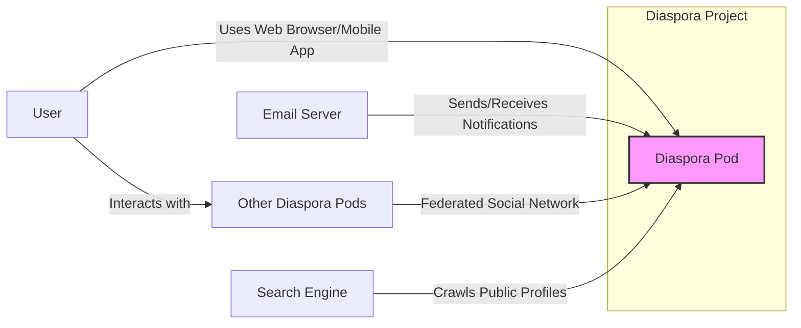
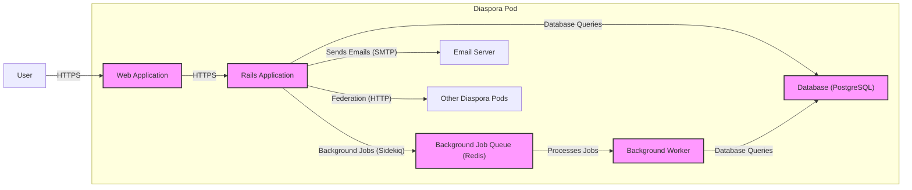
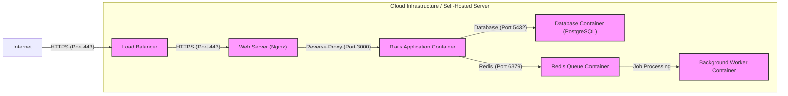
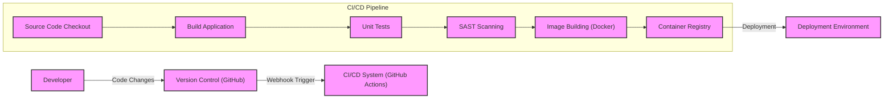

# BUSINESS POSTURE

The Diaspora project aims to provide a decentralized, privacy-focused social network as an alternative to centralized platforms. It prioritizes user control over data, resisting censorship, and fostering a community-driven environment.

- Business priorities and goals:
  - Provide users with a privacy-respecting social networking platform.
  - Empower users with control over their data and online identity.
  - Foster a decentralized and open social network, resistant to censorship and single points of failure.
  - Build a community-driven and sustainable open-source project.

- Most important business risks:
  - Data breaches and privacy violations could erode user trust and damage the project's reputation.
  - Platform instability or downtime could discourage user adoption and community growth.
  - Security vulnerabilities could be exploited to compromise user accounts or platform integrity.
  - Lack of moderation or ineffective content moderation could lead to a toxic environment and user attrition.
  - Difficulty in achieving widespread adoption and network effects compared to established centralized platforms.

# SECURITY POSTURE

- Security controls:
  - security control: HTTPS encryption for communication between users and pods (Diaspora servers). Implemented at web server level.
  - security control: Password hashing for user authentication. Implemented in application code.
  - security control: Input validation on user-provided data. Implemented in application code.
  - security control: Protection against Cross-Site Scripting (XSS) vulnerabilities. Implemented in application code using templating engines and output encoding.
  - security control: Protection against Cross-Site Request Forgery (CSRF) vulnerabilities. Implemented in application code using CSRF tokens.
  - security control: Regular security updates of underlying operating system and software libraries. Responsibility of pod administrators.
  - security control: Open source code, allowing for community security reviews and contributions. Publicly available on GitHub.

- Accepted risks:
  - accepted risk: Reliance on community contributions for security vulnerability discovery and patching.
  - accepted risk: Security posture varies across different Diaspora pods, depending on administrator practices.
  - accepted risk: Potential for vulnerabilities in third-party dependencies.
  - accepted risk: Limited resources for dedicated security audits and penetration testing.

- Recommended security controls:
  - security control: Implement automated security scanning (SAST/DAST) in the development pipeline.
  - security control: Establish a vulnerability disclosure program to encourage responsible reporting of security issues.
  - security control: Conduct regular security code reviews, especially for critical components.
  - security control: Implement rate limiting and abuse prevention mechanisms to protect against denial-of-service attacks and spam.
  - security control: Enhance logging and monitoring for security events and intrusion detection.
  - security control: Provide security guidelines and best practices for pod administrators.

- Security requirements:
  - Authentication:
    - requirement: Secure password-based authentication for users.
    - requirement: Consider supporting multi-factor authentication (MFA) for enhanced security.
    - requirement: Implement secure password reset and recovery mechanisms.
  - Authorization:
    - requirement: Role-based access control to manage administrative functions within a pod.
    - requirement: Fine-grained authorization to control access to user data and features based on relationships and privacy settings.
    - requirement: Ensure consistent authorization checks across all application components.
  - Input validation:
    - requirement: Validate all user inputs on both client-side and server-side to prevent injection attacks.
    - requirement: Sanitize user-generated content to prevent XSS vulnerabilities.
    - requirement: Implement robust input validation for API endpoints.
  - Cryptography:
    - requirement: Use strong encryption algorithms and protocols for sensitive data in transit (HTTPS) and at rest (password hashes).
    - requirement: Securely manage cryptographic keys and secrets.
    - requirement: Consider end-to-end encryption for private messages for enhanced privacy.

# DESIGN

## C4 CONTEXT

- Context Diagram Elements:
  - Element:
    - Name: User
    - Type: Person
    - Description: Individuals who use the Diaspora social network to connect with others, share content, and manage their online identity.
    - Responsibilities: Create content, interact with other users, manage their profile and privacy settings.
    - Security controls: Strong passwords, enabling MFA (if available), managing privacy settings.
  - Element:
    - Name: Diaspora Pod
    - Type: Software System
    - Description: A server running the Diaspora software, responsible for hosting user data, serving the web application, and federating with other pods.
    - Responsibilities: Host user accounts and data, serve the Diaspora web application, handle user authentication and authorization, manage social interactions, federate with other pods, send email notifications.
    - Security controls: HTTPS encryption, input validation, authentication and authorization mechanisms, regular security updates, firewall, intrusion detection system (IDS).
  - Element:
    - Name: Email Server
    - Type: External System
    - Description: External email infrastructure used by the Diaspora pod to send email notifications to users (e.g., new mentions, messages).
    - Responsibilities: Receive email sending requests from the Diaspora pod and deliver emails to users.
    - Security controls: SPF, DKIM, DMARC email authentication to prevent spoofing and phishing.
  - Element:
    - Name: Other Diaspora Pods
    - Type: External Software System
    - Description: Other independent Diaspora pods that form the federated social network.
    - Responsibilities: Host their own users and data, federate with other pods to exchange social content.
    - Security controls: HTTPS encryption for federation, adherence to Diaspora federation protocol, independent security posture.
  - Element:
    - Name: Search Engine
    - Type: External System
    - Description: Web search engines that may crawl publicly accessible profiles and content on Diaspora pods.
    - Responsibilities: Index publicly available web content.
    - Security controls: robots.txt to control crawling, privacy settings to control profile visibility.

## C4 CONTAINER

- Container Diagram Elements:
  - Element:
    - Name: Web Application
    - Type: Web Browser
    - Description: Client-side web application written in Javascript, HTML, and CSS, served to users' web browsers. Provides the user interface for interacting with Diaspora.
    - Responsibilities: Present user interface, handle user interactions, communicate with the Rails Application via HTTPS.
    - Security controls: Browser security features (e.g., Content Security Policy), protection against DOM-based XSS.
  - Element:
    - Name: Rails Application
    - Type: Web Application
    - Description: Server-side application built with Ruby on Rails, responsible for handling user requests, business logic, and data management.
    - Responsibilities: Handle user authentication and authorization, process user requests, interact with the database, manage social interactions, implement federation protocol, send email notifications, enqueue background jobs.
    - Security controls: Input validation, output encoding, authentication and authorization mechanisms, protection against common web vulnerabilities (e.g., SQL injection, CSRF, XSS), security libraries and frameworks, rate limiting.
  - Element:
    - Name: Database (PostgreSQL)
    - Type: Database
    - Description: Relational database used to store persistent data, including user accounts, profiles, posts, and social interactions.
    - Responsibilities: Persist application data, provide data access and retrieval for the Rails Application.
    - Security controls: Database access controls, encryption at rest (optional, depending on infrastructure), regular backups, database security hardening.
  - Element:
    - Name: Background Job Queue (Redis)
    - Type: Message Queue
    - Description: In-memory data store used as a job queue for asynchronous tasks, such as processing notifications and federation activities.
    - Responsibilities: Queue background jobs submitted by the Rails Application, ensure job persistence and delivery.
    - Security controls: Access controls to Redis, secure configuration.
  - Element:
    - Name: Background Worker
    - Type: Application
    - Description: Background processes (e.g., Sidekiq workers) that consume jobs from the job queue and execute asynchronous tasks.
    - Responsibilities: Process background jobs, such as sending notifications, handling federation tasks, and performing maintenance operations.
    - Security controls: Secure coding practices, proper error handling, resource management.
  - Element:
    - Name: Email Server
    - Type: External System
    - Description: External email infrastructure used to send email notifications. (Same as Context Diagram)
    - Responsibilities: (Same as Context Diagram)
    - Security controls: (Same as Context Diagram)
  - Element:
    - Name: Other Diaspora Pods
    - Type: External Software System
    - Description: Other independent Diaspora pods. (Same as Context Diagram)
    - Responsibilities: (Same as Context Diagram)
    - Security controls: (Same as Context Diagram)

## DEPLOYMENT

Deployment Solution: Dockerized deployment on cloud infrastructure (e.g., AWS, GCP, Azure) or self-hosted servers. This is a common and flexible deployment model for web applications.

- Deployment Diagram Elements:
  - Element:
    - Name: Load Balancer
    - Type: Infrastructure Component
    - Description: Distributes incoming HTTPS traffic across multiple Web Server instances for scalability and availability.
    - Responsibilities: Load balancing, SSL termination, traffic routing.
    - Security controls: DDoS protection, rate limiting, SSL/TLS configuration, access control lists.
  - Element:
    - Name: Web Server (Nginx)
    - Type: Software Component
    - Description: Web server responsible for serving static assets and reverse proxying requests to the Rails Application Container.
    - Responsibilities: Serve static content, reverse proxy to Rails application, handle HTTPS connections.
    - Security controls: Web server hardening, access controls, security updates, configured to prevent directory listing and information disclosure.
  - Element:
    - Name: Rails Application Container
    - Type: Containerized Application
    - Description: Docker container running the Rails application.
    - Responsibilities: Run the Rails application code, handle business logic, interact with database and job queue.
    - Security controls: Container image security scanning, least privilege container configuration, regular container updates, application-level security controls (as described in Container Diagram).
  - Element:
    - Name: Database Container (PostgreSQL)
    - Type: Containerized Database
    - Description: Docker container running the PostgreSQL database.
    - Responsibilities: Persist application data.
    - Security controls: Database container hardening, access controls, regular container updates, database-level security controls (as described in Container Diagram), volume encryption (optional).
  - Element:
    - Name: Redis Queue Container
    - Type: Containerized Application
    - Description: Docker container running the Redis job queue.
    - Responsibilities: Manage background job queue.
    - Security controls: Container image security scanning, least privilege container configuration, regular container updates, access controls to Redis.
  - Element:
    - Name: Background Worker Container
    - Type: Containerized Application
    - Description: Docker container running the background worker processes (Sidekiq).
    - Responsibilities: Process background jobs.
    - Security controls: Container image security scanning, least privilege container configuration, regular container updates, secure coding practices in worker processes.

## BUILD

- Build Process Elements:
  - Element:
    - Name: Developer
    - Type: Person
    - Description: Software developers who write and maintain the Diaspora codebase.
    - Responsibilities: Write code, commit changes to version control, perform local testing.
    - Security controls: Secure development practices, code review, local security testing.
  - Element:
    - Name: Version Control (GitHub)
    - Type: Software Service
    - Description: GitHub repository hosting the Diaspora source code and managing version history.
    - Responsibilities: Store source code, manage branches and commits, trigger CI/CD pipeline via webhooks.
    - Security controls: Access controls, branch protection rules, audit logs.
  - Element:
    - Name: CI/CD System (GitHub Actions)
    - Type: Software Service
    - Description: Automated CI/CD pipeline using GitHub Actions to build, test, and package the application.
    - Responsibilities: Automate build process, run tests, perform security scans, build container images, push images to container registry.
    - Security controls: Secure pipeline configuration, access controls, secret management, audit logs.
  - Element:
    - Name: Source Code Checkout
    - Type: CI/CD Pipeline Stage
    - Description: Stage in the CI/CD pipeline that retrieves the latest source code from the version control system.
    - Responsibilities: Obtain source code for building.
    - Security controls: Secure access to version control system.
  - Element:
    - Name: Build Application
    - Type: CI/CD Pipeline Stage
    - Description: Stage in the CI/CD pipeline that compiles the application code and builds the necessary artifacts.
    - Responsibilities: Compile code, build application packages.
    - Security controls: Secure build environment, dependency management, build process hardening.
  - Element:
    - Name: Unit Tests
    - Type: CI/CD Pipeline Stage
    - Description: Stage in the CI/CD pipeline that executes automated unit tests to verify code functionality.
    - Responsibilities: Run unit tests, identify code defects.
    - Security controls: Well-written and comprehensive unit tests, secure testing environment.
  - Element:
    - Name: SAST Scanning
    - Type: CI/CD Pipeline Stage
    - Description: Stage in the CI/CD pipeline that performs Static Application Security Testing to identify potential security vulnerabilities in the source code.
    - Responsibilities: Analyze source code for vulnerabilities, generate security reports.
    - Security controls: Properly configured SAST scanner, vulnerability reporting and tracking.
  - Element:
    - Name: Image Building (Docker)
    - Type: CI/CD Pipeline Stage
    - Description: Stage in the CI/CD pipeline that builds Docker container images for the application.
    - Responsibilities: Create container images, package application and dependencies.
    - Security controls: Base image selection, minimal image layers, security scanning of container images, image signing.
  - Element:
    - Name: Container Registry
    - Type: Software Service
    - Description: Registry for storing and managing Docker container images.
    - Responsibilities: Store container images, provide access for deployment.
    - Security controls: Access controls, image scanning, vulnerability management for registry, secure image storage.
  - Element:
    - Name: Deployment Environment
    - Type: Infrastructure
    - Description: Target environment where the application is deployed (e.g., cloud infrastructure, servers).
    - Responsibilities: Run the deployed application.
    - Security controls: Infrastructure security controls (as described in Deployment section), secure deployment process.

# RISK ASSESSMENT

- Critical business processes:
  - User registration and account management.
  - Posting and sharing content.
  - Private messaging and communication.
  - User profile management and privacy settings.
  - Federation with other pods.

- Data to protect and sensitivity:
  - User profiles (personal information, contact details, etc.) - Highly sensitive.
  - User posts and content - Sensitive.
  - Private messages - Highly sensitive.
  - User relationships and social graph - Sensitive.
  - Authentication credentials (password hashes) - Highly sensitive.
  - Pod configuration and secrets - Highly sensitive.

# QUESTIONS & ASSUMPTIONS

- Questions:
  - What is the current process for security vulnerability management and patching in the Diaspora project?
  - Are there any existing security incident response plans or procedures?
  - What is the level of security awareness and training among Diaspora developers and pod administrators?
  - Are there any specific compliance requirements or regulations that Diaspora needs to adhere to (e.g., GDPR, CCPA)?
  - What are the typical resource constraints for security within the open-source project?

- Assumptions:
  - BUSINESS POSTURE: The primary business goal is to provide a privacy-focused and decentralized social network. User privacy and data security are high priorities.
  - SECURITY POSTURE: Basic web application security best practices are implemented. Security is primarily driven by community contributions and open-source principles. Formal security processes might be limited due to resource constraints.
  - DESIGN: The system follows a typical web application architecture with a Rails backend, PostgreSQL database, and Redis for background jobs. Deployment is likely containerized using Docker.