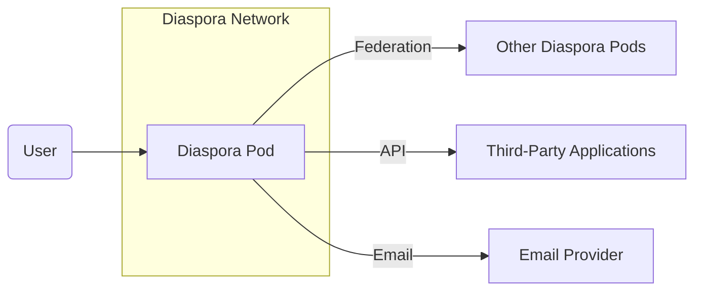

Okay, let's create a design document for the Diaspora project based on the provided GitHub repository.

# BUSINESS POSTURE

Diaspora is a distributed social network aiming to provide an alternative to centralized platforms like Facebook. Its core value proposition revolves around user privacy, data ownership, and control.

Priorities:

*   User Privacy: Ensuring user data is protected and not exploited for commercial gain.
*   Data Ownership: Giving users full control over their data and its distribution.
*   Decentralization: Avoiding a single point of control or failure.
*   Open Source: Transparency and community involvement in development.
*   Usability: Providing a user-friendly experience to attract and retain users.

Goals:

*   Provide a viable, privacy-respecting alternative to mainstream social networks.
*   Build a sustainable and growing community of users and developers.
*   Foster a decentralized ecosystem of interconnected Diaspora pods.

Business Risks:

*   Data breaches on individual pods: Since each pod is independently managed, a security breach on one pod could compromise user data.
*   Lack of consistent security practices across pods: Varying levels of technical expertise among pod administrators could lead to inconsistent security implementations.
*   Scalability challenges: Maintaining performance and reliability as the network grows.
*   Spam and abuse: Preventing malicious actors from exploiting the platform.
*   Legal and regulatory compliance: Navigating the complex landscape of data privacy regulations in different jurisdictions.
*   Maintaining active development and community engagement.

# SECURITY POSTURE

Existing Security Controls (based on the GitHub repository and general knowledge of the project):

*   security control: Ruby on Rails framework: Provides built-in security features like CSRF protection, secure session management, and protection against common web vulnerabilities. (Implemented in the codebase).
*   security control: HTTPS: Enforces encrypted communication between users and pods. (Mentioned in documentation and assumed to be a standard practice).
*   security control: User authentication: Requires users to create accounts and authenticate with passwords. (Implemented in the codebase).
*   security control: Data encryption at rest: Some pods may implement database encryption, but this is not standardized across the network. (Not consistently enforced, depends on pod administrator).
*   security control: Regular security updates: The Diaspora project releases updates to address vulnerabilities. (Visible in the GitHub repository).
*   security control: Open-source code: Allows for community review and identification of security flaws. (The project is open source).
*   security control: Federated architecture: Distributes data across multiple servers, reducing the impact of a single point of failure. (Core design principle).

Accepted Risks:

*   accepted risk: Inconsistent security practices across pods: The project acknowledges that pod administrators have varying levels of technical expertise, leading to potential security disparities.
*   accepted risk: Dependence on third-party libraries: Like any software project, Diaspora relies on external libraries, which could introduce vulnerabilities.
*   accepted risk: User-generated content risks: The platform allows users to share content, which could include malicious links or files.

Recommended Security Controls:

*   Implement a standardized security baseline for all pods, including mandatory data encryption at rest and regular security audits.
*   Provide clear security guidelines and tools for pod administrators.
*   Implement a robust content moderation system to detect and remove malicious content.
*   Introduce a bug bounty program to incentivize security researchers to find and report vulnerabilities.
*   Implement two-factor authentication (2FA) for user accounts.

Security Requirements:

*   Authentication:
    *   Strong password policies (length, complexity).
    *   Protection against brute-force attacks (account lockout).
    *   Secure password reset mechanisms.
    *   Support for two-factor authentication (2FA).
*   Authorization:
    *   Role-based access control (RBAC) to manage user permissions.
    *   Granular control over data sharing and visibility (privacy settings).
    *   Access control lists (ACLs) for managing access to specific resources.
*   Input Validation:
    *   Strict validation of all user inputs to prevent injection attacks (SQL injection, cross-site scripting).
    *   Sanitization of user-generated content to remove potentially harmful code.
    *   File upload restrictions (file type, size).
*   Cryptography:
    *   Use of strong, industry-standard cryptographic algorithms for data encryption (at rest and in transit).
    *   Secure key management practices.
    *   Regular review and updates of cryptographic libraries.

# DESIGN

## C4 CONTEXT



Element Descriptions:

*   Element:
    *   Name: User
    *   Type: Person
    *   Description: A person who uses Diaspora to connect with others and share information.
    *   Responsibilities: Creating content, interacting with other users, managing their profile and privacy settings.
    *   Security controls: Strong passwords, 2FA (recommended), privacy settings.

*   Element:
    *   Name: Diaspora Pod
    *   Type: Software System
    *   Description: A single instance of the Diaspora software, hosting user accounts and data.
    *   Responsibilities: Storing user data, handling user requests, federating with other pods.
    *   Security controls: HTTPS, Rails security features, data encryption (recommended), regular security updates.

*   Element:
    *   Name: Other Diaspora Pods
    *   Type: Software System
    *   Description: Other independently managed Diaspora pods.
    *   Responsibilities: Same as Diaspora Pod.
    *   Security controls: Same as Diaspora Pod (ideally).

*   Element:
    *   Name: Third-Party Applications
    *   Type: Software System
    *   Description: External applications that interact with Diaspora via its API.
    *   Responsibilities: Varies depending on the application.
    *   Security controls: API authentication and authorization.

*   Element:
    *   Name: Email Provider
    *   Type: Software System
    *   Description: An external service used for sending email notifications.
    *   Responsibilities: Delivering emails.
    *   Security controls: Standard email security protocols (SPF, DKIM, DMARC).

## C4 CONTAINER

```mermaid
graph LR
    subgraph Diaspora Pod
        User(User) -- "HTTPS" --> WebApp[Web Application]
        WebApp -- "Ruby, Rails" --> AppServer[Application Server (e.g., Puma, Unicorn)]
        AppServer -- "SQL" --> Database[Database (e.g., PostgreSQL, MySQL)]
        AppServer -- "Redis" --> Cache[Cache (Redis)]
        AppServer -- "Sidekiq" --> BackgroundJobs[Background Jobs (Sidekiq)]
        BackgroundJobs -- "SQL" --> Database
        BackgroundJobs -- "Redis" --> Cache
    end
    WebApp -- "Federation Protocol" --> DiasporaFederation[Other Diaspora Pods]
    WebApp -- "API" --> ThirdPartyApps[Third-Party Applications]
    AppServer -- "Email" --> EmailProvider[Email Provider]

```

Element Descriptions:

*   Element:
    *   Name: Web Application
    *   Type: Web Application
    *   Description: The main user interface for interacting with Diaspora.
    *   Responsibilities: Handling user requests, rendering views, interacting with the application server.
    *   Security controls: CSRF protection, secure session management, input validation, output encoding.

*   Element:
    *   Name: Application Server (e.g., Puma, Unicorn)
    *   Type: Application Server
    *   Description: The server that runs the Diaspora Ruby on Rails application.
    *   Responsibilities: Processing application logic, interacting with the database and other components.
    *   Security controls: Secure configuration, regular updates.

*   Element:
    *   Name: Database (e.g., PostgreSQL, MySQL)
    *   Type: Database
    *   Description: Stores user data, posts, comments, etc.
    *   Responsibilities: Data persistence, query execution.
    *   Security controls: Data encryption at rest (recommended), access control, regular backups.

*   Element:
    *   Name: Cache (Redis)
    *   Type: Cache
    *   Description: Caches frequently accessed data to improve performance.
    *   Responsibilities: Storing and retrieving cached data.
    *   Security controls: Secure configuration, access control.

*   Element:
    *   Name: Background Jobs (Sidekiq)
    *   Type: Background Processor
    *   Description: Handles asynchronous tasks like sending emails and processing federation requests.
    *   Responsibilities: Executing background jobs.
    *   Security controls: Secure configuration, input validation.

*   Element:
    *   Name: Other Diaspora Pods
    *   Type: Software System
    *   Description: Other independently managed Diaspora pods.
    *   Responsibilities: Same as Diaspora Pod.
    *   Security controls: Same as Diaspora Pod (ideally).

*   Element:
    *   Name: Third-Party Applications
    *   Type: Software System
    *   Description: External applications that interact with Diaspora via its API.
    *   Responsibilities: Varies depending on the application.
    *   Security controls: API authentication and authorization.

*   Element:
    *   Name: Email Provider
    *   Type: Software System
    *   Description: An external service used for sending email notifications.
    *   Responsibilities: Delivering emails.
    *   Security controls: Standard email security protocols (SPF, DKIM, DMARC).

## DEPLOYMENT

Possible Deployment Solutions:

1.  Manual installation on a VPS (Virtual Private Server).
2.  Using Docker and Docker Compose.
3.  Using a cloud provider's platform-as-a-service (PaaS) offering (e.g., Heroku, AWS Elastic Beanstalk).
4.  Using Kubernetes.

Chosen Solution (for detailed description): Docker and Docker Compose. This is a common and relatively straightforward approach for deploying Diaspora.

```mermaid
graph LR
    subgraph Deployment Environment (e.g., VPS)
        subgraph Docker Host
            subgraph diaspora_web
                WebApp[Web Container (Nginx)]
            end
            subgraph diaspora_app
                AppServer[App Server Container (Puma)]
            end
            subgraph diaspora_db
                Database[Database Container (PostgreSQL)]
            end
            subgraph diaspora_redis
                Cache[Cache Container (Redis)]
            end
            subgraph diaspora_sidekiq
                BackgroundJobs[Sidekiq Container]
            end

            WebApp -- "HTTPS" --> Internet[Internet]
            WebApp -- "Proxy" --> AppServer
            AppServer -- "SQL" --> Database
            AppServer -- "Redis Protocol" --> Cache
            AppServer -- "Sidekiq Protocol" --> BackgroundJobs
            BackgroundJobs -- "SQL" --> Database
            BackgroundJobs -- "Redis Protocol" --> Cache
        end
    end

```

Element Descriptions:

*   Element:
    *   Name: Web Container (Nginx)
    *   Type: Web Server
    *   Description: Serves static content and acts as a reverse proxy to the application server.
    *   Responsibilities: Handling incoming HTTP requests, serving static files, forwarding requests to the application server.
    *   Security controls: HTTPS configuration, secure headers, regular updates.

*   Element:
    *   Name: App Server Container (Puma)
    *   Type: Application Server
    *   Description: Runs the Diaspora Ruby on Rails application.
    *   Responsibilities: Processing application logic, interacting with the database and other components.
    *   Security controls: Secure configuration, regular updates.

*   Element:
    *   Name: Database Container (PostgreSQL)
    *   Type: Database
    *   Description: Stores user data, posts, comments, etc.
    *   Responsibilities: Data persistence, query execution.
    *   Security controls: Data encryption at rest (recommended), access control, regular backups, strong passwords.

*   Element:
    *   Name: Cache Container (Redis)
    *   Type: Cache
    *   Description: Caches frequently accessed data to improve performance.
    *   Responsibilities: Storing and retrieving cached data.
    *   Security controls: Secure configuration, access control.

*   Element:
    *   Name: Sidekiq Container
    *   Type: Background Processor
    *   Description: Handles asynchronous tasks like sending emails and processing federation requests.
    *   Responsibilities: Executing background jobs.
    *   Security controls: Secure configuration, input validation.

*   Element:
        * Name: Internet
        * Type: Network
        * Description: External network.
        * Responsibilities: Routing traffic to the server.
        * Security controls: Firewall, Intrusion Detection/Prevention System.

## BUILD

Diaspora's build process is primarily managed through the Ruby on Rails framework and associated tools. While the repository doesn't explicitly define a CI/CD pipeline like GitHub Actions, the development workflow implies certain build steps and security considerations.

```mermaid
graph LR
    Developer[Developer] -- "Git Push" --> GitHub[GitHub Repository]
    GitHub -- "Code Review" --> CodeReviewers[Code Reviewers]
    CodeReviewers -- "Approve" --> GitHub
    GitHub -- "Merge" --> MainBranch[Main Branch]
    MainBranch -- "Bundle Install" --> Dependencies[RubyGems Dependencies]
    MainBranch -- "Rake Tasks" --> BuildArtifacts[Build Artifacts (Assets, etc.)]
    MainBranch -- "Tests" --> TestResults[Test Results]
    MainBranch -- "Linters" --> LintResults[Lint Results]
    MainBranch -- "SAST (Brakeman)" --> SASTResults[SAST Results]

```

Build Process Description:

1.  Developers write code and push changes to the GitHub repository.
2.  Code reviews are conducted to ensure code quality and security.
3.  Upon approval, changes are merged into the main branch.
4.  Dependencies are managed using Bundler ( `bundle install` ), which fetches RubyGems.
5.  Rake tasks are used to precompile assets, run migrations, and perform other build-related tasks.
6.  Tests (unit, integration, system) are executed to verify functionality and identify potential issues.
7.  Linters (e.g., RuboCop) are used to enforce code style and identify potential code quality issues.
8.  Static Application Security Testing (SAST) is performed using Brakeman, a security scanner specifically designed for Ruby on Rails applications.

Security Controls in Build Process:

*   Code Review: Manual inspection of code changes to identify potential security vulnerabilities.
*   Dependency Management: Bundler helps manage dependencies, but regular audits and updates are crucial to mitigate supply chain risks. Tools like `bundler-audit` can be used to check for known vulnerabilities in dependencies.
*   Automated Testing: Running tests helps catch security-related bugs early in the development process.
*   Linters: Enforce coding standards and identify potential code quality issues that could lead to security vulnerabilities.
*   SAST (Brakeman): Scans the codebase for potential security vulnerabilities specific to Ruby on Rails applications.

# RISK ASSESSMENT

Critical Business Processes:

*   User registration and authentication.
*   Content creation and sharing.
*   Federation with other pods.
*   User data management (profile, settings, privacy).
*   Communication (messaging, notifications).

Data Sensitivity:

*   Personally Identifiable Information (PII): Usernames, email addresses, profile information, IP addresses. (High sensitivity)
*   User-generated content: Posts, comments, messages, images, videos. (Variable sensitivity, depending on content)
*   Social graph data: Connections between users. (High sensitivity)
*   Authentication credentials: Passwords (hashed and salted). (High sensitivity)
*   Session tokens: Used to maintain user sessions. (High sensitivity)

# QUESTIONS & ASSUMPTIONS

Questions:

*   What is the specific threat model used by the Diaspora core team (if any)?
*   What are the current procedures for handling security incidents?
*   Are there any plans to implement a standardized security certification or audit process for Diaspora pods?
*   What is the process for vetting and approving third-party applications that integrate with Diaspora?
*   How is user data handled when a user decides to delete their account or migrate to another pod?

Assumptions:

*   BUSINESS POSTURE: The Diaspora project prioritizes user privacy and decentralization above all else.
*   SECURITY POSTURE: Pod administrators are responsible for securing their own instances, but the core team provides guidance and tools.
*   DESIGN: The provided diagrams are a reasonable representation of the typical Diaspora deployment, but individual pods may vary. The build process relies heavily on the Ruby on Rails framework and associated tools. There is no formal CI/CD pipeline defined in the repository, but the development workflow implies certain build steps.