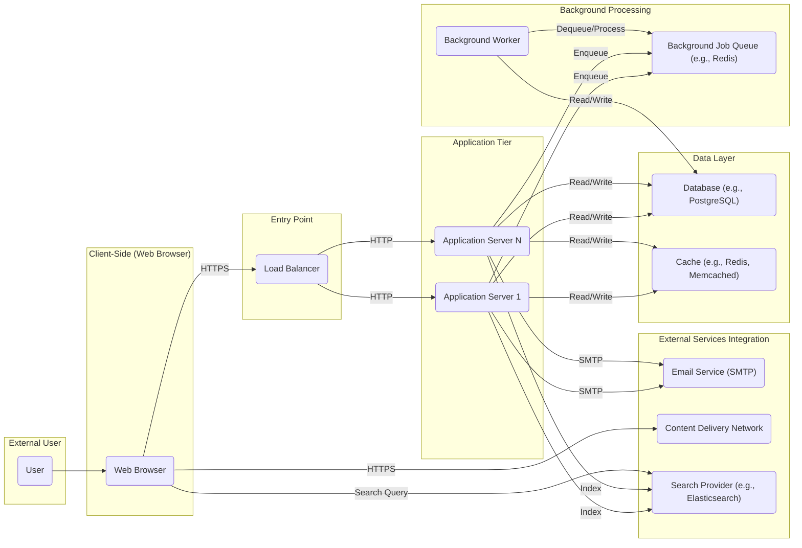

# Project Design Document: Discourse Forum Platform

**Version:** 1.1
**Date:** October 26, 2023
**Author:** AI Software Architect

## 1. Introduction

This document provides a detailed architectural design of the Discourse forum platform, based on the open-source project available at [https://github.com/discourse/discourse](https://github.com/discourse/discourse). This document aims to provide a comprehensive understanding of the system's components, their interactions, and the overall architecture. It will serve as the foundation for subsequent threat modeling activities by providing a clear and detailed picture of the system's structure and data flows.

## 2. Goals

*   Clearly define the major components of the Discourse platform and their responsibilities.
*   Illustrate the interactions and data flow between these components with a focus on security boundaries.
*   Provide sufficient detail about technologies and data handled by each component for effective threat modeling.
*   Document key technologies, dependencies, and communication protocols.
*   Establish a common understanding of the system architecture for development, security analysis, and operations teams.

## 3. Scope

This document covers the core architectural components of a standard Discourse deployment, focusing on aspects relevant to security. It includes:

*   Frontend web application (client-side)
*   Backend application server (including API and business logic)
*   Database system (primary data store)
*   Background job processing system
*   Email handling mechanisms
*   Content Delivery Network (CDN) usage and integration
*   Authentication and authorization mechanisms and flows
*   Key data elements and their storage locations

This document does not cover:

*   Specific details of plugin architectures or individual plugin functionalities.
*   Detailed code-level implementation specifics within components.
*   Specific deployment configurations (e.g., detailed Kubernetes manifests, specific cloud provider services).
*   Detailed performance tuning aspects or infrastructure scaling strategies beyond basic load balancing.

## 4. High-Level Architecture

## 5. Component Details

### 5.1. User

*   Represents an individual interacting with the Discourse platform through a web browser.
*   Performs actions such as browsing topics, creating and editing posts, managing their profile, and interacting with other users.
*   Authentication state is maintained through browser cookies and server-side sessions.

### 5.2. Web Browser

*   The client-side application used by users to access and interact with Discourse.
*   Renders the user interface using HTML, CSS, and JavaScript (primarily Ember.js).
*   Communicates with the backend application server via HTTPS for API requests and WebSocket for real-time updates.
*   Stores session cookies for authentication.
*   Fetches static assets from the CDN.

### 5.3. Load Balancer

*   The entry point for all incoming HTTP/HTTPS traffic to the Discourse application.
*   Distributes traffic across multiple `Application Server` instances to ensure high availability and scalability.
*   Typically performs SSL/TLS termination, encrypting traffic between the user and the load balancer.
*   May implement features like health checks and session persistence (sticky sessions).

### 5.4. Application Servers

*   Run the core Discourse application logic, primarily built using the Ruby on Rails framework.
*   Handle user requests, process data, enforce business rules, and interact with the `Database` and other services.
*   Responsible for:
    *   Authentication and authorization of user actions.
    *   Serving the API endpoints consumed by the `Web Browser`.
    *   Rendering server-side content (though most rendering is client-side).
    *   Managing user sessions.
    *   Enqueuing background jobs.
    *   Interacting with the `Search Provider`.
*   May utilize a `Cache` (e.g., Redis, Memcached) to improve performance by storing frequently accessed data.

### 5.5. Database

*   The primary persistent storage for all application data.
*   Typically a relational database like PostgreSQL.
*   Stores:
    *   User accounts (including credentials, profiles, and settings).
    *   Forum content (topics, posts, categories, tags).
    *   User relationships (likes, follows, mentions).
    *   Application settings and configurations.
    *   Session data (if not using a separate session store).

### 5.6. Background Job Queue

*   Manages asynchronous tasks that do not need to be processed in real-time during a user request.
*   Commonly implemented using Redis or a similar message queue.
*   Stores jobs to be processed by `Background Workers`.
*   Examples of jobs: sending emails, processing notifications, rebuilding search indexes, and performing scheduled tasks.

### 5.7. Background Workers

*   Processes tasks from the `Background Job Queue`.
*   Runs independently of the main `Application Server` processes.
*   Connects to the `Database` and potentially external services to perform their tasks.
*   Ensures that long-running or resource-intensive operations do not block user-facing requests.

### 5.8. Email Service (SMTP)

*   An external service used for sending transactional emails.
*   Used for:
    *   Account verification and password resets.
    *   Email notifications for new posts, mentions, and other events.
    *   Forum digests and newsletters.
*   Communication with the `Email Service` is typically done via SMTP protocol.

### 5.9. Content Delivery Network (CDN)

*   A distributed network of servers that stores and serves static assets.
*   Used to serve:
    *   Images and other media files uploaded by users.
    *   CSS and JavaScript files for the frontend application.
    *   Fonts and other static resources.
*   Improves performance by serving content from geographically closer locations to users and reduces load on the `Application Servers`.

### 5.10. Cache

*   An optional but common component used to improve application performance.
*   Typically an in-memory data store like Redis or Memcached.
*   Stores frequently accessed data to reduce the load on the `Database`.
*   Examples of cached data: rendered HTML fragments, user profiles, and application settings.

### 5.11. Search Provider

*   An external service (e.g., Elasticsearch) used for indexing and searching forum content.
*   The `Application Servers` send data to the `Search Provider` to be indexed.
*   The `Web Browser` can directly query the `Search Provider` for efficient search functionality.
*   Improves the speed and relevance of search results compared to database-based searching.

## 6. Data Flow

### 6.1. User Authentication

1. User (`User`) submits login credentials via the `Web Browser` over HTTPS.
2. The `Load Balancer` routes the request to an `Application Server`.
3. The `Application Server` authenticates the user against data stored in the `Database`.
4. Upon successful authentication, the `Application Server` creates a session and stores session data (potentially in the `Cache` or `Database`).
5. A session cookie is set in the `Web Browser` to maintain the authenticated state.

### 6.2. User Creating a Post

1. User (`User`) composes a new post in the `Web Browser`.
2. The `Web Browser` sends the post content to the `Application Server` via an HTTPS API request.
3. The `Load Balancer` routes the request to an `Application Server`.
4. The `Application Server` authenticates and authorizes the user.
5. The `Application Server` validates the post content.
6. The `Application Server` saves the new post data to the `Database`.
7. The `Application Server` may update the `Cache` with relevant information.
8. The `Application Server` enqueues background jobs in the `Background Job Queue` for tasks like:
    *   Sending notifications to subscribed users.
    *   Updating search indexes in the `Search Provider`.
    *   Processing mentions.
9. `Background Workers` process the jobs from the `Background Job Queue`, potentially interacting with the `Database` and the `Email Service` to send notifications.
10. The `Application Server` sends a success response back to the `Web Browser`.
11. The `Web Browser` updates the user interface.

### 6.3. User Requesting a Page with Images

1. User (`User`) requests a page via the `Web Browser`.
2. The `Load Balancer` routes the request to an `Application Server`.
3. The `Application Server` generates the HTML for the page.
4. The HTML contains links to images and other static assets.
5. The `Web Browser` fetches these static assets directly from the `CDN` via HTTPS.

## 7. Deployment Considerations

*   Discourse is commonly deployed on cloud platforms (e.g., AWS, Google Cloud, Azure) or on-premise infrastructure.
*   Containerization technologies like Docker are frequently used for packaging and deploying the application components.
*   Orchestration tools like Kubernetes can be used to manage and scale the `Application Servers`, `Background Workers`, and other services.
*   A robust monitoring and logging system is crucial for maintaining the health, performance, and security of the platform. This includes monitoring application logs, server metrics, and security events.
*   Regular backups of the `Database` are essential for disaster recovery.

## 8. Security Considerations (Detailed)

This section provides a more detailed overview of security considerations for each component, which will be further explored during threat modeling.

*   **User:**
    *   Phishing attacks targeting user credentials.
    *   Account takeover through weak passwords or compromised devices.
*   **Web Browser:**
    *   Vulnerabilities in the browser itself.
    *   Exposure to Cross-Site Scripting (XSS) attacks if the application doesn't properly sanitize output.
    *   Man-in-the-middle attacks if HTTPS is not enforced.
*   **Load Balancer:**
    *   Denial-of-Service (DoS) and Distributed Denial-of-Service (DDoS) attacks.
    *   Vulnerabilities in the load balancer software itself.
    *   Improper SSL/TLS configuration leading to weakened encryption.
*   **Application Servers:**
    *   SQL Injection vulnerabilities in database queries.
    *   Cross-Site Scripting (XSS) vulnerabilities in rendered content.
    *   Cross-Site Request Forgery (CSRF) vulnerabilities.
    *   Authentication and authorization bypass vulnerabilities.
    *   Remote code execution vulnerabilities in dependencies or the application code.
    *   Exposure of sensitive information through error messages or logs.
*   **Database:**
    *   Unauthorized access to sensitive data.
    *   Data breaches due to weak access controls or vulnerabilities.
    *   SQL Injection attacks originating from the `Application Servers`.
    *   Lack of encryption for data at rest.
*   **Background Job Queue:**
    *   Unauthorized access to the queue, potentially leading to manipulation of background tasks.
    *   Injection of malicious jobs into the queue.
*   **Background Workers:**
    *   Security vulnerabilities in the worker code that could be exploited.
    *   Access to sensitive data and external systems, requiring careful permission management.
*   **Email Service (SMTP):**
    *   Spoofing of email addresses.
    *   Exposure of email content in transit if not using TLS.
    *   Potential for abuse if not properly configured and secured.
*   **Content Delivery Network (CDN):**
    *   Compromise of the CDN infrastructure, potentially leading to serving of malicious content.
    *   Exposure of sensitive data if not properly configured (e.g., preventing listing of CDN buckets).
*   **Cache:**
    *   Exposure of sensitive data if the cache is compromised or not properly secured.
    *   Cache poisoning attacks.
*   **Search Provider:**
    *   Search injection vulnerabilities.
    *   Unauthorized access to indexed data.

## 9. Future Considerations

*   Integration with single sign-on (SSO) providers for centralized authentication.
*   Implementation of more granular access control mechanisms.
*   Enhancements to real-time features using WebSockets.
*   Advanced analytics and reporting dashboards.
*   Support for more diverse storage options.

This improved design document provides a more detailed and nuanced understanding of the Discourse architecture, specifically tailored for effective threat modeling. The added details about data flow, component responsibilities, and specific security considerations will enable a more thorough analysis of potential vulnerabilities and risks.
