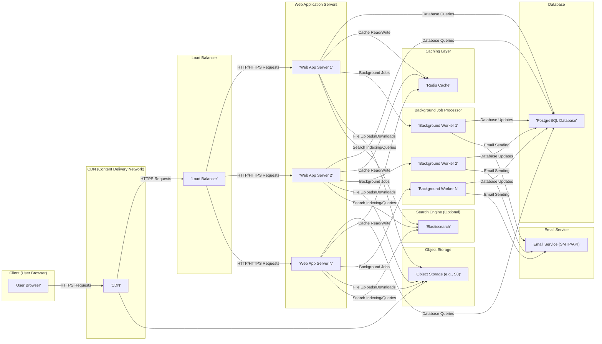

# Project Design Document: Discourse Forum Platform

**Project Name:** Discourse

**Project Repository:** [https://github.com/discourse/discourse](https://github.com/discourse/discourse)

**Document Version:** 1.1

**Date:** October 26, 2023

**Author:** AI Software Architect

## 1. Introduction

This document provides a detailed architectural design of the Discourse forum platform, intended to serve as a foundation for thorough threat modeling. It outlines the core components, their interactions, data flow, and underlying technologies. This document aims to provide sufficient detail for security analysis and identification of potential vulnerabilities.

## 2. Goals and Objectives

The primary goals of Discourse are to deliver:

- A modern, open-source platform for online discussions.
- An intuitive and engaging user experience for forum participation.
- Comprehensive tools for community management and effective moderation.
- Scalable and performant architecture capable of supporting large user bases.
- An extensible platform through the use of plugins and customizable themes.

## 3. High-Level Architecture

Discourse employs a standard multi-tier web application architecture, emphasizing a clear separation of concerns between the client, application logic, and data storage.

## 4. Detailed Component Breakdown

This section provides a detailed breakdown of the key components within the Discourse architecture, outlining their functionality, underlying technology, and significant interactions.

### 4.1. Client (User Browser)

- **Functionality:**  Provides the user interface for interacting with the Discourse platform. Responsible for rendering the application's HTML, CSS, and JavaScript.
- **Technology:**  Standard web browsers (e.g., Chrome, Firefox, Safari). Relies heavily on JavaScript for dynamic interactions.
- **Key Interactions:**
    - Initiates HTTPS requests to the CDN or directly to the load balancer for web pages and API calls.
    - Receives and renders HTML, CSS, and JavaScript.
    - Communicates with the backend via AJAX requests (JSON API).
    - Handles local storage of session tokens (typically HTTP cookies).

### 4.2. CDN (Content Delivery Network)

- **Functionality:**  Distributes static assets (images, stylesheets, JavaScript files) to geographically dispersed servers, reducing latency and improving load times for users. Can also provide basic DDoS protection and TLS termination.
- **Technology:**  Services such as Cloudflare, Fastly, AWS CloudFront, or similar.
- **Key Interactions:**
    - Serves static content to user browsers based on proximity.
    - May cache dynamic content based on configured rules.
    - Can act as a reverse proxy, forwarding requests to the origin servers (load balancers).

### 4.3. Load Balancer

- **Functionality:**  Distributes incoming network traffic across multiple web application servers to ensure high availability, fault tolerance, and optimal performance.
- **Technology:**  Software-based (e.g., HAProxy, Nginx) or cloud provider managed load balancers (e.g., AWS ELB, Azure Load Balancer, GCP Load Balancing).
- **Key Interactions:**
    - Receives all incoming HTTP/HTTPS requests from the CDN or directly from users.
    - Distributes requests to healthy web application servers based on configured algorithms (e.g., round-robin, least connections).
    - Performs health checks on backend servers.

### 4.4. Web Application Servers

- **Functionality:**  Hosts the core Discourse application logic, handles user requests, manages authentication and authorization, interacts with the database and other services, and renders dynamic web pages.
- **Technology:**  Ruby on Rails framework running on application servers like Puma or Unicorn.
- **Key Responsibilities:**
    - Handling user authentication (username/password, OAuth, SSO).
    - Enforcing authorization rules based on user roles and permissions.
    - Processing user input and validating data to prevent vulnerabilities.
    - Rendering dynamic HTML using templates and data from the database.
    - Interacting with the PostgreSQL database for persistent data storage.
    - Queuing background jobs for asynchronous tasks.
    - Interacting with the Redis cache for session management and data caching.
    - Handling file uploads and downloads, interacting with object storage.
    - Potentially interacting with an optional search engine like Elasticsearch.

### 4.5. Background Job Processor

- **Functionality:**  Executes asynchronous tasks that do not require immediate processing or could potentially block the main application thread. This improves responsiveness and allows for resource-intensive operations to be handled separately.
- **Technology:**  Sidekiq, a background processing framework for Ruby, typically using Redis as a message broker.
- **Key Tasks:**
    - Sending emails (notifications, password resets, digest emails).
    - Processing uploaded files (resizing images, generating thumbnails).
    - Performing data backups and maintenance tasks.
    - Updating search indexes in Elasticsearch.
    - Handling webhook events and external integrations.

### 4.6. Database

- **Functionality:**  Provides persistent storage for all of Discourse's data, including user information, posts, topics, categories, settings, and moderation logs.
- **Technology:**  PostgreSQL, a robust open-source relational database.
- **Key Data Stored:**
    - User accounts, profiles, and authentication credentials (hashed passwords).
    - Forum topics, posts, and their relationships.
    - Categories, tags, and forum settings.
    - User preferences and notification settings.
    - Moderation actions and logs.
    - Plugin data and configurations.

### 4.7. Caching Layer

- **Functionality:**  Stores frequently accessed data in-memory to reduce database load and improve application performance.
- **Technology:**  Redis, an in-memory data store often used as a cache and message broker.
- **Key Data Cached:**
    - User session data.
    - Frequently accessed user information and profiles.
    - Rendered HTML fragments.
    - API request results.
    - Rate limiting information.

### 4.8. Email Service

- **Functionality:**  Handles the sending of outbound emails from the Discourse application.
- **Technology:**  SMTP server or third-party email API providers (e.g., SendGrid, Mailgun, AWS SES).
- **Key Email Types:**
    - User registration and email verification.
    - Notification emails for new posts, mentions, and private messages.
    - Password reset instructions.
    - Digest emails summarizing recent activity.
    - Administrative emails.

### 4.9. Object Storage

- **Functionality:**  Stores uploaded files, such as user avatars and attachments in posts, providing scalable and cost-effective storage.
- **Technology:**  Cloud-based object storage services like Amazon S3, Google Cloud Storage, Azure Blob Storage, or self-hosted solutions.
- **Key Files Stored:**
    - User avatar images.
    - Images and other file attachments within forum posts.
    - Potentially backups or other large files.

### 4.10. Search Engine (Optional)

- **Functionality:**  Provides advanced search capabilities for forum content, allowing users to efficiently find relevant topics and posts.
- **Technology:**  Elasticsearch is a common choice for Discourse.
- **Key Interactions:**
    - Web application servers index new and updated content in Elasticsearch.
    - User search queries are directed to Elasticsearch for efficient retrieval of results.

## 5. Data Flow

This section illustrates the typical flow of data for common user interactions within the Discourse platform.

### 5.1. User Login

- The user enters their credentials in the login form within their web browser.
- The browser sends an HTTPS POST request containing the credentials to the load balancer.
- The load balancer routes the request to one of the available web application servers.
- The web application server authenticates the user by comparing the provided credentials with the stored, hashed password in the PostgreSQL database.
- Upon successful authentication, the server creates a session and stores the session ID in the Redis cache.
- The server sends an HTTP response back to the browser, including a `Set-Cookie` header containing the session cookie.

### 5.2. Posting a New Topic

- The user composes a new topic using the editor in their web browser.
- The browser sends an AJAX POST request containing the topic title and content to the load balancer.
- The load balancer routes the request to a web application server.
- The web application server validates the input data.
- The server creates a new topic and the initial post in the PostgreSQL database.
- The server updates relevant caches in Redis (e.g., recent topics).
- The server queues background jobs using Sidekiq for sending notifications to subscribed users.
- The server sends an HTTP response back to the browser confirming the successful creation of the topic.

### 5.3. Viewing a Topic

- The user clicks on a link to a topic in their web browser.
- The browser sends an HTTPS GET request to the load balancer, specifying the topic ID.
- The load balancer routes the request to a web application server.
- The web application server retrieves the topic and its associated posts from the PostgreSQL database, potentially leveraging the Redis cache for frequently accessed data.
- The server renders the HTML for the topic page and sends it as an HTTP response to the browser.
- The browser then makes separate requests to the CDN for static assets (images, CSS, JavaScript).

### 5.4. Uploading an Avatar

- The user uploads an avatar image through a form in their web browser.
- The browser sends a multipart/form-data POST request to the load balancer.
- The load balancer routes the request to a web application server.
- The web application server receives the image data.
- The server uploads the image to the configured object storage (e.g., S3).
- The server updates the user's profile in the PostgreSQL database with the URL of the uploaded avatar in object storage.
- The server updates relevant caches in Redis.
- The server sends an HTTP response back to the browser confirming the successful upload.

## 6. Key Technologies

- **Programming Language:** Ruby
- **Framework:** Ruby on Rails
- **Frontend Framework:** Ember.js
- **Database:** PostgreSQL
- **Caching:** Redis
- **Background Jobs:** Sidekiq
- **Web Server:** Puma (default), Unicorn
- **Templating Engine:** Handlebars
- **CSS Framework:** Custom framework used within Discourse
- **Search Engine (Optional):** Elasticsearch
- **Message Broker (for Sidekiq):** Redis

## 7. Security Considerations

This section highlights key security considerations based on the architectural design. This serves as an initial point for more in-depth threat modeling.

- **Authentication and Authorization:**
    - Securely managing user credentials and implementing robust authentication mechanisms (e.g., strong password policies, multi-factor authentication).
    - Implementing fine-grained authorization controls to restrict access to resources and functionalities based on user roles and permissions.
- **Input Validation and Output Encoding:**
    - Thoroughly validating all user inputs to prevent injection attacks (e.g., SQL injection, cross-site scripting (XSS)).
    - Encoding output data to prevent XSS vulnerabilities.
- **Cross-Site Request Forgery (CSRF) Protection:**
    - Implementing CSRF tokens to prevent malicious requests originating from other websites.
- **Session Management:**
    - Securely managing user sessions using HTTP cookies with appropriate flags (e.g., `HttpOnly`, `Secure`, `SameSite`).
    - Implementing session timeouts and invalidation mechanisms.
- **Rate Limiting and Abuse Prevention:**
    - Implementing rate limiting on API endpoints and critical actions to prevent brute-force attacks and abuse.
- **Data Protection (at Rest and in Transit):**
    - Encrypting sensitive data at rest in the database and object storage.
    - Enforcing HTTPS for all communication to protect data in transit.
- **Vulnerability Management:**
    - Regularly updating dependencies (Ruby gems, JavaScript libraries, operating system packages) to patch known vulnerabilities.
    - Conducting regular security audits and penetration testing.
- **Secure File Uploads:**
    - Validating file types and sizes upon upload.
    - Scanning uploaded files for malware.
    - Storing uploaded files securely and serving them with appropriate content security headers.
- **Content Security Policy (CSP):**
    - Implementing a strict CSP to mitigate XSS attacks by controlling the sources from which the browser is allowed to load resources.
- **Regular Security Audits:**
    - Conducting periodic security assessments and code reviews to identify potential vulnerabilities.
- **Secure Configuration Management:**
    - Securely managing and storing configuration settings, avoiding hardcoding sensitive information.

## 8. Assumptions and Constraints

- This document describes a common deployment architecture for Discourse. Specific configurations and features may differ based on individual installations and enabled plugins.
- It is assumed that standard security best practices are followed at the infrastructure level (e.g., secure server configurations, network segmentation).
- The focus is on the core Discourse application and its primary components. Detailed architectures of specific plugins or external integrations are not covered.
- This document assumes a self-hosted or managed hosting environment. Platform-as-a-Service (PaaS) deployments may introduce variations in the underlying infrastructure.

This improved design document provides a more comprehensive and detailed overview of the Discourse architecture, specifically tailored for threat modeling purposes. The enhanced descriptions of components, data flow, and security considerations will facilitate a more thorough and effective security analysis.
