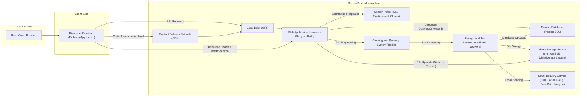

# Project Design Document: Discourse Forum Platform

**Project Link:** https://github.com/discourse/discourse

**Date:** October 26, 2023

**Version:** 1.1

**Author:** AI Software Architect

## 1. Introduction

This document provides a detailed architectural design of the Discourse forum platform, intended for use in subsequent threat modeling activities. It outlines the key components, their interactions, data flow, and technologies employed. This document aims to provide a comprehensive understanding of the system's structure and functionality.

## 2. System Architecture

Discourse employs a robust web application architecture, emphasizing a clear separation of concerns and leveraging modern web technologies. The core components interact to deliver the forum functionality.

### 2.1. Architecture Diagram

### 2.2. Component Descriptions

*   **User's Web Browser:** The application through which users interact with the Discourse platform. It renders the frontend application and handles user input.
*   **Discourse Frontend (Ember.js Application):** A sophisticated client-side JavaScript application built with Ember.js. It manages the user interface, handles routing, interacts with the backend API, and provides a rich, interactive user experience.
*   **Content Delivery Network (CDN):** An optional but highly recommended component that caches static assets like images, stylesheets, and JavaScript files. This reduces latency and improves load times for users globally. Examples include Cloudflare, Fastly, and AWS CloudFront.
*   **Load Balancer(s):** Distributes incoming HTTP traffic across multiple instances of the backend web application. This ensures high availability, fault tolerance, and scalability by preventing any single instance from being overwhelmed. Common examples include HAProxy, Nginx, and cloud provider load balancers.
*   **Web Application Instances (Ruby on Rails):** The core of the Discourse application, built using the Ruby on Rails framework. These instances handle user authentication, authorization, business logic, API endpoints, and interactions with the database and other services. They process user requests and generate dynamic content.
*   **Background Job Processors (Sidekiq Workers):** A system for processing asynchronous tasks off the main request-response cycle. Powered by Redis, Sidekiq handles tasks like sending emails, processing notifications, importing data, and performing maintenance operations, improving the responsiveness of the main application.
*   **Primary Database (PostgreSQL):** The persistent data store for Discourse. It holds all essential application data, including user information, forum topics, posts, categories, settings, and more. PostgreSQL is chosen for its reliability, robustness, and feature set.
*   **Object Storage Service (e.g., AWS S3, DigitalOcean Spaces):** Used for storing user-uploaded files, such as avatars, attachments, and embedded media. Object storage provides scalable and cost-effective storage, offloading file management from the main application servers.
*   **Email Delivery Service (SMTP or API - e.g., SendGrid, Mailgun):** Responsible for sending transactional emails to users, such as account verification emails, password reset requests, and notification emails. Utilizing a dedicated email service improves deliverability and simplifies email infrastructure management.
*   **Search Index (e.g., Elasticsearch Cluster):** Provides powerful full-text search capabilities for forum content. Elasticsearch indexes the content of posts and topics, allowing users to quickly and efficiently find relevant information. A cluster setup ensures high availability and scalability for the search functionality.
*   **Caching and Queuing System (Redis):** A versatile in-memory data store used for various purposes within Discourse. It acts as a cache for frequently accessed data, reducing database load and improving performance. It also serves as the message broker for Sidekiq, managing the queue of background jobs.

## 3. Data Flow

This section details the typical flow of data for key user interactions within the Discourse platform.

*   **Viewing a Forum Topic:**
    *   The user's web browser sends an HTTP request to the Discourse domain.
    *   The CDN serves cached static assets if available.
    *   The load balancer directs the request to an available web application instance.
    *   The Rails application receives the request and queries the PostgreSQL database to retrieve the topic details, associated posts, and user information.
    *   Frequently accessed data might be retrieved from the Redis cache to optimize performance.
    *   The Rails application renders the necessary data and sends it back to the frontend as JSON.
    *   The Ember.js application on the client-side receives the data and dynamically renders the topic content in the user's browser.

*   **Creating a New Forum Post:**
    *   The user composes their post in the web browser.
    *   The Ember.js application sends an API request (typically a POST request) to the backend Rails application, including the post content and associated metadata.
    *   The Rails application authenticates and authorizes the user.
    *   The application validates the input data to prevent malicious content or errors.
    *   The new post data is saved to the PostgreSQL database.
    *   The Rails application enqueues background jobs using Redis/Sidekiq to handle tasks like:
        *   Sending notifications to subscribed users.
        *   Updating user activity feeds.
        *   Processing any embedded media or links.
    *   The Elasticsearch index is updated with the content of the new post to make it searchable.
    *   The Rails application sends a success response back to the frontend.
    *   The Ember.js application updates the displayed topic with the newly created post, often using WebSockets for real-time updates.

*   **Uploading a User Avatar:**
    *   The user selects an image file through the browser interface.
    *   The Ember.js application initiates the upload process, which might involve:
        *   Direct upload to the object storage service using a pre-signed URL generated by the backend.
        *   Uploading the file to the backend Rails application, which then forwards it to the object storage.
    *   If a pre-signed URL is used, the browser directly uploads the image to the object storage (e.g., AWS S3).
    *   The frontend or backend notifies the Rails application about the successful upload, providing the location of the uploaded file in the object storage.
    *   The Rails application updates the user's profile in the PostgreSQL database with the URL or path to the new avatar in the object storage.
    *   The CDN may cache the new avatar image for faster delivery in the future.

## 4. Key Technologies

*   **Primary Programming Languages:** Ruby (Backend), JavaScript (Frontend)
*   **Backend Framework:** Ruby on Rails (version typically specified in `Gemfile`)
*   **Frontend Framework:** Ember.js (version typically specified in `package.json` or `yarn.lock`)
*   **Database System:** PostgreSQL (version commonly 12 or higher)
*   **Background Job Processing:** Sidekiq (using Redis as a message broker)
*   **Caching and Queuing:** Redis
*   **Search Engine:** Elasticsearch (or potentially OpenSearch)
*   **Web Server (Production):** Typically Puma or Unicorn, often running behind a reverse proxy like Nginx or Apache.
*   **Operating System (Server):** Linux-based distributions are the most common (e.g., Ubuntu, Debian, CentOS).
*   **Containerization and Orchestration (Optional but Common):** Docker for containerization, often orchestrated with Kubernetes or Docker Compose for deployment and management.
*   **Email Delivery Libraries/Gems (Ruby):**  ActionMailer (part of Rails), potentially integration with specific email provider libraries.

## 5. Deployment Model

Discourse offers flexibility in deployment, catering to various needs and scales.

*   **Self-Hosted Deployment:** Organizations manage the entire infrastructure required to run Discourse on their own servers or cloud instances. This provides maximum control over the environment but necessitates expertise in server administration, security, and maintenance.
    *   **Considerations:** Requires manual setup of all components (web servers, database, Redis, etc.), responsibility for security patching and updates, and scaling infrastructure as needed.
*   **Managed Hosting Solutions:** Utilizing a hosting provider specifically designed for Discourse. The provider handles infrastructure management, updates, backups, and often provides support. This simplifies operations but involves reliance on a third-party vendor.
    *   **Examples:** Official Discourse hosting, other specialized hosting providers.
*   **Containerized Deployment (Docker):** Packaging Discourse and its dependencies into Docker containers allows for consistent and reproducible deployments across different environments. This simplifies setup and management, especially when combined with orchestration tools.
    *   **Orchestration:** Kubernetes is frequently used to manage and scale containerized Discourse deployments, providing features like automated deployments, scaling, and self-healing. Docker Compose is suitable for smaller deployments.
*   **Cloud-Based Deployment:** Deploying Discourse on cloud platforms like AWS, Google Cloud, or Azure. This offers scalability, reliability, and access to various managed services.
    *   **Services Used:**  Often involves using managed database services (e.g., AWS RDS, Google Cloud SQL), managed Kubernetes services (e.g., AWS EKS, Google GKE), object storage (e.g., AWS S3, Google Cloud Storage), and load balancers provided by the cloud platform.

A typical self-hosted, containerized deployment might involve:

*   A reverse proxy (e.g., Nginx) acting as the entry point, handling SSL termination and routing traffic.
*   Multiple Docker containers running the Ruby on Rails application instances.
*   A Docker container for the PostgreSQL database.
*   A Docker container for Redis.
*   Potentially a Docker container or managed service for Elasticsearch.
*   Configuration managed through environment variables or configuration files.
*   Orchestration using Docker Compose or Kubernetes to manage the containers and their interactions.

## 6. Security Considerations (High-Level)

Discourse incorporates various security measures to protect user data and the platform itself. A dedicated threat modeling exercise will delve deeper into potential vulnerabilities and mitigation strategies.

*   **Authentication and Authorization Mechanisms:**
    *   Standard username/password authentication with secure password hashing (e.g., bcrypt).
    *   Support for social logins (e.g., Google, Facebook, Twitter) via OAuth.
    *   Single Sign-On (SSO) integration capabilities.
    *   Role-based access control to manage permissions for different user groups.
*   **Input Validation and Output Encoding:**
    *   Server-side validation of all user inputs to prevent injection attacks (SQL injection, command injection, etc.).
    *   Proper encoding of output data to prevent Cross-Site Scripting (XSS) vulnerabilities.
*   **Protection Against Cross-Site Request Forgery (CSRF):** Implementation of CSRF tokens to prevent unauthorized actions on behalf of authenticated users.
*   **Enforced HTTPS:**  Mandatory use of HTTPS to encrypt all communication between the user's browser and the server, protecting sensitive data in transit.
*   **Secure Password Management:**  Storage of user passwords using strong hashing algorithms with salts.
*   **Rate Limiting and Abuse Prevention:** Implementation of rate limits on API endpoints and critical actions to mitigate brute-force attacks and other forms of abuse.
*   **Content Security Policy (CSP):**  Use of CSP headers to control the resources that the browser is allowed to load, reducing the risk of XSS attacks.
*   **Database Security Best Practices:** Secure configuration of the PostgreSQL database, including strong passwords, restricted access, and regular security updates.
*   **Object Storage Security:**  Properly configured access controls and permissions for the object storage service to prevent unauthorized access to uploaded files.
*   **Email Security Measures:**  Implementation of SPF, DKIM, and DMARC records to verify the authenticity of outgoing emails and prevent email spoofing.
*   **Regular Security Audits and Penetration Testing:**  Proactive identification of potential vulnerabilities through security assessments.
*   **Dependency Management and Vulnerability Scanning:**  Regularly updating dependencies and scanning for known vulnerabilities in third-party libraries.
*   **WebSockets Security:** Secure configuration and handling of WebSocket connections to prevent vulnerabilities in real-time communication.
*   **Regular Security Updates and Patching:**  Prompt application of security updates to the Discourse platform and its underlying infrastructure components.

This enhanced design document provides a more detailed and comprehensive overview of the Discourse architecture, offering a solid foundation for conducting thorough threat modeling activities. The expanded descriptions of components, data flows, and security considerations will aid in identifying potential risks and developing effective mitigation strategies.