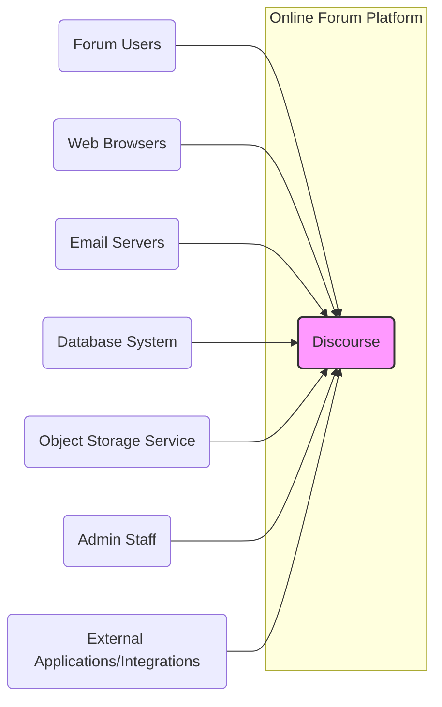
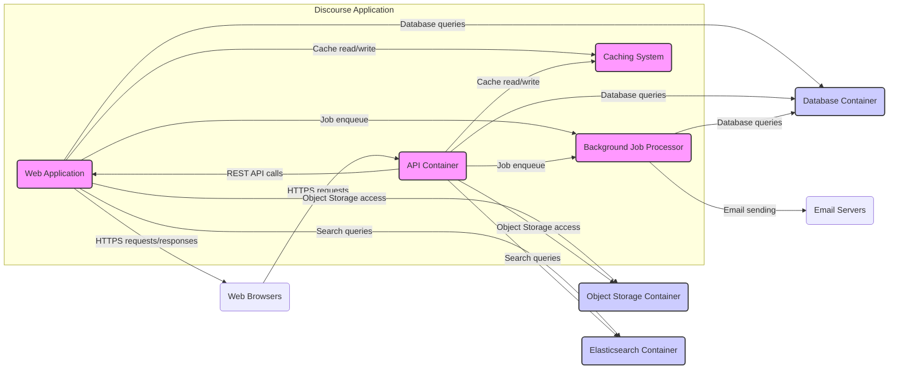
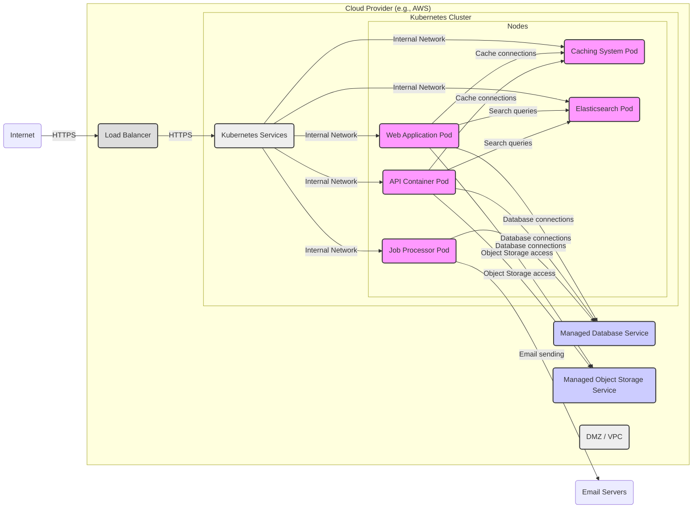
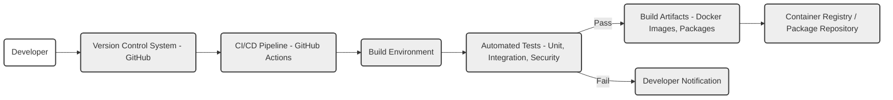

# BUSINESS POSTURE

Discourse is an open-source internet forum and mailing list management software. It aims to modernize online discussions by providing a platform that is engaging, user-friendly, and scalable.

- Business priorities and goals:
  - Provide a modern, user-friendly forum platform.
  - Enable communities to grow and thrive through online discussions.
  - Offer a scalable and reliable platform for various community sizes.
  - Support open-source principles and community contributions.
  - Offer both self-hosted and hosted solutions to cater to different user needs.

- Most important business risks:
  - Data breaches and data loss, leading to reputational damage and loss of user trust.
  - Service disruptions and downtime, impacting community engagement and platform reliability.
  - Security vulnerabilities that could be exploited to compromise user accounts or platform integrity.
  - Difficulty in scaling the platform to meet growing community demands.
  - Negative perception due to lack of security features or poor security practices.

# SECURITY POSTURE

- Existing security controls:
  - security control: Regular security audits and penetration testing (location: likely documented in security policies or blog posts, but needs verification).
  - security control: Secure software development lifecycle (SSDLC) practices, including code reviews and security testing (location: likely internal development processes, needs verification).
  - security control: Input validation and sanitization to prevent common web vulnerabilities like XSS and SQL injection (location: within the application codebase).
  - security control: Authentication and authorization mechanisms to control access to forum features and data (location: within the application codebase).
  - security control: Protection against common web attacks like CSRF (location: within the application codebase).
  - security control: HTTPS encryption for communication between users and the platform (location: deployment configuration).
  - security control: Rate limiting to mitigate brute-force attacks and denial-of-service attempts (location: application or infrastructure level).
  - security control: Regular security updates and patching of dependencies (location: development and maintenance processes).
  - accepted risk: Reliance on community contributions for security vulnerability discovery and patching (inherent to open-source projects).
  - accepted risk: Potential for misconfigurations in self-hosted deployments by users (outside of Discourse control).

- Recommended security controls:
  - security control: Implement automated security scanning tools (SAST/DAST) in the CI/CD pipeline to proactively identify vulnerabilities.
  - security control: Enhance logging and monitoring capabilities for security events and incident response.
  - security control: Formalize incident response plan and procedures.
  - security control: Implement dependency scanning and management tools to ensure timely patching of vulnerable dependencies.
  - security control: Provide security hardening guidelines for self-hosted deployments.

- Security requirements:
  - Authentication:
    - Requirement: Secure user authentication mechanisms, including password-based login, social logins (OAuth), and potentially multi-factor authentication (MFA).
    - Requirement: Protection against brute-force attacks on login endpoints.
    - Requirement: Secure password storage using strong hashing algorithms.
  - Authorization:
    - Requirement: Role-based access control (RBAC) to manage user permissions and access to forum features (e.g., admin, moderator, user).
    - Requirement: Granular permissions to control access to categories, topics, and administrative functions.
    - Requirement: Secure API authorization for external integrations.
  - Input validation:
    - Requirement: Comprehensive input validation and sanitization for all user-provided data to prevent injection attacks (XSS, SQL injection, etc.).
    - Requirement: Validation on both client-side and server-side.
    - Requirement: Use of parameterized queries or ORM to prevent SQL injection.
  - Cryptography:
    - Requirement: Use HTTPS for all communication to protect data in transit.
    - Requirement: Secure storage of sensitive data at rest, such as API keys or secrets (if applicable).
    - Requirement: Proper handling of cryptographic keys and secrets.

# DESIGN

## C4 CONTEXT

- Context Diagram Elements:
  - - Name: Discourse
    - Type: Software System
    - Description: The online forum platform itself, providing discussion forums, user management, and community features.
    - Responsibilities:
      - Managing user accounts and profiles.
      - Hosting and displaying forum content (topics, posts, messages).
      - Facilitating user interactions and discussions.
      - Providing moderation and administrative tools.
      - Exposing APIs for integrations.
    - Security controls:
      - Authentication and authorization mechanisms.
      - Input validation and sanitization.
      - Protection against common web vulnerabilities.
      - Logging and monitoring.

  - - Name: Forum Users
    - Type: Person
    - Description: Individuals who access and use the Discourse platform to participate in discussions, create content, and interact with the community.
    - Responsibilities:
      - Creating user accounts and managing profiles.
      - Browsing forum content.
      - Creating and replying to topics and posts.
      - Interacting with other users.
    - Security controls:
      - Strong password management (user responsibility).
      - Awareness of phishing and social engineering attacks.

  - - Name: Web Browsers
    - Type: Software System
    - Description: Web browsers used by forum users to access the Discourse platform via the internet.
    - Responsibilities:
      - Rendering the Discourse web application.
      - Sending user requests to the Discourse platform.
      - Receiving and displaying responses from the Discourse platform.
    - Security controls:
      - Browser security features (e.g., Content Security Policy enforcement, XSS protection).
      - User awareness of browser security settings and extensions.

  - - Name: Email Servers
    - Type: Software System
    - Description: Email servers used for sending and receiving emails related to forum activities, such as notifications, password resets, and digest emails.
    - Responsibilities:
      - Sending emails from the Discourse platform to users.
      - Receiving emails from users (e.g., for email-in functionality, if enabled).
      - Managing email queues and delivery.
    - Security controls:
      - SMTP authentication and encryption (TLS).
      - Spam filtering and email security measures.

  - - Name: Database System
    - Type: Software System
    - Description: Database system used by Discourse to store forum data, including user accounts, posts, topics, categories, and settings.
    - Responsibilities:
      - Storing and retrieving forum data.
      - Ensuring data persistence and integrity.
      - Providing data access to the Discourse application.
    - Security controls:
      - Database access controls and authentication.
      - Data encryption at rest (if required).
      - Regular database backups.

  - - Name: Object Storage Service
    - Type: Software System
    - Description: Object storage service used to store uploaded files, attachments, and potentially other static assets.
    - Responsibilities:
      - Storing and retrieving uploaded files.
      - Providing access to stored files to the Discourse application and users (as authorized).
      - Ensuring data durability and availability.
    - Security controls:
      - Access controls and authentication for object storage.
      - Data encryption at rest (if required).
      - Regular backups (if applicable).

  - - Name: Admin Staff
    - Type: Person
    - Description: Administrators and moderators who manage the Discourse platform, configure settings, moderate content, and manage users.
    - Responsibilities:
      - Configuring and maintaining the Discourse platform.
      - Managing users and permissions.
      - Moderating forum content and enforcing community guidelines.
      - Monitoring platform performance and security.
    - Security controls:
      - Strong authentication and authorization for admin accounts.
      - Audit logging of administrative actions.
      - Security training and awareness.

  - - Name: External Applications/Integrations
    - Type: Software System
    - Description: External applications or services that integrate with Discourse via APIs, such as single sign-on providers, analytics platforms, or custom integrations.
    - Responsibilities:
      - Interacting with Discourse APIs to access data or perform actions.
      - Providing additional functionality or services that complement Discourse.
    - Security controls:
      - Secure API authentication and authorization (e.g., API keys, OAuth).
      - Input validation and sanitization on data exchanged with Discourse.
      - Adherence to API security best practices.

## C4 CONTAINER

- Container Diagram Elements:
  - - Name: Web Application
    - Type: Container
    - Description: The primary web application container responsible for serving the user interface, handling user interactions, and rendering forum content. Likely built using Ruby on Rails.
    - Responsibilities:
      - Handling HTTP requests from web browsers.
      - Rendering HTML, CSS, and JavaScript for the user interface.
      - Implementing core forum features (topic creation, post display, user profiles).
      - Interacting with the database, cache, job processor, and object storage.
      - Enforcing web application security controls.
    - Security controls:
      - Web application firewall (WAF) if deployed behind a load balancer.
      - Input validation and sanitization.
      - Session management and authentication.
      - Protection against XSS, CSRF, and other web vulnerabilities.

  - - Name: API Container
    - Type: Container
    - Description: A dedicated API container providing a RESTful API for external integrations and potentially for internal use by the web application. Likely part of the same Ruby on Rails application or a separate service.
    - Responsibilities:
      - Handling API requests from external applications and potentially the web application.
      - Providing API endpoints for accessing forum data and performing actions.
      - Implementing API authentication and authorization.
      - Interacting with the database, cache, job processor, and object storage.
      - Enforcing API security controls.
    - Security controls:
      - API gateway for rate limiting, authentication, and security policies.
      - API key management or OAuth 2.0 for authentication.
      - Input validation and sanitization for API requests.
      - API request logging and monitoring.

  - - Name: Background Job Processor
    - Type: Container
    - Description: A background job processing system (e.g., Sidekiq, Resque) responsible for handling asynchronous tasks, such as sending emails, processing notifications, and performing background data updates.
    - Responsibilities:
      - Processing background jobs enqueued by the web application and API container.
      - Sending emails via email servers.
      - Performing resource-intensive tasks asynchronously.
      - Ensuring reliable job execution and retries.
    - Security controls:
      - Secure job queue management.
      - Input validation for job parameters.
      - Monitoring of job processing and error handling.

  - - Name: Caching System
    - Type: Container
    - Description: A caching system (e.g., Redis, Memcached) used to improve performance by caching frequently accessed data, such as forum content, user sessions, and API responses.
    - Responsibilities:
      - Caching data to reduce database load and improve response times.
      - Providing fast access to cached data for the web application and API container.
      - Managing cache invalidation and eviction.
    - Security controls:
      - Access controls to the caching system.
      - Secure configuration of the caching system.

  - - Name: Database Container
    - Type: Container
    - Description: A database management system (e.g., PostgreSQL, MySQL) container used to store persistent forum data.
    - Responsibilities:
      - Storing and managing forum data.
      - Ensuring data integrity and availability.
      - Providing database access to the web application, API container, and job processor.
      - Performing database backups and maintenance.
    - Security controls:
      - Database access controls and authentication.
      - Database encryption at rest (if configured).
      - Regular database backups and disaster recovery.
      - Database security hardening.

  - - Name: Object Storage Container
    - Type: Container
    - Description: An object storage service container (e.g., AWS S3, Google Cloud Storage, MinIO) used to store uploaded files and attachments.
    - Responsibilities:
      - Storing and retrieving uploaded files.
      - Providing scalable and durable storage for files.
      - Providing access to stored files to the web application and API container.
    - Security controls:
      - Object storage access controls and authentication.
      - Object storage encryption at rest (if configured).
      - Data lifecycle management and retention policies.

  - - Name: Elasticsearch Container
    - Type: Container
    - Description: An Elasticsearch container used for providing search functionality within the forum.
    - Responsibilities:
      - Indexing forum content for search.
      - Handling search queries from the web application and API container.
      - Providing fast and relevant search results.
    - Security controls:
      - Access controls to the Elasticsearch cluster.
      - Secure configuration of Elasticsearch.
      - Input validation for search queries.

## DEPLOYMENT

Deployment Solution: Cloud-based deployment using Docker containers and Kubernetes on a cloud provider like AWS, GCP, or Azure.

- Deployment Diagram Elements:
  - - Name: Internet
    - Type: Environment
    - Description: The public internet, representing external users accessing the Discourse platform.
    - Responsibilities:
      - Providing network connectivity for users to access Discourse.
    - Security controls:
      - None directly controlled by Discourse deployment. Reliance on internet infrastructure security.

  - - Name: Load Balancer (LB)
    - Type: Infrastructure
    - Description: A cloud load balancer distributing incoming HTTPS traffic across Kubernetes service endpoints.
    - Responsibilities:
      - Load balancing incoming traffic.
      - TLS termination.
      - Protecting backend services from direct internet exposure.
    - Security controls:
      - HTTPS termination and encryption.
      - DDoS protection.
      - Web Application Firewall (WAF) capabilities (optional, but recommended).

  - - Name: DMZ / VPC
    - Type: Network Zone
    - Description: A Demilitarized Zone or Virtual Private Cloud isolating the Kubernetes cluster and backend services from the public internet and other internal networks.
    - Responsibilities:
      - Network segmentation and isolation.
      - Controlling network traffic flow.
    - Security controls:
      - Network Access Control Lists (NACLs) or Security Groups.
      - Network firewalls.

  - - Name: Kubernetes Cluster
    - Type: Infrastructure
    - Description: A Kubernetes cluster providing container orchestration for Discourse application containers.
    - Responsibilities:
      - Deploying and managing containerized applications.
      - Scaling application containers.
      - Providing service discovery and networking within the cluster.
    - Security controls:
      - Kubernetes RBAC for access control within the cluster.
      - Network policies to control pod-to-pod communication.
      - Container security scanning and vulnerability management.
      - Regular Kubernetes security updates.

  - - Name: Kubernetes Services (KUBE_SVC)
    - Type: Kubernetes Resource
    - Description: Kubernetes Services exposing the Web Application, API Container, Job Processor, Caching System, and Elasticsearch pods within the cluster.
    - Responsibilities:
      - Providing stable endpoints for accessing pods.
      - Load balancing traffic across pods within a service.
    - Security controls:
      - Kubernetes Network Policies to restrict access to services.
      - Service account security.

  - - Name: Web Application Pod (WEB_POD)
    - Type: Container Instance
    - Description: Instances of the Web Application container running as pods within the Kubernetes cluster.
    - Responsibilities: Same as Web Application Container.
    - Security controls: Same as Web Application Container, plus Kubernetes pod security context.

  - - Name: API Container Pod (API_POD)
    - Type: Container Instance
    - Description: Instances of the API Container running as pods within the Kubernetes cluster.
    - Responsibilities: Same as API Container Container.
    - Security controls: Same as API Container Container, plus Kubernetes pod security context.

  - - Name: Job Processor Pod (JOB_POD)
    - Type: Container Instance
    - Description: Instances of the Job Processor container running as pods within the Kubernetes cluster.
    - Responsibilities: Same as Job Processor Container.
    - Security controls: Same as Job Processor Container, plus Kubernetes pod security context.

  - - Name: Caching System Pod (CACHE_POD)
    - Type: Container Instance
    - Description: Instances of the Caching System container running as pods within the Kubernetes cluster.
    - Responsibilities: Same as Caching System Container.
    - Security controls: Same as Caching System Container, plus Kubernetes pod security context.

  - - Name: Elasticsearch Pod (ES_POD)
    - Type: Container Instance
    - Description: Instances of the Elasticsearch container running as pods within the Kubernetes cluster.
    - Responsibilities: Same as Elasticsearch Container.
    - Security controls: Same as Elasticsearch Container, plus Kubernetes pod security context.

  - - Name: Managed Database Service (DB_SVC)
    - Type: Managed Service
    - Description: A managed database service (e.g., AWS RDS, GCP Cloud SQL, Azure Database for PostgreSQL) provided by the cloud provider.
    - Responsibilities:
      - Providing a managed database instance.
      - Handling database backups, patching, and maintenance.
    - Security controls:
      - Database access controls managed by the cloud provider.
      - Database encryption at rest and in transit (managed by the cloud provider).
      - Cloud provider's security measures for managed services.

  - - Name: Managed Object Storage Service (OSS_SVC)
    - Type: Managed Service
    - Description: A managed object storage service (e.g., AWS S3, GCP Cloud Storage, Azure Blob Storage) provided by the cloud provider.
    - Responsibilities:
      - Providing managed object storage.
      - Handling data durability and availability.
    - Security controls:
      - Object storage access controls managed by the cloud provider.
      - Object storage encryption at rest (managed by the cloud provider).
      - Cloud provider's security measures for managed services.

## BUILD

- Build Process Elements:
  - - Name: Developer
    - Type: Person
    - Description: Software developers contributing code to the Discourse project.
    - Responsibilities:
      - Writing and committing code changes.
      - Performing local testing.
      - Addressing code review feedback.
    - Security controls:
      - Secure development practices training.
      - Code review process.
      - Access control to the version control system.

  - - Name: Version Control System - GitHub (VCS)
    - Type: Tool
    - Description: GitHub repository hosting the Discourse source code.
    - Responsibilities:
      - Storing and managing source code.
      - Tracking code changes and versions.
      - Facilitating collaboration among developers.
    - Security controls:
      - Access control to the repository (authentication and authorization).
      - Branch protection rules.
      - Audit logging of repository activities.

  - - Name: CI/CD Pipeline - GitHub Actions (CI)
    - Type: Tool
    - Description: GitHub Actions workflows automating the build, test, and deployment processes.
    - Responsibilities:
      - Automating the build process.
      - Running automated tests.
      - Building and publishing artifacts.
      - Enforcing build pipeline security controls.
    - Security controls:
      - Secure configuration of CI/CD pipelines.
      - Secrets management for CI/CD workflows.
      - Code scanning and security checks within the pipeline.
      - Access control to CI/CD workflows and configurations.

  - - Name: Build Environment
    - Type: Infrastructure
    - Description: The environment where the build process is executed, typically within the CI/CD pipeline.
    - Responsibilities:
      - Providing the necessary tools and dependencies for building the software.
      - Isolating build processes.
    - Security controls:
      - Secure build environment configuration.
      - Dependency scanning and management.
      - Isolation from production environments.

  - - Name: Automated Tests - Unit, Integration, Security (TEST)
    - Type: Process
    - Description: Automated tests executed as part of the build pipeline, including unit tests, integration tests, and security tests (e.g., SAST, linters).
    - Responsibilities:
      - Verifying code quality and functionality.
      - Identifying bugs and vulnerabilities early in the development cycle.
      - Enforcing code quality standards.
    - Security controls:
      - Security testing tools integration (SAST, linters).
      - Test coverage analysis.
      - Regular updates to security testing tools and rules.

  - - Name: Build Artifacts - Docker Images, Packages (ARTIFACT)
    - Type: Output
    - Description: The output of the build process, including Docker images, packages, and other deployable artifacts.
    - Responsibilities:
      - Packaging the software for deployment.
      - Ensuring artifact integrity and security.
    - Security controls:
      - Artifact signing and verification.
      - Vulnerability scanning of Docker images and dependencies.
      - Secure storage of build artifacts.

  - - Name: Container Registry / Package Repository (REGISTRY)
    - Type: Tool
    - Description: A container registry (e.g., Docker Hub, GitHub Container Registry) and/or package repository for storing and distributing build artifacts.
    - Responsibilities:
      - Storing and managing build artifacts.
      - Providing access to artifacts for deployment.
    - Security controls:
      - Access control to the registry/repository.
      - Vulnerability scanning of stored artifacts.
      - Image signing and verification.

  - - Name: Developer Notification (NOTIFY)
    - Type: Process
    - Description: Notifications sent to developers in case of build failures or test failures.
    - Responsibilities:
      - Alerting developers about issues in the build process.
      - Facilitating timely issue resolution.
    - Security controls:
      - Secure notification channels.

# RISK ASSESSMENT

- Critical business processes:
  - User registration and authentication.
  - Forum content creation and management (topics, posts).
  - User interactions and communication within the forum.
  - Platform administration and moderation.
  - Email notifications and communication.
  - API access and integrations.
  - Search functionality.

- Data being protected and sensitivity:
  - User data:
    - Sensitivity: High. Includes usernames, email addresses, passwords (hashed), profile information, IP addresses, activity logs, potentially private messages.
    - Protection needed: Confidentiality, integrity, availability.
  - Forum content:
    - Sensitivity: Medium to High (depending on forum topic and community). Includes posts, topics, messages, attachments.
    - Protection needed: Integrity, availability, confidentiality (for private categories/messages).
  - System configuration data:
    - Sensitivity: High. Includes database credentials, API keys, secrets, server configurations.
    - Protection needed: Confidentiality, integrity, availability.
  - Logs and audit trails:
    - Sensitivity: Medium. Includes access logs, security event logs, audit trails.
    - Protection needed: Integrity, availability, confidentiality (depending on log content).

# QUESTIONS & ASSUMPTIONS

- Questions:
  - What are the specific security audit and penetration testing schedules and findings for Discourse?
  - What specific SAST/DAST tools are currently used or planned for use in the development pipeline?
  - Is multi-factor authentication (MFA) currently supported or planned for Discourse user accounts and administrative accounts?
  - What is the incident response plan for security incidents affecting Discourse?
  - Are there specific security hardening guidelines provided for self-hosted Discourse deployments?
  - What are the data retention policies for user data and forum content?
  - What are the specific compliance requirements (e.g., GDPR, CCPA) that Discourse needs to adhere to?

- Assumptions:
  - BUSINESS POSTURE: Discourse prioritizes user privacy and data security due to the nature of online forum platforms and the sensitivity of user-generated content.
  - SECURITY POSTURE: Discourse follows secure software development practices and implements common web application security controls. However, as an open-source project, it relies on community contributions for security vulnerability discovery and patching.
  - DESIGN: Discourse is designed as a modern web application with a modular architecture, utilizing containers and cloud-native technologies for deployment and scalability. It leverages common components like databases, caching systems, and background job processors. The deployment model assumes a cloud-based environment for scalability and manageability.