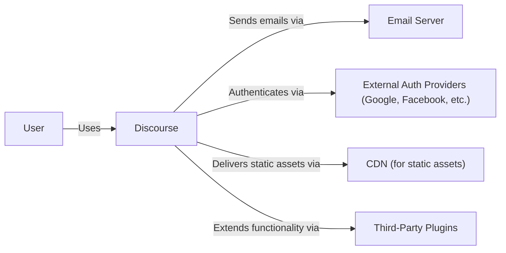
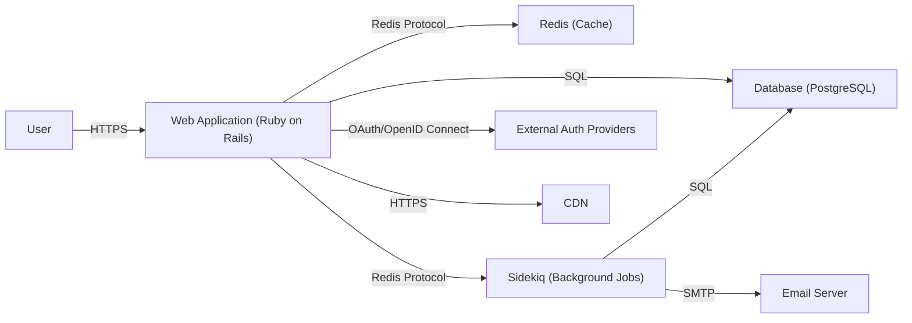
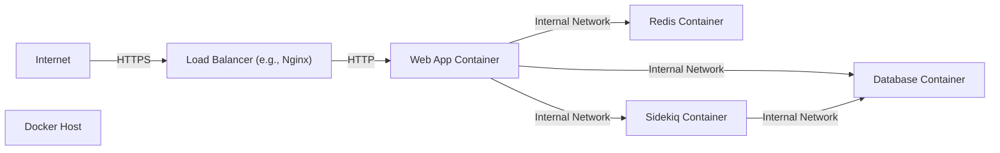
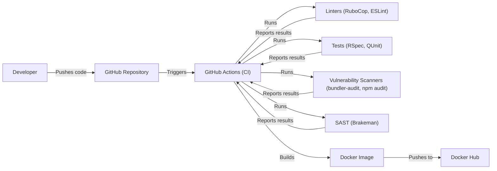

Okay, let's create a design document for the Discourse project, focusing on aspects relevant to threat modeling.

# BUSINESS POSTURE

Discourse is an open-source discussion platform.  It aims to provide a clean, modern, and customizable forum solution for communities.  The business priorities revolve around:

*   User Engagement:  Maintaining a vibrant and active user base.
*   Community Health:  Providing tools to foster positive and constructive discussions.
*   Customization and Extensibility:  Allowing users to tailor the platform to their specific needs.
*   Reliability and Scalability:  Ensuring the platform can handle a large number of users and discussions.
*   Reputation: Maintaining a positive image as a secure and reliable platform.

Given these priorities, the most important business risks are:

*   Data Breach:  Leakage of user data (emails, private messages, etc.) could severely damage reputation and user trust.
*   Platform Abuse:  Spam, harassment, and other forms of abuse can degrade the user experience and community health.
*   Service Disruption:  Downtime or performance issues can frustrate users and drive them to other platforms.
*   Compromise of Administrative Accounts:  Attackers gaining administrative access could manipulate the platform, delete content, or ban users.
*   Vulnerabilities in Third-Party Plugins:  Since Discourse is highly extensible, vulnerabilities in plugins could expose the core platform to risks.

# SECURITY POSTURE

Based on the provided GitHub repository, here's an assessment of Discourse's security posture:

Existing Security Controls:

*   security control: Robust Authentication: Supports various authentication methods, including email/password, social logins (Google, Facebook, Twitter, etc.), and SSO. Implemented in the core application logic and various authentication plugins.
*   security control: Authorization: Role-based access control (RBAC) system with different levels of permissions (e.g., regular users, moderators, administrators). Implemented in the core application logic.
*   security control: Input Validation: Extensive use of sanitization and validation to prevent cross-site scripting (XSS), SQL injection, and other common web vulnerabilities. Implemented throughout the codebase, particularly in models and controllers.
*   security control: Content Security Policy (CSP): Implemented to mitigate XSS and other code injection attacks. Configurable in site settings.
*   security control: Cross-Site Request Forgery (CSRF) Protection: Implemented using standard Rails mechanisms.
*   security control: Rate Limiting: Implemented to prevent abuse and brute-force attacks. Configurable in site settings.
*   security control: Regular Security Audits and Penetration Tests: While not explicitly documented in the repository, it's highly likely that a project of this scale undergoes regular security assessments.
*   security control: Secure Development Practices: The codebase demonstrates a strong focus on security, with consistent use of secure coding patterns.
*   security control: HTTPS Enforcement: Enforced by default.
*   security control: Two-Factor Authentication (2FA): Supported and encouraged for enhanced account security.
*   security control: Password Hashing: Uses strong, salted password hashing (BCrypt).
*   security control: Email Verification: New user accounts typically require email verification.

Accepted Risks:

*   accepted risk: Dependence on Third-Party Libraries: Like any large project, Discourse relies on numerous third-party libraries, which could introduce vulnerabilities.
*   accepted risk: Plugin Security: The security of third-party plugins is largely outside the control of the core Discourse team.
*   accepted risk: Configuration Errors: Misconfiguration of security settings by administrators could expose the platform to risks.
*   accepted risk: Zero-Day Vulnerabilities:  As with any software, there's always the risk of undiscovered vulnerabilities.

Recommended Security Controls:

*   security control: Implement Subresource Integrity (SRI) for JavaScript and CSS assets to mitigate the risk of compromised CDNs or third-party scripts.
*   security control: Regularly review and update third-party dependencies to address known vulnerabilities. Implement automated dependency scanning.
*   security control: Provide comprehensive security documentation and guidelines for plugin developers.
*   security control: Implement a robust security logging and monitoring system to detect and respond to suspicious activity.
*   security control: Consider implementing a bug bounty program to incentivize security researchers to find and report vulnerabilities.

Security Requirements:

*   Authentication:
    *   Support strong password policies (minimum length, complexity requirements).
    *   Provide options for multi-factor authentication (MFA).
    *   Securely store and manage user credentials.
    *   Protect against brute-force attacks.
    *   Implement secure session management.

*   Authorization:
    *   Enforce granular access control based on user roles and permissions.
    *   Prevent privilege escalation attacks.
    *   Ensure that users can only access data and functionality they are authorized to use.

*   Input Validation:
    *   Validate all user input on the server-side.
    *   Sanitize user input to prevent XSS and other injection attacks.
    *   Use a whitelist approach to input validation whenever possible.

*   Cryptography:
    *   Use strong, industry-standard cryptographic algorithms.
    *   Securely store and manage cryptographic keys.
    *   Protect sensitive data in transit and at rest.
    *   Use HTTPS for all communication.

# DESIGN

## C4 CONTEXT

Element Descriptions:

*   Element:
    *   Name: User
    *   Type: Person
    *   Description: A person who interacts with the Discourse forum.
    *   Responsibilities: Creating topics, posting replies, sending private messages, managing their profile.
    *   Security controls: Strong passwords, 2FA (optional), email verification.

*   Element:
    *   Name: Discourse
    *   Type: Software System
    *   Description: The core Discourse forum application.
    *   Responsibilities: Handling user requests, managing forum data, enforcing access control, rendering the user interface.
    *   Security controls: Input validation, output encoding, CSRF protection, authentication, authorization, rate limiting, CSP.

*   Element:
    *   Name: Email Server
    *   Type: Software System
    *   Description: An external system used to send emails (notifications, password resets, etc.).
    *   Responsibilities: Sending emails on behalf of Discourse.
    *   Security controls: Secure SMTP configuration, TLS encryption.

*   Element:
    *   Name: External Auth Providers (Google, Facebook, etc.)
    *   Type: Software System
    *   Description: Third-party services used for user authentication.
    *   Responsibilities: Authenticating users and providing user information to Discourse.
    *   Security controls: OAuth 2.0, OpenID Connect.

*   Element:
    *   Name: CDN (for static assets)
    *   Type: Software System
    *   Description: A content delivery network used to serve static assets (images, CSS, JavaScript).
    *   Responsibilities: Delivering static assets quickly and efficiently.
    *   Security controls: HTTPS, potentially SRI.

*   Element:
    *   Name: Third-Party Plugins
    *   Type: Software System
    *   Description: Optional plugins that extend the functionality of Discourse.
    *   Responsibilities: Providing additional features and integrations.
    *   Security controls: Dependent on the specific plugin; ideally follow secure coding practices.

## C4 CONTAINER

Element Descriptions:

*   Element:
    *   Name: User
    *   Type: Person
    *   Description: A person who interacts with the Discourse forum.
    *   Responsibilities: Creating topics, posting replies, sending private messages, managing their profile.
    *   Security controls: Strong passwords, 2FA (optional), email verification.

*   Element:
    *   Name: Web Application (Ruby on Rails)
    *   Type: Container: Web Application
    *   Description: The main Discourse application, built using Ruby on Rails.
    *   Responsibilities: Handling user requests, rendering the user interface, interacting with the database and other containers.
    *   Security controls: Input validation, output encoding, CSRF protection, authentication, authorization, rate limiting, CSP.

*   Element:
    *   Name: Database (PostgreSQL)
    *   Type: Container: Database
    *   Description: The PostgreSQL database used to store forum data (users, posts, topics, etc.).
    *   Responsibilities: Storing and retrieving data.
    *   Security controls: Access control, encryption at rest (if configured), regular backups.

*   Element:
    *   Name: Redis (Cache)
    *   Type: Container: Cache
    *   Description: A Redis instance used for caching data to improve performance.
    *   Responsibilities: Storing frequently accessed data in memory.
    *   Security controls: Access control (if configured).

*   Element:
    *   Name: Sidekiq (Background Jobs)
    *   Type: Container: Background Worker
    *   Description: A background job processing system used for tasks like sending emails and processing images.
    *   Responsibilities: Performing asynchronous tasks.
    *   Security controls: Input validation (for job parameters).

*   Element:
    *   Name: Email Server
    *   Type: Software System
    *   Description: An external system used to send emails (notifications, password resets, etc.).
    *   Responsibilities: Sending emails on behalf of Discourse.
    *   Security controls: Secure SMTP configuration, TLS encryption.

*   Element:
    *   Name: External Auth Providers
    *   Type: Software System
    *   Description: Third-party services used for user authentication.
    *   Responsibilities: Authenticating users and providing user information to Discourse.
    *   Security controls: OAuth 2.0, OpenID Connect.

*   Element:
    *   Name: CDN
    *   Type: Software System
    *   Description: A content delivery network used to serve static assets (images, CSS, JavaScript).
    *   Responsibilities: Delivering static assets quickly and efficiently.
    *   Security controls: HTTPS, potentially SRI.

## DEPLOYMENT

Discourse can be deployed in several ways:

1.  **Self-Hosted (Docker):** The recommended and most common approach.  Uses Docker Compose to orchestrate the various containers (web app, database, Redis, Sidekiq).
2.  **Self-Hosted (Manual Installation):**  Installing all dependencies and configuring the application manually on a server.  More complex and less recommended.
3.  **Cloud Providers (e.g., AWS, DigitalOcean, GCP):**  Deploying Discourse on cloud platforms using virtual machines or container services (e.g., AWS ECS, Kubernetes).
4.  **Hosted Services:** Using a managed Discourse hosting provider.

We'll describe the **Self-Hosted (Docker)** deployment in detail, as it's the official recommendation:

Element Descriptions:

*   Element:
    *   Name: Internet
    *   Type: External
    *   Description: The public internet.
    *   Responsibilities: Routing traffic to the Discourse instance.
    *   Security controls: Firewall, DDoS protection (typically provided by the hosting provider or a separate service).

*   Element:
    *   Name: Load Balancer (e.g., Nginx)
    *   Type: Infrastructure Node
    *   Description: A reverse proxy and load balancer (often Nginx) that sits in front of the Discourse web application.
    *   Responsibilities: Terminating SSL/TLS, forwarding traffic to the web application container, potentially handling caching and rate limiting.
    *   Security controls: HTTPS configuration, TLS certificate management, firewall rules, potentially WAF (Web Application Firewall).

*   Element:
    *   Name: Docker Host
    *   Type: Infrastructure Node
    *   Description: The physical or virtual server that runs Docker.
    *   Responsibilities: Hosting the Docker containers.
    *   Security controls: Operating system hardening, firewall, regular security updates, Docker security best practices.

*   Element:
    *   Name: Web App Container
    *   Type: Container Instance
    *   Description: A Docker container running the Discourse web application.
    *   Responsibilities: Handling user requests, rendering the user interface.
    *   Security controls: All application-level security controls (see C4 Container diagram).

*   Element:
    *   Name: Database Container
    *   Type: Container Instance
    *   Description: A Docker container running the PostgreSQL database.
    *   Responsibilities: Storing and retrieving data.
    *   Security controls: Database access control, encryption at rest (if configured).

*   Element:
    *   Name: Redis Container
    *   Type: Container Instance
    *   Description: A Docker container running the Redis cache.
    *   Responsibilities: Caching data.
    *   Security controls: Redis access control (if configured).

*   Element:
    *   Name: Sidekiq Container
    *   Type: Container Instance
    *   Description: A Docker container running Sidekiq for background jobs.
    *   Responsibilities: Processing asynchronous tasks.
    *   Security controls: Input validation for job parameters.

## BUILD

Discourse uses a combination of tools and processes for building and publishing the application:

1.  **Source Code Management:** Git (hosted on GitHub).
2.  **Dependency Management:** Bundler (for Ruby gems), Yarn (for JavaScript packages).
3.  **Build Automation:** Docker Compose is used to build the Docker images.  The `Dockerfile` defines the build steps for each container.
4.  **Testing:** RSpec (for Ruby code), QUnit (for JavaScript code).  Tests are run as part of the build process.
5.  **Continuous Integration (CI):** Discourse uses GitHub Actions for CI.  Workflows are defined in `.github/workflows`. These workflows automate tasks like running tests, building Docker images, and linting code.
6.  **Security Checks:**
    *   **Linters:** RuboCop (for Ruby code style and potential errors), ESLint (for JavaScript code style and potential errors).
    *   **Vulnerability Scanning:** While not explicitly shown in the workflows, it's common practice to use tools like `bundler-audit` (for Ruby gem vulnerabilities) and `npm audit` (for JavaScript package vulnerabilities) during the build process. These could be integrated into the CI pipeline.
    *   **Static Application Security Testing (SAST):** Tools like Brakeman (for Ruby on Rails security vulnerabilities) could be integrated into the CI pipeline to scan the codebase for potential security issues.

# RISK ASSESSMENT

*   **Critical Business Processes:**
    *   User registration and login.
    *   Creating and managing forum content (topics, posts, categories).
    *   User communication (private messages, notifications).
    *   Administration and moderation of the forum.
    *   Plugin management.

*   **Data Sensitivity:**
    *   **High Sensitivity:**
        *   User email addresses.
        *   Private messages.
        *   User IP addresses.
        *   Authentication tokens.
        *   Password hashes.
    *   **Medium Sensitivity:**
        *   User profile information (usernames, avatars, bio, etc.).
        *   Public forum content (topics, posts).
    *   **Low Sensitivity:**
        *   Site configuration settings.
        *   Aggregated usage statistics.

# QUESTIONS & ASSUMPTIONS

*   **Questions:**
    *   What specific threat actors are considered most relevant to Discourse (e.g., script kiddies, organized crime, nation-states)?
    *   What is the acceptable downtime for the platform?
    *   Are there any specific compliance requirements (e.g., GDPR, CCPA)?
    *   What is the current process for handling security incidents?
    *   Is there a dedicated security team or individual responsible for security?
    *   What is budget for security improvements?

*   **Assumptions:**
    *   BUSINESS POSTURE: The primary goal is to provide a stable and secure platform for online communities.  Growth and user engagement are key priorities.
    *   SECURITY POSTURE: The Discourse team follows secure development practices and regularly addresses security vulnerabilities.  The platform is assumed to be reasonably secure, but there's always room for improvement.
    *   DESIGN: The Docker-based deployment is the standard and recommended approach.  The CI/CD pipeline is automated using GitHub Actions.
    *   The infrastructure provider (where Docker Host is running) handles basic network security (firewall, DDoS protection).