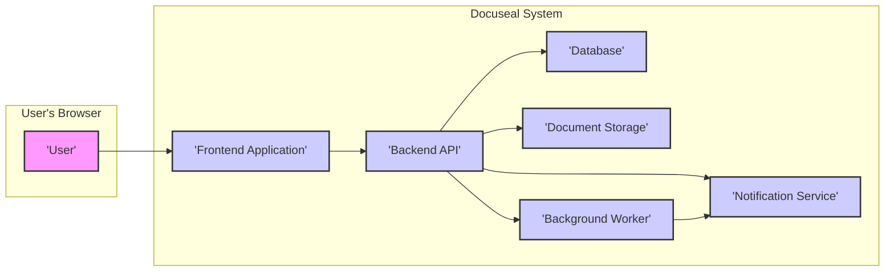

# Project Design Document: Docuseal

**Version:** 1.1
**Date:** October 26, 2023
**Prepared By:** AI Software Architect

## 1. Project Overview

Docuseal is a secure and user-friendly web application designed to digitize and streamline the document signing process. It addresses the inefficiencies and security risks associated with traditional paper-based document signing by providing a platform for users to upload, distribute, and electronically sign documents. Docuseal aims to offer a legally compliant, auditable, and efficient solution for individuals and organizations of all sizes.

## 2. Goals and Objectives

* **Primary Goal:** To establish Docuseal as a trusted and reliable platform for secure electronic document signing.
* **Objectives:**
    * Enable users to securely upload and manage various document formats.
    * Facilitate the creation and management of flexible signing workflows involving multiple recipients with defined roles and signing order.
    * Provide an intuitive and accessible user interface for signing documents on various devices.
    * Guarantee the integrity and authenticity of signed documents through cryptographic measures and audit trails.
    * Offer comprehensive audit logs detailing all document-related activities, including access, modifications, and signatures.
    * Provide a well-documented API for potential future integrations with other business systems.

## 3. Target Audience

* **Individuals:** Professionals, freelancers, and individuals needing to sign or obtain signatures on personal or business documents.
* **Small to Medium-sized Businesses (SMBs):** Companies seeking to improve efficiency and reduce costs associated with document signing processes.
* **Enterprises:** Larger organizations requiring a scalable and secure solution for managing high volumes of documents and complex signing workflows.
* **Departments within Organizations:** Specific teams (e.g., HR, Legal, Sales) needing a dedicated document signing solution.

## 4. High-Level Architecture

* **User's Browser:** The primary interface through which users interact with Docuseal, typically a web browser.
* **Frontend Application:** A client-side application, likely a Single Page Application (SPA) built with technologies like React, Angular, or Vue.js. It handles user interface rendering, user input management, and communication with the Backend API.
* **Backend API:** A server-side application responsible for core business logic, user authentication and authorization, data validation, and interactions with persistent storage and other services. It exposes RESTful APIs for the Frontend Application.
* **Database:** A persistent data store for structured data, including user accounts, document metadata, signing workflows, recipient information, audit logs, and system configurations.
* **Document Storage:** A secure storage service for the actual document files uploaded by users. This could be an object storage service or a dedicated file storage system.
* **Background Worker:** A service responsible for executing asynchronous and potentially long-running tasks, such as sending email notifications, processing documents after upload, and generating reports.
* **Notification Service:** A dedicated service for sending notifications to users via various channels, primarily email, and potentially SMS or in-app notifications in the future.

## 5. Detailed Component Design

### 5.1. Frontend Application

* **Responsibilities:**
    * User authentication and secure session management using techniques like token-based authentication.
    * Rendering user interfaces for all application features, including document upload, recipient management, tagging, signing, and dashboard views.
    * Handling user input and performing client-side validation to improve user experience and reduce server load.
    * Communicating with the Backend API via secure HTTP requests (HTTPS).
    * Rendering document previews using browser-native capabilities or third-party libraries.
    * Providing real-time updates on document signing status through techniques like WebSockets or Server-Sent Events (SSE).
* **Key Functionalities:**
    * Secure user registration and login processes.
    * Intuitive drag-and-drop interface for document uploads, supporting various file formats (e.g., PDF, DOCX).
    * Visual interface for managing recipients, defining signing order, and assigning roles (e.g., signer, reviewer).
    * Interactive tagging interface for placing signature fields, initial fields, text fields, and other form elements on documents.
    * User-friendly document signing interface with options for drawing signatures, typing signatures, or uploading signature images.
    * Personalized dashboard for users to track the status of documents they have sent or need to sign.
    * User profile management features for updating personal information and security settings.
* **Technology Considerations:**
    * Likely implemented using a component-based JavaScript framework like React, Angular, or Vue.js.
    * Utilizes browser APIs for file handling, local storage (for temporary data), and user interaction.
    * Employs secure communication protocols (HTTPS) for all API interactions.
    * May use a state management library (e.g., Redux, Zustand) for managing application state.

### 5.2. Backend API

* **Responsibilities:**
    * Securely authenticating and authorizing users accessing API endpoints using methods like JWT or OAuth 2.0.
    * Handling all API requests from the Frontend Application, including requests for document management, workflow creation, and signing processes.
    * Implementing core business logic for document processing, signature verification, and workflow management.
    * Interacting with the Database to persist and retrieve application data.
    * Interacting with Document Storage to upload, retrieve, and manage document files.
    * Generating unique and secure signing links for recipients.
    * Verifying digital signatures and ensuring the integrity of signed documents using cryptographic libraries.
    * Generating comprehensive audit logs for all significant actions, including user logins, document uploads, and signature events.
    * Triggering asynchronous tasks via the Background Worker for non-blocking operations.
* **Key Functionalities:**
    * Secure user authentication and authorization middleware.
    * RESTful API endpoints for:
        * User management (registration, login, profile updates).
        * Document management (upload, download, delete, metadata retrieval).
        * Workflow management (creation, modification, initiation).
        * Recipient management (add, remove, update).
        * Signature requests and verification.
        * Audit log retrieval.
    * Logic for generating and managing secure, time-limited signing URLs.
    * Implementation of digital signature algorithms (e.g., RSA, ECDSA).
    * Secure handling of cryptographic keys and certificates.
    * Integration with the Notification Service for sending email notifications.
* **Technology Considerations:**
    * Likely implemented using a robust backend framework such as Node.js with Express, Python with Django/Flask, Java with Spring Boot, or Go.
    * Utilizes a secure communication protocol (HTTPS) and enforces it for all API endpoints.
    * Implements robust input validation and sanitization techniques to prevent common web vulnerabilities like SQL injection and cross-site scripting (XSS).
    * Employs secure storage mechanisms for sensitive data, such as password hashing with salt and pepper.

### 5.3. Database

* **Responsibilities:**
    * Providing persistent storage for all application data, ensuring data durability and availability.
    * Maintaining data integrity and consistency through database constraints and transactions.
    * Enabling efficient data retrieval and querying for application operations.
* **Data Entities:**
    * **Users:** Stores user credentials (hashed password, salt), personal information, roles, and permissions.
    * **Documents:** Stores document metadata (title, upload date, owner ID, current status, file path in Document Storage).
    * **Recipients:** Stores information about each recipient in a signing workflow (email, signing order, role, status, signature details).
    * **Workflows:** Defines the sequence of signing steps, associated recipients, and document for each signing process.
    * **Signatures:** Stores details about each signature, including timestamp, signer ID, signature value, and potentially geolocation data.
    * **Audit Logs:** Records all significant events with timestamps, user IDs, action types, and relevant details.
    * **System Configuration:** Stores application-wide settings and parameters.
* **Technology Considerations:**
    * Likely a relational database management system (RDBMS) such as PostgreSQL or MySQL, chosen for its transactional integrity and structured data handling capabilities.
    * Employs encryption at rest for sensitive data stored within the database.
    * Implements appropriate access controls and database user permissions to restrict access to sensitive data.

### 5.4. Document Storage

* **Responsibilities:**
    * Securely storing uploaded document files in their original format.
    * Providing reliable and efficient access to stored documents for authorized users and services.
    * Ensuring data durability, availability, and potentially versioning of documents.
* **Technology Considerations:**
    * Likely an object storage service like AWS S3, Azure Blob Storage, or Google Cloud Storage, offering scalability, durability, and cost-effectiveness.
    * Employs encryption at rest and in transit to protect document data.
    * Implements access control policies (e.g., IAM roles, bucket policies) to restrict access to authorized services and users.
    * May utilize features like versioning to track changes to documents over time.

### 5.5. Background Worker

* **Responsibilities:**
    * Executing asynchronous tasks offloaded from the Backend API to improve responsiveness.
    * Sending email notifications to users regarding document signing requests, completion status, and other events.
    * Potentially processing documents after upload, such as generating thumbnails or converting file formats.
    * Generating reports and performing data analysis tasks.
* **Technology Considerations:**
    * Could be implemented using a message queue system like RabbitMQ or Kafka to manage and process tasks.
    * Worker processes can be implemented using programming languages like Python, Node.js, or Go.
    * Allows the Backend API to handle user requests more efficiently by delegating time-consuming operations.

### 5.6. Notification Service

* **Responsibilities:**
    * Sending notifications to users via various channels, primarily email.
    * Managing notification templates and personalizing messages.
    * Tracking the delivery status of notifications and handling potential failures.
* **Technology Considerations:**
    * Could be a dedicated in-house service or integrated with a third-party email service provider (ESP) like SendGrid, Mailgun, or AWS SES.
    * May support multiple notification channels in the future, such as SMS or in-app notifications.

## 6. Data Flow

```mermaid
graph LR
    subgraph "User"
        A1["'User Action (e.g., Upload Document)'"]
    end
    subgraph "Frontend Application"
        B1["'Handles User Input'"]
        B2["'Sends API Request (HTTPS)'"]
    end
    subgraph "Backend API"
        C1["'Receives API Request'"]
        C2["'Authenticates/Authorizes User'"]
        C3["'Processes Request & Business Logic'"]
        C4["'Interacts with Database'"]
        C5["'Interacts with Document Storage'"]
        C6["'Triggers Background Worker (if needed)'"]
        C7["'Sends Response (HTTPS)'"]
    end
    subgraph "Database"
        D1["'Stores/Retrieves Data'"]
    end
    subgraph "Document Storage"
        E1["'Stores/Retrieves Files'"]
    end
    subgraph "Background Worker"
        F1["'Pulls Task from Queue'"]
        F2["'Performs Asynchronous Task (e.g., Send Notification)'"]
    end
    subgraph "Notification Service"
        G1["'Sends Notification (e.g., Email)'"]
    end

    A1 --> B1
    B1 --> B2
    B2 --> C1
    C1 --> C2
    C2 --> C3
    C3 --> C4
    C3 --> C5
    C3 --> C6
    C3 --> C7
    C4 --> D1
    C5 --> E1
    C6 --> F1
    F1 --> F2
    F2 --> G1
    C7 --> B2
    B2 --> A1
    style A1 fill:#f9f,stroke:#333,stroke-width:2px
    style B1 fill:#ccf,stroke:#333,stroke-width:2px
    style B2 fill:#ccf,stroke:#333,stroke-width:2px
    style C1 fill:#ccf,stroke:#333,stroke-width:2px
    style C2 fill:#ccf,stroke:#333,stroke-width:2px
    style C3 fill:#ccf,stroke:#333,stroke-width:2px
    style C4 fill:#ccf,stroke:#333,stroke-width:2px
    style C5 fill:#ccf,stroke:#333,stroke-width:2px
    style C6 fill:#ccf,stroke:#333,stroke-width:2px
    style C7 fill:#ccf,stroke:#333,stroke-width:2px
    style D1 fill:#ccf,stroke:#333,stroke-width:2px
    style E1 fill:#ccf,stroke:#333,stroke-width:2px
    style F1 fill:#ccf,stroke:#333,stroke-width:2px
    style F2 fill:#ccf,stroke:#333,stroke-width:2px
    style G1 fill:#ccf,stroke:#333,stroke-width:2px
```

* **User Action:** The user initiates an action through the Frontend Application (e.g., uploading a document, sending a document for signature).
* **Frontend Handling:** The Frontend Application captures user input and sends a secure API request (HTTPS) to the Backend API.
* **Backend Processing:** The Backend API receives the request, authenticates and authorizes the user, executes the necessary business logic, and interacts with other components.
* **Data Persistence:** The Backend API interacts with the Database to store or retrieve persistent data related to users, documents, and workflows.
* **Document Management:** The Backend API interacts with Document Storage to upload, retrieve, and manage document files.
* **Asynchronous Task Handling:** For tasks that don't require immediate response, the Backend API triggers the Background Worker by adding a task to a message queue.
* **Background Task Execution:** The Background Worker pulls tasks from the queue and executes them (e.g., sending notifications).
* **Notifications:** The Background Worker or Backend API utilizes the Notification Service to send notifications to users via email or other configured channels.
* **Response:** The Backend API sends a response back to the Frontend Application, which updates the user interface accordingly.

## 7. Security Considerations (Detailed)

* **Authentication and Authorization:**
    * **Frontend:** Securely stores authentication tokens (e.g., in HTTP-only cookies or local storage with appropriate safeguards). Avoids storing sensitive credentials directly.
    * **Backend API:** Implements JWT or OAuth 2.0 for API authentication. Verifies the authenticity and integrity of tokens before processing requests. Enforces role-based access control (RBAC) to restrict access to resources based on user roles.
    * **Database:** Uses strong database credentials and restricts access based on the principle of least privilege.
* **Data Protection:**
    * **In Transit:** Enforces HTTPS for all communication between the Frontend and Backend, and between the Backend and other services.
    * **At Rest:** Encrypts sensitive data at rest in the Database and Document Storage using appropriate encryption algorithms. Securely manages encryption keys.
    * **Document Handling:** Generates cryptographically secure hashes of uploaded documents to ensure integrity. Uses digital signatures to guarantee the authenticity and non-repudiation of signed documents.
* **Input Validation and Sanitization:**
    * **Frontend:** Implements client-side validation to improve user experience and prevent basic errors.
    * **Backend API:** Performs rigorous server-side validation and sanitization of all user inputs to prevent injection attacks (e.g., SQL injection, XSS).
* **Secure Document Handling:**
    * Access to documents in Document Storage is controlled through secure access policies and authentication.
    * Only authorized users and services can access and modify documents.
    * Audit logs track all document access and modification events.
* **Session Management:**
    * Uses secure session tokens with appropriate expiration times.
    * Implements measures to prevent session fixation and hijacking.
* **Background Worker Security:**
    * Secure communication between the Backend API and the Background Worker (e.g., using authenticated message queues).
    * Proper authorization for tasks performed by the Background Worker.
* **Notification Service Security:**
    * Uses secure protocols for communication with the Notification Service.
    * Protects API keys or credentials used to access the Notification Service.
* **Regular Security Practices:**
    * Conducts regular security audits and penetration testing to identify and address potential vulnerabilities.
    * Implements a secure software development lifecycle (SDLC).
    * Keeps all software and dependencies up-to-date with the latest security patches.
    * Complies with relevant data privacy and security regulations (e.g., GDPR, HIPAA, depending on the target audience and data handled).

## 8. Technology Stack (Specific Examples)

* **Frontend:**
    * JavaScript Framework: React with TypeScript
    * State Management: Redux Toolkit
    * UI Library: Material UI or Ant Design
    * Build Tool: Webpack or Parcel
* **Backend:**
    * Language: Node.js or Python
    * Framework: Express.js (Node.js) or Django REST Framework (Python)
    * API Style: RESTful
    * Authentication: JWT (JSON Web Tokens) or OAuth 2.0
* **Database:**
    * PostgreSQL with appropriate extensions for security and performance
* **Document Storage:**
    * AWS S3 with server-side encryption (SSE-S3 or SSE-KMS)
* **Background Worker:**
    * Redis or RabbitMQ for message queuing
    * Implementation using Node.js with libraries like `bull` or Python with `Celery`
* **Notification Service:**
    * SendGrid, Mailgun, or AWS SES for email delivery
* **Infrastructure:**
    * Cloud Provider: AWS, Azure, or Google Cloud Platform
    * Containerization: Docker
    * Orchestration: Kubernetes (for scalability and management)
    * Infrastructure as Code (IaC): Terraform or CloudFormation

## 9. Deployment Model

* **Cloud-Native Deployment:** The application will be primarily deployed on a cloud platform (e.g., AWS, Azure, GCP) leveraging managed services for scalability and reliability.
* **Containerized Microservices:** The Backend API and Background Worker will be deployed as containerized microservices using Docker.
* **Orchestration with Kubernetes:** Kubernetes will be used to manage and orchestrate the containerized applications, providing features like auto-scaling, load balancing, and self-healing.
* **CI/CD Pipeline:** A robust Continuous Integration and Continuous Deployment (CI/CD) pipeline will be implemented using tools like Jenkins, GitLab CI, or GitHub Actions for automated builds, testing, and deployments across different environments (development, staging, production).
* **Infrastructure as Code (IaC):** Infrastructure will be provisioned and managed using IaC tools like Terraform or CloudFormation to ensure consistency and repeatability.

## 10. Future Considerations

* **Integration with other platforms:**
    * API integrations with CRM systems (e.g., Salesforce, HubSpot) to automatically trigger document signing workflows.
    * Integrations with document management systems (e.g., SharePoint, Google Drive) for seamless document import and export.
    * Webhooks to notify external systems about document signing events.
* **Advanced analytics and reporting:**
    * Dashboards to visualize document signing metrics, user activity, and workflow efficiency.
    * Customizable reports on document status, completion times, and user engagement.
* **Support for more complex signing workflows:**
    * Conditional routing of documents based on recipient actions or data within the document.
    * Parallel signing options for multiple recipients to sign simultaneously.
    * Support for certified electronic signatures with identity verification.
* **Mobile applications:**
    * Native mobile applications for iOS and Android to provide a convenient signing experience on mobile devices.
* **Enhanced security features:**
    * Integration with identity providers for Single Sign-On (SSO).
    * Blockchain-based document verification for enhanced trust and immutability.
    * Multi-factor authentication (MFA) for all user accounts.

This improved design document provides a more detailed and comprehensive overview of the Docuseal project, focusing on clarity, security considerations, and specific technology choices. It serves as a solid foundation for further development and, critically, for conducting thorough threat modeling to identify and mitigate potential security risks effectively.
