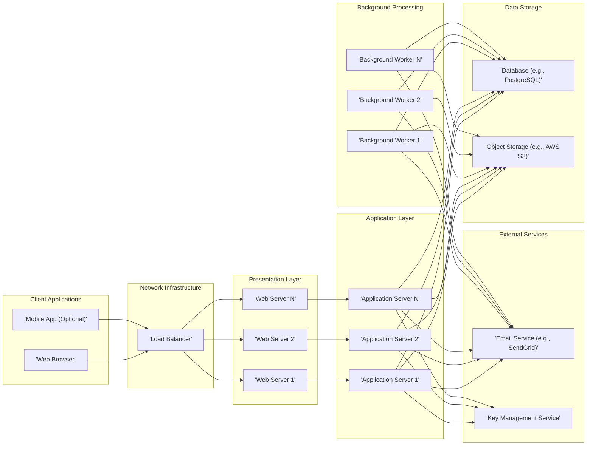
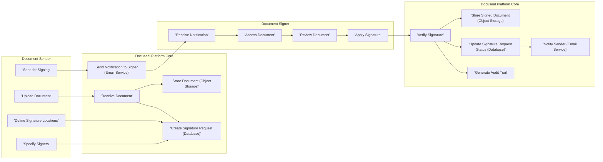

# Project Design Document: Docuseal

**Version:** 1.1
**Date:** October 26, 2023
**Author:** AI Software Architect

## 1. Project Overview

Docuseal is a platform meticulously crafted to simplify and secure the process of document signing and management. Its core objective is to offer a reliable, efficient, and intuitive solution for individuals and organizations to obtain legally binding electronic signatures on various document types. The platform is envisioned to include features for seamless document uploading, precise definition of signature placement, effortless invitation of signers, real-time tracking of the signing lifecycle, and robust secure storage of finalized documents. This document details the architectural blueprint and crucial considerations for Docuseal, serving as a foundational artifact for subsequent threat modeling exercises.

## 2. Goals and Objectives

*   To establish a highly secure and dependable platform for electronic document signing, ensuring data integrity and confidentiality.
*   To provide an exceptionally user-friendly interface, catering to both document initiators and recipients, minimizing the learning curve.
*   To guarantee the legal validity and irrefutability of signed documents, adhering to relevant legal frameworks.
*   To enable transparent and efficient tracking and management of document signing workflows, providing clear visibility into the process.
*   To offer broad compatibility with various commonly used document formats, enhancing accessibility.
*   To facilitate seamless integration with other business-critical systems, enhancing overall productivity (a strategic future objective).

## 3. Target Audience

*   Individual users seeking a straightforward method for signing or obtaining signatures on personal documents.
*   Small to medium-sized businesses (SMBs) desiring a cost-effective and efficient e-signature solution to streamline their operations.
*   Large organizations requiring a scalable, secure, and enterprise-grade document signing platform to manage high volumes of transactions.
*   Software developers and system integrators who might leverage Docuseal's API for embedding e-signature capabilities into their own applications (contingent on API availability).

## 4. System Architecture

The Docuseal platform is designed around a robust multi-tier architecture, promoting modularity and separation of concerns across presentation, application logic, and data persistence layers.

### 4.1. High-Level Architecture Diagram

### 4.2. Component Descriptions

*   **Client Applications:**
    *   'Web Browser': The primary interface enabling users to access and interact with Docuseal's functionalities.
    *   'Mobile App (Optional)': A dedicated application for mobile platforms, potentially offering enhanced features like offline access or biometric authentication.
*   **Network Infrastructure:**
    *   'Load Balancer': Efficiently distributes incoming network traffic across multiple web servers, ensuring high availability, fault tolerance, and optimal performance.
*   **Presentation Layer:**
    *   'Web Servers': Responsible for serving static content (HTML, CSS, JavaScript) and routing user requests to the application layer.
*   **Application Layer:**
    *   'Application Servers': Executes the core business logic of Docuseal, encompassing user authentication, document processing, management of signature workflows, and handling API requests.
*   **Background Processing:**
    *   'Background Workers': Dedicated processes for handling asynchronous tasks that don't require immediate user interaction, such as sending email notifications, generating comprehensive audit trails, and potentially performing document format conversions.
*   **Data Storage:**
    *   'Database (e.g., PostgreSQL)': Stores structured, persistent data, including user account information, document metadata, signature request details, audit logs, and system configuration settings.
    *   'Object Storage (e.g., AWS S3)': Securely stores uploaded documents and finalized signed documents in a scalable and cost-effective manner.
*   **External Services:**
    *   'Email Service (e.g., SendGrid)': Facilitates the sending of transactional emails, such as notifications for document signing requests, status updates, and confirmations.
    *   'Key Management Service': Securely manages cryptographic keys used for critical operations like document encryption, digital signature generation, and other security-sensitive processes.

## 5. Data Flow

The typical data flow for a document signing process within Docuseal involves a series of well-defined steps:

## 6. Key Components

*   **User Management Subsystem:** Responsible for handling user registration, secure authentication, role-based authorization, and comprehensive profile management.
*   **Document Management Subsystem:** Enables users to securely upload, store, organize, search, and retrieve documents throughout their lifecycle.
*   **Signature Workflow Engine:** Orchestrates the entire process of sending documents for signature, meticulously tracking progress, managing signer interactions, and facilitating signature collection.
*   **Electronic Signature Module:** Implements the cryptographic algorithms and protocols necessary for applying legally valid and verifiable digital signatures to documents.
*   **Notification Service:** Manages the sending of timely notifications to users via email and potentially other channels (e.g., SMS), keeping them informed about document signing activities.
*   **Audit Logging Subsystem:** Records all significant actions and events within the system, providing a comprehensive audit trail for security monitoring, compliance, and non-repudiation.
*   **API Gateway (Optional):** Provides a secure and managed entry point for external applications to access Docuseal's functionalities programmatically, facilitating integrations.

## 7. Technologies Used (Potential)

*   **Backend Programming Languages:** Python (with frameworks like Django or Flask), Node.js (with Express.js), or similar robust server-side technologies.
*   **Frontend Framework:** A modern JavaScript framework such as React, Angular, or Vue.js to build a dynamic and responsive user interface.
*   **Database System:** A relational database like PostgreSQL or MySQL, or a cloud-based database service offering scalability and reliability.
*   **Object Storage Service:** Cloud-based object storage solutions such as AWS S3, Azure Blob Storage, or Google Cloud Storage for storing documents.
*   **Email Delivery Service:** Reliable email services like SendGrid, Mailgun, or AWS SES for transactional email delivery.
*   **Message Broker (for Background Tasks):** Message queue systems like RabbitMQ, Kafka, or Redis for managing asynchronous task processing.
*   **Containerization Technology:** Docker for packaging and deploying applications in isolated containers.
*   **Container Orchestration Platform:** Kubernetes for automating deployment, scaling, and management of containerized applications.
*   **Key Management Solution:** Dedicated key management services like AWS KMS, Azure Key Vault, or Google Cloud KMS for secure cryptographic key management.

## 8. Deployment Architecture

Docuseal is envisioned to be deployed within a cloud environment to leverage its inherent scalability, reliability, and cost-effectiveness. A typical deployment architecture might include:

*   **Containerized Microservices:** Core components (web servers, application servers, background workers) are packaged as Docker containers, promoting modularity and independent scaling.
*   **Managed Kubernetes Cluster:** A managed Kubernetes service (e.g., AWS EKS, Azure AKS, Google GKE) orchestrates the deployment, scaling, and health management of the containerized applications.
*   **Cloud Load Balancer:** A cloud-managed load balancer (e.g., AWS ELB, Azure Load Balancer, Google Cloud Load Balancing) distributes incoming traffic efficiently and ensures high availability.
*   **Managed Database Service:** A fully managed database service simplifies database administration, provides automatic backups, and ensures high availability.
*   **Managed Object Storage Service:** A highly scalable and durable object storage service for secure and reliable document storage.
*   **Virtual Private Cloud (VPC):** The entire infrastructure is deployed within a logically isolated VPC, enhancing network security and control.
*   **Infrastructure as Code (IaC):** Tools like Terraform or CloudFormation are used to define and manage the infrastructure in an automated and repeatable manner.

## 9. Security Considerations (Detailed for Threat Modeling)

This section expands on the initial security considerations, providing more specific details relevant for threat modeling.

*   **Robust Authentication and Authorization:** Securely verifying user identities and strictly controlling access to resources based on roles and permissions.
    *   Implementation of multi-factor authentication (MFA) to enhance login security.
    *   Fine-grained role-based access control (RBAC) to limit access to specific functionalities and data.
    *   Enforcement of strong password policies, including complexity requirements and regular password rotation.
    *   Protection against brute-force attacks through rate limiting and account lockout mechanisms.
*   **Comprehensive Data Encryption:** Protecting sensitive data both while in transit and when stored at rest.
    *   Mandatory use of TLS/SSL encryption for all communication between clients and the server, and between internal services.
    *   Encryption at rest for the database and object storage using industry-standard encryption algorithms.
    *   Consideration of end-to-end encryption for documents, where the document is encrypted client-side before being uploaded.
*   **Strict Input Validation and Sanitization:** Preventing injection attacks (e.g., SQL injection, cross-site scripting) by rigorously validating and sanitizing all user-provided inputs.
*   **Secure Document Handling Practices:** Ensuring the integrity, confidentiality, and availability of uploaded and signed documents throughout their lifecycle.
    *   Implementing access controls on stored documents based on user roles and permissions.
    *   Utilizing digital signatures to ensure document integrity and non-repudiation.
    *   Regularly backing up documents to prevent data loss.
*   **Detailed Audit Logging and Monitoring:** Maintaining a comprehensive and immutable audit trail of all significant actions within the system for security monitoring, compliance, and forensic analysis.
    *   Logging user logins, document access, signature requests, and administrative actions.
    *   Implementing real-time monitoring and alerting for suspicious activities.
*   **Proactive Vulnerability Management:** Regularly scanning for and promptly patching software vulnerabilities in all components of the system.
    *   Performing regular penetration testing to identify potential security weaknesses.
    *   Staying up-to-date with security advisories and applying necessary patches.
*   **Secure Key Management Practices:** Protecting the cryptographic keys used for signing and encryption with the utmost care.
    *   Utilizing a dedicated Key Management Service (KMS) to securely store and manage cryptographic keys.
    *   Implementing strict access controls for accessing and managing encryption keys.
    *   Regularly rotating encryption keys.
*   **Protection Against Denial-of-Service (DoS) Attacks:** Implementing measures to prevent malicious attempts to overwhelm the system and make it unavailable.
    *   Utilizing rate limiting to restrict the number of requests from a single source.
    *   Employing web application firewalls (WAFs) to filter malicious traffic.
*   **Secure API Design and Implementation (if applicable):** Implementing robust authentication and authorization mechanisms for API access to prevent unauthorized use.
    *   Using API keys, OAuth 2.0, or other secure authentication protocols.
    *   Enforcing rate limiting and input validation for API requests.
*   **Compliance with Relevant Regulations:** Adhering to relevant industry standards and regulations (e.g., GDPR, eIDAS, HIPAA depending on the target market and data handled).

## 10. Future Considerations

*   Expanding integration capabilities with other business applications such as CRM, ERP, and HR systems to streamline workflows.
*   Implementing support for advanced electronic signature types, such as Qualified Electronic Signatures (QES) for higher levels of legal assurance.
*   Developing support for more complex and customizable document workflows to cater to diverse business needs.
*   Enhancing reporting and analytics features to provide users with valuable insights into their document signing activities.
*   Developing and releasing a dedicated mobile application for both iOS and Android platforms to improve accessibility and user experience.

This refined design document provides a more detailed and comprehensive overview of the Docuseal platform's architecture, components, and security considerations. It serves as a robust foundation for the upcoming threat modeling exercise, enabling a thorough identification and mitigation of potential security risks.
