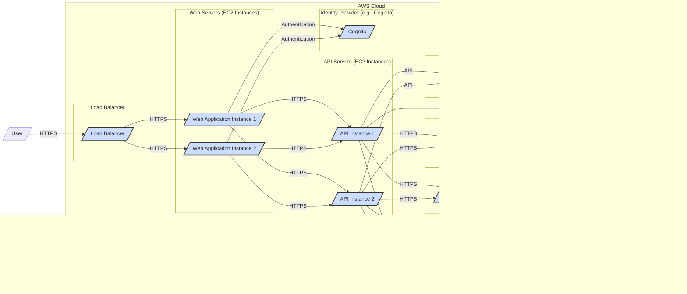

# BUSINESS POSTURE

The Docuseal project aims to provide an open-source platform for document signing and verification. This suggests a business need for secure and auditable digital document workflows. Businesses and individuals require reliable and trustworthy methods to sign documents electronically, ensuring integrity and non-repudiation.

Business Priorities and Goals:
- Provide a functional and user-friendly open-source document signing platform.
- Ensure the security and integrity of signed documents.
- Offer a cost-effective alternative to proprietary document signing solutions.
- Build a community around the open-source project for ongoing development and support.
- Enable customization and extensibility to meet diverse user needs.

Business Risks:
- Security vulnerabilities leading to unauthorized access, data breaches, or manipulation of signed documents.
- Lack of user adoption due to poor usability or lack of trust in an open-source solution.
- Legal and compliance risks if the platform does not meet regulatory requirements for digital signatures in different jurisdictions.
- Dependence on community contributions for maintenance and feature development, potentially leading to project stagnation.
- Reputational damage if security incidents or functional issues arise.

# SECURITY POSTURE

Existing Security Controls:
- security control: HTTPS is likely used for communication, protecting data in transit. (Assumption based on common web application practices).
- security control:  Basic user authentication is expected to manage user accounts. (Assumption based on application functionality).
- security control:  Authorization mechanisms are likely in place to control access to documents and signing functionalities. (Assumption based on application functionality).
- security control:  Input validation is expected to prevent common web application vulnerabilities. (Assumption based on standard secure development practices).

Accepted Risks:
- accepted risk: As an open-source project, initial security testing and code review might be limited to community contributions.
- accepted risk:  Rapid development cycles in early stages might prioritize functionality over in-depth security hardening.
- accepted risk:  Reliance on community for vulnerability reporting and patching might lead to slower response times compared to commercial solutions with dedicated security teams.

Recommended Security Controls:
- security control: Implement a robust Secure Software Development Lifecycle (SSDLC) including security requirements gathering, threat modeling, secure coding practices, static and dynamic code analysis, and penetration testing.
- security control: Integrate automated security scanning tools (SAST/DAST) into the CI/CD pipeline to detect vulnerabilities early in the development process.
- security control: Implement strong authentication mechanisms, such as multi-factor authentication (MFA), to protect user accounts.
- security control: Implement fine-grained authorization controls based on roles and permissions to restrict access to sensitive data and functionalities.
- security control:  Establish a vulnerability disclosure program to encourage responsible reporting of security issues by the community.
- security control:  Perform regular security audits and penetration testing by independent security experts.
- security control:  Implement security logging and monitoring to detect and respond to security incidents.
- security control:  Ensure secure storage of cryptographic keys used for document signing and verification, potentially using Hardware Security Modules (HSMs) or secure key management services for sensitive deployments.

Security Requirements:
- Authentication:
    - security requirement: The system must provide secure user authentication to verify the identity of users accessing the platform.
    - security requirement: Support for strong password policies, including complexity requirements and password rotation.
    - security requirement: Consider implementing multi-factor authentication (MFA) for enhanced security.
    - security requirement: Secure session management to prevent session hijacking.
- Authorization:
    - security requirement: Implement role-based access control (RBAC) to manage user permissions and access to functionalities.
    - security requirement:  Ensure proper authorization checks are performed before granting access to documents and signing operations.
    - security requirement:  Principle of least privilege should be applied to user roles and permissions.
- Input Validation:
    - security requirement:  All user inputs must be validated to prevent injection attacks (e.g., SQL injection, Cross-Site Scripting (XSS)).
    - security requirement:  File uploads must be validated to prevent malicious file uploads.
    - security requirement:  Data sanitization and encoding should be applied to prevent output encoding vulnerabilities.
- Cryptography:
    - security requirement:  Use strong cryptographic algorithms and libraries for document signing and verification.
    - security requirement:  Securely generate, store, and manage cryptographic keys.
    - security requirement:  Ensure the integrity and confidentiality of documents during storage and transmission using encryption.
    - security requirement:  Implement digital signatures according to relevant standards (e.g., PKCS#7, X.509).
    - security requirement:  Consider using timestamping services to ensure the long-term validity of digital signatures.

# DESIGN

## C4 CONTEXT

Context Diagram Elements:

- Element:
    - Name: User
    - Type: Person
    - Description: Individuals or organizations who use the Docuseal platform to send, sign, and verify documents. This includes document senders, signers, and administrators.
    - Responsibilities: Initiate document signing requests, sign documents, verify document signatures, manage user accounts (administrators).
    - Security controls: User authentication (username/password, MFA), access control based on roles.

- Element:
    - Name: Docuseal Platform
    - Type: Software System
    - Description: The open-source document signing and verification platform being designed. It provides functionalities for document upload, signing, verification, and user management.
    - Responsibilities: Manage document workflows, handle user authentication and authorization, generate and verify digital signatures, store documents securely, provide audit logs.
    - Security controls: Input validation, secure coding practices, authentication, authorization, cryptography, security logging, vulnerability management.

- Element:
    - Name: Document Storage Service
    - Type: Software System
    - Description: An external service used by Docuseal to store documents securely. This could be cloud storage (e.g., AWS S3, Azure Blob Storage) or an on-premise storage solution.
    - Responsibilities: Securely store and retrieve documents, ensure data availability and durability.
    - Security controls: Access control, encryption at rest, data backup and recovery, security monitoring.

- Element:
    - Name: Timestamping Service
    - Type: Software System
    - Description: An optional external service used to provide trusted timestamps for digital signatures, enhancing their long-term validity and non-repudiation.
    - Responsibilities: Provide reliable and cryptographically secure timestamps.
    - Security controls: Secure time synchronization, tamper-proof timestamp generation, audit logging.

- Element:
    - Name: Audit Logging System
    - Type: Software System
    - Description: A system used to record security-relevant events and activities within the Docuseal platform for auditing and security monitoring purposes.
    - Responsibilities: Collect, store, and provide access to audit logs.
    - Security controls: Secure log storage, access control to logs, log integrity protection.

- Element:
    - Name: Identity Provider
    - Type: Software System
    - Description: An external system responsible for managing user identities and authentication. This could be an OAuth 2.0 provider, SAML provider, or an internal user directory.
    - Responsibilities: Authenticate users, provide user identity information to Docuseal.
    - Security controls: Secure authentication protocols, user account management, access control.

## C4 CONTAINER

Container Diagram Elements:

- Element:
    - Name: Web Application
    - Type: Container
    - Description:  The front-end web application providing the user interface for Docuseal. Likely implemented using a modern JavaScript framework (e.g., React, Vue.js) and served by a web server (e.g., Nginx, Apache).
    - Responsibilities:  Present user interface, handle user interactions, communicate with the API, manage user sessions, authenticate users via Identity Provider.
    - Security controls:  HTTPS, input validation (client-side), secure session management, protection against XSS and CSRF attacks, integration with Identity Provider for authentication.

- Element:
    - Name: API
    - Type: Container
    - Description:  The backend API server providing RESTful endpoints for the web application and potentially other clients. Likely implemented using a framework like Flask or Django (Python), Node.js, or similar.
    - Responsibilities:  Handle business logic, manage document workflows, perform authorization checks, interact with the database, interact with the Signing Service, queue background tasks, log security events to Audit Log, interact with Document Storage Service.
    - Security controls:  HTTPS, input validation (server-side), authorization, secure API design, protection against injection attacks, rate limiting, security logging, integration with Audit Log.

- Element:
    - Name: Database
    - Type: Container
    - Description:  Persistent storage for application data, including user accounts, document metadata, workflow states, and audit logs. Likely a relational database like PostgreSQL or MySQL.
    - Responsibilities:  Store and retrieve application data, ensure data integrity and consistency.
    - Security controls:  Database access control, encryption at rest, regular backups, database hardening, protection against SQL injection (handled by API layer primarily).

- Element:
    - Name: Signing Service
    - Type: Container
    - Description:  A dedicated service responsible for performing cryptographic operations related to document signing and verification. This could be a separate microservice to isolate cryptographic key management and operations.
    - Responsibilities:  Generate digital signatures, verify digital signatures, manage cryptographic keys, interact with Timestamping Service.
    - Security controls:  Secure key generation and storage (potentially using HSM), secure cryptographic operations, access control, audit logging.

- Element:
    - Name: Background Worker
    - Type: Container
    - Description:  A background process responsible for asynchronous tasks, such as document processing, sending notifications, and potentially audit log processing.  Could be implemented using Celery, Redis Queue, or similar.
    - Responsibilities:  Process background tasks, improve application responsiveness, handle long-running operations.
    - Security controls:  Secure task queue configuration, input validation for task processing, proper error handling, security logging.

## DEPLOYMENT

Deployment Architecture Option: Cloud Deployment (e.g., AWS)

Deployment Diagram Elements (Cloud Deployment - AWS):

- Element:
    - Name: Load Balancer
    - Type: Infrastructure
    - Description:  Distributes incoming HTTPS traffic across multiple Web Application instances for high availability and scalability. AWS Elastic Load Balancer (ELB) or Application Load Balancer (ALB) could be used.
    - Responsibilities:  Traffic distribution, SSL termination, health checks.
    - Security controls:  SSL/TLS configuration, DDoS protection, access control lists.

- Element:
    - Name: Web Servers (EC2 Instances)
    - Type: Infrastructure
    - Description:  EC2 instances running the Web Application container. Multiple instances for redundancy and scalability.
    - Responsibilities:  Run the Web Application, serve static content, handle user requests.
    - Security controls:  Operating system hardening, security groups, regular patching, intrusion detection systems (IDS).

- Element:
    - Name: API Servers (EC2 Instances)
    - Type: Infrastructure
    - Description:  EC2 instances running the API container. Multiple instances for redundancy and scalability.
    - Responsibilities:  Run the API, handle API requests, business logic execution.
    - Security controls:  Operating system hardening, security groups, regular patching, intrusion detection systems (IDS), API gateway for rate limiting and security policies.

- Element:
    - Name: Database (RDS PostgreSQL)
    - Type: Infrastructure
    - Description:  Managed PostgreSQL database service provided by AWS RDS.
    - Responsibilities:  Persistent data storage, database management, backups.
    - Security controls:  Database encryption at rest and in transit, database access control, regular backups, vulnerability scanning, managed service security features.

- Element:
    - Name: Signing Service (EC2 Instance)
    - Type: Infrastructure
    - Description:  EC2 instance running the Signing Service container.  Potentially deployed in a more secure environment if HSM is used.
    - Responsibilities:  Run the Signing Service, perform cryptographic operations.
    - Security controls:  Operating system hardening, security groups, minimal exposed ports, access control, potentially HSM integration for key management.

- Element:
    - Name: Background Worker (EC2 Instance)
    - Type: Infrastructure
    - Description:  EC2 instance running the Background Worker container.
    - Responsibilities:  Run background tasks, process queues.
    - Security controls:  Operating system hardening, security groups, access control.

- Element:
    - Name: Document Storage (S3)
    - Type: Infrastructure
    - Description:  AWS S3 bucket for storing documents.
    - Responsibilities:  Secure and scalable document storage.
    - Security controls:  S3 bucket access policies, encryption at rest, versioning, access logging.

- Element:
    - Name: Audit Log (CloudWatch Logs)
    - Type: Infrastructure
    - Description:  AWS CloudWatch Logs for centralized logging of application and security events.
    - Responsibilities:  Centralized log storage and management.
    - Security controls:  Access control to logs, log retention policies, log integrity protection (CloudWatch features).

- Element:
    - Name: Identity Provider (Cognito)
    - Type: Infrastructure
    - Description:  AWS Cognito for user authentication and identity management.
    - Responsibilities:  User authentication, user directory management.
    - Security controls:  Cognito security features, MFA support, secure authentication protocols.

- Element:
    - Name: Timestamping Service (External)
    - Type: Infrastructure
    - Description:  External trusted timestamping service.
    - Responsibilities:  Provide trusted timestamps.
    - Security controls:  Service provider security controls, secure communication protocols.

## BUILD

BUILD Process Description:

1. Developer: Developers write code and commit changes to the GitHub repository.
2. GitHub Repository:  The source code repository hosting the Docuseal project.
3. CI/CD System (e.g., GitHub Actions):  An automated CI/CD system triggered by code commits to the GitHub repository.
4. Build Agent:  A server or environment where the build process is executed.
5. SAST Scanner: Static Application Security Testing (SAST) tools are integrated into the build pipeline to automatically scan the code for potential security vulnerabilities.
6. Build & Test: The build agent compiles the code, runs unit tests, and performs integration tests.
7. Artifact Repository (e.g., GitHub Packages):  Build artifacts (e.g., compiled code, binaries, packages) are stored in an artifact repository.
8. Container Registry (e.g., Docker Hub, ECR): Container images are built and pushed to a container registry.
9. Deployment Environment:  Container images are pulled from the container registry and deployed to the target deployment environment (e.g., cloud environment described in the Deployment section).

BUILD Security Controls:

- security control:  Secure access control to the GitHub repository, using branch protection and code review processes.
- security control:  Use of a dedicated CI/CD system with secure configuration and access controls.
- security control:  Automated build process to ensure consistency and reduce manual errors.
- security control:  Integration of SAST scanners into the CI/CD pipeline to detect vulnerabilities early.
- security control:  Dependency scanning to identify vulnerabilities in third-party libraries and dependencies.
- security control:  Code signing of build artifacts to ensure integrity and authenticity.
- security control:  Secure storage of build artifacts and container images in artifact repositories and container registries with access controls.
- security control:  Regular security audits of the CI/CD pipeline and build process.
- security control:  Immutable build process to ensure reproducibility and prevent tampering.

# RISK ASSESSMENT

Critical Business Processes:
- Document Signing Process:  Ensuring the integrity, authenticity, and non-repudiation of signed documents.
- Document Verification Process:  Reliably verifying the authenticity and integrity of signed documents.
- User Management: Securely managing user accounts and access permissions.
- Audit Logging:  Maintaining a comprehensive and tamper-proof audit trail of system activities.
- Key Management: Securely generating, storing, and managing cryptographic keys used for signing and verification.

Data to Protect and Sensitivity:
- User Data:
    - Sensitivity: Personal data (names, email addresses, etc.) - Moderate to High sensitivity depending on jurisdiction and data protection regulations (e.g., GDPR, CCPA).
    - Data type: User profiles, contact information, authentication credentials.
- Document Content:
    - Sensitivity: Confidential documents, potentially containing sensitive business information, personal data, or legally binding agreements - High sensitivity.
    - Data type: Uploaded documents in various formats (PDF, DOCX, etc.).
- Audit Logs:
    - Sensitivity: Security-relevant events, user activities - Moderate sensitivity, crucial for security monitoring and incident response.
    - Data type: Log entries containing timestamps, user actions, event details.
- Cryptographic Keys:
    - Sensitivity: Private keys used for signing - Critical sensitivity. Compromise would allow unauthorized signing and undermine the security of the entire system.
    - Data type: Private keys, public keys, certificates.

# QUESTIONS & ASSUMPTIONS

Questions:
- What are the specific compliance requirements for digital signatures that Docuseal needs to meet (e.g., eIDAS, ESIGN Act)?
- What is the intended deployment environment (cloud, on-premise, hybrid)?
- Is there a preferred Identity Provider to integrate with?
- Are there specific requirements for document storage (e.g., data residency, encryption requirements)?
- Is there a need for integration with specific timestamping services?
- What is the expected user base and document signing volume?
- Are there any existing security policies or guidelines that Docuseal needs to adhere to?
- What is the process for vulnerability reporting and patching for the open-source project?
- Are there plans for penetration testing or security audits?

Assumptions:
- BUSINESS POSTURE: The primary business goal is to provide a secure and functional open-source document signing platform. Security and data integrity are high priorities.
- SECURITY POSTURE:  Basic security controls like HTTPS and user authentication are assumed to be in place or planned.  However, a comprehensive SSDLC and proactive security measures are recommended for a production-ready system.
- DESIGN: A typical three-tier web application architecture with a separate API, database, and potentially a dedicated signing service is assumed. Cloud deployment on AWS is used as a detailed example, but other deployment options are possible. A standard CI/CD pipeline with security scanning is assumed for the build process.