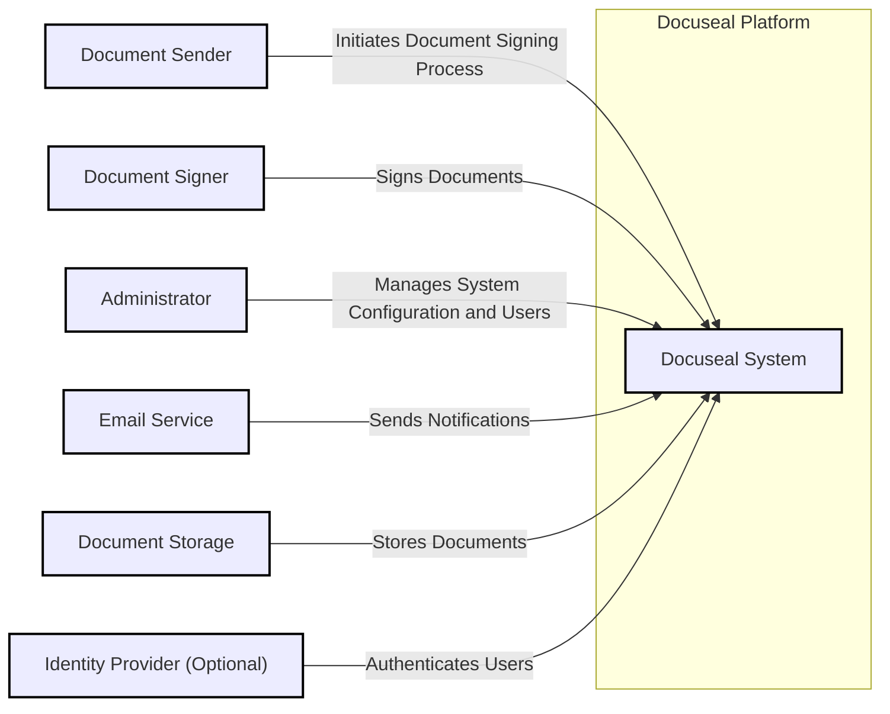
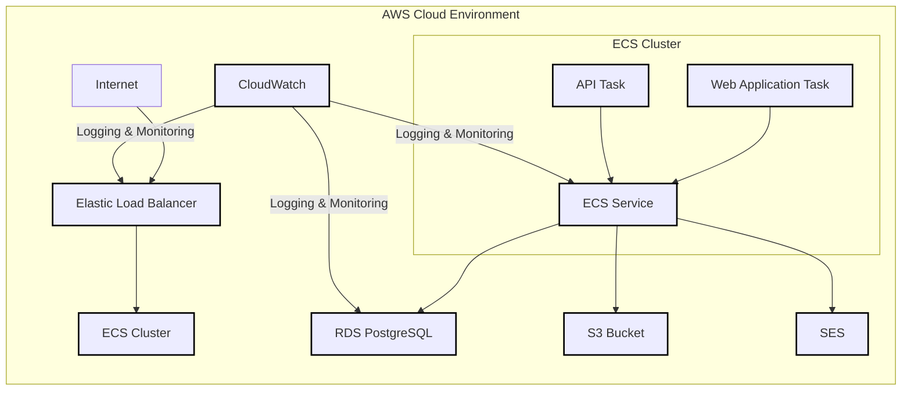
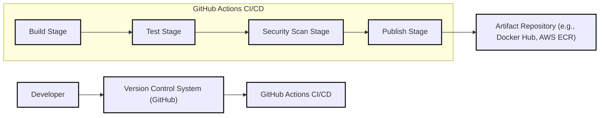

# BUSINESS POSTURE

- Business Priorities and Goals:
  - The primary goal of Docuseal is to provide a secure, reliable, and user-friendly platform for digital document signing and management.
  - Business priorities include:
    - Ensuring the integrity and authenticity of signed documents.
    - Maintaining the confidentiality of document content and user data.
    - Providing a legally compliant digital signing solution.
    - Offering a scalable and performant service to meet user demands.
    - Achieving user adoption and market penetration in the digital signature space.

- Business Risks:
  - Data breaches leading to exposure of sensitive document content or user information, resulting in financial loss, reputational damage, and legal liabilities.
  - Failure to comply with relevant digital signature regulations (e.g., eIDAS, ESIGN Act), leading to legal challenges and invalidity of signatures.
  - Service unavailability impacting business continuity and user trust.
  - Vulnerabilities in the platform being exploited to manipulate documents or signatures, undermining the integrity of the system.
  - Lack of user adoption due to poor user experience or lack of trust in the security of the platform.

# SECURITY POSTURE

- Existing Security Controls:
  - security control: HTTPS encryption for communication between users and the platform (implementation location: likely web server configuration).
  - security control: User authentication to access the platform (implementation location: application code, authentication service).
  - security control: Authorization mechanisms to control access to documents and functionalities based on user roles (implementation location: application code, authorization service).
  - security control: Input validation to prevent common web application vulnerabilities (implementation location: application code).
  - security control: Secure storage of documents (implementation location: database, object storage).
  - security control: Audit logging of user actions and system events (implementation location: application code, logging system).
  - accepted risk: Reliance on standard web application security practices without specific mention of advanced security tools or processes.
  - accepted risk: Level of security maturity is unknown without deeper code and infrastructure analysis.

- Recommended Security Controls:
  - security control: Implement a Secure Software Development Lifecycle (SSDLC) incorporating security reviews, static and dynamic analysis, and penetration testing.
  - security control: Integrate automated security scanning tools (SAST, DAST, dependency scanning) into the CI/CD pipeline.
  - security control: Implement robust input validation and sanitization across all application layers.
  - security control: Implement rate limiting and защиты от бот-атак (bot protection) to prevent abuse and denial-of-service attacks.
  - security control: Regularly perform security audits and penetration testing by independent security experts.
  - security control: Implement a vulnerability management program to track, prioritize, and remediate security vulnerabilities.
  - security control: Consider implementing multi-factor authentication (MFA) for enhanced user account security.
  - security control: Implement data loss prevention (DLP) measures to protect sensitive document content.
  - security control: Implement security monitoring and alerting to detect and respond to security incidents.

- Security Requirements:
  - Authentication:
    - requirement: Secure user authentication mechanism to verify user identity before granting access to the platform.
    - requirement: Support for strong password policies and password management.
    - requirement: Consider integration with existing Identity Providers (IdP) via protocols like SAML or OAuth 2.0 for enterprise users.
    - requirement: Implement session management to securely manage user sessions and prevent session hijacking.
  - Authorization:
    - requirement: Role-based access control (RBAC) to manage user permissions and access to documents and functionalities.
    - requirement: Granular authorization policies to control access at the document level.
    - requirement: Secure API authorization to protect backend services from unauthorized access.
  - Input Validation:
    - requirement: Comprehensive input validation on all user inputs to prevent injection attacks (e.g., SQL injection, XSS).
    - requirement: Validation of uploaded document formats and sizes to prevent malicious file uploads.
    - requirement: Sanitization of user-generated content to prevent stored XSS vulnerabilities.
  - Cryptography:
    - requirement: Use strong encryption algorithms for data at rest (documents, database) and data in transit (HTTPS).
    - requirement: Secure key management practices for encryption keys.
    - requirement: Implement digital signature algorithms to ensure document integrity and non-repudiation.
    - requirement: Use cryptographic hashing for password storage and data integrity checks.

# DESIGN

## C4 CONTEXT



- Context Diagram Elements:
  - - Name: Docuseal System
    - Type: Software System
    - Description: The Docuseal platform for digital document signing and management.
    - Responsibilities:
      - Facilitates document uploading and preparation for signing.
      - Manages the document signing workflow.
      - Provides secure document storage and retrieval.
      - Ensures document integrity and authenticity through digital signatures.
      - Manages user accounts and access control.
      - Generates audit logs of system activities.
    - Security controls:
      - Authentication and authorization to control access.
      - Input validation to prevent vulnerabilities.
      - Encryption of data at rest and in transit.
      - Audit logging for security monitoring and incident response.
      - Digital signature implementation for document integrity and non-repudiation.
  - - Name: Document Sender
    - Type: User
    - Description: Users who initiate the document signing process by uploading and sending documents for signature.
    - Responsibilities:
      - Uploading documents to the Docuseal platform.
      - Specifying recipients and signing order.
      - Tracking the signing process.
      - Downloading signed documents.
    - Security controls:
      - User authentication to access the platform.
      - Authorization to manage their own documents and signing processes.
  - - Name: Document Signer
    - Type: User
    - Description: Users who are invited to sign documents through the Docuseal platform.
    - Responsibilities:
      - Reviewing documents to be signed.
      - Applying digital signatures to documents.
      - Completing the signing process.
    - Security controls:
      - User authentication to access documents for signing.
      - Audit logging of signing actions.
  - - Name: Administrator
    - Type: User
    - Description: Users responsible for managing the Docuseal platform, including user management, system configuration, and monitoring.
    - Responsibilities:
      - User account management (creation, deletion, role assignment).
      - System configuration and settings.
      - Monitoring system performance and security.
      - Audit log review and security incident response.
    - Security controls:
      - Strong authentication and authorization for administrative access.
      - Audit logging of administrative actions.
      - Access to security configuration and monitoring tools.
  - - Name: Email Service
    - Type: External System
    - Description: An external email service used by Docuseal to send notifications to users, such as signing requests and completion confirmations.
    - Responsibilities:
      - Sending email notifications.
    - Security controls:
      - Secure communication with Docuseal platform (e.g., using SMTP over TLS).
      - Potentially SPF, DKIM, and DMARC configurations to enhance email security and prevent spoofing.
  - - Name: Document Storage
    - Type: External System
    - Description: An external storage system used by Docuseal to store documents securely. This could be cloud storage (e.g., AWS S3, Azure Blob Storage) or on-premise storage.
    - Responsibilities:
      - Securely storing documents at rest.
      - Providing access to documents for the Docuseal platform.
      - Ensuring data durability and availability.
    - Security controls:
      - Encryption of data at rest.
      - Access control mechanisms to restrict access to documents.
      - Data backup and recovery procedures.
  - - Name: Identity Provider (Optional)
    - Type: External System
    - Description: An optional external Identity Provider (IdP) that can be integrated with Docuseal for user authentication, especially in enterprise environments.
    - Responsibilities:
      - Authenticating users.
      - Providing user identity information to Docuseal.
    - Security controls:
      - Secure authentication protocols (e.g., SAML, OAuth 2.0).
      - Secure communication with Docuseal platform.
      - Management of user credentials and authentication policies.

## C4 CONTAINER

```mermaid
flowchart LR
    subgraph "Docuseal Platform"
        WAF["Web Application Firewall (WAF)"]
        LB["Load Balancer"] --> WAF
        WA["Web Application Container"] --> API["API Container"]
        WA --> DB["Database Container"]
        API --> DB
        API --> DS["Document Storage Container"]
        LB --> WA
    end
    U1["Document Sender"] --> LB
    U2["Document Signer"] --> LB
    A["Administrator"] --> LB
    ES["Email Service"] <-- API
    S["Document Storage"] <-- DS
    IDP["Identity Provider (Optional)"] --> WA

    classDef element stroke:#000,stroke-width:2px;
    class WAF,LB,WA,API,DB,DS element
```

- Container Diagram Elements:
  - - Name: Web Application Firewall (WAF)
    - Type: Infrastructure Component
    - Description: A Web Application Firewall to protect the Docuseal web application from common web attacks.
    - Responsibilities:
      - Filtering malicious traffic.
      - Protecting against OWASP Top 10 vulnerabilities.
      - Rate limiting and bot protection.
    - Security controls:
      - Web application attack signatures.
      - Custom security rules.
      - DDoS protection.
      - Logging and monitoring of security events.
  - - Name: Load Balancer
    - Type: Infrastructure Component
    - Description: A load balancer to distribute incoming traffic across multiple instances of the Web Application Container for scalability and high availability.
    - Responsibilities:
      - Distributing traffic.
      - Health checks for application instances.
      - SSL termination.
    - Security controls:
      - SSL/TLS encryption for traffic termination.
      - Access control to management interface.
  - - Name: Web Application Container
    - Type: Application Container
    - Description: Contains the front-end web application code, handling user interface, user interactions, and presentation logic. Likely built using a web framework (e.g., React, Angular, Vue.js).
    - Responsibilities:
      - Serving the user interface.
      - Handling user authentication and authorization.
      - Processing user requests and interacting with the API Container.
      - Rendering document views and signing interfaces.
    - Security controls:
      - Input validation and sanitization on the client-side.
      - Secure session management.
      - Protection against client-side vulnerabilities (e.g., XSS).
      - Integration with Identity Provider for authentication (if applicable).
  - - Name: API Container
    - Type: Application Container
    - Description: Contains the backend API logic, handling business logic, data processing, and interactions with the database and document storage. Likely built using a backend framework (e.g., Node.js, Python/Django, Java/Spring).
    - Responsibilities:
      - Implementing core business logic for document signing workflows.
      - API endpoints for the Web Application Container.
      - Data validation and processing.
      - Interaction with the Database Container and Document Storage Container.
      - Sending email notifications via Email Service.
      - Digital signature generation and verification.
      - Audit logging.
    - Security controls:
      - API authentication and authorization.
      - Input validation and sanitization on the server-side.
      - Secure data handling and processing.
      - Protection against server-side vulnerabilities (e.g., SQL injection, command injection).
      - Rate limiting and API security best practices.
  - - Name: Database Container
    - Type: Data Container
    - Description: Contains the database system used to store application data, such as user accounts, document metadata, audit logs, and system configuration. Likely a relational database (e.g., PostgreSQL, MySQL).
    - Responsibilities:
      - Persistent storage of application data.
      - Data integrity and consistency.
      - Data backups and recovery.
    - Security controls:
      - Database access control and authentication.
      - Encryption of data at rest (database encryption).
      - Regular database backups.
      - Database security hardening and patching.
  - - Name: Document Storage Container
    - Type: Data Container
    - Description:  An abstraction layer for interacting with the Document Storage system. This container manages the storage and retrieval of document files.
    - Responsibilities:
      - Storing and retrieving document files from the Document Storage system.
      - Managing document metadata related to storage.
      - Potentially handling encryption of documents before storage.
    - Security controls:
      - Secure communication with the Document Storage system.
      - Access control to document storage operations.
      - Encryption of documents before storage (if implemented in this container).

## DEPLOYMENT

- Deployment Architecture Options:
  - Option 1: Cloud-based deployment (AWS, Azure, GCP) using managed services (e.g., Kubernetes, serverless functions, managed database).
  - Option 2: On-premise deployment on virtual machines or bare metal servers.
  - Option 3: Hybrid deployment combining cloud and on-premise components.

- Detailed Deployment Architecture (Cloud-based - AWS using ECS):



- Deployment Diagram Elements:
  - - Name: Elastic Load Balancer (ELB)
    - Type: AWS Service
    - Description: AWS Elastic Load Balancer distributing traffic to ECS tasks.
    - Responsibilities:
      - Load balancing incoming traffic.
      - SSL termination.
      - Health checks for ECS tasks.
    - Security controls:
      - SSL/TLS encryption.
      - Security groups to control inbound and outbound traffic.
      - Integration with AWS WAF (optional, but recommended).
  - - Name: ECS Cluster
    - Type: AWS Service
    - Description: AWS Elastic Container Service cluster hosting Docker containers for the Web Application and API.
    - Responsibilities:
      - Orchestrating and managing Docker containers.
      - Providing compute resources for containers.
      - Scaling container instances.
    - Security controls:
      - IAM roles for task execution and resource access.
      - Container image security scanning (if integrated into CI/CD).
      - Network isolation within the VPC.
  - - Name: Web Application Task
    - Type: ECS Task
    - Description: ECS task running the Web Application Container.
    - Responsibilities:
      - Serving the web application.
    - Security controls:
      - Security controls inherited from Web Application Container.
      - Least privilege IAM role.
  - - Name: API Task
    - Type: ECS Task
    - Description: ECS task running the API Container.
    - Responsibilities:
      - Serving the backend API.
    - Security controls:
      - Security controls inherited from API Container.
      - Least privilege IAM role.
  - - Name: ECS Service
    - Type: ECS Service
    - Description: ECS service managing the desired number of Web Application and API tasks and ensuring their availability.
    - Responsibilities:
      - Maintaining desired task count.
      - Service discovery and load balancing within the ECS cluster.
    - Security controls:
      - Service configuration and scaling policies.
  - - Name: RDS PostgreSQL
    - Type: AWS Service
    - Description: AWS Relational Database Service (RDS) running PostgreSQL for persistent data storage.
    - Responsibilities:
      - Managed database service.
      - Data persistence, backups, and recovery.
    - Security controls:
      - Database encryption at rest and in transit.
      - Database access control lists (ACLs).
      - Security groups to control database access.
      - Regular security patching by AWS.
  - - Name: S3 Bucket
    - Type: AWS Service
    - Description: AWS Simple Storage Service (S3) bucket for storing document files.
    - Responsibilities:
      - Object storage for documents.
      - Scalable and durable storage.
    - Security controls:
      - S3 bucket encryption at rest.
      - Bucket policies and IAM roles for access control.
      - Private bucket access (not publicly accessible).
  - - Name: SES
    - Type: AWS Service
    - Description: AWS Simple Email Service (SES) for sending email notifications.
    - Responsibilities:
      - Sending emails.
    - Security controls:
      - SMTP over TLS for secure email transmission.
      - IAM roles for access control.
      - DKIM/SPF/DMARC configuration for email security.
  - - Name: CloudWatch
    - Type: AWS Service
    - Description: AWS CloudWatch for logging and monitoring application and infrastructure components.
    - Responsibilities:
      - Centralized logging.
      - Performance monitoring.
      - Security monitoring and alerting.
    - Security controls:
      - Access control to logs and monitoring data.
      - Encryption of logs at rest (optional, but recommended).

## BUILD



- Build Process:
  - Developer commits code changes to the Version Control System (GitHub).
  - GitHub Actions CI/CD pipeline is triggered on code changes (e.g., push, pull request).
  - Build Stage:
    - Compiles code, builds application containers (Docker images).
    - Performs unit tests and integration tests.
  - Test Stage:
    - Runs automated tests to verify functionality and performance.
  - Security Scan Stage:
    - Performs static application security testing (SAST) to identify code vulnerabilities.
    - Performs dependency scanning to identify vulnerable dependencies.
    - Performs container image scanning to identify vulnerabilities in base images and dependencies.
  - Publish Stage:
    - Builds are promoted to artifact repository (e.g., Docker Hub, AWS ECR).
    - Application artifacts are signed for integrity verification.
  - Artifact Repository:
    - Stores build artifacts (e.g., Docker images).
    - Provides versioning and access control for artifacts.
    - Artifacts are deployed from the artifact repository to the deployment environment.

# RISK ASSESSMENT

- Critical Business Processes:
  - Document Signing Process: Ensuring the secure and reliable execution of the document signing workflow, from document upload to final signature and storage.
  - User Management: Securely managing user accounts, roles, and permissions to control access to the platform and documents.
  - Audit Logging: Maintaining comprehensive and tamper-proof audit logs for security monitoring, compliance, and incident investigation.
  - Document Storage and Retrieval: Ensuring the confidentiality, integrity, and availability of stored documents.

- Data Sensitivity:
  - Documents: Highly sensitive. Documents may contain confidential business information, personal data, and legally binding agreements. Confidentiality and integrity are critical.
  - User Data: Sensitive. User profiles, contact information, authentication credentials. Confidentiality and integrity are important for user privacy and security.
  - Audit Logs: Sensitive. Contain records of user actions and system events, important for security monitoring and compliance. Integrity is critical.

# QUESTIONS & ASSUMPTIONS

- Questions:
  - What are the specific regulatory compliance requirements for Docuseal (e.g., eIDAS, GDPR, HIPAA)?
  - What is the expected scale of users and document volume for the platform?
  - Are there any specific integrations with other systems planned beyond email and identity providers?
  - What is the current security maturity level and existing security documentation for the project?
  - What are the performance and availability requirements for the platform?
  - What is the budget and timeline for implementing security controls and improvements?

- Assumptions:
  - Docuseal is intended to be a web-based platform accessible over the internet.
  - The platform will handle sensitive documents and user data, requiring a strong security posture.
  - The target deployment environment is a cloud environment (AWS, Azure, or similar).
  - Standard web application security best practices are intended to be followed.
  - The project aims to provide a legally compliant digital signature solution.
  - The development team has some level of security awareness and expertise, but may need guidance on specific security implementations.