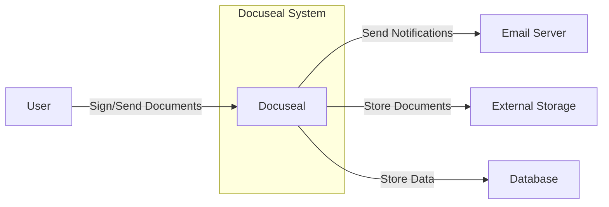

Okay, let's dive into creating a design document for Docuseal, based on the provided GitHub repository.

# BUSINESS POSTURE

Docuseal is an open-source document signing platform, aiming to provide a secure and user-friendly alternative to proprietary solutions like DocuSign.  The business priorities appear to be:

*   Provide a cost-effective alternative to commercial document signing solutions.
*   Offer a self-hostable solution, giving users full control over their data and infrastructure.
*   Maintain a high level of security and compliance to ensure the integrity and legality of signed documents.
*   Build a strong community around the open-source project, encouraging contributions and fostering trust.
*   Offer a simple, intuitive user experience for both document senders and signers.

Based on these priorities, the most important business risks are:

*   Data breaches or unauthorized access to sensitive documents.
*   Non-compliance with relevant regulations (e.g., eIDAS, GDPR, HIPAA) leading to legal issues.
*   Loss of document integrity, rendering signed documents invalid.
*   Reputational damage due to security vulnerabilities or data breaches.
*   Lack of adoption due to complexity or poor user experience.
*   Supply chain attacks.

# SECURITY POSTURE

Based on the repository review, here's a breakdown of the existing security controls, accepted risks, recommended controls, and security requirements:

Existing Security Controls:

*   security control: Authentication: User authentication via Devise, a flexible authentication solution for Rails. (Described in Gemfile and likely configured in `config/initializers/devise.rb` and related models/controllers).
*   security control: Authorization: Role-based access control (RBAC) is likely implemented, although the specifics need further investigation within the codebase.  There's mention of `User` and `Admin` roles, suggesting some level of authorization.
*   security control: Input Validation: Rails' built-in mechanisms for handling user input and preventing common vulnerabilities like SQL injection and cross-site scripting (XSS) are likely used, but specific implementations need to be verified. (ActiveRecord validations and strong parameters are expected).
*   security control: Cryptography: HTTPS is enforced in production, ensuring encrypted communication between the client and server. (Likely configured in `config/environments/production.rb`). Storage of sensitive data (e.g., document files, signatures) is likely encrypted at rest, but this needs confirmation.
*   security control: Session Management: Secure session management using cookies, likely with appropriate flags (HttpOnly, Secure) set. (Managed by Devise and Rails).
*   security control: Dependency Management: Use of Bundler to manage dependencies and `Gemfile.lock` to ensure consistent versions.
*   security control: Regular Updates: The project appears to be actively maintained, suggesting regular updates and security patches.

Accepted Risks:

*   accepted risk: The specific implementation details of RBAC and authorization need further review to ensure they adequately cover all access control scenarios.
*   accepted risk: The exact methods used for encrypting data at rest (documents, signatures) require confirmation.
*   accepted risk: While Rails provides some protection against XSS and SQL injection, a thorough review of all user input handling is necessary.
*   accepted risk: The project's reliance on third-party libraries (gems) introduces a potential supply chain risk.
*   accepted risk: The self-hosted nature of Docuseal means that users are responsible for securing their own infrastructure, which may introduce vulnerabilities if not properly managed.

Recommended Security Controls:

*   Implement a robust auditing system to track all user actions and document access.
*   Integrate with a security scanning tool (e.g., Brakeman for Rails) to automatically identify potential vulnerabilities during development.
*   Implement a Content Security Policy (CSP) to mitigate XSS risks.
*   Consider implementing multi-factor authentication (MFA) for enhanced security.
*   Provide clear documentation and guidance on secure deployment and configuration.
*   Establish a vulnerability disclosure program to encourage responsible reporting of security issues.
*   Implement signing of commits.
*   Implement regular penetration testing.

Security Requirements:

*   Authentication:
    *   Strong password policies (minimum length, complexity requirements).
    *   Protection against brute-force attacks (account lockout).
    *   Secure password reset mechanisms.
    *   Support for multi-factor authentication (recommended).

*   Authorization:
    *   Fine-grained access control to documents and features based on user roles and permissions.
    *   Principle of least privilege: users should only have access to the resources they need.
    *   Regular review and auditing of user permissions.

*   Input Validation:
    *   Strict validation of all user input on both the client-side and server-side.
    *   Use of whitelisting (allowing only known-good input) rather than blacklisting.
    *   Proper encoding of output to prevent XSS.
    *   Protection against SQL injection using parameterized queries or ORM features.

*   Cryptography:
    *   Use of strong, industry-standard encryption algorithms (e.g., AES-256) for data at rest and in transit.
    *   Secure key management practices.
    *   Regular review and updating of cryptographic libraries.
    *   Digital signatures for documents using appropriate cryptographic algorithms and standards (e.g., PAdES).

# DESIGN

## C4 CONTEXT



Element Description:

*   Element:
    *   Name: User
    *   Type: Person
    *   Description: A person who interacts with Docuseal to sign or send documents.
    *   Responsibilities: Upload documents, add recipients, sign documents, manage account settings.
    *   Security controls: Authentication, Authorization, Session Management.

*   Element:
    *   Name: Docuseal
    *   Type: Software System
    *   Description: The core Docuseal application.
    *   Responsibilities: Manage documents, users, signing process, notifications.
    *   Security controls: Input Validation, Cryptography, Auditing, Access Control.

*   Element:
    *   Name: Email Server
    *   Type: External System
    *   Description: An external email server used to send notifications to users.
    *   Responsibilities: Deliver emails.
    *   Security controls: Secure communication (TLS).

*   Element:
    *   Name: External Storage
    *   Type: External System
    *   Description: Storage for documents. Could be local file system, AWS S3, or other cloud storage.
    *   Responsibilities: Store and retrieve documents.
    *   Security controls: Data encryption at rest, access control.

*   Element:
    *   Name: Database
    *   Type: External System
    *   Description: Database used to store application data (users, document metadata, etc.).
    *   Responsibilities: Store and retrieve application data.
    *   Security controls: Data encryption at rest, access control, regular backups.

## C4 CONTAINER

```mermaid
graph LR
    subgraph Docuseal System
        A[Web Application\n(Ruby on Rails)]
        B[Background Jobs\n(Sidekiq)]
        C[Database\n(PostgreSQL)]
        D[External Storage\n(e.g., S3, Local)]
        E[Email Server\n(SMTP)]
    end
    User[User]

    User -- HTTPS --> A
    A -- Queries --> C
    A -- Store/Retrieve --> D
    A -- Enqueue --> B
    B -- Process --> A
    B -- Send --> E
    A -- Send --> E
```

Element Description:

*   Element:
    *   Name: Web Application (Ruby on Rails)
    *   Type: Web Application
    *   Description: The main web application that handles user requests.
    *   Responsibilities: User interface, authentication, authorization, document management, signing workflow.
    *   Security controls: Input Validation, Authentication, Authorization, Session Management, CSRF Protection.

*   Element:
    *   Name: Background Jobs (Sidekiq)
    *   Type: Background Processor
    *   Description: Handles asynchronous tasks, such as sending emails and processing documents.
    *   Responsibilities: Sending email notifications, document processing (e.g., generating thumbnails).
    *   Security controls: Secure communication with other containers.

*   Element:
    *   Name: Database (PostgreSQL)
    *   Type: Database
    *   Description: Stores application data.
    *   Responsibilities: Store and retrieve user data, document metadata, audit logs.
    *   Security controls: Data encryption at rest, access control, regular backups, parameterized queries.

*   Element:
    *   Name: External Storage (e.g., S3, Local)
    *   Type: Blob Storage
    *   Description: Stores the actual document files.
    *   Responsibilities: Store and retrieve document files.
    *   Security controls: Data encryption at rest, access control.

*   Element:
    *   Name: Email Server (SMTP)
    *   Type: External System
    *   Description: Sends email notifications.
    *   Responsibilities: Deliver emails.
    *   Security controls: Secure communication (TLS).

*   Element:
    *   Name: User
    *   Type: Person
    *   Description: A person who interacts with Docuseal to sign or send documents.
    *   Responsibilities: Upload documents, add recipients, sign documents, manage account settings.
    *   Security controls: Authentication, Authorization, Session Management.

## DEPLOYMENT

Possible deployment solutions:

1.  Docker Compose (for development and simple deployments).
2.  Kubernetes (for scalable and resilient deployments).
3.  Heroku or similar PaaS (for simplified deployment and management).
4.  Manual deployment on a virtual machine (for maximum control).

Chosen solution for detailed description: Kubernetes.

```mermaid
graph LR
    subgraph Kubernetes Cluster
        subgraph Namespace (docuseal)
            A[Deployment\n(Web Application)]
            B[Deployment\n(Background Jobs)]
            C[Service\n(Web Application)]
            D[Service\n(Background Jobs)]
            E[Ingress]
            F[Persistent Volume Claim\n(Database)]
            G[Persistent Volume Claim\n(Storage)]
            H[PostgreSQL Pod]
            I[External Storage\n(e.g., S3)]
        end
    end
    User[User]
    Internet[Internet]

    User -- HTTPS --> Internet
    Internet -- HTTPS --> E
    E -- Route --> C
    C -- Load Balance --> A
    A -- Connect --> H
    A -- Connect --> I
    B -- Connect --> H
    B -- Connect --> I
    H -- Store --> F
    A -- Store --> G
```

Element Description:

*   Element:
    *   Name: Deployment (Web Application)
    *   Type: Kubernetes Deployment
    *   Description: Manages the deployment of the web application pods.
    *   Responsibilities: Ensure the desired number of web application pods are running.
    *   Security controls: Resource limits, readiness and liveness probes.

*   Element:
    *   Name: Deployment (Background Jobs)
    *   Type: Kubernetes Deployment
    *   Description: Manages the deployment of the background job pods.
    *   Responsibilities: Ensure the desired number of background job pods are running.
    *   Security controls: Resource limits, readiness and liveness probes.

*   Element:
    *   Name: Service (Web Application)
    *   Type: Kubernetes Service
    *   Description: Provides a stable endpoint for accessing the web application.
    *   Responsibilities: Load balance traffic across web application pods.
    *   Security controls: Network policies.

*   Element:
    *   Name: Service (Background Jobs)
    *   Type: Kubernetes Service
    *   Description: Provides a stable endpoint for accessing the background jobs (if needed).
    *   Responsibilities: Load balance traffic across background job pods (if needed).
    *   Security controls: Network policies.

*   Element:
    *   Name: Ingress
    *   Type: Kubernetes Ingress
    *   Description: Manages external access to the web application.
    *   Responsibilities: Route traffic to the web application service.
    *   Security controls: TLS termination, HTTPS enforcement.

*   Element:
    *   Name: Persistent Volume Claim (Database)
    *   Type: Kubernetes Persistent Volume Claim
    *   Description: Requests persistent storage for the database.
    *   Responsibilities: Provide persistent storage for the database.
    *   Security controls: Access control, encryption.

*   Element:
    *   Name: Persistent Volume Claim (Storage)
    *   Type: Kubernetes Persistent Volume Claim
    *   Description: Requests persistent storage for document files.
    *   Responsibilities: Provide persistent storage for document files.
    *   Security controls: Access control, encryption.

*   Element:
    *   Name: PostgreSQL Pod
    *   Type: Kubernetes Pod
    *   Description: Runs the PostgreSQL database.
    *   Responsibilities: Store and retrieve application data.
    *   Security controls: Access control, data encryption at rest.

*   Element:
    *   Name: External Storage (e.g., S3)
    *   Type: External Service
    *   Description: Stores the actual document files.
    *   Responsibilities: Store and retrieve document files.
    *   Security controls: Data encryption at rest, access control.

*   Element:
      * Name: User
      * Type: Person
      * Description: Represents the end-user interacting with the Docuseal application.
      * Responsibilities: Initiates document signing workflows, signs documents, manages their account.
      * Security Controls: Relies on the application's authentication and authorization mechanisms.

*   Element:
      * Name: Internet
      * Type: Network
      * Description: Represents the public internet.
      * Responsibilities: Facilitates communication between the user and the Docuseal application.
      * Security Controls: Relies on TLS/HTTPS for secure communication.

## BUILD

The Docuseal project uses Ruby on Rails, and therefore likely uses Bundler for dependency management.  A typical build process would involve:

1.  Developer commits code to the repository.
2.  A Continuous Integration (CI) system (e.g., GitHub Actions, CircleCI, Jenkins) is triggered.
3.  The CI system checks out the code.
4.  Bundler installs the required dependencies (gems) based on the `Gemfile` and `Gemfile.lock`.
5.  Static analysis tools (e.g., Brakeman, Rubocop) are run to check for security vulnerabilities and code style issues.
6.  Automated tests (unit tests, integration tests) are executed.
7.  If all tests and checks pass, a Docker image is built.
8.  The Docker image is pushed to a container registry (e.g., Docker Hub, AWS ECR).

```mermaid
graph LR
    A[Developer]
    B[Git Repository\n(GitHub)]
    C[CI System\n(e.g., GitHub Actions)]
    D[Dependency Management\n(Bundler)]
    E[Static Analysis\n(Brakeman, Rubocop)]
    F[Automated Tests]
    G[Build Docker Image]
    H[Container Registry\n(e.g., Docker Hub)]

    A -- Commit Code --> B
    B -- Trigger --> C
    C -- Checkout Code --> B
    C -- Install Dependencies --> D
    C -- Run Static Analysis --> E
    C -- Run Tests --> F
    C -- Build Image --> G
    G -- Push Image --> H
```

Security Controls in Build Process:

*   Dependency Management: Bundler and `Gemfile.lock` ensure consistent and controlled dependencies, reducing the risk of using vulnerable versions.
*   Static Analysis: Tools like Brakeman help identify potential security vulnerabilities in the code before deployment.
*   Automated Tests: Unit and integration tests help ensure the code functions as expected and can catch security-related bugs.
*   Containerization: Docker provides a consistent and isolated environment for running the application, reducing the risk of environment-specific issues.
*   Secure Container Registry: Using a secure container registry (e.g., with vulnerability scanning) helps ensure that only trusted images are deployed.
*   Least Privilege: CI/CD pipelines should run with the least necessary privileges.

# RISK ASSESSMENT

*   Critical Business Processes:
    *   Document Signing: Ensuring the integrity and legality of signed documents is paramount.
    *   User Management: Securely managing user accounts and access to documents.
    *   Document Storage: Protecting documents from unauthorized access and loss.

*   Data to Protect:
    *   Document Content: Highly sensitive, containing potentially confidential or legally binding information. (Sensitivity: High)
    *   User Personal Information: Names, email addresses, potentially other PII. (Sensitivity: Medium)
    *   Digital Signatures: Cryptographic keys and signature data. (Sensitivity: High)
    *   Audit Logs: Records of user activity and document access. (Sensitivity: Medium)
    *   Document Metadata: Information about documents (e.g., title, sender, recipients). (Sensitivity: Medium)

# QUESTIONS & ASSUMPTIONS

*   Questions:
    *   What specific regulations (e.g., eIDAS, GDPR, HIPAA) does Docuseal need to comply with? This will depend on the target users and jurisdictions.
    *   What are the specific requirements for document retention and deletion?
    *   What level of assurance is required for digital signatures (e.g., basic, advanced, qualified)?
    *   What are the existing infrastructure and security policies of the organization deploying Docuseal?
    *   Are there any specific integrations required with other systems (e.g., identity providers, CRM)?
    *   What is acceptable downtime?
    *   What is the budget for security tools and services?

*   Assumptions:
    *   Business Posture: The organization deploying Docuseal has a moderate risk appetite and prioritizes security and compliance.
    *   Security Posture: The organization has basic security controls in place (e.g., firewalls, intrusion detection systems) but may need to enhance them for Docuseal.
    *   Design: The deployment environment will be Kubernetes-based, and external storage will be used for document files (e.g., AWS S3). The database will be PostgreSQL. The CI/CD pipeline will include static analysis and automated testing.
    *   The organization has a dedicated team or resources for managing and maintaining the Docuseal deployment.
    *   Users will be trained on secure usage of the platform.
    *   Regular security audits and penetration testing will be conducted.