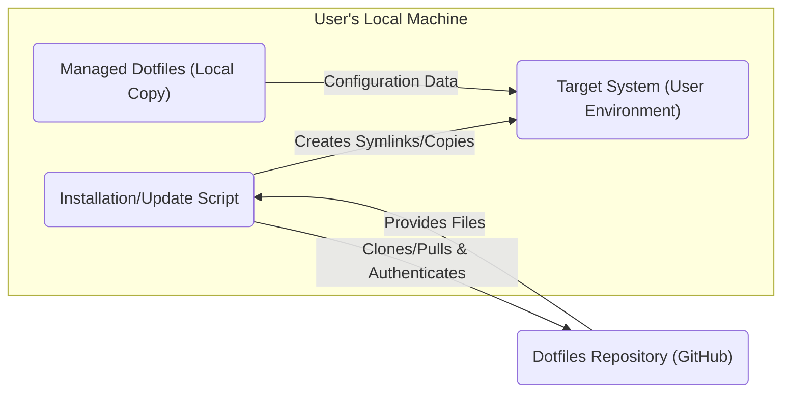
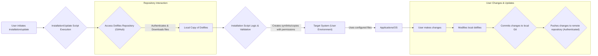

## Project Design Document: Dotfiles Management (Improved)

**1. Introduction**

This document provides an enhanced design overview of a dotfiles management system, specifically referencing the project found at [https://github.com/skwp/dotfiles](https://github.com/skwp/dotfiles). This improved design document is explicitly intended to serve as a robust foundation for subsequent threat modeling activities. By clearly outlining the system's architecture, components, data flow, and inherent security considerations, we aim to facilitate a comprehensive analysis of potential vulnerabilities and attack vectors.

**2. Project Overview**

The fundamental purpose of a dotfiles management system is to streamline the maintenance and deployment of a user's personalized configuration files (dotfiles) across various machines and environments. These dotfiles, typically located within a user's home directory, dictate the behavior and appearance of applications and the operating system. The `skwp/dotfiles` project exemplifies a common and effective approach, leveraging a version control system (Git) for change tracking and a scripting mechanism for applying these configurations consistently. Understanding this system's intricacies is crucial for identifying potential security weaknesses.

**3. System Architecture**

The dotfiles management system comprises the following key components, each with its own security implications:

*   **Dotfiles Repository:**
    *   The authoritative source of all configuration files and management scripts.
    *   In the context of `skwp/dotfiles`, this is a Git repository, typically hosted on platforms like GitHub.
    *   Contains the actual dotfiles, logically organized (e.g., by application or function).
    *   Crucially, it also includes the installation/update script, which has direct execution privileges on the target system.
    *   *Security Consideration:* The repository's access controls and security are paramount. Compromise here can lead to widespread malicious configuration deployment.

*   **Installation/Update Script:**
    *   A script (commonly Bash, Zsh, or Python) responsible for deploying the dotfiles to the target system.
    *   Performs critical actions such as:
        *   Authenticating and interacting with the Dotfiles Repository (e.g., using `git clone` or `git pull`).
        *   Creating symbolic links (symlinks) from the repository files to the correct locations within the user's home directory.
        *   Potentially executing arbitrary commands or scripts to further customize the environment.
    *   *Security Consideration:* This script operates with user privileges and can execute arbitrary code. Vulnerabilities in the script or malicious modifications can have severe consequences.

*   **Managed Dotfiles:**
    *   The actual configuration files being managed by the system.
    *   Examples include `.bashrc`, `.zshrc`, `.vimrc`, `.gitconfig`, and application-specific configuration files.
    *   These files may inadvertently contain sensitive information such as API keys, passwords, database credentials, and personal data.
    *   *Security Consideration:*  The content of these files needs careful consideration regarding sensitive data exposure, both in the repository and on the target system.

*   **Target System (User Environment):**
    *   The specific machine where the dotfiles are being applied.
    *   Includes the user's home directory, the operating system, and installed applications.
    *   The installation script directly interacts with this environment, creating symlinks and potentially modifying system settings.
    *   *Security Consideration:* The security posture of the target system influences the impact of any vulnerabilities in the dotfiles management process.

*   **Version Control System (Git):**
    *   The underlying technology used to track changes to the dotfiles over time.
    *   Enables version history, branching, and collaboration (if the repository is shared).
    *   `skwp/dotfiles` relies heavily on Git for managing the repository's state.
    *   *Security Consideration:* The integrity of the Git history is important. Compromised commits could introduce malicious configurations.

**4. Data Flow and Security Implications**

The process of applying and managing dotfiles involves the following data flow stages, each with associated security considerations:

*   **Initialization/Update Initiation:** The user triggers the installation/update process, typically by executing the installation script.
    *   *Security Consideration:* How is the execution of this script controlled? Are there any safeguards against unauthorized execution?

*   **Repository Access and Authentication:** The installation script attempts to access the Dotfiles Repository. This often involves authentication, especially for private repositories.
    *   *Security Consideration:* How are authentication credentials managed? Are they securely stored and transmitted?  Is multi-factor authentication enforced on the repository?

*   **Repository Download:** The script downloads the latest version of the configuration files and scripts from the repository.
    *   *Security Consideration:* Is the connection to the repository secure (e.g., using HTTPS)? Can the downloaded content be tampered with during transit?

*   **Local Storage and Processing:** The downloaded repository contents are stored locally on the user's machine. The installation script then processes these files.
    *   *Security Consideration:* Where are the downloaded files stored locally? Are they protected from unauthorized access?  Does the script perform any validation or sanitization of the downloaded content before execution?

*   **Configuration Application:** The installation script applies the configurations to the user's environment. This typically involves creating symbolic links or copying files.
    *   *Security Consideration:* Does the script validate the target locations before creating symlinks or copying files? Could this process be exploited to overwrite critical system files?  Are appropriate file permissions set on the created symlinks and copied files?

*   **Environment Modification:** The application of configurations modifies the user's environment.
    *   *Security Consideration:* What are the potential security implications of the applied configurations? Could they weaken system security or introduce vulnerabilities?

*   **Changes and Commits (User Initiated):** When a user modifies their configuration, they typically edit the local files and commit the changes to the local Git repository.
    *   *Security Consideration:* Are users aware of the security implications of the changes they are making?  Is there any review process for changes before they are committed?

*   **Pushing Changes to Remote Repository:**  Users typically push their committed changes to the remote Dotfiles Repository.
    *   *Security Consideration:* Is the connection to the remote repository secure? Are proper authentication and authorization mechanisms in place to prevent unauthorized pushes?

**5. Key Components and Technologies with Security Relevance**

*   **Programming/Scripting Languages (Bash, Zsh, Python):** The security of the installation script heavily depends on secure coding practices in these languages. Vulnerabilities like command injection are potential risks.
*   **Version Control System (Git):**  Proper Git hygiene, including secure commit practices and protection of the repository's integrity, is crucial.
*   **Hosting Platform (GitHub):** The security features provided by the hosting platform (e.g., access controls, vulnerability scanning) are important for protecting the Dotfiles Repository.
*   **Operating Systems (macOS, Linux, Windows):** The underlying security mechanisms of the target operating system influence the effectiveness of the dotfiles and the potential impact of vulnerabilities.
*   **Configuration File Formats (Plain Text):** The plain text nature of these files makes them easily readable, which can be a security risk if sensitive information is not properly managed.

**6. Security Considerations (Detailed)**

This section expands on the initial security thoughts, providing more specific areas of concern for threat modeling:

*   **Secrets Management:** How are sensitive credentials (API keys, passwords) handled within the dotfiles? Are they stored in plain text? Are environment variables or dedicated secrets management tools used?
*   **Installation Script Security:**  Is the installation script free from vulnerabilities like command injection, path traversal, or insecure file handling? Are there mechanisms to verify the script's integrity?
*   **Repository Access Control:** Who has access to the Dotfiles Repository (read and write)? Are appropriate permissions and authentication mechanisms in place? Is two-factor authentication enforced?
*   **Data-in-Transit Protection:** Is the communication between the target system and the Dotfiles Repository encrypted (e.g., using HTTPS for Git operations)?
*   **Local Machine Security Posture:** The security of the target system is a prerequisite. Are there any dependencies on specific security configurations on the target machine?
*   **Dependency Management Security:** If the installation script relies on external tools or packages, are these dependencies managed securely? Are known vulnerabilities in these dependencies addressed?
*   **Error Handling and Logging:** Does the installation script handle errors gracefully and log relevant events securely? Does logging inadvertently expose sensitive information?
*   **User Input Handling:** If the installation script takes user input, is this input properly validated and sanitized to prevent injection attacks?
*   **Rollback and Recovery:** Are there mechanisms to easily rollback to a previous known-good state of the dotfiles in case of errors or security issues?
*   **Code Review and Security Audits:** Has the installation script and the overall dotfiles management process been subject to code review and security audits?

**7. Future Considerations and Security Implications**

*   **Integration with Secrets Management Tools (e.g., HashiCorp Vault, Ansible Vault):** This would significantly improve the security of sensitive information. The integration process itself needs careful consideration to avoid introducing new vulnerabilities.
*   **Templating Engines with Secure Practices:** Using templating engines can add complexity. Security considerations include preventing server-side template injection vulnerabilities.
*   **Automated Testing with Security Checks:** Incorporating security checks into automated testing can help identify vulnerabilities early in the development process.
*   **Digitally Signing Installation Scripts:** This would provide a mechanism to verify the integrity and authenticity of the installation script.
*   **Policy-as-Code for Dotfiles:** Exploring tools that allow defining and enforcing policies for dotfile configurations could enhance security and compliance.

This improved design document provides a more detailed and security-focused overview of the dotfiles management system. It highlights key areas of concern and serves as a valuable resource for conducting a thorough threat modeling exercise.